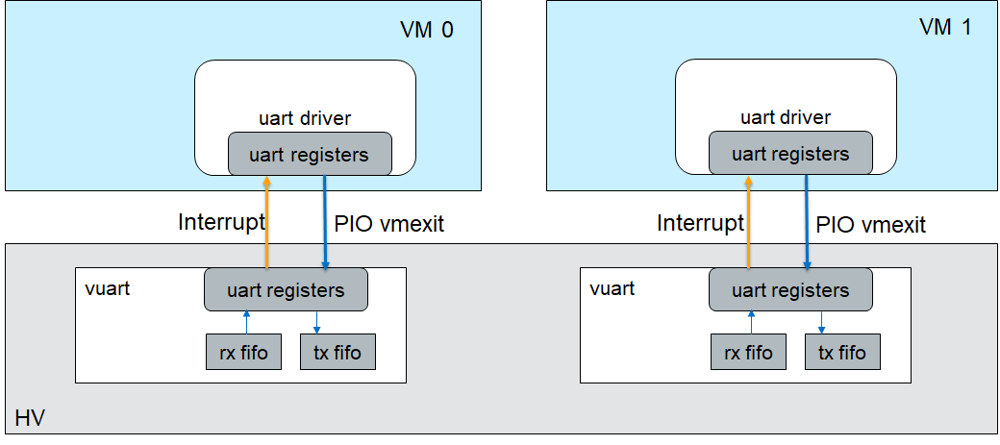
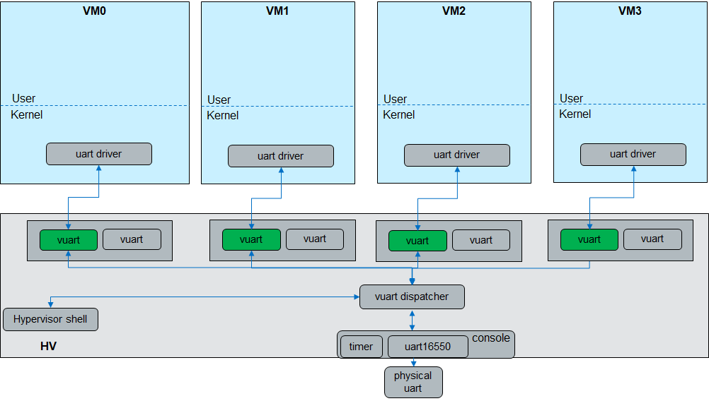
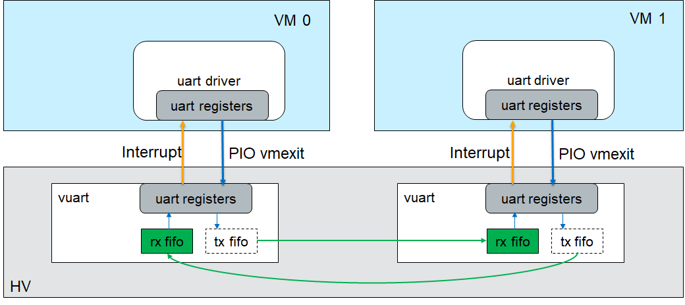

.. _vuart_virtualization:

vUART Virtualization
####################

Architecture
************

A vUART is a virtual 16550 UART implemented in the hypervisor. It can work as a
console or a communication port. The vUART is mapped to the
traditional COM port address. A UART driver in the kernel can auto detect the
port base and IRQ.

   UART Virtualization Architecture

Each vUART has two FIFOs: 8192 bytes TX FIFO and 256 bytes RX FIFO.
We only provide 4 ports for use.

-  COM1 (port base: 0x3F8, irq: 4)

-  COM2 (port base: 0x2F8, irq: 3)

-  COM3 (port base: 0x3E8, irq: 6)

-  COM4 (port base: 0x2E8, irq: 7)

A VM can enable one console vUART and several communication vUARTs.

Console vUART
*************

A vUART can be used as a console port, and it can be activated by
a ``vm_console <vm_id>`` command in the hypervisor console.
:numref:`console-uart-arch` shows only one physical UART, but four console
vUARTs (green color blocks). A hypervisor console is implemented above the
physical UART, and it works in polling mode. The hypervisor console has a
timer. The timer handler sends input from the physical UART to the
vUART or the hypervisor shell process. The timer handler also gets data from
the vUART's TX FIFO and sends it to the physical UART. The data in the vUART's
FIFOs is overwritten if it is not taken out in time.

   Console vUART Architecture

Communication vUART
*******************

The communication vUART is used to transfer data between two VMs in low
speed. For the kernel driver, it is a general UART that can be detected and
probed by 8250 serial driver. But in the hypervisor, it has a special process.

From :numref:`communication-uart-arch`, the vUART in two VMs is
connected according to the configuration in the hypervisor.  When a user
writes a byte to the communication UART in VM0:

Operations in VM0

-  VM0 UART driver puts the data to THR.

-  VM traps to hypervisor, and the vUART PIO handler is called.

-  Puts the data to its target vUART's RX FIFO.

-  Injects a Data Ready interrupt to VM1.

-  If the target vUART's FIFO is not full, injects a THRE interrupt to VM0.

-  Returns.

Operations in VM1

-  Receives an interrupt, dispatches to UART driver.

-  Reads LSR register, finds a Data Ready interrupt.

-  Reads data from RX FIFO.

-  If RX FIFO is not full, injects THRE interrupt to VM0.

   Communication vUART Architecture

Usage
*****

-  For console vUART

   To enable the console port for a VM, change the ``port_base`` and ``irq``
   fields in
   ``configs/scenarios/<scenario name>/vm_configurations.c`` under the
   hypervisor build directory using the combinations listed below. If the IRQ
   number has been used in your
   system ( ``cat /proc/interrupt``), you can choose other IRQ number. Set
   the ``.irq =0``, the vUART will work in polling mode.

   -  COM1_BASE (0x3F8) + COM1_IRQ(4)

   -  COM2_BASE (0x2F8) + COM2_IRQ(3)

   -  COM3_BASE (0x3E8) + COM3_IRQ(6)

   -  COM4_BASE (0x2E8) + COM4_IRQ(7)

   Example::

      .vuart[0] = {
                        .type = VUART_LEGACY_PIO,
                        .addr.port_base = COM1_BASE,
                        .irq = COM1_IRQ,
                  }

   The kernel bootargs ``console=ttySx`` should be the same with
   vuart[0]; otherwise, the kernel console log cannot be captured by the
   hypervisor. Then, after bringing up the system, you can switch the console
   to the target VM by:

   .. code-block:: console

      ACRN:\>vm_console 0
      ----- Entering VM 0 Shell -----

-  For communication vUART

   To enable the communication port, configure vuart[1] in
   the two VMs that need to communicate. The port_base and IRQ should
   not repeat with the vuart[0] in the same VM. t_vuart.vm_id is the
   target VM's vm_id, start from 0 (0 means VM0). t_vuart.vuart_id is the
   target vUART index in the target VM, start from 1 (1 means vuart[1]).

   Example::

      /* VM0 */
      ...
      /* VM1 */
      .vuart[1] = {
                        .type = VUART_LEGACY_PIO,
                        .addr.port_base = COM2_BASE,
                        .irq = COM2_IRQ,
                        .t_vuart.vm_id = 2U,
                        .t_vuart.vuart_id = 1U,
                        },
      ...
      /* VM2 */
      .vuart[1] = {
                        .type = VUART_LEGACY_PIO,
                        .addr.port_base = COM2_BASE,
                        .irq = COM2_IRQ,
                        .t_vuart.vm_id = 1U,
                        .t_vuart.vuart_id = 1U,
                  },

.. note:: The Device Model also has a virtual UART and uses 0x3F8
   and 0x2F8 as port base. If you add ``-s <slot>, lpc`` in the launch
   script, the Device Model will create COM0 and COM1 for the post-launched VM.
   It will also add the port information to the ACPI table. This configuration
   is useful for Windows and VxWorks as they probe the driver according to the
   ACPI table.

   If you enable the Device Model UART and the hypervisor vUART at the
   same port address, access to the port address will be responded to by the
   hypervisor vUART directly, and will not pass to the Device Model.
