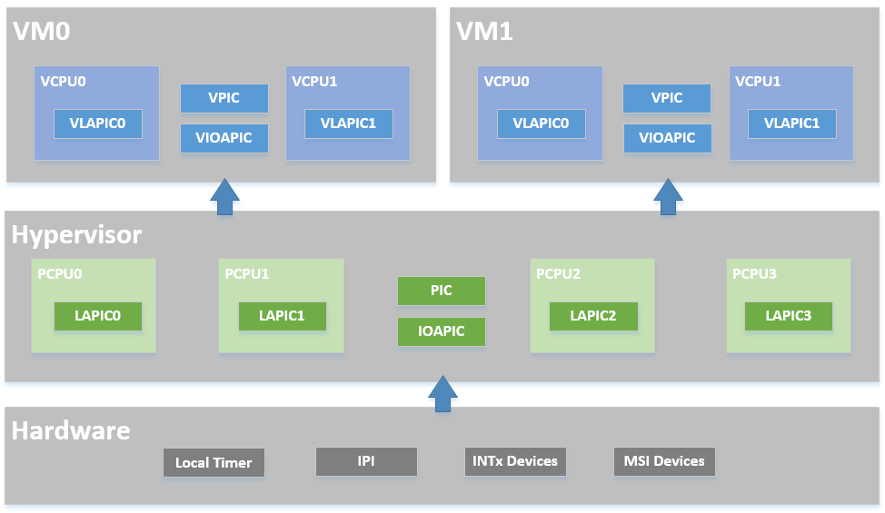
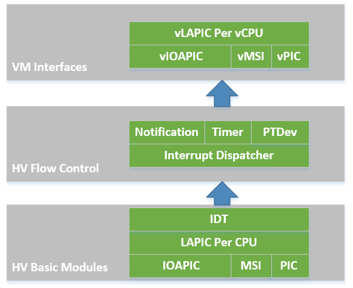
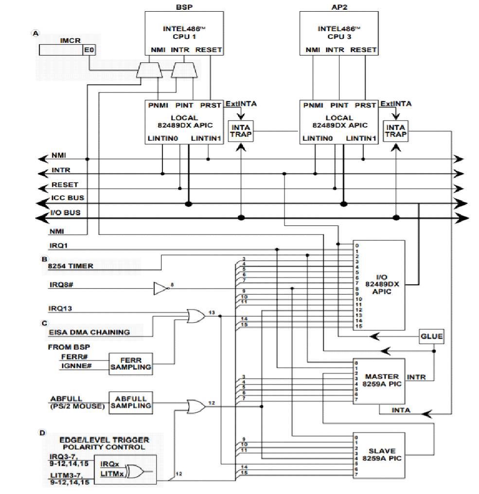
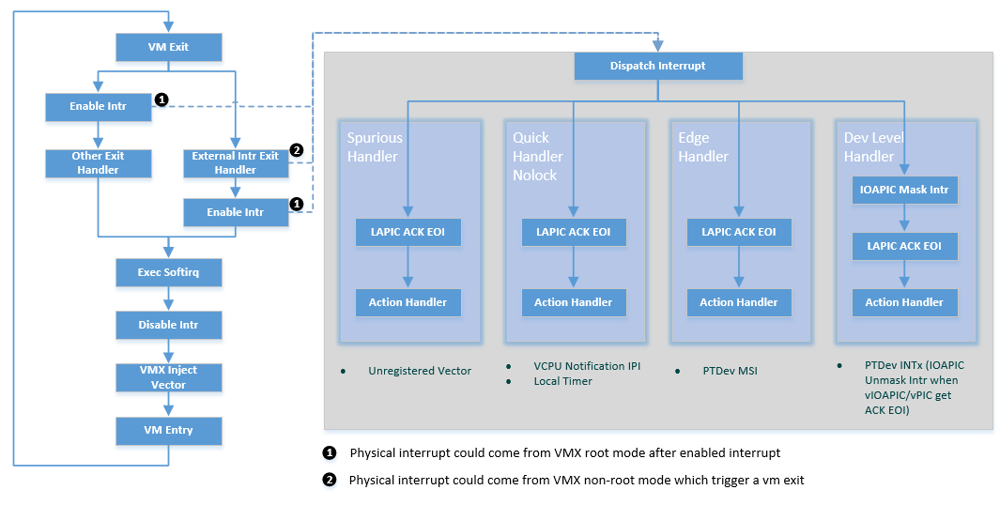
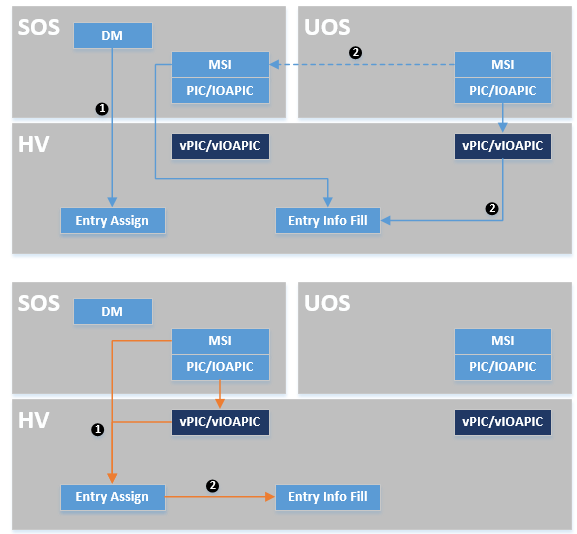
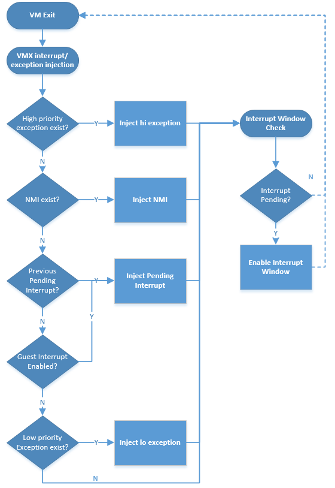

.. _interrupt-hld:

Interrupt Management high-level design
######################################

Overview
********

This document describes the interrupt management high-level design for
the ACRN hypervisor.

The ACRN hypervisor implements a simple but fully functional framework
to manage interrupts and exceptions, as show in
:numref:`interrupt-modules-overview`. In its native layer, it configures
the physical PIC, IOAPIC, and LAPIC to support different interrupt
sources from local timer/IPI to external INTx/MSI. In its virtual guest
layer, it emulates virtual PIC, virtual IOAPIC and virtual LAPIC, and
provides full APIs allowing virtual interrupt injection from emulated or
pass-thru devices.

   ACRN Interrupt Modules Overview

In the software modules view shown in :numref:`interrupt-sw-modules`,
the ACRN hypervisor sets up the physical interrupt in its basic
interrupt modules (e.g., IOAPIC/LAPIC/IDT).  It dispatches the interrupt
in the hypervisor interrupt flow control layer to the corresponding
handlers, that could be pre-defined IPI notification, timer, or runtime
registered pass-thru devices.  The ACRN hypervisor then uses its VM
interfaces based on vPIC, vIOAPIC, and vMSI modules, to inject the
necessary virtual interrupt into the specific VM

   ACRN Interrupt SW Modules Overview

Hypervisor Physical Interrupt Management
****************************************

The ACRN hypervisor is responsible for all the physical interrupt
handling. All physical interrupts are first handled in VMX root-mode.
The "external-interrupt exiting" bit in the VM-Execution controls field
is set to support this. The ACRN hypervisor also initializes all the
interrupt related modules such as IDT, PIC, IOAPIC, and LAPIC.

Only a few physical interrupts (such as TSC-Deadline timer and IOMMU)
are fully serviced in the hypervisor. Most interrupts come from pass-thru
devices whose interrupt are remapped to a virtual INTx/MSI source and
injected to the SOS or UOS, according to the pass-thru device
configuration.

The ACRN hypervisor does handle exceptions and any exception coming from
the VMX root-mode will lead to the CPU halting. For guest exception, the
hypervisor only traps #MC (machine check), prints a warning message, and
injects the exception back into the guest OS.

Physical Interrupt Initialization
=================================

After the ACRN hypervisor get control from the bootloader, it
initializes all physical interrupt-related modules for all the CPUs. The
ACRN hypervisor creates a framework to manage the physical interrupt for
hypervisor-local devices, pass-thru devices, and IPI between CPUs.

IDT
---

The ACRN hypervisor builds its native Interrupt Descriptor Table (IDT) during
interrupt initialization. For exceptions, it links to function
``dispatch_exception``, and for external interrupts it links to function
``dispatch_interrupt``. Please refer to ``arch/x86/idt.S`` for more details.

LAPIC
-----

The ACRN hypervisor resets LAPIC for each CPU, and provides basic APIs
used, for example, by the local timer (TSC Deadline)
program and IPI notification program.  These APIs include
write_laipic_reg32, send_lapic_eoi, send_startup_ipi, and
send_single_ipi.

.. comment

   Need reference to API doc generated from doxygen comments
   in hypervisor/include/arch/x86/lapic.h

PIC/IOAPIC
----------

The ACRN hypervisor masks all interrupts from PIC, so all the
legacy interrupts from PIC (<16) are linked to IOAPIC, as shown in
:numref:`interrupt-pic-pin`.

ACRN will pre-allocate vectors and mask them for these legacy interrupts
in IOAPIC RTE. For others (>= 16) ACRN will mask them with vector 0 in
RTE, and the vector will be dynamically allocated on demand.

   PIC & IOAPIC Pin Connection

Irq Desc
--------

The ACRN hypervisor maintains a global ``irq_desc[]`` array shared among the
CPUs and uses a flat mode to manage the interrupts.  The same
vector is linked to the same IRQ number for all CPUs.

.. comment

   Need reference to API doc generated from doxygen comments
   for ``struct irq_desc`` in hypervisor/include/common/irq.h

The ``irq_desc[]`` array is indexed by the IRQ number. An
``irq_handler`` field can be set to a common edge, level, or quick
handler called from ``interrupt_dispatch``. The ``irq_desc`` structure
also contains the ``dev_list`` field to maintain this IRQ's action
handler list.

The global array ``vector_to_irq[]`` is used to manage the vector
resource. This array is initialized with value ``IRQ_INVALID`` for all
vectors, and will be set to a valid IRQ number after the corresponding
vector is registered.

For example, if the local timer registers interrupt with IRQ number 271 and
vector 0xEF, then the arrays mentioned above will be set to::

    irq_desc[271].irq = 271;
    irq_desc[271].vector = 0xEF;
    vector_to_irq[0xEF] = 271;

Physical Interrupt Flow
=======================

When an physical interrupt occurs, and the CPU is running under VMX root
mode, the interrupt is triggered from the standard native irq flow:
interrupt gate to irq handler. However, if the CPU is running under VMX
non-root mode, an external interrupt will trigger a VM exit for reason
"external-interrupt". See :numref:`interrupt-handle-flow`.

   ACRN Hypervisor Interrupt Handle Flow

After an interrupt happens (in either case noted above), the ACRN
hypervisor jumps to ``dispatch_interrupt``. This function will check
which vector caused this interrupt, and the corresponding ``irq_desc``
structure's ``irq_handler`` will be called for the service.

There are several irq_handler's defined in the ACRN hypervisor, as shown
in :numref:`interrupt-handle-flow`, designed for different uses.  For
example, ``quick_handler_nolock`` is used when no critical data needs
protection in the action handlers; the VCPU notification IPI and local
timer are good example of this use case.

The more complicated ``common_dev_handler_level`` handler is intended
for pass-thru devices with level triggered interrupts. To avoid
continuously triggering the interrupt, it initially masks IOAPIC pin and
unmasks it only when the corresponding vIOAPIC pin gets an explicit EOI
ACK from the guest.

All the irq handler's finally call their own action handler list, as
shown here:

.. code-block: c

   struct dev_handler_node \*dev = desc->dev_list;
   while (dev != NULL) {
      if (dev->dev_handler != NULL)
         dev->dev_handler(desc->irq, dev->dev_data);
      dev = dev->next;
   }

The common APIs for registering, updating, and unregistering
interrupt handlers include irq_to_vector, dev_to_irq, dev_to_vector,
pri_register_handler, normal_register_handler,
unregister_handler_common, and update_irq_handler.

.. comment

   Need reference to API doc generated from doxygen comments
   in hypervisor/include/common/irq.h

.. _physical_interrupt_source:

Physical Interrupt Source
=========================

The ACRN hypervisor handles interrupts from many different sources, as
shown in :numref:`interrupt-source`:

.. list-table:: Physical Interrupt Source
   :widths: 15 10 60
   :header-rows: 1
   :name: interrupt-source

   * - Interrupt Source
     - Vector
     - Description
   * - TSC Deadline Timer
     - 0xEF
     - The TSC deadline timer implements the timer framework in
       the hypervisor based on the LAPIC TSC deadline. This interrupt's
       target is specific to the CPU to which the LAPIC belongs.
   * - CPU Startup IPI
     - N/A
     - The BSP needs to trigger an INIT-SIPI sequence to wake up the
       APs. This interrupt's target is specified by the BSP calling
       `` start_cpus()``.
   * - VCPU Notify IPI
     - 0xF0
     - When the hypervisor needs to kick the VCPU out of VMX non-root
       mode to do requests such as virtual interrupt injection, EPT
       flush, etc. This interrupt's target is specified by function
       ``send_single_ipi()``.
   * - IOMMU MSI
     - dynamic
     - IOMMU device supports an MSI interrupt. The vtd device driver in
       the hypervisor will register an interrupt to handle dmar fault.
       This interrupt's target is specified by vtd device driver.
   * - PTdev INTx
     - dynamic
     - All native devices are owned by the guest (SOS or UOS), taking
       advantage of the pass-thru method. Each pass-thru device connected
       with IOAPIC/PIC (PTdev INTx) will register an interrupt when
       its attached interrupt controller pin first gets unmasked.
       This interrupt's target is defined by and RTE entry in the IOAPIC.
   * - PTdev MSI
     - dynamic
     - All native devices are owned by the guest (SOS or UOS), taking
       advantage of pass-thru method. Each pass-thru device with
       enabled MSI (PTdev MSI) will register an interrupt when the SOS
       does an explicit hypercall. This interrupt's target is defined
       by an MSI address entry.

Softirq
=======

ACRN hypervisor implements a simple bottom-half softirq to execute the
interrupt handler, as showed in :numref:`interrupt-handle-flow`.
The softirq is executed when an interrupt is enabled. Several APIs for softirq
are defined including enable_softirq, disable_softirq, raise_softirq,
and exec_softirq.

.. comment

   Need reference to API doc generated from doxygen comments
   in hypervisor/include/common/softirq.h

Physical Exception Handling
===========================

As mentioned earlier, the ACRN hypervisor does not handle any
physical exceptions. The VMX root mode code path should guarantee no
exceptions are triggered while the hypervisor is running.

Guest Virtual Interrupt Management
**********************************

The previous sections describe physical interrupt management in the ACRN
hypervisor. After a physical interrupt happens, a registered action
handler is executed. Usually, the action handler represents a service
for virtual interrupt injection. For example, if an interrupt is
triggered from a pass-thru device, the appropriate virtual interrupt
should be injected into its guest VM.

The virtual interrupt injection could also come from an emulated device.
The I/O mediator in the Service OS (SOS) could trigger an interrupt
through a hypercall, and then do the virtual interrupt injection in the
hypervisor.

The following sections give an introduction to the ACRN guest virtual
interrupt management, including VCPU request for virtual interrupt kick
off, vPIC/vIOAPIC/vLAPIC for virtual interrupt injection interfaces,
physical-to-virtual interrupt mapping for a pass-thru device, and the
process of VMX interrupt/exception injection.

VCPU Request
============

As mentioned in `physical_interrupt_source`_, physical vector 0xF0 is
used to kick the VCPU out of its VMX non-root mode, and make a request
for virtual interrupt injection or other requests such as flush EPT.

The request-make API (vcpu_make_request) and eventid supports virtual interrupt
injection.

.. comment

   Need reference to API doc generated from doxygen comments
   in hypervisor/include/common/irq.h

There are requests for exception injection (ACRN_REQUEST_EXCP), vLAPIC
event (ACRN_REQUEST_EVENT), external interrupt from vPIC
(ACRN_REQUEST_EXTINT) and non-maskable-interrupt (ACRN_REQUEST_NMI).

The ``vcpu_make_request`` is necessary for a virtual interrupt
injection.  If the target VCPU is running under VMX non-root mode, it
will send an IPI to kick it out and results in an external-interrupt
VM-Exit.  The flow of :numref:`interrupt-handle-flow` could be executed
to complete the injection of a virtual interrupt.

There are some cases that do not need to send an IPI when making a
request because the CPU making the request is the target VCPU.  For
example, the #GP exception request always happens on the current CPU
when an invalid emulation happens. An external interrupt for a pass-thru
device always happens on the VCPUs the device belongs to, so after it
triggers an external-interrupt VM-Exit, the current CPU is also the
target VCPU.

Virtual PIC
===========

The ACRN hypervisor emulates a vPIC for each VM based on IO ranges
0x20-0x21, 0xa0-0xa1, or 0x4d0-0x4d1.

If an interrupt source from vPIC needs to inject an interrupt,
the vpic_assert_irq, vpic_deassert_irq, or vpic_pulse_irq functions can
be called to make a request for ACRN_REQUEST_EXTINT or
ACRN_REQUEST_EVENT:

.. comment

   Need reference to API doc generated from doxygen comments
   in hypervisor/include/common/vpic.h

The vpic_pending_intr and vpic_intr_accepted APIs are used to query the
vector being injected and ACK the service, by moving the interrupt from
request service (IRR) to in service (ISR).

Virtual IOAPIC
==============

ACRN hypervisor emulates a vIOAPIC for each VM based on MMIO
VIOAPIC_BASE.

If an interrupt source from vIOAPIC needs to inject an interrupt, the
vioapic_assert_irq, vioapic_dessert_irq, and vioapic_pulse_irq APIs are
used to make a request for ACRN_REQUEST_EVENT.

As the vIOAPIC is always associated with a vLAPIC, the virtual interrupt
injection from vIOAPIC will finally trigger a request for an vLAPIC
event.

Virtual LAPIC
=============

The ACRN hypervisor emulates a vLAPIC for each VCPU based on MMIO
DEFAULT_APIC_BASE.

If an interrupt source from vLAPIC needs to inject an interrupt (e.g.,
from LVT such as an LAPIC timer, from vIOAPIC for a pass-thru device
interrupt, or from an emulated device for a MSI), vlapic_intr_level,
vlapic_intr_edge, vlapic_set_local_intr, vlapic_intr_msi,
vlapic_deliver_intr APIs need to be called, resulting in a request for
ACRN_REQUEST_EVENT.

.. comment

   Need reference to API doc generated from doxygen comments
   in hypervisor/include/common/vlapic.h

The vlapic_pending_intr and vlapic_intr_accepted APIs are used to query
the vector that needs to be injected and ACK
the service that move the interrupt from request service (IRR) to in
service (ISR).

By default, the ACRN hypervisor enables vAPIC to improve the performance of
a vLAPIC emulation.

Virtual Exception
=================

When doing emulation, an exception may be triggered in the hypervisor,
for example, if guest accesses an invalid vMSR register, or the
hypervisor needs to inject a #GP, or during instruction emulation, an
instruction fetch may access a non-exist page from rip_gva, and a #PF
must be injected.

ACRN hypervisor implements virtual exception injection using the
vcpu_queue_exception, vcpu_inject_gq, and vcpu_inject_pf APIs.

.. comment

   Need reference to API doc generated from doxygen comments
   in hypervisor/include/common/irq.h

The ACRN hypervisor uses vcpu_inject_gp/vcpu_inject_pf functions to
queue exception requests, and follows `Intel Software
Developer Manual, Vol 3. <SDM vol3>`_ - 6.15, Table 6-5 
listing conditions for generating a double fault.

.. _SDM vol3: https://www.intel.com/content/www/us/en/architecture-and-technology/64-ia-32-architectures-software-developer-system-programming-manual-325384.html

Interrupt Mapping for a Pass-thru Device
========================================

A VM can control a PCI device directly through pass-thru device
assignment. The pass-thru entry is the major info object, and it is:

- A physical interrupt source, and could be a MSI/MSIX entry, PIC pins, or
  IOAPIC pins
- Pass-thru remapping information between physical and virtual interrupt
  source, for MSI/MSIX it is identified by a PCI device's BDF. For
  PIC/IOAPIC it is identified by the pin number.

   Pass-thru Device Entry Assignment

As shown in :numref:`interrupt-pass-thru` above, a UOS will assign its
pass-thru device entry by the DM, and it will fill its entry info from:

- vPIC/vIOAPIC interrupt mask/unmask
- MSI IOReq from UOS then MSI hypercall from SOS

The SOS adds its pass-thru device entry at runtime and fills info for:

- vPIC/vIOAPIC interrupt mask/unmask
- MSI hypercall from SOS

During the pass-thru device entry info filling, the hypervisor builds
native IOAPIC RTE/MSI entry based on vIOAPIC/vPIC/vMSI configuration,
and register the physical interrupt handler for it. Then with the pass-thru
device entry as the handler private data, the physical interrupt can
be linked to a virtual pin of a guest's vPIC/vIOAPIC or virtual vector of
a guest's vMSI. The handler then injects the corresponding virtual
interrupt into the guest, based on vPIC/vIOAPIC/vLAPIC APIs described
earlier.

Interrupt/Exception Injection Process
=====================================

As shown in :numref:`interrupt-handle-flow`, the ACRN hypervisor injects
virtual interrupt/exception to the guest before its VM-Entry.

This is done by updating the VMX_ENTRY_INT_INFO_FIELD of the VCPU's
VMCS. As this field is unique, the interrupt/exception injection must
follow a priority rule to handle one-by-one.

:numref:`interrupt-injection` below shows the rules about how to inject
virtual interrupt/exception one-by-one. If a high priority
interrupt/exception was already injected, the next pending
interrupt/exception will enable an interrupt window where the next
injection will be done by the following VM-Exit, triggered by the
interrupt window.

   ACRN Hypervisor Interrupt/Exception Injection Process
