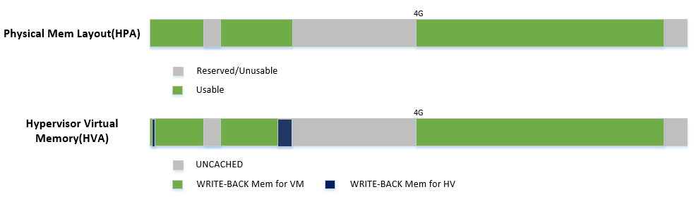

.. _memmgt-hld:

Memory Management High-Level Design
###################################

This document describes memory management for the ACRN hypervisor.

Overview
********

In the ACRN hypervisor system, there are few different memory spaces to
consider.  From the hypervisor's point of view there are:

-  Host Physical Address (HPA): the native physical address space, and
-  Host Virtual Address (HVA): the native virtual address space based on
   a MMU. A page table is used to do the translation between HPA and HVA
   spaces.

And from the Guest OS running on a hypervisor there are:

-  Guest Physical Address (GPA): the guest physical address space from a
   virtual machine.  GPA to HPA transition is usually based on a
   MMU-like hardware module (EPT in X86), and associated with a page
   table
-  Guest Virtual Address (GVA): the guest virtual address space from a
   virtual machine based on a vMMU

.. figure:: images/mem-image2.png
   :align: center
   :width: 900px
   :name: mem-overview

   ACRN Memory Mapping Overview

:numref:`mem-overview` provides an overview of the ACRN system memory
mapping, showing:

-  GVA to GPA mapping based on vMMU on a VCPU in a VM
-  GPA to HPA mapping based on EPT for a VM in the hypervisor
-  HVA to HPA mapping based on MMU in the hypervisor

This document illustrates the memory management infrastructure for the
ACRN hypervisor and how it handles the different memory space views
inside the hypervisor and from a VM:

-  How ACRN hypervisor manages host memory (HPA/HVA)
-  How ACRN hypervisor manages SOS guest memory (HPA/GPA)
-  How ACRN hypervisor & SOS DM manage UOS guest memory (HPA/GPA)

Hypervisor Memory Management
****************************

The ACRN hypervisor is the primary owner to manage system
memory. Typically the boot firmware (e.g., EFI) passes the platform physical
memory layout - E820 table to the hypervisor. The ACRN hypervisor does its memory
management based on this table.

Physical Memory Layout - E820
=============================

The boot firmware (e.g., EFI) passes the E820 table through a multiboot protocol.
This table contains the original memory layout for the platform.

   Physical Memory Layout Example

:numref:`mem-layout` is an example of the physical memory layout based on a simple
platform E820 table. The following sections demonstrate different memory
space management by referencing it.

Physical to Virtual Mapping
===========================

ACRN hypervisor is running under paging mode, so after receiving
the platform E820 table, ACRN hypervisor creates its MMU page table
based on it. This is done by the function init_paging() for all
physical CPUs.

The memory mapping policy here is:

-  Identical mapping for each physical CPU (ACRN hypervisor's memory
   could be relocatable in a future implementation)
-  Map all memory regions with UNCACHED type
-  Remap RAM regions to WRITE-BACK type

   Hypervisor Virtual Memory Layout

:numref:`vm-layout` shows:

-  Hypervisor can access all of system memory
-  Hypervisor has an UNCACHED MMIO/PCI hole reserved for devices, such
   as for LAPIC/IOAPIC access
-  Hypervisor has its own memory with WRITE-BACK cache type for its
   code and data (< 1M part is for secondary CPU reset code)

Service OS Memory Management
****************************

After the ACRN hypervisor starts, it creates the Service OS as its first
VM. The Service OS runs all the native device drivers, manage the
hardware devices, and provides I/O mediation to guest VMs. The Service
OS is in charge of the memory allocation for Guest VMs as well.

ACRN hypervisor passes the whole system memory access (except its own
part) to the Service OS. The Service OS must be able to access all of
the system memory except the hypervisor part.

Guest Physical Memory Layout - E820
===================================

The ACRN hypervisor passes the original E820 table to the Service OS
after filtering out its own part. So from Service OS's view, it sees
almost all the system memory as shown here:

   SOS Physical Memory Layout

Host to Guest Mapping
=====================

ACRN hypervisor creates Service OS's host (HPA) to guest (GPA) mapping
(EPT mapping) through the function
``prepare_vm0_memmap_and_e820()`` when it creates the SOS VM. It follows
these rules:

-  Identical mapping
-  Map all memory range with UNCACHED type
-  Remap RAM entries in E820 (revised) with WRITE-BACK type
-  Unmap ACRN hypervisor memory range
-  Unmap ACRN hypervisor emulated vLAPIC/vIOAPIC MMIO range

The host to guest mapping is static for the Service OS; it will not
change after the Service OS begins running. Each native device driver
can access its MMIO through this static mapping. EPT violation is only
serving for vLAPIC/vIOAPIC's emulation in the hypervisor for Service OS
VM.

User OS Memory Management
*************************

User OS VM is created by the DM (Device Model) application running in
the Service OS. DM is responsible for the memory allocation for a User
or Guest OS VM.

Guest Physical Memory Layout - E820
===================================

DM will create the E820 table for a User OS VM based on these simple
rules:

-  If requested VM memory size < low memory limitation (defined in DM,
   as 2GB), then low memory range = [0, requested VM memory size]
-  If requested VM memory size > low memory limitation (defined in DM,
   as 2GB), then low memory range = [0, 2GB], high memory range = [4GB,
   4GB + requested VM memory size - 2GB]

   UOS Physical Memory Layout

DM is doing UOS memory allocation based on hugeTLB mechanism by
default. The real memory mapping
may be scattered in SOS physical memory space, as shown below:

   UOS Physical Memory Layout Based on Hugetlb

Host to Guest Mapping
=====================

A User OS VM's memory is allocated by the Service OS DM application, and
may come from different huge pages in the Service OS as shown in
:ref:`uos-mem-layout-hugetlb`.

As Service OS has the full information of these huge pages size,
SOS-GPA and UOS-GPA, it works with the hypervisor to complete UOS's host
to guest mapping using this pseudo code:

.. code-block:: c

   for x in allocated huge pages do
      x.hpa = gpa2hpa_for_sos(x.sos_gpa)
      host2guest_map_for_uos(x.hpa, x.uos_gpa, x.size)
   end

Trusty
======

For an Android User OS, there is a secure world called "trusty world
support", whose memory needs are taken care by the ACRN hypervisor for
security consideration. From the memory management's view, the trusty
memory space should not be accessible by SOS or UOS normal world.

   UOS Physical Memory Layout with Trusty

Memory Interaction
******************

Previous sections described different memory spaces management in the
ACRN hypervisor, Service OS, and User OS. Among these memory spaces,
there are different kinds of interaction, for example, a VM may do a
hypercall to the hypervisor that includes a data transfer, or an
instruction emulation in the hypervisor may need to access the Guest
instruction pointer register to fetch instruction data.

Access GPA from Hypervisor
==========================

When a hypervisor needs access to the GPA for data transfers, the caller
from the Guest must make sure this memory range's GPA is address
continuous. But for HPA in the hypervisor, it could be address
dis-continuous (especially for UOS under hugetlb allocation mechanism).
For example, a 4MB GPA range may map to 2 different 2MB huge pages. The
ACRN hypervisor needs to take care of this kind of data transfer by
doing EPT page walking based on its HPA.

Access GVA from Hypervisor
==========================

Likely, when hypervisor need to access GVA for data transfer, both GPA
and HPA could be address dis-continuous. The ACRN hypervisor must pay
attention to this kind of data transfer, and handle it by doing page
walking based on both its GPA and HPA.
