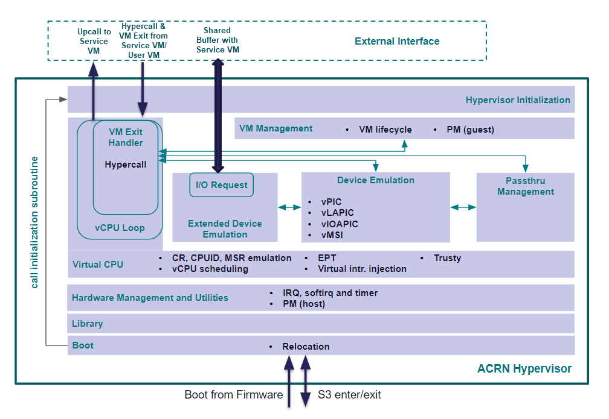

.. _modularity:

ACRN Hypervisor: Modular Design
###############################

Overview
********

ACRN highly emphasizes modular design, i.e. the separation of functionality info
modules that define a concise set of interfaces. The goals of modular design
include:

* **Understandability** A modular design is easier to understand due to
  encapsulation.
* **Testability** Modules can be integrated and tested in the reverse order of
  dependencies among them. White-box integration tests help improve the coverage
  of tests and identify corner cases that are hard to trigger when testing the
  hypervisor as a whole.
* **Configurability** Modular design makes it easy to configure certain
  functionalities in or out. This is crucial in safety-critical scenarios
  because absence of irrelevant code is required in both MISRA-C and functional
  safety standards.
* **Meet functional safety requirements** Functional safety standards explicitly
  require a hierarchical structure of modules in software architectural
  design. This applies to any safety integrity level defined in
  [IEC_61508-3]_ and [ISO_26262-6]_.

Principles
**********

* Each source file shall belong to one module only. One module may consist of
  one or multiple source files, though. A source file can be a C source, a C
  header or an assembly file.
* Each module shall have well-defined interfaces, including the exported
  functions and global variables. Functions and variables that are not
  interfaces shall be static and used inside the module only.
* Dependencies among the modules should be acyclic. Any cyclic dependency must
  be deviated explicitly.
* The complexity of a module shall be limited.

Minimizing Cyclic Dependencies
==============================

Cyclic dependencies can be mostly avoided by carefully defining the boundary of
modules. The following methods can be used when certain cyclic dependency cannot
be resolved by design.

* **Use callbacks** Callback registration and invocation help reverse dependencies
  between two modules and break cyclic dependencies. However callbacks shall be
  used with care due to its dynamic behavior. Send proposals or patches to the
  `acrn-dev mailing list <https://lists.projectacrn.org/g/acrn-dev>`_ for
  discussing if specific callbacks are appropriate.
* **Making the cyclic dependency an exception** A specific cyclic dependency can
  be regarded as an exception if it is well justified and a work around is
  available to break the cyclic dependency for integration testing.

Measuring Complexity
====================

ACRN uses the number of functions and the cyclomatic complexity [CC]_ of each
function to measure the complexity of a module. Concrete criterias on complexity
will be determined while enhancing the modularity of the hypervisor. The current
recommendation is to limit the cyclomatic complexity of a function under 20.

Architecture
************

The following figure shows the high-level components of ACRN hypervisor.

   Layered Architecture of ACRN Hypervisor

The components are listed as follows.

* **Boot** This component carries out the most basic hardware initialization to
  enable the execution of C code.
* **Library** This component consists of subroutines that require no explicit
  initialization. Examples include standard memory and string manipulation
  functions like strncpy, atomic operations and bitmap operations. This
  component is independent from and widely used in the other components.
* **Hardware Management and Utilities** This component abstract hardware
  resources and provide services like timers and physical interrupt handler
  registration to the upper layers.
* **Virtual CPU** This component implements CPU, memory and interrupt
  virtualization. The vCPU loop module in this component handles VM exit events
  by calling the proper handler in the other components. Hypercalls are
  implemented as a special type of VM exit event. This component is also able to
  inject upcall interrupts to SOS.
* **Device Emulation** This component implements devices that are emulated in
  the hypervisor itself, such as the virtual programmable interrupt controllers
  including vPIC, vLAPIC and vIOAPIC.
* **Passthru Management** This component manages devices that are passed-through
  to specific VMs.
* **Extended Device Emulation** This component implements an I/O request
  mechanism that allow the hypervisor to forward I/O accesses from UOSes to SOS
  for emulation.
* **VM Management** This component manages the creation, deletion and other
  lifecycle operations of VMs.
* **Hypervisor Initialization** This component invokes the initialization
  subroutines in the other components to bring up the hypervisor and start up
  SOS in sharing mode or all the VMs in partitioning mode.

ACRN hypervisor adopts a layered design where higher layers can invoke the
interfaces of lower layers but not vice versa. The only exception is the
invocation of initialization routine in the **Boot** component, illustrated as
the arrow from bottom to top on the left side of figure
:numref:`modularity-architecture`. This exception is made due to the following
reasons.

* **Boot** enables the execution of C code and thus has to be the lowest layer
  in the architecture.
* **Hypervisor Initialization** contains the hypervisor initialization function
  that calls the initialization functions of each layer. Thus this component is
  the highest layer to minimize reverse dependencies.
* **Boot** shall invoke the hypervisor initialization routine after bringing up
  the hardware. This inevitably causes a reverse dependency from **Boot** to
  **Hypervisor Initialization**.

To enable integration testing of a layer in the middle (e.g. **Virtual CPU**),
**Boot** will invoke a customized function that only invokes the initialization
functions of that layer as well as the layers below.

References
**********

.. [IEC_61508-3] IEC 61508-3:2010, Functional safety of electrical/electronic/programmable electronic safety-related systems – Part 3: Software requirements

.. [ISO_26262-6] ISO 26262-6:2011, Road vehicles - Functional safety - Part 6: Product development at the software level

.. [CC] Cyclomatic complexity - Wikipedia, https://en.wikipedia.org/wiki/Cyclomatic_complexity
