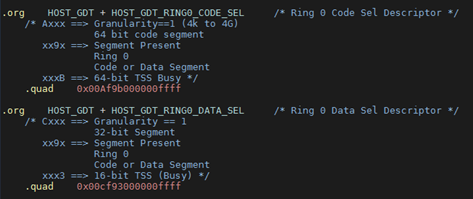
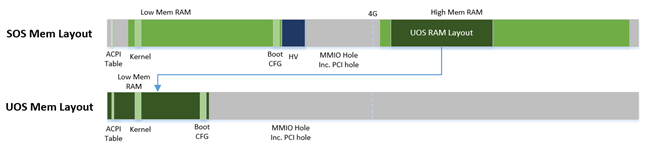
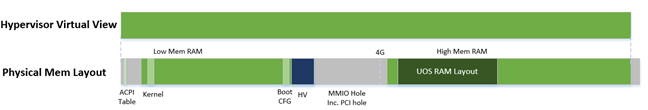
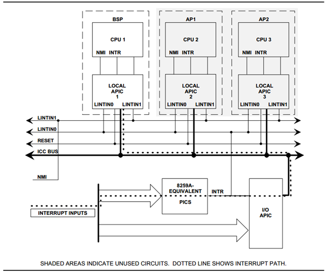
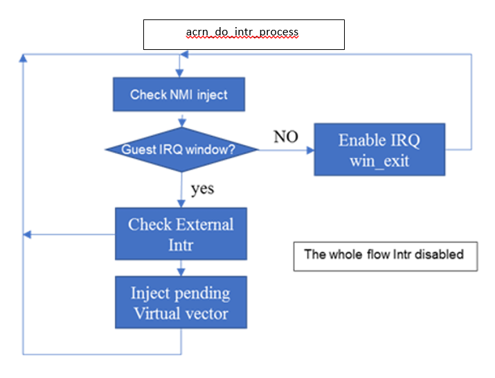
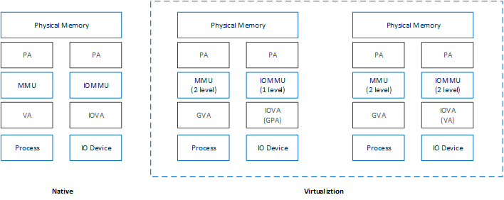
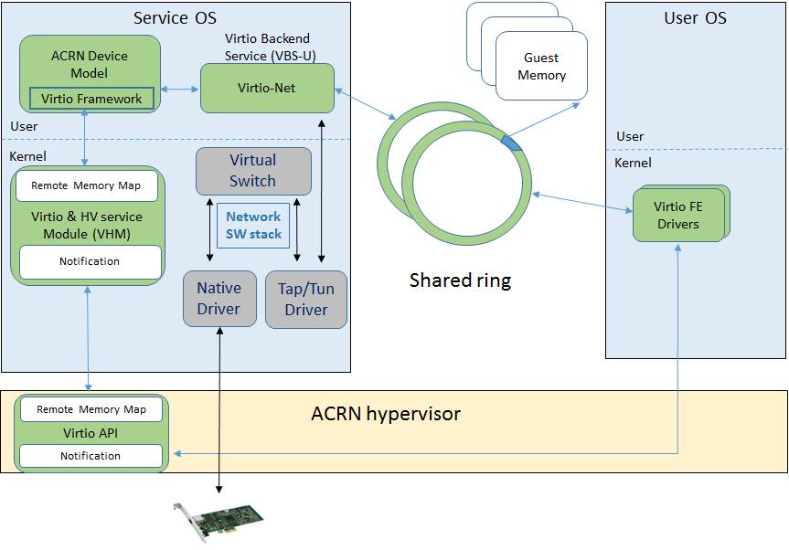

.. _primer:

Developer Primer
################

This Developer Primer introduces the fundamental components of ACRN and
the virtualization technology used by this open source reference stack.
Code level documentation and additional details can be found by
consulting the :ref:`acrn_apis` documentation and the `source code in
GitHub`_.

.. _source code in GitHub: https://github.com/projectacrn

The ACRN Hypervisor acts as a host with full control of the processor(s)
and the hardware (physical memory, interrupt management and I/O). It
provides the User OS with an abstraction of a virtual platform, allowing
the guest to behave as if were executing directly on a logical
processor.

.. _source tree structure:

Source Tree Structure
*********************

Understanding the ACRN hypervisor and the ACRN device model source tree
structure is helpful for locating the code associated with a particular
hypervisor and device emulation feature.

The ACRN source code (and documentation) are maintained in the
https://github.com/projectacrn/acrn-hypervisor repo, with the
hypervisor, device model, tools, and documentation in their own
folders::

   acrn-hypervisor
   ├─ hypervisor
   ├─ devicemodel
   ├─ tools
   └─ doc

Here's a brief description of each of these source tree folders:

ACRN hypervisor source tree
===========================

**arch/x86/**
  hypervisor architecture, which includes arch x86 related source files
  to run the hypervisor, such as CPU, memory, interrupt, and VMX.

**boot/**
  boot stuff mainly including ACPI related

**bsp/**
  board support package, used to support NUC with UEFI

**common/**
  common source files for hypervisor, which including VM hypercall
  definition, VM main loop, and VM software loader

**debug/**
  all debug related source files, which will not be compiled for
  release version, mainly including console, uart, logmsg and shell

**include/**
  include files for all public APIs (doxygen comments in these source
  files are used to generate the :ref:`acrn_apis` documentation)

**lib/**
  runtime service libraries

ACRN Device Model source tree
=============================

**arch/x86/**
  architecture-specific source files needed for the devicemodel

**core/**
  ACRN Device model core logic (main loop, SOS interface, etc.)

**hw/**
  Hardware emulation code, with the following subdirectories:

  **pci/**
     PCI devices, including VBS-Us (Virtio backend drivers in user-space).

  **platform/**
     platform devices such as uart, and keyboard.

**include/**
  include files for all public APIs (doxygen comments in these source
  files are used to generate the :ref:`acrn_apis` documentation)

**samples/**
  scripts (included in the Clear Linux build) for setting up the network
  and launching the User OS on the platform.

ACRN Tools source tree
=============================

The tools folder holds source code for ACRN-provided tools such as:

acrnlog
  a userland tool to capture the log output from the currently running
  hypervisor, and from the last previous run if the hypervisor crashed.

acrnctl
  a utility to create, delete, list, launch, and stop a User OS (UOS).

acrntrace
  a Service OS (SOS) utility to capture trace data and scripts to
  analyze the collected data.

ACRN documentation source tree
==============================

Project ACRN documentation is written using the reStructuredText markup
language (.rst file extension) with Sphinx extensions, and processed
using Sphinx to create a formatted stand-alone website, (the one you're
reading now.) Developers can view this content either in its raw form as
.rst markup files in the acrn-documentation repo, or you can generate
the HTML content and view it with a web browser directly on your
workstation, useful if you're contributing documentation to the project.

**api/**
  ReST files for API document generation

**custom-doxygen/**
  Customization files for doxygen-generated html output (while
  generated, we currently don't include the doxygen html output but do use
  the XML output to feed into the Sphinx-generation process)

**getting_started/**
  ReST files and images for the Getting Started Guide

**howtos/**
  ReST files and images for Technical and Process how-to articles

**images/**
  Image files not specific to a document (logos, and such)

**introduction/**
  ReST files and images for the Introduction to Project ACRN

**primer/**
  ReST files and images for the Developer Primer

**scripts/**
  Files used to assist building the documentation set

**static/**
  Sphinx folder for extras added to the generated output (such as custom
  CSS additions)

**_templates/**
  Sphinx configuration updates for the standard read-the-docs templates
  used to format the generated HTML output

CPU virtualization
******************

The ACRN hypervisor uses static partitioning of the physical CPU cores,
providing each User OS a virtualized environment containing at least one
statically assigned physical CPU core. The CPUID features for a
partitioned physical core is the same as the native CPU features. CPU
power management (Cx/Px) is managed by the User OS.

The supported Intel |reg| NUC platform (see :ref:`hardware`) has a CPU
with four cores. The Service OS is assigned one core and the other three
cores are assigned to the User OS. ``XSAVE`` and ``XRSTOR`` instructions
(used to perform a full save/restore of the extended state in the
processor to/from memory) are currently not supported in the User OS.
(The kernel boot parameters must specify ``noxsave``). Processor core
sharing among User OSes is planned for a future release.

The following sections introduce CPU virtualization related
concepts and technologies.

Host GDT
========

The ACRN hypervisor initializes the host Global Descriptor Table (GDT),
used to define the characteristics of the various memory areas during
program execution. Code Segment ``CS:0x8`` and Data Segment ``DS:0x10``
are configured as Hypervisor selectors, with their settings in host the
GDT as shown in :numref:`host-gdt`:

   Host GDT

Host IDT
========

The ACRN hypervisor installs interrupt gates for both Exceptions and
Vectors. That means exceptions and interrupts will automatically disable
interrupts. The ``HOST_GDT_RING0_CODE_SEL`` is used in the Host IDT
table.

Guest SMP Booting
=================

The Bootstrap Processor (BSP) vCPU for the User OS boots into x64 long
mode directly, while the Application Processors (AP) vCPU boots into
real mode. The virtualized Local Advanced Programmable Interrupt
Controller (vLAPIC) for the User OS in the hypervisor emulates the
INIT/STARTUP signals.

The AP vCPU belonging to the User OS begins in an infinite loop, waiting
for an INIT signal.  Once the User OS issues a Startup IPI (SIPI) signal
to another vCPU, the vLAPIC traps the request, resets the target vCPU,
and then enters the ``INIT->STARTUP#1->STARTUP#2`` cycle to boot the
vCPUs for the User OS.

VMX configuration
=================

ACRN hypervisor has the Virtual Machine configuration (VMX) shown in
:numref:`VMX_MSR` below. (These configuration settings may change in the future, according to
virtualization policies.)

.. table:: VMX Configuration
   :align: center
   :widths: auto
   :name: VMX_MSR

   +----------------------------------------+----------------+---------------------------------------+
   | **VMX MSR**                            | **Bits**       | **Description**                       |
   +========================================+================+=======================================+
   | **MSR\_IA32\_VMX\_PINBASED\_CTLS**     | Bit0 set       | Enable External IRQ VM Exit           |
   +                                        +----------------+---------------------------------------+
   |                                        | Bit6 set       | Enable HV pre-40ms Preemption timer   |
   +                                        +----------------+---------------------------------------+
   |                                        | Bit7 clr       | Post interrupt did not support        |
   +----------------------------------------+----------------+---------------------------------------+
   | **MSR\_IA32\_VMX\_PROCBASED\_CTLS**    | Bit25 set      | Enable I/O bitmap                     |
   +                                        +----------------+---------------------------------------+
   |                                        | Bit28 set      | Enable MSR bitmap                     |
   +                                        +----------------+---------------------------------------+
   |                                        | Bit19,20 set   | Enable CR8 store/load                 |
   +----------------------------------------+----------------+---------------------------------------+
   | **MSR\_IA32\_VMX\_PROCBASED\_CTLS2**   | Bit1 set       | Enable EPT                            |
   +                                        +----------------+---------------------------------------+
   |                                        | Bit7 set       | Allow guest real mode                 |
   +----------------------------------------+----------------+---------------------------------------+
   | **MSR\_IA32\_VMX\_EXIT\_CTLS**         | Bit15          | VMX Exit auto ack vector              |
   +                                        +----------------+---------------------------------------+
   |                                        | Bit18,19       | MSR IA32\_PAT save/load               |
   +                                        +----------------+---------------------------------------+
   |                                        | Bit20,21       | MSR IA32\_EFER save/load              |
   +                                        +----------------+---------------------------------------+
   |                                        | Bit9           | 64-bit mode after VM Exit             |
   +----------------------------------------+----------------+---------------------------------------+

CPUID and Guest TSC calibration
===============================

User OS access to CPUID will be trapped by ACRN hypervisor, however
the ACRN hypervisor will pass through most of the native CPUID
information to the guest, except the virtualized CPUID 0x1 (to
provide fake x86_model).

The Time Stamp Counter (TSC) is a 64-bit register present on all x86
processors that counts the number of cycles since reset. ACRN hypervisor
also virtualizes ``MSR_PLATFORM_INFO`` and ``MSR_ATOM_FSB_FREQ``.

RDTSC/RDTSCP
============

User OS vCPU reads of ``RDTSC``, ``RDTSCP``, or ``MSR_IA32_TSC_AUX``
will not make the VM Exit to the hypervisor. Thus the vCPUID provided by
``MSR_IA32_TSC_AUX`` can be changed via the User OS.

The ``RDTSCP`` instruction is widely used by the ACRN hypervisor to
identify the current CPU (and read the current value of the processor's
time-stamp counter). Because there is no VM Exit for
``MSR_IA32_TSC_AUX`` msr register, the hypervisor will save and restore
the ``MSR_IA32_TSC_AUX`` value on every VM Exit and Enter. Before the
hypervisor restores the host CPU ID, we must not use a ``RDTSCP``
instruction because it would return the vCPU ID instead of host CPU ID.

CR Register virtualization
==========================

Guest CR8 access will make the VM Exit, and is emulated in the
hypervisor for vLAPIC to update its PPR register. Guest access to CR3
will not make the VM Exit.

MSR BITMAP
==========

In the ACRN hypervisor, only these module-specific registers (MSR) are
supported:

**MSR_IA32_TSC_DEADLINE**
  emulates Guest TSC timer program

**MSR_PLATFORM_INFO**
  emulates a fake X86 module

**MSR_ATOM_FSB_FREQ**
  provides the CPU frequency directly via this MSR to avoid TSC calibration

I/O BITMAP
==========

All User OS I/O port accesses are trapped into the ACRN hypervisor by
default. Most of the Service OS I/O port accesses are not trapped into
the ACRN hypervisor, allowing the Service OS direct access to the
hardware port.

The Service OS I/O trap policy is:

**0x3F8/0x3FC**
  for emulated vUART inside hypervisor for SOS only, will be trapped

**0x20/0xA0/0x460**
  for vPIC emulation in hypervisor, will be trapped

**0xCF8/0xCFC**
  for hypervisor PCI device interception, will be trapped

Exceptions
==========

The User OS handles its exceptions inside the VM, including page fault,
GP, etc. A #MC and #DB exception causes a VM Exit to the ACRN hypervisor
console.

Memory virtualization
*********************

ACRN hypervisor provides memory virtualization by using a static
partition of system memory. Each virtual machine owns its own contiguous
partition of memory, with the Service OS staying in lower memory and the
User OS instances in high memory. (High memory is memory which is not
permanently mapped in the kernel address space, while Low Memory is
always mapped, so you can access it in the kernel simply by
dereferencing a pointer.) In future implementations, this will evolve to
utilize EPT/VT-d.

ACRN hypervisor memory is not visible to any User OS. In the ACRN
hypervisor, there are a few memory accesses that need to work
efficiently:

- ACRN hypervisor to access host memory
- vCPU per VM to access guest memory
- vCPU per VM to access host memory
- vCPU per VM to access MMIO memory

The rest of this section introduces how these kinds of memory accesses
are managed.  It gives an overview of physical memory layout,
Paravirtualization (MMU) memory mapping in the hypervisor and VMs, and
Host-Guest Extended Page Table (EPT) memory mapping for each VM.

Physical Memory Layout
======================

The Physical Memory Layout Example for Service OS & User OS is shown in
:numref:`primer-mem-layout` below:

   Memory Layout

:numref:`primer-mem-layout` shows an example of physical memory layout
of the Service and User OS. The Service OS accepts the whole e820 table
(all usable memory address ranges not reserved for use by the BIOS)
after filtering out the Hypervisor memory too. From the SOS's point of
view, it takes control of all available physical memory, including User
OS memory, not used by the hypervisor (or BIOS). Each User OSes memory
is allocated from (High) SOS memory and the User OS only owns this
section of memory control.

Some of the physical memory of a 32-bit machine, needs to be sacrificed
by making it hidden so memory-mapped I/O (MMIO) devices have room to
communicate. This creates an MMIO hole for VMs to access some range of
MMIO addresses directly for communicating to devices; or they may need
the hypervisor to trap some range of MMIO to do device emulation. This
access control is done through EPT mapping.

PV (MMU) Memory Mapping in the Hypervisor
=========================================

   ACRN Hypervisor PV Mapping Example

The ACRN hypervisor is trusted and can access and control all system
memory, as shown in :numref:`primer-pv-mapping`. Because the hypervisor
is running in protected mode, an MMU page table must be prepared for its
PV translation. To simplify things, the PV translation page table is set
as a 1:1 mapping.  Some MMIO range mappings could be removed if they are
not needed. This PV page table is created when the hypervisor memory is
first initialized.

PV (MMU) Memory Mapping in VMs
==============================

As mentioned earlier, the Primary vCPU starts to run in protected mode
when its VM is started. But before it begins, a temporary PV (MMU) page
table must be prepared..

This page table is a 1:1 mapping for 4 Gb, and only lives for a short
time when the vCPU first runs. After the vCPU starts to run its kernel
image (for example Linux\*), the kernel will create its own PV page
tables, after which, the temporary page table will be obsoleted.

Host-Guest (EPT) Memory Mapping
===============================

The VMs (both SOS and UOS) need to create an Extended Page Table (EPT) to
access the host physical memory based on its guest physical memory. The
guest VMs also need to set an MMIO trap to trigger EPT violations for
device emulation (such as IOAPIC, and LAPIC).  This memory layout is
shown in :numref:`primer-sos-ept-mapping`:

   SOS EPT Mapping Example

The SOS takes control of all the host physical memory space: its EPT
mapping covers almost all of the host memory except that reserved for
the hypervisor (HV) and a few MMIO trap ranges for IOAPIC & LAPIC
emulation. The guest to host mapping for SOS is 1:1.

   UOS EPT Mapping Example

However, for the UOS, its memory EPT mapping is linear but with an
offset (as shown in :numref:`primer-uos-ept-mapping`).  The MMIO hole is
not mapped to trap all MMIO accesses from the UOS (and do emulating in
the device model). To support pass through devices in the future, some
MMIO range mapping may be added.

.. _Graphic_mediation:

Graphic mediation
*****************

Intel |reg| Graphics Virtualization Technology –g (Intel |reg| GVT-g)
provides GPU sharing capability to multiple VMs by using a mediated
pass-through technique. This allows a VM to access performance critical
I/O resources (usually partitioned) directly, without intervention from
the hypervisor in most cases.

Privileged operations from this VM are trap-and-emulated to provide
secure isolation among VMs. The Hypervisor must ensure that no
vulnerability is exposed when assigning performance-critical resource to
each VM. When a performance-critical resource cannot be partitioned, a
scheduler must be implemented (either in software or hardware) to allow
time-based sharing among multiple VMs. In this case, the device must
allow the hypervisor to save and restore the hardware state associated
with the shared resource, either through direct I/O register read/write
(when there is no software invisible state) or through a device-specific
context save/restore mechanism (where there is a software invisible
state).

In the initial release of Project ACRN, graphic mediation is not
enabled, and is planned for a future release.

I/O emulation
*************

The I/O path is explained in the :ref:`ACRN-io-mediator` section of the
:ref:`introduction`.  The following sections, provide additional device
assignment management and PIO/MMIO trap flow introduction.

Device Assignment Management
============================

ACRN hypervisor provides major device assignment management. Since the
hypervisor owns all native vectors and IRQs, there must be a mapping
table to handle the Guest IRQ/Vector to Host IRQ/Vector. Currently we
assign all devices to SOS_VM except the UART.

If a PCI device (with MSI/MSI-x) is assigned to Guest, the User OS will
program the PCI config space and set the guest vector to this device. A
Hypercall ``HC_VM_PCI_MSIX_REMAP`` is provided. Once the guest programs
the guest vector, the Service OS may call this hypercall to notify the ACRN
hypervisor. The hypervisor allocates a host vector, creates a guest-host
mapping relation, and replaces the guest vector with a real native
vector for the device:

**PCI MSI/MSI-X**
  PCI Message Signaled Interrupts (MSI/MSX-x) from
  devices can be triggered from a hypercall when a guest program
  vectors. All PCI devices are programed with real vectors
  allocated by the Hypervisor.

**PCI/INTx**
  Device assignment is triggered when the guest programs
  the virtual Advanced I/O Programmable Interrupt Controller
  (vIOAPC) Redirection Table Entries (RTE).

**Legacy**
  Legacy devices are assigned to SOS_VM.

User OS device assignment is similar to the above, except the User OS
doesn't call hypercall. Instead, the Guest program PCI configuration
space will be trapped into the Device Module, and Device Module may
issue hypercall to notify hypervisor the guest vector is changing.

Currently, there are two types of I/O Emulation supported: MMIO and
PORTIO trap handling. MMIO emulation is triggered by an EPT violation
VMExit only. If there is an EPT misconfiguration and VMExit occurs, the
hypervisor will halt the system. (Because the hypervisor set up all EPT
page table mapping at the beginning of the Guest boot, there should not
be an EPT misconfiguration.)

There are multiple places where I/O emulation can happen - in ACRN
hypervisor, Service OS Kernel VHM module, or in the Service OS Userland
ACRN Device Module.

PIO/MMIO trap Flow
==================

Here is a description of the PIO/MMIO trap flow:

#. Instruction decoder: get the Guest Physical Address (GPA) from VM
   Exit, go through gla2gpa() page walker if necessary.

#. Emulate the instruction. Here the hypervisor will have an address
   range check to see if the hypervisor is interested in this IO
   port or MMIO GPA access.

#. Hypervisor emulates vLAPIC, vIOAPIC, vPIC, and vUART only (for
   Service OS only). Any other emulation request are forwarded to
   the SOS for handling. The vCPU raising the I/O request will
   halt until this I/O request is processed successfully. An IPI will
   send to vCPU0 of SOS to notify there is an I/O request waiting for
   service.

#. Service OS VHM module takes the I/O request and dispatches the request
   to multiple clients. These clients could be SOS kernel space
   VBS-K, MPT, or User-land Device model. VHM I/O request server
   selects a default fallback client responsible to handle any I/O
   request not handled by other clients. (The Device Manager is the
   default fallback client.) Each client needs to register its I/O
   range or specific PCI bus/device/function (BDF) numbers. If an I/O
   request falls into the client range, the I/O request server will
   send the request to that client.

#. Multiple clients - fallback client (Device Model in user-land),
   VBS-K client, MPT client.
   Once the I/O request emulation completes, the client updates the
   request status and notifies the hypervisor by a hypercall.
   Hypervisor picks up that request, do any necessary cleanup,
   and resume the Guest vCPU.

Most I/O emulation tasks are done by the SOS CPU, and requests come from
UOS vCPUs.

Virtual interrupt
*****************

All interrupts received by the User OS comes from a virtual interrupt
injected by a virtual vLAPIC, vIOAPIC, or vPIC. All device emulation is
done inside the SOS Userspace device model. However for performance
consideration, vLAPIC, vIOAPIC, and vPIC devices are emulated inside the
ACRN hypervisor directly. From the guest point of view, vPIC uses
Virtual Wire Mode via vIOAPIC.

The symmetric I/O Mode is shown in :numref:`primer-symmetric-io`:

   Symmetric I/O Mode

**Kernel boot param with vPIC**
  add "maxcpu=0" to User OS to use PIC

**Kernel boot param with vIOAPIC**
  add "maxcpu=1" (as long as not "0") User OS will use IOAPIC. Keep
  IOAPIC pin2 as source of PIC.

Virtual LAPIC
=============

The LAPIC (Local Advanced Programmable interrupt Controller) is
virtualized for SOS or UOS. The vLAPIC is currently emulated by a Guest
MMIO trap to GPA address range: 0xFEE00000 - 0xFEE100000 (1MB). ACRN
hypervisor will support APIC-v and Post interrupts in a future release.

vLAPIC provides the same feature as a native LAPIC:

- Mask/Unmask vectors
- Inject virtual vectors (Level or Edge trigger mode) to vCPU
- Notify vIOAPIC of EOI processing
- Provide TSC Timer service
- vLAPIC support CR8 to update TPR
- INIT/STARTUP handling

Virtual IOAPIC
==============

A vIOAPIC is emulated by the hypervisor when the Guest accesses MMIO GPA
Range: 0xFEC00000 - 0xFEC01000. The vIOAPIC for the SOS will match the
same pin numbers as the native HW IOAPIC. The vIOAPIC for UOS only
provides 24 Pins. When a vIOAPIC PIN is asserted, the vIOAPIC calls
vLAPIC APIs to inject the vector to the Guest.

Virtual PIC
===========

A vPIC is required for TSC calculation. Normally the UOS boots with a
vIOAPIC. A vPIC is a source of external interrupts to the Guest. On
every VMExit, the hypervisor checks if there are pending external PIC
interrupts.

Virtual Interrupt Injection
===========================

The source of virtual interrupts comes from either the Device Module or
from assigned devices:

**SOS assigned devices**
  As we assigned all devices to SOS directly whenever a devices'
  physical interrupts come, we inject the corresponding virtual interrupts
  to SOS via the vLAPIC/vIOAPIC.  In this case, the SOS doesn't use the
  vPIC and does not have emulated devices.

**UOS assigned devices**
  Only PCI devices are assigned to UOS, and virtual interrupt injection
  follows the same way as the SOS. A virtual interrupt injection operation
  is triggered when a device's physical interrupt is triggered.

**UOS emulated devices**
  Device Module (user-land Device Model) is responsible for UOS emulated
  devices' interrupt lifecycle management. The Device Model knows when an
  emulated device needs to assert a virtual IOPAIC/PIC Pin or needs to
  send a virtual MSI vector to the Guest. This logic is entirely handled
  by the Device Model.

:numref:`primer-hypervisor-interrupt` shows how the hypervisor handles
interrupt processing and pending interrupts (acrn_do_intr_process):

   Hypervisor Interrupt handler

There are many cases where the Guest RFLAG.IF is cleared and interrupts
are disabled. The hypervisor will check if the Guest IRQ window is
available before injection. NMI is unmasked interrupt injection
regardless of existing guest IRQ window status. If the current IRQ
windows is not available, hypervisor enables
``MSR_IA32_VMX_PROCBASED_CTLS_IRQ_WIN`` (PROCBASED_CTRL.bit[2]) and
VMEnter directly. The injection will be done on next VMExit once the
Guest issues STI (GuestRFLAG.IF=1).

VT-x and VT-d
*************

Since 2006, Intel CPUs have supported hardware assist - VT-x
instructions, where the CPU itself traps specific guest instructions and
register accesses directly into the VMM without need for binary
translation (and modification) of the guest operating system. Guest
operating systems can be run natively without modification, although it
is common to still install virtualization-aware para-virtualized drivers
into the guests to improve functionality. One common example is access
to storage via emulated SCSI devices.

Intel CPUs and chipsets support various Virtualization Technology (VT)
features - such as VT-x and VT-d. Physical events on the platform
trigger CPU **VM Exits** (a trap into the VMM) to handle physical
events such as physical device interrupts,

In the ACRN hypervisor design, VT-d can be used to do DMA Remapping,
such as Address translation and Isolation.
:numref:`primer-dma-address-mapping` is an example of address
translation:

   DMA address mapping

Hypercall
*********

ACRN hypervisor currently supports less than a dozen
:ref:`hypercall_apis` and VHM upcall APIs to support the necessary VM
management, IO request distribution and guest memory mappings. The
hypervisor and Service OS (SOS) reserve vector 0xF4 for hypervisor
notification to the SOS. This upcall is necessary whenever device
emulation is required by the SOS.  The upcall vector 0xF4 is injected to
SOS vCPU0.

Refer to the :ref:`acrn_apis` documentation for details.

Device emulation
****************

The ACRN Device Model emulates different kinds of platform devices, such as
RTC, LPC, UART, PCI device, and Virtio block device. The most important
thing about device emulation is to handle the I/O request from different
devices. The I/O request could be PIO, MMIO, or PCI CFG SPACE access. For
example:

- a CMOS RTC device may access 0x70/0x71 PIO to get the CMOS time,
- a GPU PCI device may access its MMIO or PIO BAR space to complete
  its frame buffer rendering, or
- the bootloader may access PCI devices' CFG
  SPACE for BAR reprogramming.

ACRN Device Model injects interrupts/MSIs to its frontend devices when
necessary as well, for example, a RTC device needs to get its ALARM
interrupt or a PCI device with MSI capability needs to get its MSI. The
Data Model also provides a PIRQ routing mechanism for platform devices.

Virtio Devices
**************

This section introduces the Virtio devices supported by ACRN.  Currently
all the Back-end Virtio drivers are implemented using the Virtio APIs
and the FE drivers are re-using Linux standard Front-end Virtio drivers.

Virtio-rnd
==========

The Virtio-rnd entropy device supplies high-quality randomness for guest
use. The Virtio device ID of the Virtio-rnd device is 4, and supports
one virtqueue of 64 entries (configurable in the source code). No
feature bits are defined.

When the FE driver requires random bytes, the BE device places bytes of
random data onto the virtqueue.

To launch the Virtio-rnd device, you can use the following command:

.. code-block:: bash

   ./acrn-dm -A -m 1168M \
      -s 0:0,hostbridge \
      -s 1,virtio-blk,./uos.img \
      -s 2,virtio-rnd \
      -k bzImage \
      -B "root=/dev/vda rw rootwait noxsave maxcpus=0 nohpet \
          console=hvc0 no_timer_check ignore_loglevel \
          log_buf_len=16M consoleblank=0 tsc=reliable" vm1

To verify the result in user OS side, you can use the following command:

.. code-block:: bash

   od /dev/random

Virtio-blk
==========

The Virtio-blk device is a simple virtual block device. The FE driver
will place read, write, and other requests onto the virtqueue, so that
the BE driver can process them accordingly.

The Virtio device ID of the Virtio-blk is 2, and it supports one
virtqueue with 64 entries, configurable in the source code. The feature
bits supported by the BE device are as follows:

**VTBLK\_F\_SEG\_MAX(bit 2)**
  Maximum number of segments in a request is in seg_max.

**VTBLK\_F\_BLK\_SIZE(bit 6)**
  block size of disk is in blk\_size.

**VTBLK\_F\_FLUSH(bit 9)**
  cache flush command support.

**VTBLK\_F\_TOPOLOGY(bit 10)**
  device exports information on optimal I/O alignment.

To use the Virtio-blk device, use the following command:

.. code-block:: bash

   ./acrn-dm -A -m 1168M \
      -s 0:0,hostbridge \
      -s 1,virtio-blk,./uos.img** \
      -k bzImage -B "root=/dev/vda rw rootwait noxsave maxcpus=0 \
         nohpet console=hvc0 no_timer_check ignore_loglevel \
         log_buf_len=16M consoleblank=0 tsc=reliable" vm1

To verify the result, you should expect the user OS to boot
successfully.

Virtio-net
==========

The Virtio-net device is a virtual Ethernet device. The Virtio device ID
of the Virtio-net is 1. The Virtio-net device supports two virtqueues,
one for transmitting packets and the other for receiving packets. The
FE driver will place empty buffers onto one virtqueue for receiving
packets, and enqueue outgoing packets onto the other virtqueue for
transmission. Currently the size of each virtqueue is 1000, configurable
in the source code.

To access the external network from user OS, a L2 virtual switch should
be created in the service OS, and the BE driver is bonded to a tap/tun
device linking under the L2 virtual switch. See
:numref:`primer-virtio-net`:

   Accessing external network from User OS

Currently the feature bits supported by the BE device are:

**VIRTIO\_NET\_F\_MAC(bit 5)**
  device has given MAC address.

**VIRTIO\_NET\_F\_MRG\_RXBUF(bit 15)**
  BE driver can merge receive buffers.

**VIRTIO\_NET\_F\_STATUS(bit 16)**
  configuration status field is available.

**VIRTIO\_F\_NOTIFY\_ON\_EMPTY(bit 24)**
  device will issue an interrupt if it runs out of available
  descriptors on a virtqueue.

To enable the Virtio-net device, use the following command:

.. code-block:: bash

   ./acrn-dm -A -m 1168M \
      -s 0:0,hostbridge \
      -s 1,virtio-blk,./uos.img \
      -s 2,virtio-net,tap0 \
      -k bzImage -B "root=/dev/vda rw rootwait noxsave maxcpus=0 \
         nohpet console=hvc0 no_timer_check ignore_loglevel \
         log_buf_len=16M consoleblank=0 tsc=reliable" vm1

To verify the correctness of the device, the external
network should be accessible from the user OS.

Virtio-console
==============

The Virtio-console device is a simple device for data input and output.
The Virtio device ID of the Virtio-console device is 3. A device could
have from one to 16 ports. Each port has a pair of input and output
virtqueues used to communicate information between the FE and BE
drivers. Currently the size of each virtqueue is 64, configurable in the
source code.

Similar to Virtio-net device, the two virtqueues specific to a port are
for transmitting virtqueue and receiving virtqueue. The FE driver will
place empty buffers onto the receiving virtqueue for incoming data, and
enqueue outgoing characters onto transmitting virtqueue.

Currently the feature bits supported by the BE device are:

**VTCON\_F\_SIZE(bit 0)**
  configuration columns and rows are valid.

**VTCON\_F\_MULTIPORT(bit 1)**
  device supports multiple ports, and control virtqueues will be used.

**VTCON\_F\_EMERG\_WRITE(bit 2)**
  device supports emergency write.

Virtio-console supports redirecting guest output to various backend
devices, including stdio/pty/tty. Users could follow the syntax below to
specify which backend to use:

.. code-block:: none

   virtio-console,[@]stdio\|tty\|pty:portname[=portpath][,[@]stdio\|tty\|pty:portname[=portpath]]

For example, to use stdio as a Virtio-console backend, use the following
command:

.. code-block:: bash

   ./acrn-dm -A -m 1168M \
      -s 0:0,hostbridge \
      -s 1,virtio-blk,./uos.img \
      -s 3,virtio-console,@stdio:stdio\_port \
      -k bzImage -B "root=/dev/vda rw rootwait noxsave maxcpus=0 \
         nohpet console=hvc0 no_timer_check ignore_loglevel \
         log_buf_len=16M consoleblank=0 tsc=reliable" vm1

Then user could login into user OS:

.. code-block:: bash

   Ubuntu 17.04 xubuntu hvc0
   xubuntu login: root
   Password:

To use pty as a virtio-console backend, use the following command:

.. code-block:: bash

   ./acrn-dm -A -m 1168M \
      -s 0:0,hostbridge \
      -s 1,virtio-blk,./uos.img \
      -s 2,virtio-net,tap0 \
      -s 3,virtio-console,@pty:pty\_port \
      -k ./bzImage -B "root=/dev/vda rw rootwait noxsave maxcpus=0 \
         nohpet console=hvc0 no_timer_check ignore_loglevel \
         log_buf_len=16M consoleblank=0 tsc=reliable" vm1 &

When ACRN-DM boots User OS successfully, a similar log will be shown
as below:

.. code-block:: none

   **************************************************************
   virt-console backend redirected to /dev/pts/0
   **************************************************************

You can then use the following command to login the User OS:

.. code-block:: bash

   minicom -D /dev/pts/0

or

.. code-block:: bash

   screen /dev/pts/0
