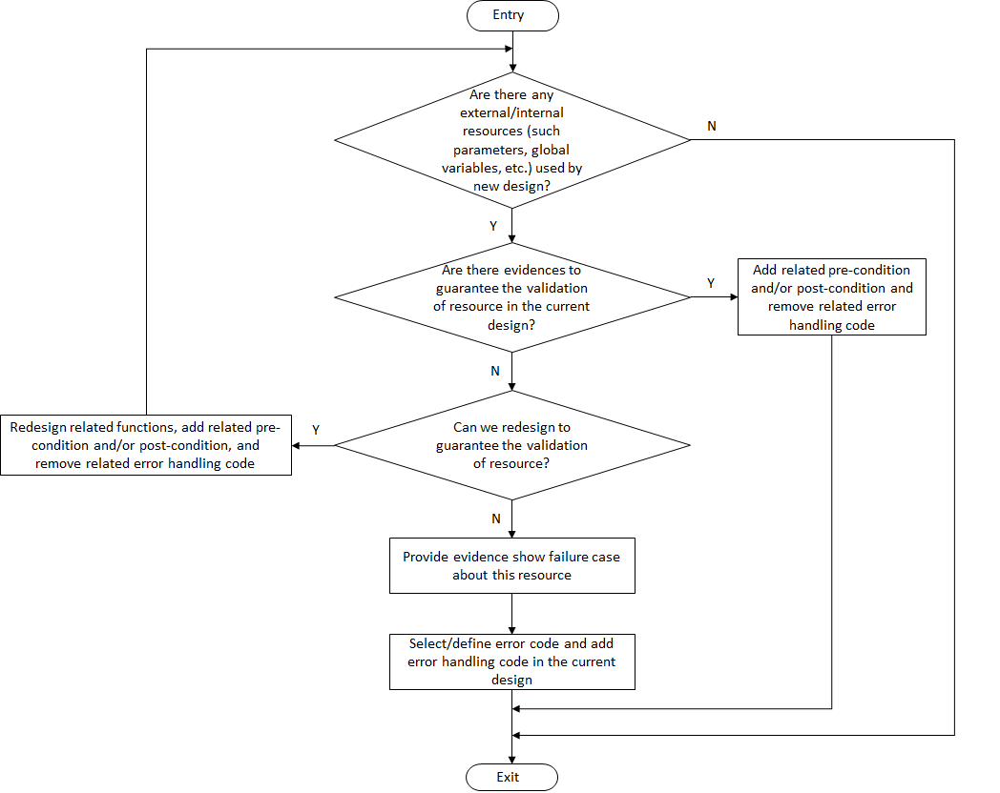

.. _sw_design_guidelines:

Software Design Guidelines
##########################

Error Detection and Error Handling
**********************************

Workflow
========

Error detection and error handling workflow in the ACRN hypervisor is shown in
:numref:`work_flow_of_error_detection_and_error_handling`.

   Error Detection and Error Handling Workflow

Design Assumption
=================

There are three types of design assumptions in the ACRN hypervisor, as shown
below:

**Pre-condition**
  Pre-conditions shall be defined right before the definition/declaration of
  the corresponding function in the C source file or header file.
  All pre-conditions shall be guaranteed by the caller of the function.
  Error checking of the pre-conditions are not needed in release version of the
  function. Developers could use ASSERT to catch design errors in a debug
  version for some cases. Verification of the hypervisor shall check whether
  each caller guarantees all pre-conditions of the callee (or not).

  This design assumption applies to the following cases:

  - Input parameters of the function.
  - Global state, such as hypervisor operation mode.

**Post-condition**
  Post-conditions shall be defined right before the definition/declaration of
  the corresponding function in the C source file or header file.
  All post-conditions shall be guaranteed by the function. All callers of the
  function should trust these post-conditions are met.
  Error checking of the post-conditions are not needed in release version of
  each caller. Developers could use ASSERT to catch design errors in a debug
  version for some cases. Verification of the hypervisor shall check whether the
  function guarantees all post-conditions (or not).

  This design assumption applies to the following case:

  - Return value of the function

    It is used to guarantee that the return value is valid, such as the return
    pointer is not NULL, the return value is within a valid range, or the
    members of the return structure are valid.

**Application Constraints**
  Application constraints of the hypervisor shall be defined in design document
  and safety manual.
  All application constraints shall be guaranteed by external safety
  applications, such as Board Support Package, firmware, safety VM, or Hardware.
  The verification of application integration shall check whether the safety
  application meets all application constraints. These constraints must be verified
  during hypervisor validation test. It is optional to do error checking for
  application constraints at hypervisor boot time.

  This design assumption applies to the following cases:

  - Configuration data defined by external safety application, such as physical
    PCI device information specific for each board design.

  - Input data which is only specified by external safety application.

.. note:: If input data can be specified by both a non-safety VM and a safety VM,
   the application constraint isn't applicable to these data. Related error checking
   and handling shall be done during hypervisor design.

Refer to the :ref:`C Programming Language Coding Guidelines <c_coding_guidelines>`
to document these design assumptions with doxygen-style comments.

Architecture Level
==================

Functional Safety Consideration
-------------------------------

The hypervisor will do range check in hypercalls and HW capability checks
according to Table A.2 of FuSa Standards [IEC_61508-3_2010]_ .

Error Handling Methods
----------------------

The error handling methods used in the ACRN hypervisor on an architecture level
are shown below.

**Invoke default fatal error handler**
  The hypervisor shall invoke the default fatal error handler when the below
  cases occur. Customers can define platform-specific handlers, allowing them to
  implement additional error reporting (mostly to hardware) if required. The
  default fatal error handler will invoke platform-specific handlers defined by
  users at first, then it will panic the system.

  This method applies to the following cases:

  - Related hardware resources are unavailable.
  - Boot information is invalid during platform initialization.
  - Unexpected exception occurs in root mode due to hardware failures.
  - Failures occur in the VM dedicated for error handling.

**Return error code**
  The hypervisor shall return an error code to the VM when the below cases
  occur. The error code shall indicate the error type detected (e.g. invalid
  parameter, device not found, device busy, resource unavailable, etc).

  This method applies to the following case:

  - The hypercall parameter from the VM is invalid.

**Inform the safety VM through specific register or memory area**
  The hypervisor shall inform the safety VM through a specific register or
  memory area when the below cases occur. The VM will decide how to handle the
  related error. This shall only be done after the VM (Safety OS or Service OS)
  dedicated to error handling has started.

  This method applies to the following cases:

  - Machine check errors occur due to hardware failures.

  - Unexpected VM entry failures occur, where the VM is not the one dedicated
    for error handling.

**Panic the system via ASSERT**
  The hypervisor can panic the system when the below cases occur. It shall
  only be used for debug and used to check pre-conditions and post-conditions
  to catch design errors.

  This method applies to the following case:

  - Software design errors occur.

Rules of Error Detection and Error Handling
-------------------------------------------

The rules of error detection and error handling on an architecture level are
shown in :numref:`rules_arch_level` below.

.. table:: Rules of Error Detection and Error Handling on Architecture Level
   :align: center
   :widths: auto
   :name: rules_arch_level

   +--------------------+-------------------------+--------------+---------------------------+-------------------------+
   | Resource Class     | Failure Mode            | Error        | Error Handling Policy     | Example                 |
   |                    |                         | Detection    |                           |                         |
   |                    |                         | via          |                           |                         |
   |                    |                         | Hypervisor   |                           |                         |
   +====================+=========================+==============+===========================+=========================+
   | External resource  | Invalid register/memory | Yes          | Follow SDM strictly, or   | Unsupported MSR         |
   | provided by VM     | state on VM exit        |              | state any deviation to the| or invalid CPU ID       |
   |                    |                         |              | document explicitly       |                         |
   |                    +-------------------------+--------------+---------------------------+-------------------------+
   |                    | Invalid hypercall       | Yes          | The hypervisor shall      | Invalid hypercall       |
   |                    | parameter               |              | return related error code | parameter provided by   |
   |                    |                         |              | to the VM                 | any VM                  |
   |                    +-------------------------+--------------+---------------------------+-------------------------+
   |                    | Invalid data in the     | Yes          | Case by case depending    | Invalid data in memory  |
   |                    | sharing memory area     |              | on the data               | shared with all VMs,    |
   |                    |                         |              |                           | such as IO request      |
   |                    |                         |              |                           | buffers and sbuf for    |
   |                    |                         |              |                           | debug                   |
   +--------------------+-------------------------+--------------+---------------------------+-------------------------+
   | External resource  | Invalid E820 table or   | Yes          | The hypervisor shall      | Invalid E820 table or   |
   | provided by        | invalid boot information|              | panic during platform     | invalid boot information|
   | bootloader         |                         |              | initialization            |                         |
   | (UEFI or SBL)      |                         |              |                           |                         |
   +--------------------+-------------------------+--------------+---------------------------+-------------------------+
   | Physical resource  | 1GB page is not         | Yes          | The hypervisor shall      | 1GB page is not         |
   | used by the        | available on the        |              | panic during platform     | available on the        |
   | hypervisor         | platform or invalid     |              | initialization            | platform or invalid     |
   |                    | physical CPU ID         |              |                           | physical CPU ID         |
   +--------------------+-------------------------+--------------+---------------------------+-------------------------+

Examples
--------

Here is an example to illustrate when error handling codes are required on
an architecture level.

There are two pre-condition statements of ``vcpu_from_vid``. It indicates that
it's the caller's responsibility to guarantee these pre-conditions.

.. code-block:: c

  /**
   * @pre vcpu_id < CONFIG_MAX_VCPUS_PER_VM
   * @pre &(vm->hw.vcpu_array[vcpu_id])->state != VCPU_OFFLINE
   */
  static inline struct acrn_vcpu *vcpu_from_vid(struct acrn_vm *vm, uint16_t vcpu_id)
  {
          return &(vm->hw.vcpu_array[vcpu_id]);
  }

``vcpu_from_vid`` is called by ``hcall_set_vcpu_regs``, which is a hypercall.
``hcall_set_vcpu_regs`` is an external interface and ``vcpu_id`` is provided by
VM. In this case, we shall add the error checking codes before calling
``vcpu_from_vid`` to make sure that the passed parameters are valid and the
pre-conditions are guaranteed.

Here is the sample codes for error checking before calling ``vcpu_from_vid``:

.. code-block:: c

  status = 0;

  if (vcpu_id >= CONFIG_MAX_VCPUS_PER_VM) {
          pr_err("vcpu id is out of range \r\n");
          status = -EINVAL;
  } else if ((&(vm->hw.vcpu_array[vcpu_id]))->state == VCPU_OFFLINE) {
          pr_err("vcpu is offline \r\n");
          status = -EINVAL;
  }

  if (status == 0) {
          vcpu = vcpu_from_vid(vm, vcpu_id);
          ...
  }

Module Level
============

Functional Safety Consideration
-------------------------------

Data verification, and explicit specification of pre-conditions and post-conditions
are applied for internal functions of the hypervisor according to Table A.4 of
FuSa Standards [IEC_61508-3_2010]_ .

Error Handling Methods
----------------------

The error handling methods used in the ACRN hypervisor on a module level are
shown below.

**Panic the system via ASSERT**
  The hypervisor can panic the system when the below cases occur. It shall
  only be used for debugging, used to check pre-conditions and post-conditions
  to catch design errors.

  This method applies to the following case:

  - Software design errors occur.

Rules of Error Detection and Error Handling
-------------------------------------------

The rules of error detection and error handling on a module level are shown in
:numref:`rules_module_level` below.

.. table:: Rules of Error Detection and Error Handling on Module Level
   :align: center
   :widths: auto
   :name: rules_module_level

   +--------------------+-----------+----------------------------+---------------------------+-------------------------+
   | Resource Class     | Failure   | Error Detection via        | Error Handling Policy     | Example                 |
   |                    | Mode      | Hypervisor                 |                           |                         |
   +====================+===========+============================+===========================+=========================+
   | Internal data of   | N/A       | Partial.                   | The hypervisor shall use  | virtual PCI device      |
   | the hypervisor     |           | The related pre-conditions | the internal resource/data| information, defined    |
   |                    |           | are required.              | directly.                 | with array 'pci_vdevs[]'|
   |                    |           | The design will guarantee  |                           | through static          |
   |                    |           | the correctness and the    |                           | allocation.             |
   |                    |           | test cases will verify the |                           |                         |
   |                    |           | related pre-conditions.    |                           |                         |
   |                    |           | If the design can not      |                           |                         |
   |                    |           | guarantee the correctness, |                           |                         |
   |                    |           | the related error handling |                           |                         |
   |                    |           | codes need to be added.    |                           |                         |
   |                    |           | Note: Some examples of     |                           |                         |
   |                    |           | pre-conditions are listed, |                           |                         |
   |                    |           | like non-empty array, valid|                           |                         |
   |                    |           | array size and non-null    |                           |                         |
   |                    |           | pointer.                   |                           |                         |
   +--------------------+-----------+----------------------------+---------------------------+-------------------------+
   | Configuration data | Corrupted | No.                        | The bootloader initializes| 'vm_config->pci_devs'   |
   | of the VM          | VM config | The related pre-conditions | hypervisor (including     | is configured           |
   |                    |           | are required.              | code, data, and bss) and  | statically.             |
   |                    |           | Note: VM configuration data| verifies the integrity of |                         |
   |                    |           | are auto generated based on| hypervisor image in which |                         |
   |                    |           | different board configs,   | VM configurations are.    |                         |
   |                    |           | they are defined           | Thus hypervisor does not  |                         |
   |                    |           | as static structure.       | need any additional       |                         |
   |                    |           |                            | mechanism.                |                         |
   +--------------------+-----------+----------------------------+---------------------------+-------------------------+
   | Configuration data | N/A       | No.                        | The hypervisor shall use  | The maximum number of   |
   | of the hypervisor  |           | The related pre-conditions | the internal resource/data| PCI devices in the VM,  |
   |                    |           | are required.              | directly.                 | defined with            |
   |                    |           | The design will guarantee  |                           | CONFIG_MAX_PCI_DEV_NUM  |
   |                    |           | the correctness and this   |                           | through configuration.  |
   |                    |           | shall be verified manually.|                           |                         |
   +--------------------+-----------+----------------------------+---------------------------+-------------------------+

Examples
--------

Here are some examples to illustrate when error handling codes are required on
a module level.

**Example_1: Analyze the function 'partition_mode_vpci_init'**

.. code-block:: c

  /**
   * @pre vm != NULL
   * @pre vm->vpci->pci_vdev_cnt <= CONFIG_MAX_PCI_DEV_NUM
   */
  static int32_t partition_mode_vpci_init(const struct acrn_vm *vm)
  {
          struct acrn_vpci *vpci = (struct acrn_vpci *)&(vm->vpci);
          struct pci_vdev *vdev;
          struct acrn_vm_config *vm_config = get_vm_config(vm->vm_id);
          struct acrn_vm_pci_dev_config *pci_dev_config;
          uint32_t i;

          vpci->pci_vdev_cnt = vm_config->pci_dev_num;

          for (i = 0U; i < vpci->pci_vdev_cnt; i++) {
                  vdev = &vpci->pci_vdevs[i];
                  vdev->vpci = vpci;
                  pci_dev_config = &vm_config->pci_devs[i];
                  vdev->vbdf.value = pci_dev_config->vbdf.value;

                  if (vdev->vbdf.value != 0U) {
                          partition_mode_pdev_init(vdev, pci_dev_config->pbdf);
                          vdev->ops = &pci_ops_vdev_pt;
                  } else {
                          vdev->ops = &pci_ops_vdev_hostbridge;
                  }

                  if (vdev->ops->init != NULL) {
                          if (vdev->ops->init(vdev) != 0) {
                                  pr_err("%s() failed at PCI device (vbdf %x)!",
                                          __func__, vdev->vbdf);
                          }
                  }
          }

          return 0;
  }

``get_vm_config`` is called by ``partition_mode_vpci_init``.
There are one pre-condition and two post-conditions of ``get_vm_config``.
It indicates that the caller of ``get_vm_config`` shall guarantee these
pre-conditions and ``get_vm_config`` itself shall guarantee the post-condition.

.. code-block:: c

  /**
   * @pre vm_id < CONFIG_MAX_VM_NUM
   * @post retval != NULL
   * @post retval->pci_dev_num <= MAX_PCI_DEV_NUM
   */
  struct acrn_vm_config *get_vm_config(uint16_t vm_id)
  {
          return &vm_configs[vm_id];
  }

**Question_1: Is error checking required for 'vm_config'?**

No. Because 'vm_config' is getting data from ``get_vm_config`` and the
post-condition of ``get_vm_config`` guarantees that the return value is not NULL.

**Question_2: Is error checking required for 'vdev'?**

No. Here are the reasons:

a) The pre-condition of ``partition_mode_vpci_init`` guarantees that 'vm' is not
   NULL. It indicates that 'vpci' is not NULL. Since 'vdev' is getting data from
   the array 'pci_vdevs[]' via indexing, 'vdev' is not NULL as long as the index
   is valid.

b) The post-condition of ``get_vm_config`` guarantees that 'vpci->pci_vdev_cnt'
   is less than or equal to 'CONFIG_MAX_PCI_DEV_NUM', which is the array size of
   'pci_vdevs[]'. It indicates that the index used to get 'vdev' is always
   valid.

Given the two reasons above, 'vdev' is always not NULL. So, the error checking
codes are not required for 'vdev'.

**Question_3: Is error checking required for 'pci_dev_config'?**

No. 'pci_dev_config' is getting data from the array 'pci_vdevs[]', which is the
physical PCI device information coming from Board Support Package and firmware.
For physical PCI device information, the related application constraints
shall be defined in the design document or safety manual. For debug purpose,
developers could use ASSERT here to catch the Board Support Package or firmware
failures, which does not guarantee these application constraints.

**Question_4: Is error checking required for 'vdev->ops->init'?**

No. Here are the reasons:

a) Question_2 proves that 'vdev' is always not NULL.

b) 'vdev->ops' is fully initialized before 'vdev->ops->init' is called.

Given the two reasons above, 'vdev->ops->init' is always not NULL. So, the error
checking codes are not required for 'vdev->ops->init'.

**Question_5: How to handle the case when 'vdev->ops->init(vdev)' returns non-zero?**

This case indicates that the initialization of specific virtual device fails.
Investigation has to be done to figure out the root-cause. Default fatal error
handler shall be invoked here if it is caused by a hardware failure or invalid
boot information.

**Example_2: Analyze the function 'partition_mode_vpci_deinit'**

.. code-block:: c

  /**
   * @pre vdev != NULL
   * @pre vm->vpci->pci_vdev_cnt <= CONFIG_MAX_PCI_DEV_NUM
   */
  static void partition_mode_vpci_deinit(const struct acrn_vm *vm)
  {
          struct pci_vdev *vdev;
          uint32_t i;

          for (i = 0U; i < vm->vpci.pci_vdev_cnt; i++) {
                  vdev = (struct pci_vdev *) &(vm->vpci.pci_vdevs[i]);
                  if ((vdev->ops != NULL) && (vdev->ops->deinit != NULL)) {
                          if (vdev->ops->deinit(vdev) != 0) {
                                  pr_err("vdev->ops->deinit failed!");
                          }
                  }
                  /* TODO: implement the deinit of 'vdev->ops' */
          }
  }

**Question_6: Is error checking required for 'vdev->ops' and 'vdev->ops->init'?**

Yes. Because 'vdev->ops' and 'vdev->ops->init' can not be guaranteed to be
not NULL. If the VM called ``partition_mode_vpci_deinit`` twice, it may be NULL.

Module Level Configuration Design Guidelines
********************************************

Design Goals
============

There are two goals for module level configuration design, as shown below:

a) In order to make the hypervisor more flexible, one source code and binary
   is preferred for different platforms with different configurations;

b) If one module is not used by a specific project, the module source code is
   treated as dead code. The effort to configure it in/out shall be minimized.

Hypervisor Operation Modes
==========================

The hypervisor operation modes are shown in
:numref:`hypervisor_operation_modes` below.

.. table:: Hypervisor Operation Modes
   :align: center
   :widths: 10 10 50
   :name: hypervisor_operation_modes

   +-------------+-----------+------------------------------------------------------------------------------+
   | Operation   | Sub-modes | Description                                                                  |
   | Modes       |           |                                                                              |
   +=============+===========+==============================================================================+
   | INIT mode   | DETECT    | The hypervisor detects firmware, detects hardware resource, and reads        |
   |             | mode      | configuration data.                                                          |
   |             +-----------+------------------------------------------------------------------------------+
   |             | STARTUP   | The hypervisor initializes hardware resources, creates virtual resources like|
   |             | mode      | VCPU and VM, and executes VMLAUNCH instruction(the very first VM entry).     |
   +-------------+-----------+------------------------------------------------------------------------------+
   | OPERATIONAL | N/A       | After the first VM entry, the hypervisor runs in VMX root mode and guest OS  |
   | mode        |           | runs in VMX non-root mode.                                                   |
   +-------------+-----------+------------------------------------------------------------------------------+
   | TERMINATION | N/A       | If any fatal error is detected, the hypervisor will enter TERMINATION mode.  |
   | mode        |           | In this mode, a default fatal error handler will be invoked to handle the    |
   |             |           | fatal error.                                                                 |
   +-------------+-----------+------------------------------------------------------------------------------+

Configurable Module Properties
==============================

The properties of configurable modules are shown below:

- The functionality of the module depends on platform configurations;
- Corresponding platform configurations can be detected in DETECT mode;
- The module APIs shall be configured in DETECT mode;
- The module APIs shall be used in modes other than DETECT mode.

Platform configurations include:

- Features depending on hardware or firmware
- Configuration data provided by firmware
- Configuration data provided by BSP

Design Rules
============

The module level configuration design rules are shown below:

1. The platform configurations shall be detectable by hypervisor in DETECT mode;

2. Configurable module APIs shall be abstracted as operations which are
   implemented through a set of function pointers in the operations data
   structure;

3. Every function pointer in the operations data structure shall be instantiated
   as one module API in DETECT mode and the API is allowed to be implemented as
   empty function for some specific configurations;

4. The operations data structure shall be read-only in STARTUP mode, OPERATIONAL
   mode, and TERMINATION mode;

5. The configurable module shall only be accessed via APIs in the operations
   data structure in STARTUP mode or OPERATIONAL mode;

6. In order to guarantee that the function pointer in the operations data
   structure is dereferenced after it has been instantiated, the pre-condition
   shall be added for the function which dereferences the function pointer,
   instead of checking the pointer for NULL.

.. note:: The third rule shall be double checked during code review.

Use Cases
=========

The following table shows some use cases of module level configuration design:

.. list-table:: Module Level Configuration Design Use Cases
   :widths: 10 25 20
   :header-rows: 1

   * - **Platform Configuration**
     - **Configurable Module**
     - **Prerequisite**

   * - Features depending on hardware or firmware
     - This module is used to virtualize part of LAPIC functionalities.
       It can be done via APICv or software emulation depending on CPU
       capabilities.
       For example, KBL NUC doesn't support virtual-interrupt delivery, while
       other platforms support it.
     - If a function pointer is used, the prerequisite is
       "hv_operation_mode == OPERATIONAL".

   * - Configuration data provided by firmware
     - This module is used to interact with firmware (UEFI or SBL), and the
       configuration data is provided by firmware.
       For example, UP2 uses SBL and KBL NUC uses UEFI.
     - If a function pointer is used, the prerequisite is
       "hv_operation_mode != DETECT".

   * - Configuration data provided by BSP
     - This module is used to virtualize LAPIC, and the configuration data is
       provided by BSP.
       For example, some VMs use LAPIC pass-through and the other VMs use
       vLAPIC.
     - If a function pointer is used, the prerequisite is
       "hv_operation_mode == OPERATIONAL".

.. note:: Prerequisite is used to guarantee that the function pointer used for
   configuration is dereferenced after it has been instantiated.

Examples
========

Take the module for parsing boot information as an example to illustrate the
idea of module level configuration design.

.. figure:: images/boot_information_parsing_module.png
   :align: center
   :scale: 70 %
   :name: boot_information_parsing_module

   Boot Information Parsing Module

As shown in the source code below, 'struct firmware_operations' is an operations
data structure that contains a set of function pointers.
Different firmware may have different implementations:

- 'firmware_uefi_ops' is for UEFI platform;
- 'firmware_sbl_ops' is for SBL platform.

.. code-block:: c

  struct firmware_operations {
          void (*init)(void);
          uint64_t (*get_ap_trampoline)(void);
          void *(*get_rsdp)(void);
          void (*init_irq)(void);
          int32_t (*init_vm_boot_info)(struct acrn_vm *vm);
  };

  static struct firmware_operations firmware_uefi_ops = {
          .init = uefi_init,
          .get_ap_trampoline = uefi_get_ap_trampoline,
          .get_rsdp = uefi_get_rsdp,
          .init_irq = uefi_init_irq,
          .init_vm_boot_info = uefi_init_vm_boot_info,
  };

  static struct firmware_operations firmware_sbl_ops = {
          .init = sbl_init,
          .get_ap_trampoline = sbl_get_ap_trampoline,
          .get_rsdp = sbl_get_rsdp,
          .init_irq = sbl_init_irq,
          .init_vm_boot_info = sbl_init_vm_boot_info,
  };

'firmware_ops' is the operations set that is dereferenced and takes effect.

'init_firmware_operations' is called when the hypervisor is in DETECT mode and
'firmware_ops' is instantiated here to either 'firmware_uefi_ops' or
'firmware_sbl_ops' depending on the platform.

.. note:: All the other exported interfaces using 'firmware_ops' shall be called
   after the instantiation.

.. code-block:: c

  static struct firmware_operations *firmware_ops;

  struct firmware_operations* uefi_get_firmware_operations(void)
  {
          return &firmware_uefi_ops;
  }

  struct firmware_operations* sbl_get_firmware_operations(void)
  {
          return &firmware_sbl_ops;
  }

  void init_firmware_operations(void)
  {
          if (is_firmware_sbl()) {
                  firmware_ops = sbl_get_firmware_operations();
          } else {
                  firmware_ops = uefi_get_firmware_operations();
          }
  }

For example, when the hypervisor needs to initialize the VM boot information,
it calls 'firmware_init_vm_boot_info' and 'firmware_ops->init_vm_boot_info' is
dereferenced here with correct API being called.

.. code-block:: c

  /**
   * @pre firmware_ops->init_vm_boot_info != NULL
   */
  int32_t firmware_init_vm_boot_info(struct acrn_vm *vm)
  {
          return firmware_ops->init_vm_boot_info(vm);
  }

References
**********

.. [IEC_61508-3_2010] IEC 61508-3:2010, Functional safety of electrical/electronic/programmable electronic safety-related systems - Part 3: Software requirements
