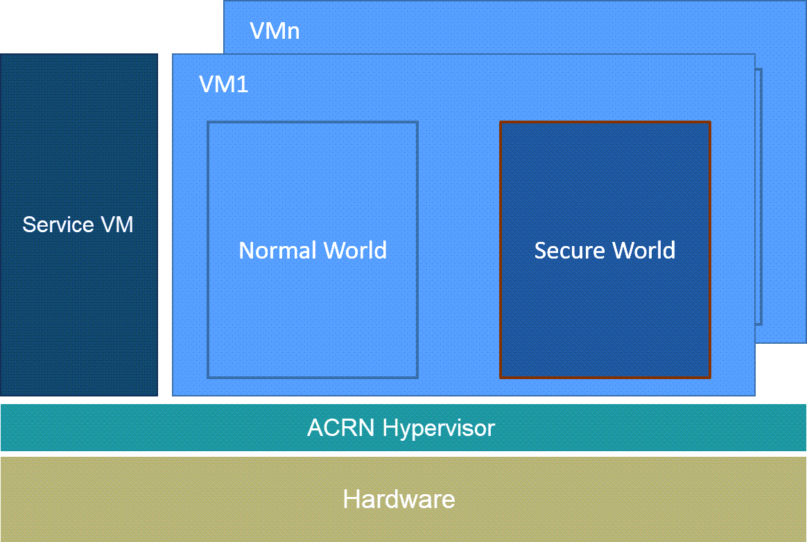
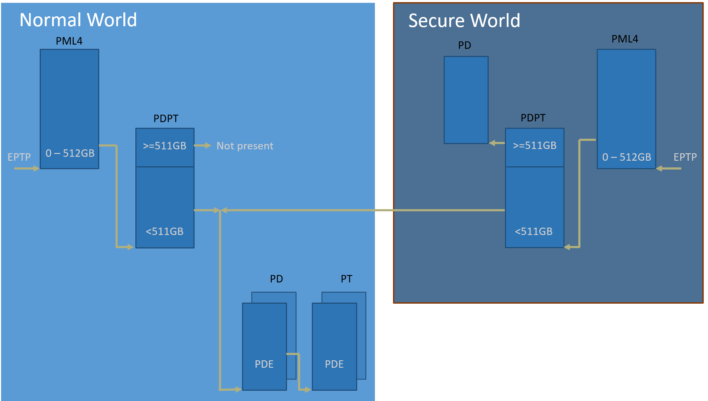

.. _trusty_tee:

Trusty TEE
##########

Introduction
************

`Trusty`_ is a set of software components supporting a Trusted Execution Environment (TEE).
TEE is commonly known as an isolated processing environment in which applications can be
securely executed irrespective of the rest of the system. For more information about TEE,
please visit the `Trusted Execution Environment wiki page <https://en.wikipedia.org/wiki/Trusted_execution_environment>`_.
Trusty consists of:

1. An operating system (the Trusty OS) that runs on a processor intended to provide a TEE
#. Drivers for the Android kernel (Linux) to facilitate communication with applications
   running under the Trusty OS
#. A set of libraries for Android/Linux systems software to facilitate communication with
   trusted applications executed within the Trusty OS using the kernel drivers

LK (`Little Kernel`_) is a tiny operating system suited for small embedded devices, bootloaders,
and other environments where OS primitives such as threads, mutexes, and timers are needed, but
there's a desire to keep things small and lightweight. LK has been chosen as the Trusty OS kernel.

Trusty Architecture
*******************

.. note::
   Trusty OS is running in Secure World in the architecture drawing above.

.. _trusty-hypercalls:

Trusty specific Hypercalls
**************************

There are a few :ref:`hypercall_apis` that are related to Trusty.

.. doxygengroup:: trusty_hypercall
   :project: Project ACRN
   :content-only:

Trusty Boot flow
****************

By design, the User OS bootloader (``UOS_Loader``) will trigger the Trusty boot process. The complete boot flow is illustrated below.

.. graphviz:: images/trusty-boot-flow.dot
   :name: trusty-boot-flow
   :align: center
   :caption: Trusty Boot Flow

As shown in the above figure, here are some details about the Trusty boot flow processing:

1. UOS_Loader

   a. Load and verify Trusty image from virtual disk
   #. Allocate runtime memory for trusty
   #. Do ELF relocation of trusty image and get entry address
   #. Call ``hcall_initialize_trusty`` with trusty memory base and entry address
#. ACRN (``hcall_initialize_trusty``)

   a. Save World context for Normal World
   #. Init World context for Secure World (RIP, RSP, EPT, etc.)
   #. Resume to Secure World
#. Trusty

   a. Booting up
   #. Call ``hcall_world_switch`` to switch back to Normal World if boot completed
#. ACRN (``hcall_world_switch``)

   a. Save World context for the World which caused this ``vmexit`` (Secure World)
   #. Restore World context for next World (Normal World (UOS_Loader))
   #. Resume to next World (UOS_Loader)
#. UOS_Loader

   a. Continue to boot

EPT Hierarchy
*************

As per the Trusty design, Trusty can access Normal World's memory, but Normal World cannot
access Secure World's memory. Hence it means Secure World EPTP page table hierarchy
must contain normal world GPA address space, while Trusty world's GPA address space
must be removed from the Normal world EPTP page table hierarchy.

Design
======

Put Secure World's GPA to very high position: 511 GB - 512 GB. The PML4/PDPT for Trusty
World are separated from Normal World. PD/PT for low memory (< 511 GB) are shared in
both Trusty World's EPT and Normal World's EPT. PD/PT for high memory (>= 511 GB) are
valid for Trusty World's EPT only.

Benefit
=======

This design will benefit the EPT changes of Normal World. There are requirement to
modify Normal World's EPT during runtime such as increasing memory, changing attributes,
etc. If such behavior happened, only PD and PT for Normal World need to
be updated.

API
===

.. doxygengroup:: trusty_apis
   :project: Project ACRN
   :content-only:

.. _Trusty: https://source.android.com/security/trusty/
.. _Little Kernel: https://github.com/littlekernel/lk
