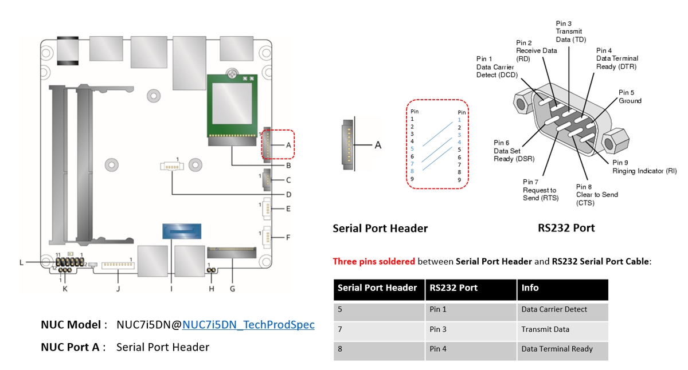
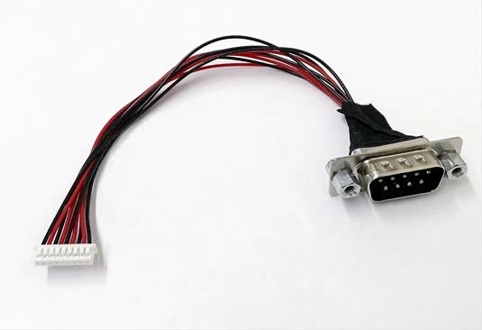

.. _getting-started-apl-nuc:

Getting started guide for Intel NUC
###################################

The Intel |reg| NUC is the primary tested platform for ACRN development,
and its setup is described below.

Hardware setup
**************

Intel Apollo Lake NUC (APL) and Intel Kaby Lake NUC (KBL),
described in :ref:`hardware`, are currently supported for ACRN development:

- We can enable the serial console on `KBL
  <https://www.amazon.com/Intel-Business-Mini-Technology-BLKNUC7i7DNH1E/dp/B07CCQ8V4R>`__
  (NUC7i7DN), but this is not supported on APL (NUC6CAYH).

Connecting to the serial port
=============================

If you don't need a serial console you can ignore this section. 

Neither the APL or KBL NUCs present an external serial port interface.
However, the KBL NUC does have a serail port header you can
expose with a serial DB9 header cable. You can build this cable yourself,
referring to the `KBL NUC product specification
<https://www.intel.com/content/dam/support/us/en/documents/mini-pcs/nuc-kits/NUC7i7DN_TechProdSpec.pdf>`__
as shown below: 

   KBL serial port header details

   KBL `serial port header to RS232 cable
   <https://www.amazon.com/dp/B07BV1W6N8/ref=cm_sw_r_cp_ep_dp_wYm0BbABD5AK6>`_

Or you can `purchase
<https://www.amazon.com/dp/B07BV1W6N8/ref=cm_sw_r_cp_ep_dp_wYm0BbABD5AK6>`_
such a cable.

You'll also need an `RS232 DB9 female to USB cable
<https://www.amazon.com/Adapter-Chipset-CableCreation-Converter-Register/dp/B0769DVQM1>`__,
or an `RS232 DB9 female/female (NULL modem) cross-over cable
<https://www.amazon.com/SF-Cable-Null-Modem-RS232/dp/B006W0I3BA>`__
to connect to your host system.

.. note::
   If you want to use the RS232 DB9 female/female cable, please choose 
   the ``cross-over`` type rather than ``straight-through`` type.

Firmware update on the NUC
==========================

You may need to update to the latest UEFI firmware for the NUC hardware.
Follow these `BIOS Update Instructions
<https://www.intel.com/content/www/us/en/support/articles/000005636.html>`__
for downloading and flashing an updated BIOS for the NUC.

Software setup
**************

.. _set-up-CL:

Set up a Clear Linux Operating System
=====================================

Currently, an installable version of ACRN does not exist. Therefore, you
need to setup a base Clear Linux OS and you'll build and bootstrap ACRN
on your platform. You'll need a network connection for your platform to
complete this setup.

.. note::

   Please refer to the ACRN :ref:`release_notes` for the Clear Linux OS
   version number tested with a specific ACRN release.  Adjust the
   instruction below to reference the appropriate version number of Clear
   Linux OS (we use version 28960 as an example).

#. Download the compressed Clear Linux OS installer image from
   https://download.clearlinux.org/releases/28960/clear/clear-28960-installer.img.xz
   and follow the `Clear Linux OS installation guide
   <https://clearlinux.org/documentation/clear-linux/get-started/bare-metal-install>`__
   as a starting point for installing Clear Linux OS onto your platform. Follow the recommended
   options for choosing an **Advanced options** installation type, and using the platform's
   storage as the target device for installation (overwriting the existing data
   and creating three partitions on the platform's storage drive).

   When setting up Clear Linux on your NUC:

   #.  Launch the Clear Linux OS installer boot menu
   #.  With Clear Linux OS highlighted, select Enter.
   #.  From the Main Menu, select "Configure Media" and set
       "Auto Partition" to your desired hard disk.
   #.  ``shift + A`` to the "Advanced options".
   #.  Select "Additional Bundle Selection" to add bundles for
       "desktop-autostart", "editors", "network-basic", "user-basic"
   #.  Select "User Manager" to add an administrative user "clear" and
       password.
   #.  Select "Assign Hostname" to set the hostname as "clr-sos-guest"

#. After installation is complete, boot into Clear Linux OS, login as
   **clear** (using the password you set earlier).

#. The instructions below provide details for setting
   up the ACRN Hypervisor, Service OS, and Guest OS.  Along with the
   manual step details, We also provide an
   automated script that does all these steps for you, so you can skip these
   manual steps.  See the `quick-setup-guide`_ section below to use the
   automated setup script.

.. _quick-setup-guide:

Use the script to set up ACRN automatically
===========================================

We provide an `acrn_quick_setup.sh script
<https://raw.githubusercontent.com/projectacrn/acrn-hypervisor/master/doc/getting-started/acrn_quick_setup.sh>`__
in the ACRN GitHub repo to quickly and automatically set up the SOS and UOS
and generate a customized script for launching the UOS.

This script requires the Clear Linux version number you'd like to set up
for the ACRN SOS and UOS.  The version specified must be greater than or
equal to the Clear Linux version currently installed on the NUC.  You
can see your current Clear Linux version with the command::

   $ cat /etc/os-release

.. note:: In the following steps, we're using Clear Linux version 28960.  You should
   specify the Clear Linux version you want to use.

Here are the steps to install Clear Linux on your NUC, set up the SOS
and UOS using the ``acrn_quick_setup.sh`` script, and launch the UOS:

#. Installing Clear Linux and login system

#. Open a terminal

#. Download ``acrn_quick_setup.sh`` script to set up the SOS. (If you don't need a proxy to
   get the script, you can just skip the ``export`` command.)

   .. code-block:: console

      $ export https_proxy=https://myproxy.mycompany.com:port
      $ cd ~
      $ wget https://raw.githubusercontent.com/projectacrn/acrn-hypervisor/master/doc/getting-started/acrn_quick_setup.sh

      $ sudo sh acrn_quick_setup.sh -s 28960
      Password:
      Upgrading SOS...
      Disable auto update...
      Clear Linux version 28960 is already installed. Continuing to setup SOS...
      Adding the service-os and kernel-iot-lts2018 bundles...
        ...100%
        ...100%
        ...100%
      none
      Add /mnt/EFI/acrn folder
      Copy /usr/share/acrn/samples/nuc/acrn.conf /mnt/loader/entries/
      Copy /usr/lib/acrn/acrn.efi to /mnt/EFI/acrn
      Check ACRN efi boot event
      Clean all ACRN efi boot event
      Check linux bootloader event
      Clean all Linux bootloader event
      Add new ACRN efi boot event
      Create loader.conf
      Add default (5 seconds) boot wait time
      Add default boot to ACRN
      Getting latest Service OS kernel version: kernel-org.clearlinux.iot-lts2018-sos.4.19.34-45
      Getting current Service OS kernel version: kernel-org.clearlinux.iot-lts2018-sos.4.19.13-1901141830
      Replacing root partition uuid in acrn.conf
      Replace with new SOS kernel in acrn.conf
      Service OS setup done!
      Rebooting Service OS to take effects.
      Rebooting.

   .. note::
      This script is using ``/dev/sda1`` as default EFI System Partition
      ESP). If the ESP is different based on your hardware, you can specify
      it using ``-e`` option.  For example, to set up the SOS on an NVMe
      SSD, you could specify::

         sudo sh acrn_quick_setup.sh -s 28960 -e /dev/nvme0n1p1

   .. note::
      If you don't need to reboot automatically after setting up the SOS, you
      can specify the ``-d`` parameter (don't reboot)

#. After the system reboots, login as the clear user.  You can verify
   the SOS booted successfully by checking the ``dmesg`` log:

   .. code-block:: console

      $ dmesg | grep ACRN
      [    0.000000] Hypervisor detected: ACRN
      [    1.220887] ACRNTrace: Initialized acrn trace module with 4 cpu
      [    1.224401] ACRN HVLog: Initialized hvlog module with 4 cpu

#. Continue by setting up a Guest OS using the ``acrn_quick_setup.sh``
   script with the ``-u`` option (and the same Clear Linux version
   number):

   .. code-block:: console

      $ sudo sh acrn_quick_setup.sh -u 28960
      Password:
      Upgrading UOS...
      Downloading UOS image: https://download.clearlinux.org/releases/28960/clear/clear-28960-kvm.img.xz
        % Total    % Received % Xferd  Average Speed   Time    Time     Time  Current
                                       Dload  Upload   Total   Spent    Left  Speed
       14  248M   14 35.4M    0     0   851k      0  0:04:57  0:00:42  0:04:15  293k

   After the download is completed, you'll get this output.

   .. code-block:: console

      Unxz UOS image: clear-28960-kvm.img.xz
      Get UOS image: clear-28960-kvm.img
      Upgrade UOS done...
      Now you can run this command to start UOS...
      $ sudo /root/launch_uos_28960.sh

#. Now you can launch the UOS using the customized launch_uos script
   (with sudo):

   .. code-block:: console

      $ sudo /root/launch_uos_28960.sh
      Password:
      cpu1 online=0
      cpu2 online=0
      cpu3 online=0
      passed gvt-g optargs low_gm 64, high_gm 448, fence 8
      SW_LOAD: get kernel path /usr/lib/kernel/default-iot-lts2018
      SW_LOAD: get bootargs root=/dev/vda3 rw rootwait maxcpus=1 nohpet console=tty0 console=hvc0   console=ttyS0 no_timer_check ignore_loglevel log_buf_len=16M   consoleblank=0 tsc=reliable i915.avail_planes_per_pipe=0x070F00   i915.enable_hangcheck=0 i915.nuclear_pageflip=1 i915.enable_guc_loading=0   i915.enable_guc_submission=0 i915.enable_guc=0
      VHM api version 1.0
      open hugetlbfs file /run/hugepage/acrn/huge_lv1/D279543825D611E8864ECB7A18B34643
      open hugetlbfs file /run/hugepage/acrn/huge_lv2/D279543825D611E8864ECB7A18B34643
      level 0 free/need pages:512/0 page size:0x200000
      level 1 free/need pages:1/2 page size:0x40000000
      to reserve more free pages:
      to reserve pages (+orig 1): echo 2 > /sys/kernel/mm/hugepages/hugepages-1048576kB/nr_hugepages
      now enough free pages are reserved!

      try to setup hugepage with:
          level 0 - lowmem 0x0, biosmem 0x0, highmem 0x0
          level 1 - lowmem 0x80000000, biosmem 0x0, highmem 0x0
      total_size 0x180000000

      mmap ptr 0x0x7efef33bb000 -> baseaddr 0x0x7eff00000000
      mmap 0x40000000@0x7eff00000000
      touch 1 pages with pagesz 0x40000000
      mmap 0x40000000@0x7eff40000000
      touch 512 pages with pagesz 0x200000
      ...
      [  OK  ] Started Login Service.
      [  OK  ] Started Network Name Resolution.
      [  OK  ] Reached target Network.
               Starting Permit User Sessions...
      [  OK  ] Reached target Host and Network Name Lookups.
      [  OK  ] Started Permit User Sessions.
      [  OK  ] Started Serial Getty on ttyS0.
      [  OK  ] Started Getty on tty1.
      [  OK  ] Started Serial Getty on hvc0.
      [  OK  ] Reached target Login Prompts.
      [  OK  ] Reached target Multi-User System.
      [  OK  ] Reached target Graphical Interface.

      clr-0d449d5327d64aee8a6b8a3484dcd880 login:

#. Login as root (and specify the new password).  You can verify you're
   running in the UOS by checking the kernel release version or seeing
   if acrn devices are visible:

   .. code-block:: console

      # uname -r
      4.19.34-45.iot-lts2018
      # ls /dev/acrn*
      ls: cannot access '/dev/acrn*': No such file or directory

   In the UOS there won't be any ``/dev/acrn*`` devices.  If you're in the SOS,
   you'd see results such as these:

   .. code-block:: console

      # uname -r
      4.19.34-45.iot-lts2018-sos
      # ls /dev/acrn*
      /dev/acrn_hvlog_cur_0   /dev/acrn_hvlog_cur_2  /dev/acrn_trace_0  /dev/acrn_trace_2  /dev/acrn_vhm
      /dev/acrn_hvlog_cur_1   /dev/acrn_hvlog_cur_3  /dev/acrn_trace_1  /dev/acrn_trace_3

With that you've successfully set up Clear Linux at the Service and User
OS and started up a UOS VM.

.. _manual-setup-guide:

Manual setup ACRN guide
=======================

If you don't need the script to setup ACRN by manual, and then you should follow these steps
after installation of Clear Linux and login system.

#. Clear Linux OS is set to automatically update itself. We recommend that you disable
   this feature to have more control over when the updates happen. Use this command
   to disable the autoupdate feature:

   .. code-block:: none

      $ sudo swupd autoupdate --disable

   .. note::
      The Clear Linux OS installer will automatically check for updates and install the
      latest version available on your system. If you wish to use a specific version
      (such as 28960), you can achieve that after the installation has completed using
      ``sudo swupd verify --fix --picky -m 28960``

#. If you have an older version of Clear Linux OS already installed
   on your hardware, use this command to upgrade Clear Linux OS
   to version 28960 (or newer):

   .. code-block:: none

      $ sudo swupd update -m 28960     # or newer version

#. Use the ``sudo swupd bundle-add`` command and add these Clear Linux OS bundles:

   .. code-block:: none

      $ sudo swupd bundle-add service-os kernel-iot-lts2018

   .. table:: Clear Linux OS bundles
      :widths: auto
      :name: CL-bundles

      +--------------------+---------------------------------------------------+
      | Bundle             | Description                                       |
      +====================+===================================================+
      | service-os         | Add the acrn hypervisor, the acrn devicemodel and |
      |                    | Service OS kernel                                 |
      +--------------------+---------------------------------------------------+
      | kernel-iot-lts2018 | Run the Intel kernel "kernel-iot-lts2018"         |
      |                    | which is enterprise-style kernel with backports   |
      +--------------------+---------------------------------------------------+

.. _add-acrn-to-efi:

Add the ACRN hypervisor to the EFI Partition
============================================

In order to boot the ACRN SOS on the platform, you'll need to add it to the EFI
partition. Follow these steps:

#. Mount the EFI partition and verify you have the following files:

   .. code-block:: none

      $ sudo ls -1 /boot/EFI/org.clearlinux
      bootloaderx64.efi
      kernel-org.clearlinux.native.4.20.11-702
      kernel-org.clearlinux.iot-lts2018-sos.4.19.23-19
      kernel-org.clearlinux.iot-lts2018.4.19.23-19
      loaderx64.efi

   .. note::
      On Clear Linux OS, the EFI System Partion (e.g.: ``/dev/sda1``)
      is mounted under ``/boot`` by default
      The Clear Linux project releases updates often, sometimes
      twice a day, so make note of the specific kernel versions
      (*iot-lts2018 and *iot-lts2018-sos*) listed on your system,
      as you will need them later.

   .. note::
      The EFI System Partition (ESP) may be different based on your hardware.
      It will typically be something like ``/dev/mmcblk0p1`` on platforms
      that have an on-board eMMC or ``/dev/nvme0n1p1`` if your system has
      a non-volatile storage media attached via a PCI Express (PCIe) bus
      (NVMe).

#. Put the ``acrn.efi`` hypervisor application (included in the Clear
   Linux OS release) on the EFI partition with:

   .. code-block:: none

      $ sudo mkdir /boot/EFI/acrn
      $ sudo cp /usr/lib/acrn/acrn.efi /boot/EFI/acrn/

#. Configure the EFI firmware to boot the ACRN hypervisor by default

   The ACRN hypervisor (``acrn.efi``) is an EFI executable
   loaded directly by the platform EFI firmware. It then in turns loads the
   Service OS bootloader. Use the ``efibootmgr`` utility to configure the EFI
   firmware and add a new entry that loads the ACRN hypervisor.

   .. code-block:: none

      $ sudo efibootmgr -c -l "\EFI\acrn\acrn.efi" -d /dev/sda -p 1 -L "ACRN"

   .. note::

      Be aware that a Clear Linux OS update that includes a kernel upgrade will
      reset the boot option changes you just made. A Clear Linux OS update could
      happen automatically (if you have not disabled it as described above),
      if you later install a new bundle to your system, or simply if you
      decide to trigger an update manually. Whenever that happens,
      double-check the platform boot order using ``efibootmgr -v`` and
      modify it if needed.

   The ACRN hypervisor (``acrn.efi``) accepts three command-line parameters that
   tweak its behavior:

   1. ``bootloader=``: this sets the EFI executable to be loaded once the hypervisor
      is up and running. This is typically the bootloader of the Service OS and the
      default value is to use the Clear Linux OS bootloader, i.e.:
      ``\EFI\org.clearlinux\bootloaderx64.efi``.
   #. ``uart=``: this tells the hypervisor where the serial port (UART) is found or
      whether it should be disabled. There are three forms for this parameter:

      #. ``uart=disabled``: this disables the serial port completely
      #. ``uart=bdf@<BDF value>``:  this sets the PCI serial port based on its BDF.
         For example, use ``bdf@0:18.1`` for a BDF of 0:18.1 ttyS1.
      #. ``uart=port@<port address>``: this sets the serial port address

      .. note::

         ``uart=port@<port address>`` is required if you want to enable the serial console.
         You should run ``dmesg |grep ttyS0`` to get port address from the output, and then
         add the ``uart`` parameter into the ``efibootmgr`` command.

   #. ``vuart=ttySn@irqN``: this tells the hypervisor which virtual serial device SOS
      will use and its IRQ number. This is used to avoid conflict with SOS passthrough
      devices' interrupt. If UART is set to ttyS1, and its native IRQ is 5, you'd better
      set ``vuart=ttyS1@irq5`` (Use 'dmesg | grep tty' to get IRQ information).
      Also set ``console=ttyS1`` in ``acrn.conf`` to match the SOS boot args.

   Here is a more complete example of how to configure the EFI firmware to load the ACRN
   hypervisor and set these parameters.

   .. code-block:: none

      $ sudo efibootmgr -c -l "\EFI\acrn\acrn.efi" -d /dev/sda -p 1 -L "ACRN NUC Hypervisor" \
            -u "bootloader=\EFI\org.clearlinux\bootloaderx64.efi uart=disabled"

   And also here is the example of how to enable a serial console for KBL NUC.

   .. code-block:: none

      $ sudo efibootmgr -c -l "\EFI\acrn\acrn.efi" -d /dev/sda -p 1 -L "ACRN NUC Hypervisor" \
            -u "bootloader=\EFI\org.clearlinux\bootloaderx64.efi uart=port@0x3f8"

#. Create a boot entry for the ACRN Service OS by copying a provided ``acrn.conf``
   and editing it to account for the kernel versions noted in a previous step.

   It must contain these settings:

   +-----------+----------------------------------------------------------------+
   | Setting   | Description                                                    |
   +===========+================================================================+
   | title     | Text to show in the boot menu                                  |
   +-----------+----------------------------------------------------------------+
   | linux     | Linux kernel for the Service OS (\*-sos)                       |
   +-----------+----------------------------------------------------------------+
   | options   | Options to pass to the Service OS kernel (kernel parameters)   |
   +-----------+----------------------------------------------------------------+

   A starter acrn.conf configuration file is included in the Clear Linux
   OS release and is
   also available in the acrn-hypervisor/hypervisor GitHub repo as `acrn.conf
   <https://github.com/projectacrn/acrn-hypervisor/blob/master/efi-stub/clearlinux/acrn.conf>`__
   as shown here:

   .. literalinclude:: ../../efi-stub/clearlinux/acrn.conf
      :caption: efi-stub/clearlinux/acrn.conf

   On the platform, copy the ``acrn.conf`` file to the EFI partition we mounted earlier:

   .. code-block:: none

      $ sudo cp /usr/share/acrn/samples/nuc/acrn.conf /boot/loader/entries/

   You will need to edit this file to adjust the kernel version (``linux`` section),
   insert the ``PARTUUID`` of your ``/dev/sda3`` partition
   (``root=PARTUUID=<UUID of rootfs partition>``) in the ``options`` section, and
   add the ``hugepagesz=1G hugepages=2`` at end of the ``options`` section.

   Use ``blkid`` to find out what your ``/dev/sda3`` ``PARTUUID`` value is. Here
   is a handy one-line command to do that:

   .. code-block:: none

      # sed -i "s/<UUID of rootfs partition>/`blkid -s PARTUUID -o value \
                     /dev/sda3`/g" /boot/loader/entries/acrn.conf

   .. note::
      It is also possible to use the device name directly, e.g. ``root=/dev/sda3``

#. Add a timeout period for Systemd-Boot to wait, otherwise it will not
   present the boot menu and will always boot the base Clear Linux OS

   .. code-block:: none

      $ sudo clr-boot-manager set-timeout 20
      $ sudo clr-boot-manager update

#. Reboot and select "The ACRN Service OS" to boot, as shown below:

   .. code-block:: console
      :emphasize-lines: 1
      :caption: ACRN Service OS Boot Menu

      => The ACRN Service OS
      Clear Linux OS for Intel Architecture (Clear-linux-iot-lts2018-4.19.23-19)
      Clear Linux OS for Intel Architecture (Clear-linux-iot-lts2018-sos-4.19.23-19)
      Clear Linux OS for Intel Architecture (Clear-linux-native.4.20.11-702)
      EFI Default Loader
      Reboot Into Firmware Interface

#. After booting up the ACRN hypervisor, the Service OS will be launched
   automatically by default, and the Clear Linux OS desktop will be showing with user "clear",
   (or you can login remotely with an "ssh" client).
   If there is any issue which makes the GNOME desktop doesn't show successfully, then the system will go to
   shell console.

#. From ssh client, login as user "clear" using the password you set previously when
   you installed Clear Linux OS.

#. After rebooting the system, check that the ACRN hypervisor is running properly with:

  .. code-block:: none

   $ dmesg | grep ACRN
   [    0.000000] Hypervisor detected: ACRN
   [    1.687128] ACRNTrace: acrn_trace_init, cpu_num 4
   [    1.693129] ACRN HVLog: acrn_hvlog_init

If you see log information similar to this, the ACRN hypervisor is running properly
and you can start deploying a User OS.  If not, verify the EFI boot options, SOS
kernel, and ``acrn.conf`` settings are correct (as described above).

ACRN Network Bridge
===================

ACRN bridge has been setup as a part of systemd services for device communication. The default
bridge creates ``acrn_br0`` which is the bridge and ``tap0`` as an initial setup. The files can be
found in ``/usr/lib/systemd/network``. No additional setup is needed since systemd-networkd is
automatically enabled after a system restart.

Set up Reference UOS
====================

#. On your platform, download the pre-built reference Clear Linux OS UOS
   image version 28960 (or newer) into your (root) home directory:

   .. code-block:: none

      $ cd ~
      $ mkdir uos
      $ cd uos
      $ curl https://download.clearlinux.org/releases/28960/clear/clear-28960-kvm.img.xz -o uos.img.xz

   .. note::
      In case you want to use or try out a newer version of Clear Linux OS as the UOS, you can
      download the latest from http://download.clearlinux.org/image. Make sure to adjust the steps
      described below accordingly (image file name and kernel modules version).

#. Uncompress it:

   .. code-block:: none

      $ unxz uos.img.xz

#. Deploy the UOS kernel modules to UOS virtual disk image (note: you'll need to use
   the same **iot-lts2018** image version number noted in step 1 above):

   .. code-block:: none

      $ sudo losetup -f -P --show uos.img
      $ sudo mount /dev/loop0p3 /mnt
      $ sudo cp -r /usr/lib/modules/"`readlink /usr/lib/kernel/default-iot-lts2018 | awk -F '2018.' '{print $2}'`.iot-lts2018" /mnt/lib/modules
      $ sudo umount /mnt
      $ sync

#. Edit and Run the ``launch_uos.sh`` script to launch the UOS.

   A sample `launch_uos.sh
   <https://raw.githubusercontent.com/projectacrn/acrn-hypervisor/master/devicemodel/samples/nuc/launch_uos.sh>`__
   is included in the Clear Linux OS release, and
   is also available in the acrn-hypervisor/devicemodel GitHub repo (in the samples
   folder) as shown here:

   .. literalinclude:: ../../devicemodel/samples/nuc/launch_uos.sh
      :caption: devicemodel/samples/nuc/launch_uos.sh
      :language: bash

   By default, the script is located in the ``/usr/share/acrn/samples/nuc/``
   directory. You can run it to launch the User OS:

   .. code-block:: none

      $ cd /usr/share/acrn/samples/nuc/
      $ sudo ./launch_uos.sh

#. At this point, you've successfully booted the ACRN hypervisor,
   SOS, and UOS:

   .. figure:: images/gsg-successful-boot.png
      :align: center

      Successful boot
