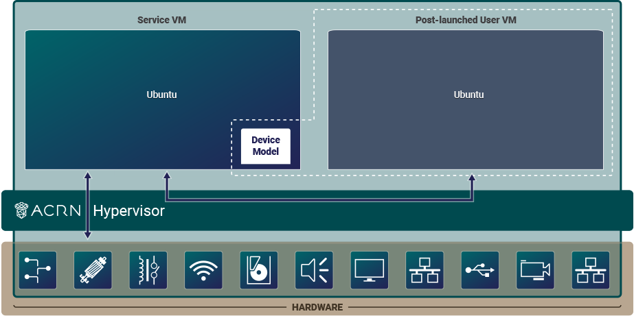
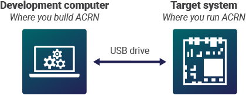
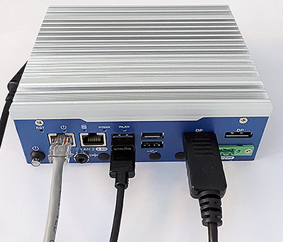

.. _gsg:
.. _rt_industry_ubuntu_setup:
.. _getting-started-building:

Getting Started Guide
#####################

This guide will help you get started with ACRN. We'll show how to prepare a
build environment on your development computer. Then we'll walk through the
steps to set up a simple ACRN configuration on a target system. The
configuration is an ACRN shared scenario and consists of an ACRN hypervisor,
Service VM, and one post-launched User VM as illustrated in this figure:

Throughout this guide, you will be exposed to some of the tools, processes, and
components of the ACRN project. Let's get started.

.. _gsg-prereq:

Prerequisites
**************

You will need two machines: a development computer and a target system. The
development computer is where you configure and build ACRN and your application.
The target system is where you deploy and run ACRN and your application.

Before you begin, make sure your machines have the following prerequisites:

**Development computer**:

* Hardware specifications

  - A PC with Internet access (A fast system with multiple cores and 16GB
    memory or more will make the builds go faster.)

* Software specifications

  - Ubuntu Desktop 22.04 LTS (ACRN development is not supported on Windows.)

**Target system**:

* Hardware specifications

  - Target board (see :ref:`hardware_tested`)
  - Ubuntu Desktop 22.04 LTS bootable USB disk: download the latest `Ubuntu
    Desktop 22.04 LTS ISO image <https://releases.ubuntu.com/jammy/>`__ and
    follow the `Ubuntu documentation
    <https://ubuntu.com/tutorials/create-a-usb-stick-on-ubuntu#1-overview>`__
    for creating the USB disk.
  - USB keyboard and mouse
  - Monitor
  - Ethernet cable and Internet access
  - A second USB disk with minimum 16GB capacity. Format your USB disk with a
    file system that supports files greater than 4GB: extFAT or NTFS, but not
    FAT32. We'll use this USB disk to copy files between the development
    computer and target system. Instead of a USB drive, you can copy files
    between systems over the network using the ``scp`` command.
  - Local storage device (NVMe or SATA drive, for example).  We recommend having
    40GB or more of free space.

.. note::
   If you're working behind a corporate firewall, you'll likely need to
   configure a proxy for accessing the Internet, if you haven't done so already.
   While some tools use the environment variables ``http_proxy`` and ``https_proxy`` to
   get their proxy settings, some use their own configuration files, most
   notably ``apt`` and ``git``.  If a proxy is needed and it's not configured,
   commands that access the Internet may time out and you may see errors such
   as "unable to access ..." or "couldn't resolve host ...".

.. _gsg-dev-computer:

.. rst-class:: numbered-step

Prepare the Development Computer
********************************

To set up the ACRN build environment on the development computer:

#. On the development computer, run the following command to confirm that Ubuntu
   Desktop 22.04 is running:

   .. code-block:: bash

      cat /etc/os-release

   If you have an older version, see `Ubuntu documentation
   <https://ubuntu.com/tutorials/install-ubuntu-desktop#1-overview>`__ to
   install a new OS on the development computer.

#. Download the apt information database about all available package updates for
   your Ubuntu release. We'll need it to get the tools and libraries used
   for ACRN builds:

   .. code-block:: bash

      sudo apt update

   This next command upgrades packages already installed on your system with
   minor updates and security patches. This command is optional as there is a
   small risk that upgrading your system software can introduce unexpected
   issues:

   .. code-block:: bash

      sudo apt upgrade -y #optional command to upgrade system

#. Create a working directory:

   .. code-block:: bash

      mkdir -p ~/acrn-work

#. Install the necessary ACRN build tools:

   .. code-block:: bash

      sudo apt install -y gcc git make vim libssl-dev libpciaccess-dev uuid-dev \
           libsystemd-dev libevent-dev libxml2-dev libxml2-utils libusb-1.0-0-dev \
           python3 python3-pip libblkid-dev e2fslibs-dev \
           pkg-config libnuma-dev libcjson-dev liblz4-tool flex bison \
           xsltproc clang-format bc libpixman-1-dev libsdl2-dev libegl-dev \
           libgles-dev libdrm-dev gnu-efi libelf-dev \
           build-essential git-buildpackage devscripts dpkg-dev equivs lintian \
           apt-utils pristine-tar dh-python python3-lxml python3-defusedxml \
           python3-tqdm python3-xmlschema python3-elementpath acpica-tools

#. Get the ACRN hypervisor and ACRN kernel source code, and check out the
   current release branch.

   .. code-block:: bash

      cd ~/acrn-work
      git clone https://github.com/projectacrn/acrn-hypervisor.git
      cd acrn-hypervisor
      git checkout master

      cd ..
      git clone https://github.com/projectacrn/acrn-kernel.git
      cd acrn-kernel
      git checkout master

#. Configure git with your name and email address:

   .. code-block:: none

      git config --global user.name "David Developer"
      git config --global user.email "david.developer@company.com"

.. _gsg-board-setup:

.. rst-class:: numbered-step

Prepare the Target and Generate a Board Configuration File
***************************************************************

In this step, you will use the **Board Inspector** to generate a board
configuration file.

A **board configuration file** is an XML file that stores hardware-specific
information extracted from the target system. The file is used to configure the
ACRN hypervisor, because each hypervisor instance is specific to your target
hardware.

.. important::

   Before running the Board Inspector, you must set up your target hardware and
   BIOS exactly as you want it, including connecting all peripherals,
   configuring BIOS settings, and adding memory and PCI devices. For example,
   you must connect all USB devices you intend to access; otherwise, the Board Inspector will not
   detect these USB devices for passthrough. If you change the hardware or BIOS
   configuration, or add or remove USB devices, you must run the Board Inspector
   again to generate a new board configuration file.

Set Up the Target Hardware
============================

To set up the target hardware environment:

#. Connect all USB devices, such as a mouse and keyboard.

#. Connect the monitor and power supply cable.

#. Connect the target system to the LAN with the Ethernet cable.

Example of a target system with cables connected:

Install OS on the Target
============================

The target system needs Ubuntu Desktop 22.04 LTS to run the Board Inspector
tool. You can read the full instructions to download, create a bootable USB
drive, and `Install Ubuntu desktop
<https://ubuntu.com/tutorials/install-ubuntu-desktop#1-overview>`_ on the Ubuntu
site.  We'll provide a summary here:

To install Ubuntu 22.04:

#. Insert the Ubuntu bootable USB disk into the target system.

#. Power on the target system, and select the USB disk as the boot device
   in the UEFI
   menu. Note that the USB disk label presented in the boot options depends on
   the brand/make of the USB drive. (You will need to configure the BIOS to boot
   off the USB device first, if that option isn't available.)

#. After selecting the language and keyboard layout, select the **Normal
   installation** and **Download updates while installing Ubuntu** (downloading
   updates requires the target to have an Internet connection).

   .. image:: ./images/gsg_ubuntu_install_01.png
      :align: center

#. Use the check boxes to choose whether you'd like to install Ubuntu alongside
   another operating system (if one already exists), or delete your existing operating system and
   replace it with Ubuntu:

   .. image:: ./images/gsg_ubuntu_install_02.png
      :align: center

#. Complete the Ubuntu installation by choosing your geographical location,
   and creating your login details. We use ``acrn`` as the username in this guide.

   If you choose a username other than ``acrn``, be sure to use
   that username in the command examples and paths shown in this guide.

#. After the Ubuntu installation completes on the target and you reboot the
   system, don't forget to update the system software (as Ubuntu recommends):

   .. code-block:: bash

      sudo apt update
      sudo apt upgrade -y

#. It's convenient to use the network to transfer files between the development
   computer and target system, so we recommend installing the openssh-server
   package on the target system::

      sudo apt install -y openssh-server

   This command will install and start the ssh-server service on the target
   system.  We'll need to know the target system's IP address to make a
   connection from the development computer, so find it now with this command::

      hostname -I | cut -d ' ' -f 1

#. Make a working directory on the target system that we'll use later::

      mkdir -p ~/acrn-work

Configure Target BIOS Settings
===============================

#. Boot your target and enter the BIOS configuration editor.

   Tip: When you are booting your target, you'll see an option (quickly) to
   enter the BIOS configuration editor, typically by pressing :kbd:`F2` during
   the boot and before the GRUB menu (or Ubuntu login screen) appears.  If you
   are not quick enough, you can reboot the system to try again.

#. Configure these BIOS settings:

   * Enable **VMX** (Virtual Machine Extensions, which provide hardware
     assist for CPU virtualization).
   * Enable **VT-d** (Intel Virtualization Technology for Directed I/O, which
     provides additional support for managing I/O virtualization).
   * Disable **Secure Boot**. This setting simplifies the steps for this example.

   The names and locations of the BIOS settings depend on the target
   hardware and BIOS vendor and version.

Generate a Board Configuration File
=========================================

#. Build the Board Inspector Debian package on the development computer:

   a. Move to the development computer.

   #. On the development computer, go to the ``acrn-hypervisor`` directory:

      .. code-block:: bash

         cd ~/acrn-work/acrn-hypervisor

   #. Build the Board Inspector Debian package:

      .. code-block:: bash

         debian/debian_build.sh clean && debian/debian_build.sh board_inspector

      In a few seconds, the build generates a board_inspector Debian package in the
      parent (``~/acrn-work``) directory.

#. Copy the Board Inspector Debian package from the development computer to the
   target system.

   Option 1: Use ``scp``
      Use the ``scp`` command to copy the Debian package from your development
      computer to the ``/tmp`` directory on the target
      system.  Replace ``10.0.0.200`` with the target system's IP address you found earlier::

         scp ~/acrn-work/python3-acrn-board-inspector*.deb acrn@10.0.0.200:/tmp

   Option 2: Use a USB disk
       a. On the development computer, insert the USB disk that you intend to use to
          copy files.

       #. Ensure that there is only one USB disk inserted by running the following
          command:

          .. code-block:: bash

             ls /media/$USER

          Confirm that only one disk name appears. You'll use that disk name in the following steps.

       #. Copy the Board Inspector Debian package to the USB disk:

          .. code-block:: bash

             cd ~/acrn-work/
             disk="/media/$USER/"$(ls /media/$USER)
             cp -r python3-acrn-board-inspector*.deb "$disk"/
             sync && sudo umount "$disk"

       #. Remove the USB disk from the development computer and insert it into the target system.

       #. Copy the Board Inspector Debian package from the USB disk to the target:

          .. code-block:: bash

             mkdir -p ~/acrn-work
             disk="/media/$USER/"$(ls /media/$USER)
             cp -r "$disk"/python3-acrn-board-inspector*.deb  /tmp

#. Now that we've got the Board Inspector Debian package on the target system, install it there:

   .. code-block:: bash

      sudo apt install -y /tmp/python3-acrn-board-inspector*.deb

#. Reboot the target system:

   .. code-block:: bash

      sudo reboot

#. Run the Board Inspector to generate the board configuration file. This
   example uses the parameter ``my_board`` as the file name. The Board Inspector
   can take a few minutes to scan your target system and create the board XML
   file with your target system's information.

   .. code-block:: bash

      cd ~/acrn-work
      sudo acrn-board-inspector my_board

   .. note::

      If you get an error that mentions Pstate and editing the GRUB
      configuration, reboot the system and run this command again.

#. Confirm that the board configuration file ``my_board.xml`` was generated in
   the current directory:

   .. code-block:: bash

      ls ./my_board.xml

#. Copy ``my_board.xml`` from the target to the development computer.  Again we
   have two options:

   Option 1: Use ``scp``
      From your development computer, use the ``scp`` command to copy the board
      configuration file from your target system back to the
      ``~/acrn-work`` directory on your development computer. Replace
      ``10.0.0.200`` with the target system's IP address you found earlier::

         scp acrn@10.0.0.200:~/acrn-work/my_board.xml ~/acrn-work/

   Option 2: Use a USB disk
       a. Make sure the USB disk is connected to the target.

       #. Copy ``my_board.xml`` to the USB disk:

          .. code-block:: bash

             disk="/media/$USER/"$(ls /media/$USER)
             cp ~/acrn-work/my_board.xml "$disk"/
             sync && sudo umount "$disk"

       #. Insert the USB disk into the development computer.

       #. Copy ``my_board.xml`` from the USB disk to the development computer:

          .. code-block:: bash

             disk="/media/$USER/"$(ls /media/$USER)
             cp "$disk"/my_board.xml ~/acrn-work
             sync && sudo umount "$disk"

.. _gsg-dev-setup:

.. rst-class:: numbered-step

Generate a Scenario Configuration File and Launch Script
********************************************************

In this step, you will download, install, and use the `ACRN Configurator
<https://github.com/projectacrn/acrn-hypervisor/releases/download/v3.1/acrn-configurator-3.2-unstable.deb>`__
to generate a scenario configuration file and launch script.

A **scenario configuration file** is an XML file that holds the parameters of
a specific ACRN configuration, such as the number of VMs that can be run,
their attributes, and the resources they have access to.

A **launch script** is a shell script that is used to configure and create a
post-launched User VM. Each User VM has its own launch script.

#. On the development computer, download and install the ACRN Configurator
   Debian package:

   .. code-block:: bash

      cd ~/acrn-work
      wget https://github.com/projectacrn/acrn-hypervisor/releases/download/v3.1/acrn-configurator-3.2-unstable.deb
      cp acrn-configurator-3.2-unstable.deb /tmp

   If you already have a previous version of the acrn-configurator installed,
   you should first remove it:

   .. code-block:: bash

      sudo apt purge acrn-configurator

   Then you can install this new version:

   .. code-block:: bash

      sudo apt install -y /tmp/acrn-configurator-3.2-unstable.deb

#. Launch the ACRN Configurator:

   .. code-block:: bash

      acrn-configurator

#. Under **Start a new configuration**, confirm that the working folder is
   ``<path to>/acrn-work/MyConfiguration``. Click **Use This Folder**.

   .. image:: images/configurator-newconfig.png
      :align: center
      :class: drop-shadow

#. Import your board configuration file as follows:

   a. In the **1. Import a board configuration file** panel, click **Browse for
      file**.

   #. Browse to ``~/acrn-work/my_board.xml`` and click **Open**.

   #. Click **Import Board File**.

   .. image:: images/configurator-board01.png
      :align: center
      :class: drop-shadow

   The ACRN Configurator makes a copy of your board file, changes the file
   extension to ``.board.xml``, and saves the file to the working folder as
   ``my_board.board.xml``.

#. Create a new scenario as follows:

   a. In the **2. Create new or import an existing scenario** panel, click
      **Create Scenario**.

      .. image:: images/configurator-newscenario01.png
         :align: center
         :class: drop-shadow

   #. In the dialog box, confirm that **Shared (Post-launched VMs only)** is
      selected.

   #. Confirm that one Service VM and one post-launched VM are selected.

   #. Click **Ok**.

      .. image:: images/configurator-newscenario02.png
         :align: center
         :class: drop-shadow

#. In the **3. Configure settings for scenario and launch scripts** panel,
   the scenario's configurable items appear. Feel free to look through all
   the available configuration settings. This is where you can change the
   settings to meet your application's particular needs. But for now, you
   will update only a few settings for functional and educational purposes.

   You may see some error messages from the Configurator, such as shown here:

   .. image:: images/gsg-config-errors.png
      :align: center
      :class: drop-shadow

   The Configurator does consistency and validation checks when you load or save
   a scenario.  Notice the Hypervisor and VM1 tabs both have an error icon,
   meaning there are issues with configuration options in two areas.  Since the
   Hypervisor tab is currently highlighted, we're seeing an issue we can resolve
   on the Hypervisor settings.  Once we resolve all the errors and save the
   scenario (forcing a full validation of the schema again), these error
   indicators and messages will go away.

#. Click the **Hypervisor Global Settings > Basic Parameters** tab, select the
   ``Debug`` build type, and select the serial console port (the example shows
   ``/dev/ttyS0``, but yours may be different). If your board doesn't have a
   serial console port, select the ``Release`` build type. The Debug build type
   requires a serial console port (and is reporting an error because a serial
   console port hasn't been configured yet).

   .. image:: images/configurator-buildtype.png
      :align: center
      :class: drop-shadow

#. Click the **VM0 ServiceVM > Basic Parameters** tab and change the VM name
   to ``ACRN_Service_VM`` for this example.

   .. image:: images/configurator-servicevm.png
      :align: center
      :class: drop-shadow

#. Configure the post-launched VM as follows:

   a. Click the **VM1 Post-launched > Basic Parameters** tab and change the VM
      name to ``POST_STD_VM1`` for this example.

   #. Confirm that the **VM type** is ``Standard``. In the previous step,
      ``STD`` in the VM name is short for Standard.

   #. Scroll down to **Memory size (MB)** and change the value to ``1024``. For
      this example, we will use Ubuntu 22.04 to boot the post-launched VM.
      Ubuntu 22.04 needs at least 1024 MB to boot.

   #. For **Physical CPU affinity**, select pCPU ID ``0``, then click **+** and
      select pCPU ID ``1`` to affine (or pin) the VM to CPU cores 0 and 1. (That will
      resolve the missing physical CPU affinity assignment error.)

   #. For **Virtio console device**, click **+** to add a device and keep the
      default options. This parameter specifies the console that you will use to
      log in to the User VM later in this guide.

   #. For **Virtio block device**, click **+** and enter
      ``/home/acrn/acrn-work/ubuntu-22.04.1-desktop-amd64.iso``. This parameter
      specifies the VM's OS image and its location on the target system. Later
      in this guide, you will save the ISO file to that directory. (If you used
      a different username when installing Ubuntu on the target system, here's
      where you'll need to change the ``acrn`` username to the username you used.)

   .. image:: images/configurator-postvm.png
      :align: center
      :class: drop-shadow

#. Scroll up to the top of the panel and click **Save Scenario And Launch
   Scripts** to generate the scenario configuration file and launch script.

#. Click the **x** in the upper-right corner to close the ACRN
   Configurator.

#. Confirm that the scenario configuration file ``scenario.xml`` appears in the
   working directory::

         ls ~/acrn-work/MyConfiguration/scenario.xml

#. Confirm that the launch script appears in the
   working directory::

         ls ~/acrn-work/MyConfiguration/launch_user_vm_id1.sh

.. _gsg_build:

.. rst-class:: numbered-step

Build ACRN
***************

#. On the development computer, build the ACRN hypervisor:

   .. code-block:: bash

      cd ~/acrn-work/acrn-hypervisor
      debian/debian_build.sh clean && debian/debian_build.sh -c ~/acrn-work/MyConfiguration -b my_board.board -s scenario

   The build typically takes a few minutes. When done, the build generates several
   Debian packages in the parent (``~/acrn-work``) directory:

   .. code-block:: bash

      cd ../
      ls *.deb
         acrnd_*.deb
         acrn-dev_*.deb
         acrn-devicemodel_*.deb
         acrn-doc_*.deb
         acrn-hypervisor_*.deb
         acrn-lifemngr_*.deb
         acrn-system_*.deb
         acrn-tools_*.deb
         grub-acrn_*.deb

   The Debian packages contain the ACRN hypervisor and tools to ease installing
   ACRN on the target.

#. Build the ACRN kernel for the Service VM:

   a. If you have built the ACRN kernel before, run the following command to
      remove all artifacts from the previous build. Otherwise, an error will
      occur during the build.

      .. code-block:: bash

         cd ~/acrn-work/acrn-kernel
         make distclean

   #. Build the ACRN kernel:

      .. code-block:: bash

         cd ~/acrn-work/acrn-kernel
         cp kernel_config_service_vm .config
         make olddefconfig
         make -j $(nproc) deb-pkg

   The kernel build can take 15 minutes or less on a fast computer, but could
   take two hours or more depending on the performance of your development
   computer. When done, the build generates four Debian packages in the
   directory above the build root directory:

   .. code-block:: bash

      cd ..
      ls *.deb
         linux-headers-5.15.44-acrn-service-vm_5.15.44-acrn-service-vm-1_amd64.deb
         linux-image-5.15.44-acrn-service-vm_5.15.44-acrn-service-vm-1_amd64.deb
         linux-image-5.15.44-acrn-service-vm-dbg_5.15.44-acrn-service-vm-1_amd64.deb
         linux-libc-dev_5.15.44-acrn-service-vm-1_amd64.deb

#. Copy all the necessary files generated on the development computer to the
   target system, using one of these two options:

   Option 1: Use ``scp``
      Use the ``scp`` command to copy files from your development computer to 
      the target system.
      Replace ``10.0.0.200`` with the target system's IP address you found earlier::

         sudo scp ~/acrn-work/acrn*.deb \
             ~/acrn-work/grub*.deb \
             ~/acrn-work/*acrn-service-vm*.deb \
             ~/acrn-work/MyConfiguration/launch_user_vm_id1.sh \
             acrn@10.0.0.200:~/acrn-work

   Option 2: by USB disk
       a. Insert the USB disk into the development computer and run these commands:

          .. code-block:: bash

             disk="/media/$USER/"$(ls /media/$USER)
             cp ~/acrn-work/acrn*.deb "$disk"/
             cp ~/acrn-work/grub*.deb "$disk"/
             cp ~/acrn-work/*acrn-service-vm*.deb "$disk"/
             cp ~/acrn-work/MyConfiguration/launch_user_vm_id1.sh "$disk"/
             sync && sudo umount "$disk"

       #. Insert the USB disk you just used into the target system and run these
          commands to copy the files locally:

          .. code-block:: bash

             disk="/media/$USER/"$(ls /media/$USER)
             cp "$disk"/acrn*.deb ~/acrn-work
             cp "$disk"/grub*.deb ~/acrn-work
             cp "$disk"/*acrn-service-vm*.deb ~/acrn-work
             cp "$disk"/launch_user_vm_id1.sh ~/acrn-work
             sync && sudo umount "$disk"

.. _gsg-install-acrn:

.. rst-class:: numbered-step

Install ACRN
************

#. On the target system, install the ACRN Debian package and ACRN kernel Debian packages using these
   commands:

   .. code-block:: bash

      cd ~/acrn-work
      sudo apt install ./acrn*.deb ./grub*.deb
      sudo apt install ./*acrn-service-vm*.deb

#. Reboot the system:

   .. code-block:: bash

      reboot

#. Confirm that you see the GRUB menu with the "ACRN multiboot2" entry. Select
   it and proceed to booting ACRN. (It may be auto-selected, in which case it
   will boot with this option automatically in 5 seconds.)

   .. code-block:: console
      :emphasize-lines: 5

                              GNU GRUB version 2.04
      ────────────────────────────────────────────────────────────────────────────────
      Ubuntu
      Advanced options for Ubuntu
      *Ubuntu GNU/Linux, with ACRN hypervisor
      Advanced options for Ubuntu GNU/Linux (with ACRN hypervisor)
      UEFI Firmware Settings

.. _gsg-run-acrn:

.. rst-class:: numbered-step

Run ACRN and the Service VM
******************************

The ACRN hypervisor boots the Ubuntu Service VM automatically.

#. On the target, log in to the Service VM. (It will look like a normal
   graphical Ubuntu session.)

#. Verify that the hypervisor is running by checking ``dmesg`` in the Service
   VM:

   .. code-block:: bash

      dmesg | grep -i hypervisor

   You should see "Hypervisor detected: ACRN" in the output. Example output of a
   successful installation (yours may look slightly different):

   .. code-block:: console

      [  0.000000] Hypervisor detected: ACRN

#. Enable and start the Service VM's system daemon for managing network configurations,
   so the Device Model can create a bridge device (acrn-br0) that provides User VMs with
   wired network access:

   .. code-block:: bash

      sudo systemctl enable --now systemd-networkd

.. _gsg-user-vm:

.. rst-class:: numbered-step

Launch the User VM
*******************

#. On the target system, use the web browser to go to the `official Ubuntu website <https://releases.ubuntu.com/jammy/>`__ to
   get the Ubuntu Desktop 22.04 LTS ISO image
   ``ubuntu-22.04.1-desktop-amd64.iso`` for the User VM. (The same image you
   specified earlier in the ACRN Configurator UI.) Alternatively, instead of
   downloading it again, you can use a USB drive or ``scp`` to copy the ISO
   image file to the ``~/acrn-work`` directory on the target system.

#. If you downloaded the ISO file on the target system, copy it from the
   Downloads directory to the ``~/acrn-work/`` directory (the location we said
   in the ACRN Configurator for the scenario configuration for the VM), for
   example:

   .. code-block:: bash

      cp ~/Downloads/ubuntu-22.04.1-desktop-amd64.iso ~/acrn-work

#. Launch the User VM:

   .. code-block:: bash

      sudo chmod +x ~/acrn-work/launch_user_vm_id1.sh
      sudo ~/acrn-work/launch_user_vm_id1.sh

#. It may take about a minute for the User VM to boot and start running the
   Ubuntu image. You will see a lot of output, then the console of the User VM
   will appear as follows:

   .. code-block:: console

      Ubuntu 22.04.1 LTS ubuntu hvc0

      ubuntu login:

#. Log in to the User VM. For the Ubuntu 22.04 ISO, the user is ``ubuntu``, and
   there's no password.

#. Confirm that you see output similar to this example:

   .. code-block:: console

      Welcome to Ubuntu 22.04.1 LTS (GNU/Linux 5.15.0-43-generic x86_64)

      * Documentation:  https://help.ubuntu.com
      * Management:     https://landscape.canonical.com
      * Support:        https://ubuntu.com/advantage

      0 packages can be updated.
      0 updates are security updates.

      Your Hardware Enablement Stack (HWE) is supported until April 2025.

      The programs included with the Ubuntu system are free software;
      the exact distribution terms for each program are described in the
      individual files in /usr/share/doc/*/copyright.

      Ubuntu comes with ABSOLUTELY NO WARRANTY, to the extent permitted by
      applicable law.

      To run a command as administrator (user "root"), use "sudo <command>".
      See "man sudo_root" for details.

      ubuntu@ubuntu:~$

#. This User VM and the Service VM are running different Ubuntu images. Use this
   command to see that the User VM is running the downloaded Ubuntu ISO image:

   .. code-block:: console

      ubuntu@ubuntu:~$ uname -r
      5.15.0-43-generic

   Then open a new terminal window and use the command to see that the Service
   VM is running the ``acrn-kernel`` Service VM image:

   .. code-block:: console

      acrn@vecow:~$ uname -r
      5.15.44-acrn-service-vm

   The User VM has launched successfully. You have completed this ACRN setup.

#. (Optional) To shut down the User VM, run this command in the terminal that is
   connected to the User VM:

   .. code-block:: bash

      sudo poweroff

.. _gsg-next-steps:

Next Steps
**************

* :ref:`overview_dev` describes the ACRN configuration process, with links to
  additional details.

* A follow-on :ref:`GSG_sample_app` tutorial shows how to
  configure, build, and run a more real-world sample application with a Real-time
  VM communicating with an HMI VM via inter-VM shared memory (IVSHMEM).
