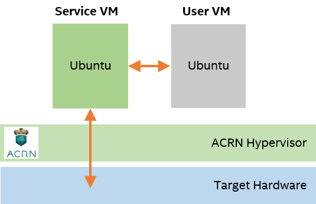
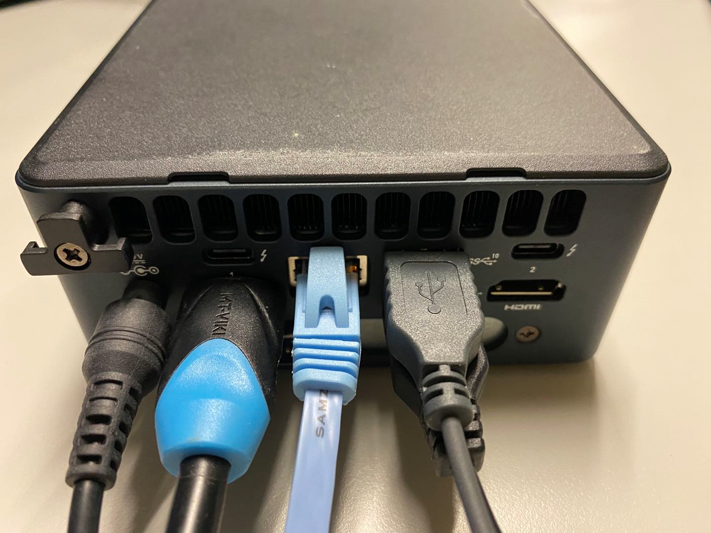

.. _gsg:
.. _rt_industry_ubuntu_setup:
.. _getting-started-building:

Getting Started Guide
#####################

This guide will help you get started with ACRN. We'll show how to prepare a
build environment on your development computer. Then we'll walk through the
steps to set up a simple ACRN configuration on a target system. The
configuration is based on the ACRN predefined **shared** scenario and consists
of an ACRN hypervisor, Service VM, and six User VMs, but we'll launch only one
User VM, as illustrated in this figure:

Throughout this guide, you will be exposed to some of the tools, processes, and
components of the ACRN project. Let's get started.

Prerequisites
**************

You will need two machines: a development computer and a target system. The
development computer is where you configure and build ACRN and your application.
The target system is where you deploy and run ACRN and your application.

.. image:: ./images/gsg_host_target.png
   :scale: 60%

Before you begin, make sure your machines have the following prerequisites:

**Development computer**:

* Hardware specifications

  - A PC with Internet access (A fast system with multiple cores and 16GB
    memory or more will make the builds go faster.)

* Software specifications

  - Ubuntu Desktop 18.04 or newer
    (ACRN development is not supported on Windows.)

**Target system**:

* Hardware specifications

  - Target board (see :ref:`hardware_tested`)
  - Ubuntu 18.04 Desktop bootable USB disk: download the `Ubuntu 18.04.05
    Desktop ISO image <https://releases.ubuntu.com/18.04.5/>`_ and follow the
    `Ubuntu documentation
    <https://ubuntu.com/tutorials/create-a-usb-stick-on-ubuntu#1-overview>`__
    for creating the USB disk.
  - USB keyboard and mouse
  - Monitor
  - Ethernet cable and Internet access
  - A second USB disk with minimum 1GB capacity to copy files between the
    development computer and target system
  - Local storage device (NVMe or SATA drive, for example)

.. rst-class:: numbered-step

Set Up the Hardware
*******************

To set up the hardware environment:

#. Connect the mouse, keyboard, monitor, and power supply cable to the target
   system.

#. Connect the target system to the LAN with the Ethernet cable.

Example of a target system with cables connected:

.. rst-class:: numbered-step

Prepare the Development Computer
********************************

To set up the ACRN build environment on the development computer:

#. On the development computer, run the following command to confirm that Ubuntu
   Desktop 18.04 or newer is running:

   .. code-block:: bash

      cat /etc/os-release

   If you have an older version, see `Ubuntu documentation
   <https://ubuntu.com/tutorials/install-ubuntu-desktop#1-overview>`__ to
   install a new OS on the development computer.

#. Update Ubuntu with any outstanding patches:

   .. code-block:: bash

      sudo apt update

   Followed by:

   .. code-block:: bash

      sudo apt upgrade -y

#. Install the necessary ACRN build tools:

   .. code-block:: bash

      sudo apt install -y gcc \
           git \
           make \
           vim \
           libssl-dev \
           libpciaccess-dev \
           uuid-dev \
           libsystemd-dev \
           libevent-dev \
           libxml2-dev \
           libxml2-utils \
           libusb-1.0-0-dev \
           python3 \
           python3-pip \
           libblkid-dev \
           e2fslibs-dev \
           pkg-config \
           libnuma-dev \
           liblz4-tool \
           flex \
           bison \
           xsltproc \
           clang-format \
           bc

#. Install Python package dependencies:

   .. code-block:: bash

      sudo pip3 install lxml xmlschema defusedxml

#. Install the iASL compiler/disassembler used for advanced power management,
   device discovery, and configuration (ACPI) within the host OS:

   .. code-block:: bash

      mkdir ~/acrn-work
      cd ~/acrn-work
      wget https://acpica.org/sites/acpica/files/acpica-unix-20210105.tar.gz
      tar zxvf acpica-unix-20210105.tar.gz
      cd acpica-unix-20210105
      make clean && make iasl
      sudo cp ./generate/unix/bin/iasl /usr/sbin

#. Get the ACRN hypervisor and kernel source code. (Because the acrn-kernel repo
   has a lot of Linux kernel history, you can clone the relevant release branch
   with minimal history, as shown here.)

   .. code-block:: bash

      cd ~/acrn-work
      git clone https://github.com/projectacrn/acrn-hypervisor
      cd acrn-hypervisor
      git checkout v2.6

      cd ..
      git clone --depth 1 --branch release_2.6 https://github.com/projectacrn/acrn-kernel

.. _gsg-board-setup:

.. rst-class:: numbered-step

Prepare the Target and Generate a Board Configuration File
***************************************************************

A **board configuration file** is an XML file that stores hardware-specific
information extracted from the target system. The file is used to configure the
ACRN hypervisor, because each hypervisor instance is specific to your target
hardware.

You use the **board inspector tool** to generate the board
configuration file.

.. important::

   Whenever you change the configuration of the board, such as BIOS settings,
   additional memory, or PCI devices, you must
   generate a new board configuration file.

Install OS on the Target
============================

The target system needs Ubuntu 18.04 to run the board inspector tool.

To install Ubuntu 18.04:

#. Insert the Ubuntu bootable USB disk into the target system.

#. Power on the target system, and select the USB disk as the boot device
   in the UEFI
   menu. Note that the USB disk label presented in the boot options depends on
   the brand/make of the USB drive. (You will need to configure the BIOS to boot
   off the USB device first, if that option isn't available.)

#. After selecting the language and keyboard layout, select the **Normal
   installation** and **Download updates while installing Ubuntu** (downloading
   updates requires the target to have an Internet connection).

   .. image:: ./images/gsg_ubuntu_install_01.png

#. Use the check boxes to choose whether you'd like to install Ubuntu alongside
   another operating system, or delete your existing operating system and
   replace it with Ubuntu:

   .. image:: ./images/gsg_ubuntu_install_02.jpg
      :scale: 85%

#. Complete the Ubuntu installation and create a new user account ``acrn`` and
   set a password.

#. The next section shows how to configure BIOS settings.

Configure Target BIOS Settings
===============================

#. Boot your target and enter the BIOS configuration editor.

   Tip: When you are booting your target, you'll see an option (quickly) to
   enter the BIOS configuration editor, typically by pressing :kbd:`F2` during
   the boot and before the GRUB menu (or Ubuntu login screen) appears.

#. Configure these BIOS settings:

   * Enable **VMX** (Virtual Machine Extensions, which provide hardware
     assist for CPU virtualization).
   * Enable **VT-d** (Intel Virtualization Technology for Directed I/O, which
     provides additional support for managing I/O virtualization).
   * Disable **Secure Boot**. This setting simplifies the steps for this example.

   The names and locations of the BIOS settings differ depending on the target
   hardware and BIOS version.

#. Set other BIOS settings, such as Hyper-Threading, depending on the needs
   of your application.

Generate a Board Configuration File
=========================================

#. On the target system, install the board inspector dependencies:

   .. code-block:: bash

      sudo apt install -y cpuid msr-tools pciutils dmidecode python3 python3-pip

#. Install the Python package dependencies:

   .. code-block:: bash

      sudo pip3 install lxml

#. Configure the GRUB kernel command line as follows:

   a. Edit the ``grub`` file. The following command uses ``vi``, but you
      can use any text editor.

      .. code-block:: bash

         sudo vi /etc/default/grub

   #. Find the line starting with ``GRUB_CMDLINE_LINUX_DEFAULT`` and append:

      .. code-block:: bash

         idle=nomwait iomem=relaxed intel_idle.max_cstate=0 intel_pstate=disable

      Example:

      .. code-block:: bash

         GRUB_CMDLINE_LINUX_DEFAULT="quiet splash idle=nomwait iomem=relaxed intel_idle.max_cstate=0 intel_pstate=disable"

      These settings allow the board inspector tool to
      gather important information about the board.

   #. Save and close the file.

   #. Update GRUB and reboot the system:

      .. code-block:: bash

         sudo update-grub
         reboot

#. Copy the board inspector tool folder from the development computer to the
   target via USB disk as follows:

   a. Move to the development computer.

   #. On the development computer, insert the USB disk that you intend to
      use to copy files.

   #. Ensure that there is only one USB disk inserted by running the
      following command:

      .. code-block:: bash

         ls /media/$USER

      Confirm that only one disk name appears. You'll use that disk name in
      the following steps.

   #. Copy the board inspector tool folder from the acrn-hypervisor source code to the USB disk:

      .. code-block:: bash

         cd ~/acrn-work/
         disk="/media/$USER/"$(ls /media/$USER)
         cp -r acrn-hypervisor/misc/config_tools/board_inspector/ $disk/
         sync && sudo umount $disk

   #. Insert the USB disk into the target system.

   #. Copy the board inspector tool from the USB disk to the target:

      .. code-block:: bash

         mkdir -p ~/acrn-work
         disk="/media/$USER/"$(ls /media/$USER)
         cp -r $disk/board_inspector ~/acrn-work

#. On the target, load the ``msr`` driver, used by the board inspector:

   .. code-block:: bash

      sudo modprobe msr

#. Run the board inspector tool ( ``board_inspector.py``)
   to generate the board configuration file. This
   example uses the parameter ``my_board`` as the file name.

   .. code-block:: bash

      cd ~/acrn-work/board_inspector/
      sudo python3 board_inspector.py my_board

#. Confirm that the board configuration file ``my_board.xml`` was generated
   in the current directory::

      ls ./my_board.xml

#. Copy ``my_board.xml`` from the target to the development computer
   via USB disk as follows:

   a. Make sure the USB disk is connected to the target.

   #. Copy ``my_board.xml`` to the USB disk:

      .. code-block:: bash

         disk="/media/$USER/"$(ls /media/$USER)
         cp ~/acrn-work/board_inspector/my_board.xml $disk/
         sync && sudo umount $disk

   #. Insert the USB disk into the development computer.

   #. Copy ``my_board.xml`` from the USB disk to the development computer:

      .. code-block:: bash

         disk="/media/$USER/"$(ls /media/$USER)
         cp $disk/my_board.xml ~/acrn-work
         sudo umount $disk

.. _gsg-dev-setup:

.. rst-class:: numbered-step

Generate a Scenario Configuration File and Launch Scripts
*********************************************************

You use the **ACRN configurator** to generate scenario configuration files and
launch scripts.

A **scenario configuration file** is an XML file that holds the parameters of
a specific ACRN configuration, such as the number of VMs that can be run,
their attributes, and the resources they have access to.

A **launch script** is a shell script that is used to configure and create a
User VM. Each User VM has its own launch script.

To generate a scenario configuration file and launch scripts:

#. On the development computer, install ACRN configurator dependencies:

   .. code-block:: bash

      cd ~/acrn-work/acrn-hypervisor/misc/config_tools/config_app
      sudo pip3 install -r requirements

#. Launch the ACRN configurator:

   .. code-block:: bash

      python3 acrn_configurator.py

#. Your web browser should open the website `<http://127.0.0.1:5001/>`__
   automatically, or you may need to visit this website manually.
   The ACRN configurator is supported on Chrome and Firefox.

#. Click the **Import Board info** button and browse to the board configuration
   file ``my_board.xml`` previously generated. When it is successfully
   imported, the board information appears.
   Example:

   .. image:: ./images/gsg_config_board.png
      :class: drop-shadow

#. Generate the scenario configuration file:

   a. Click the **Scenario Setting** menu on the top banner of the UI and select
      **Load a default scenario**. Example:

      .. image:: ./images/gsg_config_scenario_default.png
         :class: drop-shadow

   #. In the dialog box, select **shared** as the default scenario setting and
      then click **OK**. This sample default scenario defines six User VMs.

      .. image:: ./images/gsg_config_scenario_load.png
         :class: drop-shadow

   #. The scenario's configurable items appear. Feel free to look through all
      the available configuration settings used in this sample scenario. This
      is where you can change the sample scenario to meet your application's
      particular needs. But for now, leave them as they're set in the
      sample.

   #. Click the **Export XML** button to save the scenario configuration file
      that will be
      used in the build process.

   #. In the dialog box, keep the default name as is. Type
      ``/home/<username>/acrn-work`` in the Scenario XML Path field. In the
      following example, ``acrn`` is the username. Click **Submit** to save the
      file.

      .. image:: ./images/gsg_config_scenario_save.png
         :class: drop-shadow

   #. Confirm that ``shared.xml`` appears in your ``acrn-work`` directory::

         ls ~/acrn-work/shared.xml

#. Generate the launch scripts:

   a. Click the **Launch Setting** menu on the top banner of the UI and select
      **Load a default launch script**.

      .. image:: ./images/gsg_config_launch_default.png
         :class: drop-shadow

   #. In the dialog box, select **shared_launch_6uos** as the default launch
      setting and click **OK**. Because our sample ``shared`` scenario defines six
      User VMs, we're using this ``shared_launch_6uos`` launch XML configuration.

      .. image:: ./images/gsg_config_launch_load.png
         :class: drop-shadow

   #. Click the **Generate Launch Script** button.

      .. image:: ./images/gsg_config_launch_generate.png
         :class: drop-shadow

   #. In the dialog box, type ``/home/<username>/acrn-work/`` in the Source Path
      field. In the following example, ``acrn`` is the username. Click **Submit**
      to save the script.

      .. image:: ./images/gsg_config_launch_save.png
         :class: drop-shadow

   #. Confirm that ``launch_uos_id3.sh`` appears in the expected output directory::

         ls ~/acrn-work/my_board/output/launch_uos_id3.sh

#. Close the browser and press :kbd:`CTRL` + :kbd:`C` to terminate the
   ``acrn_configurator.py`` program running in the terminal window.

.. rst-class:: numbered-step

Build ACRN
***************

#. On the development computer, build the ACRN hypervisor:

   .. code-block:: bash

      cd ~/acrn-work/acrn-hypervisor
      make -j $(nproc) BOARD=~/acrn-work/my_board.xml SCENARIO=~/acrn-work/shared.xml
      make targz-pkg

   The build typically takes a few minutes. By default, the build results are
   found in the build directory. For convenience, we also built a compressed tar
   file to ease copying files to the target.

#. Build the ACRN kernel for the Service VM:

   .. code-block:: bash

      cd ~/acrn-work/acrn-kernel
      cp kernel_config_uefi_sos .config
      make olddefconfig
      make -j $(nproc) targz-pkg

   The kernel build can take 15 minutes or less on a fast computer, but could
   take an hour or more depending on the performance of your development computer.

#. Copy all the necessary files generated on the development computer to the
   target system by USB disk as follows:

   a. Insert the USB disk into the development computer and run these commands:

      .. code-block:: bash

         disk="/media/$USER/"$(ls /media/$USER)
         cp linux-5.10.52-acrn-sos-x86.tar.gz $disk/
         cp ~/acrn-work/acrn-hypervisor/build/hypervisor/acrn.bin $disk/
         cp ~/acrn-work/my_board/output/launch_uos_id3.sh $disk/
         cp ~/acrn-work/acpica-unix-20210105/generate/unix/bin/iasl $disk/
         cp ~/acrn-work/acrn-hypervisor/build/acrn-2.6-unstable.tar.gz $disk/
         sync && sudo umount $disk/

      Even though our sample default scenario defines six User VMs, we're only
      going to launch one of them, so we'll only need the one launch script.

   #. Insert the USB disk you just used into the target system and run these
      commands to copy the tar files locally:

      .. code-block:: bash

         disk="/media/$USER/"$(ls /media/$USER)
         cp $disk/linux-5.10.52-acrn-sos-x86.tar.gz ~/acrn-work
         cp $disk/acrn-2.6-unstable.tar.gz ~/acrn-work

   #. Extract the Service VM files onto the target system:

      .. code-block:: bash

         cd ~/acrn-work
         sudo tar -zxvf linux-5.10.52-acrn-sos-x86.tar.gz -C / --keep-directory-symlink

      This tar extraction replaces parts of the Ubuntu installation we installed
      and used for running the board inspector, with the Linux kernel we built
      based on the board and scenario configuration.

   #. Extract the ACRN tools and images:

      .. code-block:: bash

         sudo tar -zxvf acrn-2.6-unstable.tar.gz -C / --keep-directory-symlink

   #. Copy a few additional ACRN files to the expected locations:

      .. code-block:: bash

         sudo mkdir -p /boot/acrn/
         sudo cp $disk/acrn.bin /boot/acrn
         sudo cp $disk/iasl /usr/sbin/
         cp $disk/launch_uos_id3.sh ~/acrn-work
         sudo umount $disk/

.. rst-class:: numbered-step

Install ACRN
************

In the following steps, you will configure GRUB on the target system.

#. On the target, find the root filesystem (rootfs) device name by using the
   ``lsblk`` command:

   .. code-block:: console
      :emphasize-lines: 24

      ~$ lsblk
      NAME        MAJ:MIN RM   SIZE RO TYPE MOUNTPOINT
      loop0         7:0    0 255.6M  1 loop /snap/gnome-3-34-1804/36
      loop1         7:1    0  62.1M  1 loop /snap/gtk-common-themes/1506
      loop2         7:2    0   2.5M  1 loop /snap/gnome-calculator/884
      loop3         7:3    0 241.4M  1 loop /snap/gnome-3-38-2004/70
      loop4         7:4    0  61.8M  1 loop /snap/core20/1081
      loop5         7:5    0   956K  1 loop /snap/gnome-logs/100
      loop6         7:6    0   2.2M  1 loop /snap/gnome-system-monitor/148
      loop7         7:7    0   2.4M  1 loop /snap/gnome-calculator/748
      loop8         7:8    0  29.9M  1 loop /snap/snapd/8542
      loop9         7:9    0  32.3M  1 loop /snap/snapd/12704
      loop10        7:10   0  65.1M  1 loop /snap/gtk-common-themes/1515
      loop11        7:11   0   219M  1 loop /snap/gnome-3-34-1804/72
      loop12        7:12   0  55.4M  1 loop /snap/core18/2128
      loop13        7:13   0  55.5M  1 loop /snap/core18/2074
      loop14        7:14   0   2.5M  1 loop /snap/gnome-system-monitor/163
      loop15        7:15   0   704K  1 loop /snap/gnome-characters/726
      loop16        7:16   0   276K  1 loop /snap/gnome-characters/550
      loop17        7:17   0   548K  1 loop /snap/gnome-logs/106
      loop18        7:18   0 243.9M  1 loop /snap/gnome-3-38-2004/39
      nvme0n1     259:0    0 119.2G  0 disk 
      ├─nvme0n1p1 259:1    0   512M  0 part /boot/efi
      └─nvme0n1p2 259:2    0 118.8G  0 part /

   As highlighted, you're looking for the device name associated with the
   partition named ``/``, in this case ``nvme0n1p2``.

#. Run the ``blkid`` command to get the UUID and PARTUUID for the rootfs device
   (replace the ``nvme0n1p2`` name with the name shown for the rootfs on your
   system):

   .. code-block:: bash

      sudo blkid /dev/nvme0n1p2

   In the output, look for the UUID and PARTUUID (example below). You will need
   them in the next step.

   .. code-block:: console

      /dev/nvme0n1p2: UUID="3cac5675-e329-4cal-b346-0a3e65f99016" TYPE="ext4" PARTUUID="03db7f45-8a6c-454b-adf7-30343d82c4f4"

#. Add the ACRN Service VM to the GRUB boot menu:

   a. Edit the GRUB 40_custom file. The following command uses ``vi``, but
      you can use any text editor.

      .. code-block:: bash

         sudo vi /etc/grub.d/40_custom

   #. Add the following text at the end of the file. Replace ``<UUID>`` and
      ``<PARTUUID>`` with the output from the previous step.

      .. code-block:: bash
         :emphasize-lines: 6,8

         menuentry "ACRN Multiboot Ubuntu Service VM" --id ubuntu-service-vm {
           load_video
           insmod gzio
           insmod part_gpt
           insmod ext2
           search --no-floppy --fs-uuid --set "UUID"
           echo 'loading ACRN...'
           multiboot2 /boot/acrn/acrn.bin  root=PARTUUID="PARTUUID"
           module2 /boot/vmlinuz-5.10.52-acrn-sos Linux_bzImage
         }

   #. Save and close the file.

   #. Correct example image

      .. code-block:: console

         menuentry "ACRN Multiboot Ubuntu Service VM" --id ubuntu-service-vm {
           load_video
           insmod gzio
           insmod part_gpt
           insmod ext2
           search --no-floppy --fs-uuid --set "3cac5675-e329-4cal-b346-0a3e65f99016"
           echo 'loading ACRN...'
           multiboot2 /boot/acrn/acrn.bin  root=PARTUUID="03db7f45-8a6c-454b-adf7-30343d82c4f4"
           module2 /boot/vmlinuz-5.10.52-acrn-sos Linux_bzImage
         }

#. Make the GRUB menu visible when
   booting and make it load the Service VM kernel by default:

   a. Edit the ``grub`` file:

      .. code-block:: bash

         sudo vi /etc/default/grub

   #. Edit lines with these settings (comment out the ``GRUB_TIMEOUT_STYLE`` line).
      Leave other lines as they are:

      .. code-block:: bash

         GRUB_DEFAULT=ubuntu-service-vm
         #GRUB_TIMEOUT_STYLE=hidden
         GRUB_TIMEOUT=5

   #. Save and close the file.

#. Update GRUB and reboot the system:

   .. code-block:: bash

      sudo update-grub
      reboot

#. Confirm that you see the GRUB menu with the "ACRN Multiboot Ubuntu Service
   VM" entry. Select it and proceed to booting ACRN. (It may be autoselected, in
   which case it will boot with this option automatically in 5 seconds.)

   .. code-block:: console
      :emphasize-lines: 8

                                GNU GRUB version 2.04
      ────────────────────────────────────────────────────────────────────────────────
      Ubuntu
      Advanced options for Ubuntu
      Ubuntu 18.04.05 LTS (18.04) (on /dev/nvme0n1p2)
      Advanced options for Ubuntu 18.04.05 LTS (18.04) (on /dev/nvme0n1p2)
      System setup
      *ACRN Multiboot Ubuntu Service VM

.. rst-class:: numbered-step

Run ACRN and the Service VM
******************************

The ACRN hypervisor boots the Ubuntu Service VM automatically.

#. On the target, log in to the Service VM. (It will look like a normal Ubuntu
   session.)

#. Verify that the hypervisor is running by checking ``dmesg`` in
   the Service VM:

   .. code-block:: bash

      dmesg | grep ACRN

   You should see "Hypervisor detected: ACRN" in the output. Example output of a
   successful installation (yours may look slightly different):

   .. code-block:: console

      [  0.000000] Hypervisor detected: ACRN
      [  3.875620] ACRNTrace: Initialized acrn trace module with 4 cpu

.. rst-class:: numbered-step

Launch the User VM
*******************

#. A User VM image is required on the target system before launching it. The
   following steps use Ubuntu:

   a. Go to the `official Ubuntu website
      <https://releases.ubuntu.com/bionic>`__ to get an ISO format of the Ubuntu
      18.04 desktop image.

   #. Put the ISO file in the path ``~/acrn-work/`` on the target system.

#. Even though our sample default scenario defines six User VMs, we're only
   going to launch one of them.
   Open the launch script in a text editor. The following command uses ``vi``, but
   you can use any text editor.

   .. code-block:: bash

      vi ~/acrn-work/launch_uos_id3.sh

#. Look for the line that contains the term ``virtio-blk`` and replace the
   existing image file path with your ISO image file path.  In the following
   example, the ISO image file path is
   ``/home/acrn/acrn-work/ubuntu-18.04.5-desktop-amd64.iso``.

   .. code-block:: bash
      :emphasize-lines: 4

      acrn-dm -A -m $mem_size -s 0:0,hostbridge -U 615db82a-e189-4b4f-8dbb-d321343e4ab3 \
         --mac_seed $mac_seed \
         $logger_setting \
         -s 7,virtio-blk,/home/acrn/acrn-work/ubuntu-18.04.5-desktop-amd64.iso \
         -s 8,virtio-net,tap_YaaG3 \
         -s 6,virtio-console,@stdio:stdio_port \
         --ovmf /usr/share/acrn/bios/OVMF.fd \
         -s 1:0,lpc \
         $vm_name

#. Save and close the file.

#. Launch the User VM:

   .. code-block:: bash

      sudo chmod +x ~/acrn-work/launch_uos_id3.sh
      sudo chmod +x /usr/bin/acrn-dm
      sudo chmod +x /usr/sbin/iasl
      sudo ~/acrn-work/launch_uos_id3.sh

#. It will take a few seconds for the User VM to boot and start running the
   Ubuntu image.  Confirm that you see the console of the User VM on the Service
   VM's terminal. Example:

   .. code-block:: console

      Ubuntu 18.04.5 LTS ubuntu hvc0

      ubuntu login:

#. Log in to the User VM. For the Ubuntu 18.04 ISO, the user is ``ubuntu``, and
   there's no password.

#. Confirm that you see output similar to this example:

   .. code-block:: console

      Welcome to Ubuntu 18.04.5 LTS (GNU/Linux 5.4.0-42-generic x86_64)

      * Documentation:  https://help.ubuntu.com
      * Management:     https://landscape.canonical.com
      * Support:        https://ubuntu.com/advantage

      0 packages can be updated.
      0 updates are security updates.

      Your Hardware Enablement Stack (HWE) is supported until April 2023.

      The programs included with the Ubuntu system are free software;
      the exact distribution terms for each program are described in the
      individual files in /usr/share/doc/*/copyright.

      Ubuntu comes with ABSOLUTELY NO WARRANTY, to the extent permitted by
      applicable law.

      To run a command as administrator (user "root"), use "sudo <command>".
      See "man sudo_root" for details.

      ubuntu@ubuntu:~$

The User VM has launched successfully. You have completed this ACRN setup.

Next Steps
**************

:ref:`overview_dev` describes the ACRN configuration process, with links to
additional details.
