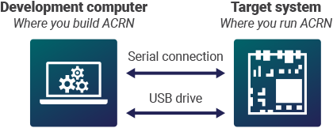
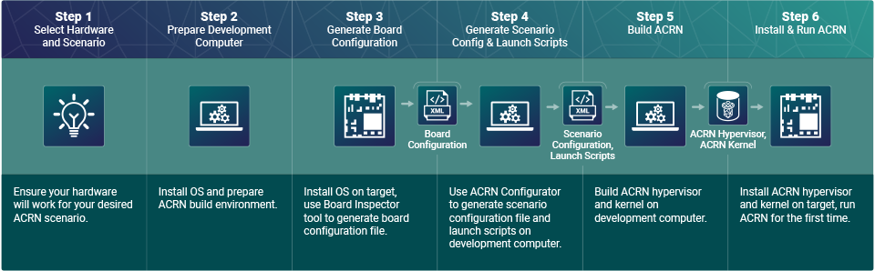
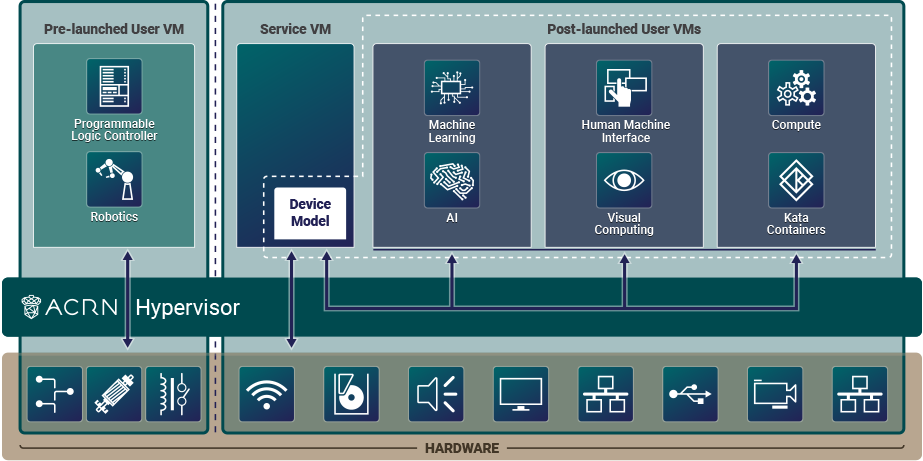

.. _overview_dev:

Configuration and Development Overview
######################################

This overview is for developers who are new to ACRN and are responsible for
configuring and building the hypervisor and the VMs for applications. It will
introduce you to the general development process, including ACRN components and
tools.

The overview covers the process at an abstract and universal level.

* Abstract: the overall structure rather than detailed instructions
* Universal: applicable to most use cases

This overview complements the :ref:`gsg`. The guide provides
step-by-step instructions to enable an ACRN example for first-time use, while
the overview provides background information and serves as a gateway to
additional features and resources that can help you develop your solution.

See :ref:`introduction` for information about ACRN benefits, use cases, and
architecture.

.. _overview_dev_dev_env:

Development Environment
***********************

The recommended development environment for ACRN consists of two machines:

* **Development computer** where you configure and build ACRN images
* **Target system** where you install and run ACRN images

ACRN requires a serial output from the target system to the development computer
for :ref:`debugging and system messaging <acrn-debug>`. If your target doesn't
have a serial output, :ref:`here are some tips for connecting a serial output
<connect_serial_port>`.

You need a way to copy the built ACRN images and other files between the
development computer and target system. ACRN documentation, such as the
:ref:`gsg`, offers steps for copying via USB disk as a simple solution.

General Process for Building an ACRN Hypervisor
***********************************************

The general process for configuring and building an ACRN hypervisor is
illustrated in the following figure. Additional details follow.

.. _overview_dev_hw_scenario:

|icon_light| Step 1: Select Hardware and Scenario
*************************************************

ACRN configuration is hardware and scenario specific. You will need to learn
about supported ACRN hardware and scenarios, and select the right ones for your
needs.

Select Your Hardware
====================

ACRN supports certain Intel processors. Development kits are widely available.
See :ref:`hardware`.

.. _overview_dev_select_scenario:

Select Your Scenario
====================

A scenario defines a specific ACRN configuration, such as the type and number of
VMs that can be run, their attributes, and the resources they have access to.

This image shows an example of an ACRN scenario to illustrate the types of VMs
that ACRN offers:

ACRN offers three types of VMs:

* **Pre-launched User VMs**: These VMs are automatically launched at boot time
  by the hypervisor. They run independently of other VMs and own dedicated
  hardware resources, such as a CPU core, memory, and I/O devices. Other VMs,
  including the Service VM, may not even be aware of a pre-launched VM's
  existence. The configuration of pre-launched VMs is static and must be defined
  at build time. They are well-suited for safety-critical applications and where
  very strict isolation, including from the Service VM, is desirable.

* **Service VM**: A special VM, required for scenarios that have post-launched
  User VMs. The Service VM can access hardware resources directly by running
  native drivers and provides device sharing services to post-launched User VMs
  through the :ref:`ACRN Device Model (DM) <hld-devicemodel>` ``acrn-dm``
  application. The Device Model runs inside the Service VM and is responsible
  for creating and launching a User VM and then performing device emulation for
  the devices configured for sharing with that User VM. ACRN supports one
  Service VM.

* **Post-launched User VMs**: These VMs typically share hardware resources via
  the Service VM and Device Model. They can also access hardware devices
  directly if they've been configured as passthrough devices. Unlike
  pre-launched VMs, you can change the configuration at runtime. They are
  well-suited for non-safety applications, including human machine interface
  (HMI), artificial intelligence (AI), computer vision, real-time, and others.

The names "pre-launched" and "post-launched" refer to the boot order of these
VMs. The ACRN hypervisor launches the pre-launched VMs first, then launches the
Service VM. The Service VM launches the post-launched VMs.

Due to the static configuration of pre-launched VMs, they are recommended only
if you need complete isolation from the rest of the system. Most use cases can
meet their requirements without pre-launched VMs. Even if your application has
stringent real-time requirements, start by testing the application on a
post-launched VM before considering a pre-launched VM.

Predefined Scenarios
---------------------

To help accelerate the configuration process, ACRN offers the following
:ref:`predefined sample scenarios <usage-scenarios>`:

* **Shared scenario:** This scenario represents a traditional computing, memory,
  and device resource sharing model among VMs. It has post-launched User VMs and
  the required Service VM. There are no pre-launched VMs in this scenario.

* **Partitioned scenario:** This scenario has pre-launched User VMs to
  demonstrate VM partitioning: the User VMs are independent and isolated, and
  they do not share resources. There is no need for the Service VM or Device
  Model because all partitioned VMs run native device drivers and directly
  access their configured resources.

* **Hybrid scenario:** This scenario simultaneously supports both sharing and
  partitioning on the consolidated system. It has pre-launched and
  post-launched VMs, along with the Service VM.

ACRN provides predefined configuration files and documentation to help you set
up these scenarios. You can customize the files for your use case, as described
later in :ref:`overview_dev_config_editor`.

|icon_host| Step 2: Prepare the Development Computer
****************************************************

Your development computer requires certain dependencies to configure and build
ACRN:

* Ubuntu OS (ACRN development is not supported on Windows.)
* Build tools
* ACRN hypervisor source code
* If your scenario has a Service VM: ACRN kernel source code

.. _overview_dev_board_config:

|icon_target| Step 3: Generate a Board Configuration File
*********************************************************

The :ref:`board_inspector_tool` ``board_inspector.py``, found in the ACRN
hypervisor source code, enables you to generate a board configuration file on
the target system.

A **board configuration file** stores hardware-specific information extracted
from the target system. This XML file describes the capacity of hardware
resources (such as processors and memory), platform power states, available
devices, and BIOS settings. The file is used to configure and build the ACRN
hypervisor, because each hypervisor instance is specific to your target
hardware.

The following sections provide an overview and important information to keep
in mind when using the Board Inspector.

Configure BIOS Settings
=======================

You must configure all of your target's BIOS settings before running the Board
Inspector tool, because the tool records the current BIOS settings in the board
configuration file.

ACRN requires the BIOS settings listed in :ref:`gsg-board-setup` of the Getting
Started Guide.

Use the Board Inspector to Generate a Board Configuration File
==============================================================

The Board Inspector requires certain dependencies to be present on the target
system:

* Ubuntu OS
* Tools and kernel command-line options that allow the Board Inspector to
  collect information about the target hardware

After setting up the dependencies, you run the Board Inspector via command-line.
The tool generates the board configuration file specific to your hardware.

.. important:: Whenever you change the configuration of the board, such as BIOS
   settings or PCI ports, you must generate a new board configuration file.

You will need the board configuration file in :ref:`overview_dev_config_editor`
and :ref:`overview_dev_build`.

.. _overview_dev_config_editor:

|icon_host| Step 4: Generate a Scenario Configuration File and Launch Scripts
*****************************************************************************

The :ref:`acrn_configurator_tool` ``acrn_configurator.py`` enables you to
configure your ACRN hypervisor and VMs via a web-based user interface on your
development computer. Using the tool, you define your scenario settings and save
them to a scenario configuration file. For scenarios with post-launched User
VMs, you must also configure and generate launch scripts.

The following sections provide an overview and important information to keep
in mind when using the ACRN Configurator.

Generate a Scenario Configuration File
======================================

A **scenario configuration file** defines a working scenario by configuring
hypervisor capabilities and defining some VM attributes and resources. We call
these settings "static" because they are used to build the hypervisor. The file
contains:

* All hypervisor settings
* All pre-launched User VM settings
* All Service VM settings
* Some post-launched User VM settings, while other settings are in
  the launch script

Before using the ACRN Configurator to generate a scenario configuration
file, be sure you have the board configuration file that you generated in
:ref:`overview_dev_board_config`. The tool needs the board configuration file to
validate that your custom scenario is supported by the target hardware.

You can use the tool to create a new scenario configuration file or modify an
existing one, such as a predefined scenario described in
:ref:`overview_dev_hw_scenario`. The tool's GUI enables you to edit the
configurable items in the file, such as adding VMs, modifying VM attributes, or
deleting VMs. The tool validates your inputs against your board configuration
file. After validation is successful, the tool generates your custom scenario
configuration file in XML format.

Generate Launch Scripts
=======================

A **launch script** invokes the Service VM's Device Model to create a
post-launched User VM. The launch script defines settings needed to launch the
User VM and emulate the devices configured for sharing with that User VM. We
call these settings "dynamic" because they are used at runtime.

Before using the ACRN Configurator to generate a launch script, be sure
you have your board configuration file and scenario configuration file. The tool
needs both files to validate your launch script configuration.

The process of generating launch scripts begins by choosing to create a new
launch configuration or modify an existing one. You then use the GUI to
edit the configurable settings of each post-launched User VM in your scenario.
The tool validates your inputs against your board configuration file and
scenario configuration file. After validation is successful, the tool generates
your custom launch configuration file in XML format. You then use the tool to
generate the launch scripts. The tool creates one launch script for each VM
defined in the launch configuration file.

.. note::
   The ACRN Configurator may not show all editable
   parameters for scenario configuration files and launch scripts. You can edit
   the parameters manually. See :ref:`acrn_config_data`.

.. _overview_dev_build:

|icon_host| Step 5: Build ACRN
******************************

The ACRN hypervisor source code provides a makefile to build the ACRN hypervisor
binary and associated components. In the ``make`` command, you need to specify
your board configuration file and scenario configuration file. The build
typically takes a few minutes.

If your scenario has a Service VM, you also need to build the ACRN kernel for
the Service VM. The ACRN kernel source code provides a predefined configuration
file and a makefile to build the ACRN kernel binary and associated components.
The kernel build can take 15 minutes or less on a fast computer, but could take
an hour or more depending on the performance of your development computer. For
more information about the kernel parameters, see :ref:`kernel-parameters`.

.. _overview_dev_install:

|icon_target| Step 6: Install and Run ACRN
******************************************

The last step is to make final changes to the target system configuration and
then boot ACRN.

At a high level, you will:

* Copy the built ACRN hypervisor files, Service VM kernel files, and launch
  scripts from the development computer to the target.

* Configure GRUB to boot the ACRN hypervisor, pre-launched VMs, and Service VM.
  Reboot the target, and launch ACRN.

* If your scenario contains a post-launched VM, install an OS image for the
  post-launched VM and run the launch script you created in
  :ref:`overview_dev_config_editor`.

Learn More
**********

* To get ACRN up and running for the first time, see the :ref:`gsg` for
  step-by-step instructions.

* If you have already completed the :ref:`gsg` , see the
  :ref:`develop_acrn` for more information about complex scenarios, advanced
  features, and debugging.
