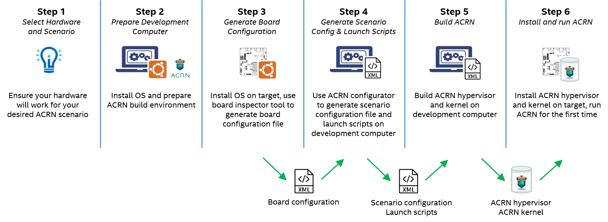
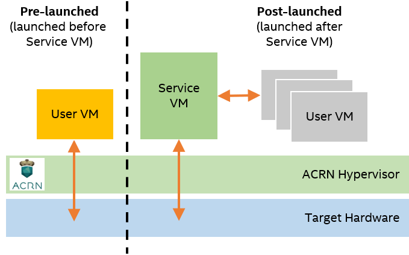

.. _overview_dev:

Configuration and Development Overview
######################################

This overview is for developers who are new or relatively new to ACRN. It will
help you get familiar with ACRN basics: ACRN components and general process for
building an ACRN hypervisor.

The overview covers the process at an abstract and universal level.

* Abstract: the overall structure rather than detailed instructions
* Universal: applicable to most use cases

Although the overview describes the process as a series of steps, it's intended
to be a summary, not a step-by-step guide. Throughout the overview, you will see
links to the :ref:`gsg` for first-time setup instructions. Links to advanced
guides and additional information are also provided.

.. _overview_dev_dev_env:

Development Environment
***********************

The recommended development environment for ACRN consists of two machines:

* **Development computer** where you configure and build ACRN images
* **Target system** where you install and run ACRN images

.. image:: ./images/overview_host_target.png
   :scale: 60%

ACRN requires a serial output from the target system to the development computer
for :ref:`debugging and system messaging <acrn-debug>`. If your target doesn't
have a serial output, :ref:`here are some tips for connecting a serial output
<connect_serial_port>`.

You will need a way to copy the built ACRN images from the development computer
to the target system. A USB drive is recommended.

General Process for Building an ACRN Hypervisor
***********************************************

The general process for configuring and building an ACRN hypervisor is
illustrated in the following figure. Additional details follow.

.. _overview_dev_hw_scenario:

|icon_light| Step 1: Select Hardware and Scenario
*************************************************

.. |icon_light| image:: ./images/icon_light.png
   :scale: 75%

ACRN configuration is hardware and scenario specific. You will need to learn
about supported ACRN hardware and scenarios, and select the right ones for your
needs.

Select Your Hardware
====================

ACRN supports certain Intel processors. Development kits are widely available.
See :ref:`hardware`.

.. _overview_dev_select_scenario:

Select Your Scenario
====================

A :ref:`scenario <usage-scenarios>` is a specific ACRN configuration, such as
the type and number of VMs that can be run, their attributes, and the resources
they have access to.

This image shows an example of an ACRN scenario to illustrate the types of VMs
that ACRN offers:

ACRN offers three types of VMs:

* **Pre-launched User VMs**: These VMs run independently of other VMs and own
  dedicated hardware resources, such as a CPU core, memory, and I/O devices.
  Other VMs may not even be aware of the existence of pre-launched VMs. The
  configuration of these VMs is static and must be defined at build time. They
  are well-suited for safety-critical applications.

* **Service VM**: This VM is required for scenarios that have post-launched VMs.
  It controls post-launched VMs and provides device sharing services to them.
  ACRN supports one Service VM.

* **Post-launched User VMs**: These VMs share hardware resources. Unlike
  pre-launched VMs, you can change the configuration at run-time. They are
  well-suited for non-safety applications, including human machine interface
  (HMI), artificial intelligence (AI), computer vision, real-time, and others.

The names "pre-launched" and "post-launched" refer to the boot order of these
VMs. The ACRN hypervisor launches the pre-launched VMs first, then launches the
Service VM. The Service VM launches the post-launched VMs.

Due to the static configuration of pre-launched VMs, they are recommended only
if you need complete isolation from the rest of the system. Most use cases can
meet their requirements without pre-launched VMs. Even if your application has
stringent real-time requirements, start by testing the application on a
post-launched VM before considering a pre-launched VM.

To help accelerate the configuration process, ACRN offers the following
:ref:`predefined scenarios <usage-scenarios>`:

* **Shared scenario:** A configuration in which the VMs share resources
  (post-launched).

* **Partitioned scenario:** A configuration in which the VMs are isolated from
  each other and don't share resources (pre-launched).

* **Hybrid scenario:** A configuration that has both pre-launched and
  post-launched VMs.

ACRN provides predefined configuration files and documentation to help you set
up these scenarios.

* New ACRN users start with the shared scenario, as described in the :ref:`gsg`.

* The other predefined scenarios are more complex. The :ref:`develop_acrn`
  provide setup instructions.

You can copy the predefined configuration files and customize them for your use
case, as described later in :ref:`overview_dev_config_editor`.

|icon_host| Step 2: Prepare the Development Computer
****************************************************

.. |icon_host| image:: ./images/icon_host.png
   :scale: 75%

Your development computer requires certain dependencies to configure and build
ACRN:

* Ubuntu OS
* Build tools
* ACRN hypervisor source code
* If your scenario has a Service VM: ACRN kernel source code

The :ref:`gsg` provides step-by-step instructions for setting up your
development computer.

In the next step, :ref:`overview_dev_board_config`, you will need the board
inspector tool found in the ACRN hypervisor source code to collect information
about the target hardware and generate a board configuration file.

.. _overview_dev_board_config:

|icon_target| Step 3: Generate a Board Configuration File
*********************************************************

.. |icon_target| image:: ./images/icon_target.png
   :scale: 75%

A **board configuration file** is an XML file that stores hardware-specific
information extracted from the target system. It describes the capacity of
hardware resources (such as processors and memory), platform power states,
available devices, and BIOS settings. The file is used to configure the ACRN
hypervisor, because each hypervisor instance is specific to your target
hardware.

The **board inspector tool** ``board_inspector.py`` enables you to generate a board
configuration file on the target system. The following sections provide an
overview and important information to keep in mind when using the tool.

Configure BIOS Settings
=======================

You must configure all of your target's BIOS settings before running the board
inspector tool, because the tool records the current BIOS settings in the board
configuration file.

Some BIOS settings are required by ACRN. The :ref:`gsg` provides a list of the
settings.

Use the Board Inspector to Generate a Board Configuration File
==============================================================

The board inspector tool requires certain dependencies to be present on the
target system:

* Ubuntu OS
* Tools and kernel command-line options that allow the board inspector to
  collect information about the target hardware

After setting up the dependencies, you run the board inspector via command-line.
The tool generates a board configuration file specific to your hardware.

.. important:: Whenever you change the configuration of the board, such as BIOS
   settings or PCI ports, you must generate a new board configuration file.

The :ref:`gsg` provides step-by-step instructions for using the tool. For more
information about the tool, see :ref:`board_inspector_tool`.

.. _overview_dev_config_editor:

|icon_host| Step 4: Generate a Scenario Configuration File and Launch Scripts
*****************************************************************************

As described in :ref:`overview_dev_select_scenario`, a scenario is a specific
ACRN configuration, such as the number of VMs that can be run, their attributes,
and the resources they have access to. These parameters are saved in a
**scenario configuration file** in XML format.

A **launch script** is a shell script that is used to create a post-launched VM.

The **ACRN configurator** ``acrn_configurator.py`` is a web-based user interface that
runs on your development computer. It enables you to customize, validate, and
generate scenario configuration files and launch scripts. The following sections
provide an overview and important information to keep in mind when using the
tool.

Generate a Scenario Configuration File
======================================

Before using the ACRN configurator to generate a scenario configuration
file, be sure you have the board configuration file that you generated in
:ref:`overview_dev_board_config`. The tool needs the board configuration file to
validate that your custom scenario is supported by the target hardware.

You can use the tool to create a new scenario configuration file or modify an
existing one, such as a predefined scenario described in
:ref:`overview_dev_hw_scenario`. The tool's GUI enables you to edit the
configurable items in the file, such as adding VMs, modifying VM attributes, or
deleting VMs. The tool validates your inputs against your board configuration
file. After validation is successful, the tool generates your custom scenario
configuration file.

Generate Launch Scripts
=======================

Before using the ACRN configurator to generate a launch script, be sure
you have your board configuration file and scenario configuration file. The tool
needs both files to validate your launch script configuration.

The process of customizing launch scripts is similar to the process of
customizing scenario configuration files. You can choose to create a new launch
script or modify an existing one. You can then use the GUI to edit the
configurable parameters. The tool validates your inputs against your board
configuration file and scenario configuration file. After validation is
successful, the tool generates your custom launch script.

.. note::
   The ACRN configurator may not show all editable
   parameters for scenario configuration files and launch scripts. You can edit
   the parameters manually. See :ref:`acrn_config_data`.

The :ref:`gsg` walks you through a simple example of using the tool. For more
information about the tool, see :ref:`acrn_configurator_tool`.

|icon_host| Step 5: Build ACRN
******************************

The ACRN hypervisor source code provides a makefile to build the ACRN hypervisor
binary and associated components. In the ``make`` command, you need to specify
your board configuration file and scenario configuration file. The build
typically takes a few minutes.

If your scenario has a Service VM, you also need to build the ACRN kernel for
the Service VM. The ACRN kernel source code provides a predefined configuration
file and a makefile to build the ACRN kernel binary and associated components.
The build can take 1-3 hours depending on the performance of your development
computer and network.

The :ref:`gsg` provides step-by-step instructions.

For more information about the kernel, see :ref:`kernel-parameters`.

.. _overview_dev_install:

|icon_target| Step 6: Install and Run ACRN
******************************************

The last step is to make final changes to the target system configuration and
then boot ACRN.

At a high level, you will:

* Copy the built ACRN hypervisor files, kernel files, and launch scripts from
  the development computer to the target.

* Configure GRUB to boot the ACRN hypervisor, pre-launched VMs, and Service VM.
  Reboot the target, and launch ACRN.

* If your scenario contains a post-launched VM, install an OS image for the
  post-launched VM and run the launch script you created in
  :ref:`overview_dev_config_editor`.

For a basic example, see the :ref:`gsg`.

For details about GRUB, see :ref:`using_grub`.

For more complex examples of post-launched VMs, see the
:ref:`develop_acrn_user_vm`.

Next Steps
**********

* To get ACRN up and running for the first time, see the :ref:`gsg` for
  step-by-step instructions.

* If you have already completed the :ref:`gsg`, see the :ref:`develop_acrn` for
  more information about complex scenarios, advanced features, and debugging.
