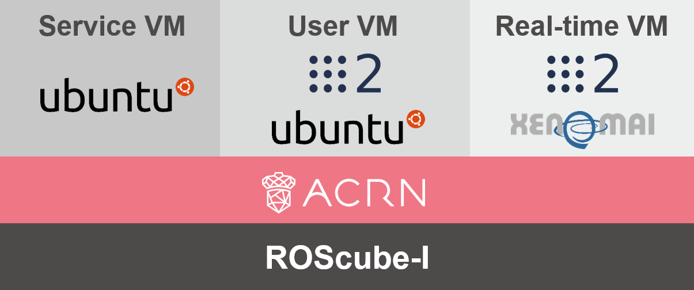
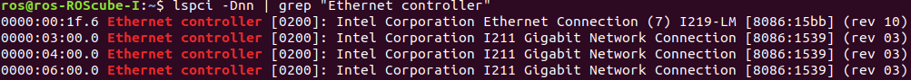
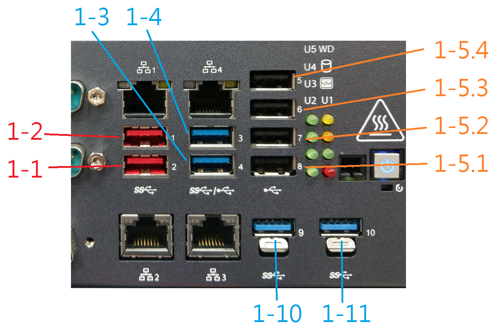
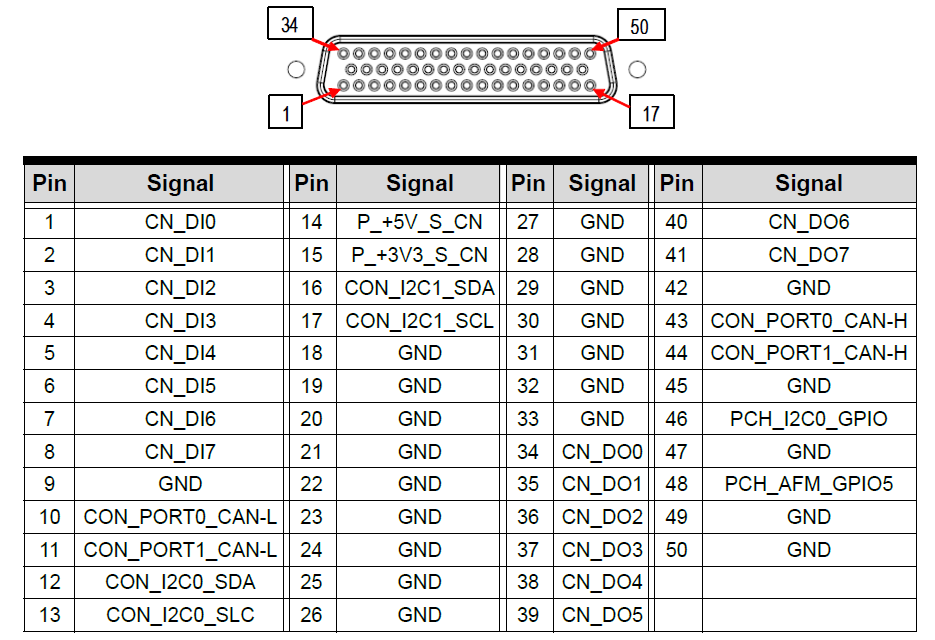

.. _roscube-gsg:

Getting Started Guide for ACRN Industry Scenario With ROScube-I
###############################################################

.. contents::
   :local:
   :depth: 1

Verified Version
****************

- Ubuntu version: **18.04**
- GCC version: **7.5.0**
- ACRN-hypervisor branch: **v2.5**
- ACRN-Kernel (Service VM kernel): **v2.5**
- RT kernel for Ubuntu User VM OS: **Linux kernel 4.19.59 with Xenomai 3.1**
- HW: `ROScube-I`_

  ADLINK `ROScube-I`_ is a real-time `ROS 2`_-enabled robotic controller based
  on Intel® Xeon® 9th Gen Intel® Core™ i7/i3 and 8th Gen Intel® Core™ i5
  processors. It features comprehensive I/O connectivity supporting a wide
  variety of sensors and actuators for unlimited robotic applications.

.. _ROScube-I:
   https://www.adlinktech.com/Products/ROS2_Solution/ROS2_Controller/ROScube-I?lang=en

.. _ROS 2:
   https://index.ros.org/doc/ros2/

Architecture
************

This tutorial will show you how to install the ACRN Industry Scenario on ROScube-I.
The scenario is shown here:

* Service VM: Used to launch the User VM and real-time VM.
* User VM: Run `ROS 2`_ application in this VM, such as for SLAM or navigation.
* Real-time VM: Run critical tasks in this VM, such as the base driver.

Prerequisites
*************

* Connect the ROScube-I as shown here:

  - HDMI for monitor.
  - Network on Ethernet port 1.
  - Keyboard and mouse on USB.

  .. figure:: images/rqi-acrn-hw-connection.jpg
     :width: 600px

* Install Ubuntu 18.04 on ROScube-I.

* Modify the following BIOS settings.

  .. csv-table::
     :widths: 15, 30, 10

     "Hyper-threading", "Advanced -> CPU Configuration", "Disabled"
     "Intel (VMX) Virtualization", "Advanced -> CPU Configuration", "Enabled"
     "Intel(R) SpeedStep(tm)", "Advanced -> CPU Configuration", "Disabled"
     "Intel(R) Speed Shift Technology", "Advanced -> CPU configuration", "Disabled"
     "Turbo Mode", "Advanced -> CPU configuration", "Disabled"
     "C States", "Advanced -> CPU configuration", "Disabled"
     "VT-d", "Chipset -> System Agent (SA) Configuration", "Enabled"
     "DVMT-Pre Allocated", "Chipset -> System Agent (SA) Configuration -> Graphics Configuration", "64M"

.. rst-class:: numbered-step

Install ACRN Hypervisor
***********************

Set Up Environment
==================

#. Open ``/etc/default/grub/`` and add ``idle=nomwait intel_pstate=disable``
   to the end of ``GRUB_CMDLINE_LINUX_DEFAULT``.

   .. figure:: images/rqi-acrn-grub.png

#. Update GRUB and then reboot.

   .. code-block:: bash

     sudo update-grub
     sudo reboot

#. Install the necessary libraries:

   .. code-block:: bash

     sudo apt update
     sudo apt install -y gcc \
         git \
         make \
         vim \
         libssl-dev \
         libpciaccess-dev \
         uuid-dev \
         libsystemd-dev \
         libevent-dev \
         libxml2-dev \
         libxml2-utils \
         libusb-1.0-0-dev \
         python3 \
         python3-pip \
         libblkid-dev \
         e2fslibs-dev \
         pkg-config \
         libnuma-dev \
         liblz4-tool \
         flex \
         bison \
         xsltproc \
         clang-format \
         bc
     sudo pip3 install lxml xmlschema defusedxml

#. Install the iASL compiler/disassembler used for advanced power management,
   device discovery, and configuration (ACPI) within the host OS:

   .. code-block:: bash

     cd /tmp
     wget https://acpica.org/sites/acpica/files/acpica-unix-20210105.tar.gz
     tar zxvf acpica-unix-20210105.tar.gz
     cd acpica-unix-20210105
     make clean && make iasl
     sudo cp ./generate/unix/bin/iasl /usr/sbin/

#. Get code from GitHub.

   .. code-block:: bash

     mkdir ~/acrn && cd ~/acrn
     git clone https://github.com/projectacrn/acrn-hypervisor -b release_2.5
     cd acrn-hypervisor

Configure Hypervisor
====================

#. Parse system information.

   .. code-block:: bash

     sudo apt install -y cpuid msr-tools
     cd ~/acrn/acrn-hypervisor/misc/config_tools/board_inspector/
     sudo python3 cli.py ros-cube-cfl
     cp ~/acrn/acrn-hypervisor/misc/config_tools/board_inspector/ros-cube-cfl.xml \
       ~/acrn/acrn-hypervisor/misc/config_tools/data/

#. Run ACRN configuration app and it will open a browser page.

   .. code-block:: bash

     cd ~/acrn/acrn-hypervisor/misc/config_tools/config_app
     sudo pip3 install -r requirements
     python3 app.py

   .. figure:: images/rqi-acrn-config-web.png

#. Select "Import Board info".

   .. figure:: images/rqi-acrn-config-import-board.png

#. Select target board name.

   .. figure:: images/rqi-acrn-config-select-board.png

#. Select "Scenario Setting" and choose "Load a default scenario".

   .. figure:: images/rqi-acrn-config-scenario-settings.png

#. Settings "Features": "RDT_ENABLED" option must be "n".

   .. figure:: images/rqi-acrn-config-features-settings.png

#. Settings "HV": You can ignore this if your RAM is <= 16GB.

   .. figure:: images/rqi-acrn-config-hv-settings.png

#. Settings "VM0": Select the hard disk currently used.
   If you system need some special bootargs (like "video=eDP-1:d"),
   you can add it below.

   .. figure:: images/rqi-acrn-config-vm0-settings.png

#. Settings "VM1": Enable all the cpu_affinity.
   You can press :kbd:`+` to increase CPU ID.
   This doesn't mean to attach all CPUs to the VM. The CPU number can be
   adjusted later.

   .. figure:: images/rqi-acrn-config-vm1-settings.png

#. Settings "VM2": Set up RT flags and enable all the cpu_affinity.

   .. figure:: images/rqi-acrn-config-vm2-settings1.png

   .. figure:: images/rqi-acrn-config-vm2-settings2.png

#. Export XML.

   .. figure:: images/rqi-acrn-config-export-xml.png

   .. figure:: images/rqi-acrn-config-export-xml-submit.png

#. Close the browser and stop the process (Ctrl+C).

#. Optional: Patch the hypervisor if you want to passthrough GPIO to VM.

   .. code-block:: bash

     cd ~/acrn/acrn-hypervisor
     wget https://raw.githubusercontent.com/Adlink-ROS/ROScube_ACRN_guide/v2.1/patch/0001-Fix-ROScube-I-gpio-pin-assignment-table.patch
     git apply 0001-Fix-ROScube-I-gpio-pin-assignment-table.patch

#. Build hypervisor

   .. code-block:: bash

     cd ~/acrn/acrn-hypervisor
     cp misc/config_tools/data/ros-cube-cfl.xml \
        misc/config_tools/data/ros-cube-cfl/ros-cube-cfl.xml
     make all \
        BOARD_FILE=misc/config_tools/data/ros-cube-cfl/ros-cube-cfl.xml \
        SCENARIO_FILE=misc/config_tools/data/ros-cube-cfl/user_defined/industry_ROS2SystemOS.xml \
        RELEASE=0

#. Install hypervisor

   .. code-block:: bash

     sudo make install
     sudo mkdir /boot/acrn
     sudo cp ~/acrn/acrn-hypervisor/build/hypervisor/acrn.bin /boot/acrn/

.. rst-class:: numbered-step

Install Service VM Kernel
*************************

Build Service VM Kernel
=======================

#. Get code from GitHub

   .. code-block:: bash

     cd ~/acrn
     git clone https://github.com/projectacrn/acrn-kernel -b release_2.5
     cd acrn-kernel

#. Restore default ACRN configuration.

   .. code-block:: bash

     cp kernel_config_uefi_sos .config
     make olddefconfig
     sed -ri '/CONFIG_LOCALVERSION=/s/=.+/="-ROS2SystemSOS"/g' .config
     sed -i '/CONFIG_PINCTRL_CANNONLAKE/c\CONFIG_PINCTRL_CANNONLAKE=m' .config

#. Build Service VM kernel. It will take some time.

   .. code-block:: bash

     make all

#. Install kernel and module.

   .. code-block:: bash

     sudo make modules_install
     sudo cp arch/x86/boot/bzImage /boot/acrn-ROS2SystemSOS

Update Grub
===========

#. Get the UUID and PARTUUID.

   .. code-block:: bash

     sudo blkid /dev/sda*

   .. note:: The UUID and PARTUUID we need should be ``/dev/sda2``, which is ``TYPE="ext4"``,
             as shown in the following graph:

   .. figure:: images/rqi-acrn-blkid.png

#. Update ``/etc/grub.d/40_custom`` as below. Remember to edit
   ``<UUID>`` and ``<PARTUUID>`` to your system's values.

   .. code-block:: bash

     menuentry "ACRN Multiboot Ubuntu Service VM" --id ubuntu-service-vm {
       load_video
       insmod gzio
       insmod part_gpt
       insmod ext2

       search --no-floppy --fs-uuid --set <UUID>
       echo 'loading ACRN Service VM...'
       multiboot2 /boot/acrn/acrn.bin  root=PARTUUID="<PARTUUID>"
       module2 /boot/acrn-ROS2SystemSOS Linux_bzImage
     }

   .. figure:: images/rqi-acrn-grun-40_custom.png

#. Update ``/etc/default/grub`` to make GRUB menu visible and load Service VM as default.

   .. code-block:: bash

     GRUB_DEFAULT=ubuntu-service-vm
     #GRUB_TIMEOUT_STYLE=hidden
     GRUB_TIMEOUT=5

#. Then update GRUB and reboot.

   .. code-block:: bash

     sudo update-grub
     sudo reboot

#. ``ACRN Multiboot Ubuntu Service VM`` entry will be shown in the GRUB
   menu. Choose it to load ACRN.  You can check that the installation is
   successful by using ``dmesg``.

   .. code-block:: bash

     sudo dmesg | grep ACRN

   .. figure:: images/rqi-acrn-dmesg.png

.. rst-class:: numbered-step

Install User VM
***************

Before Create User VM
=====================

#. Download Ubuntu image (Here we use `Ubuntu 18.04 LTS
   <https://releases.ubuntu.com/18.04/>`_ for example):

#. Install necessary packages.

   .. code-block:: bash

     sudo apt install qemu-kvm libvirt-clients libvirt-daemon-system \
       bridge-utils virt-manager ovmf
     sudo reboot

Create User VM Image
====================

.. note:: Reboot into the **native Linux kernel** (not the ACRN kernel)
   and create User VM image.

#. Start virtual machine manager application.

   .. code-block:: bash

     sudo virt-manager

#. Create a new virtual machine.

   .. figure:: images/rqi-acrn-kvm-new-vm.png

#. Select your ISO image path.

   .. figure:: images/rqi-acrn-kvm-choose-iso.png

#. Select CPU and RAM for the VM.  You can modify as high as you can to
   accelerate the installation time.  The settings here are not related to
   the resource of the User VM on ACRN, which can be decided later.

   .. figure:: images/rqi-acrn-kvm-cpu-ram.png

#. Select disk size you want. **Note that this can't be modified after creating image!**

   .. figure:: images/rqi-acrn-kvm-storage.png

#. Edit image name and select "Customize configuration before install".

   .. figure:: images/rqi-acrn-kvm-name.png

#. Select correct Firmware, apply it, and Begin Installation.

   .. figure:: images/rqi-acrn-kvm-firmware.png

#. Now you'll see the installation page of Ubuntu.
   After installing Ubuntu, you can also install some necessary
   packages, such as ssh, vim, and ROS 2.
   We'll clone the image for real-time VM to save time.

#. To install ROS 2, refer to `Installing ROS 2 via Debian Packages
   <https://index.ros.org/doc/ros2/Installation/Dashing/Linux-Install-Debians/>`_

#. Optional: Use ACRN kernel if you want to passthrough GPIO to User VM.

   .. code-block:: bash

     sudo apt install git build-essential bison flex libelf-dev libssl-dev liblz4-tool

     # Clone code
     git clone -b release_2.5 https://github.com/projectacrn/acrn-kernel
     cd acrn-kernel

     # Set up kernel config
     cp kernel_config_uos .config
     make olddefconfig
     export ACRN_KERNEL_UOS=`make kernelversion`
     export UOS="ROS2SystemUOS"
     export BOOT_DEFAULT="${ACRN_KERNEL_UOS}-${UOS}"
     sed -ri "/CONFIG_LOCALVERSION=/s/=.+/=\"-${UOS}\"/g" .config

     # Build and install kernel and modules
     make all
     sudo make modules_install
     sudo make install

     # Update Grub
     sudo sed -ri \
       "/GRUB_DEFAULT/s/=.+/=\"Advanced options for Ubuntu>Ubuntu, with Linux ${BOOT_DEFAULT}\"/g" \
       /etc/default/grub
     sudo update-grub

#. When that completes, poweroff the VM.

   .. code-block:: bash

     sudo poweroff

Run User VM
===========

Now back to the native machine to set up the environment for launching
the User VM.

#. Convert KVM image file format.

   .. code-block:: bash

     mkdir -p ~/acrn/uosVM
     cd ~/acrn/uosVM
     sudo qemu-img convert -f qcow2 -O raw /var/lib/libvirt/images/ROS2SystemUOS.qcow2 ./ROS2SystemUOS.img

#. Prepare a Launch Script File.

   .. code-block:: bash

     wget https://raw.githubusercontent.com/Adlink-ROS/ROScube_ACRN_guide/v2.1/scripts/launch_ubuntu_uos.sh
     chmod +x ./launch_ubuntu_uos.sh

   .. note:: In different models of machines, you may need to modify this
             script to set which device you want to passthrough and the
             memory size of the virtual machine.

#. Set up network and reboot to take effect.

   .. code-block:: bash

     sudo apt install net-tools wget
     mkdir -p ~/acrn/tools/
     cd ~/acrn/tools
     wget https://raw.githubusercontent.com/Adlink-ROS/ROScube_ACRN_guide/v2.1/scripts/acrn_bridge.sh
     chmod +x ./acrn_bridge.sh
     ./acrn_bridge.sh
     sudo reboot

#. **Reboot to ACRN kernel** and now you can launch the VM.

   .. code-block:: bash

     cd ~/acrn/uosVM
     sudo ./launch_ubuntu_uos.sh

.. rst-class:: numbered-step

Install Real-Time VM
********************

Copy Real-Time VM Image
=======================

.. note:: Reboot into the **native Linux kernel** (not the ACRN kernel)
   and create User VM image.

#. Clone real-time VM from User VM. (Right-click User VM and then clone)

   .. figure:: images/rqi-acrn-rtos-clone.png

#. You'll see the real-time VM is ready.

   .. figure:: images/rqi-acrn-rtos-ready.png

Set Up Real-Time VM
===================

.. note:: The section will show you how to install Xenomai on ROScube-I.
   If help is needed, `contact ADLINK
   <https://go.adlinktech.com/ROS-Inquiry_LP.html>`_ for more
   information, or ask a question on the `ACRN users mailing list
   <https://lists.projectacrn.org/g/acrn-users>`_

#. Run the VM and modify your VM hostname.

   .. code-block:: bash

     hostnamectl set-hostname ros-RTOS

#. Install Xenomai kernel.

   .. code-block:: bash

     # Install necessary packages
     sudo apt install git build-essential bison flex kernel-package libelf-dev libssl-dev haveged

     # Clone code from GitHub
     git clone -b F/4.19.59/base/ipipe/xenomai_3.1 https://github.com/intel/linux-stable-xenomai

     # Build
     cd linux-stable-xenomai
     cp arch/x86/configs/xenomai_test_defconfig .config
     make olddefconfig
     sed -i '/CONFIG_GPIO_VIRTIO/c\CONFIG_GPIO_VIRTIO=m' .config
     CONCURRENCY_LEVEL=$(nproc) make-kpkg --rootcmd fakeroot --initrd kernel_image kernel_headers

     # Install
     sudo dpkg -i ../linux-headers-4.19.59-xenomai+_4.19.59-xenomai+-10.00.Custom_amd64.deb \
       ../linux-image-4.19.59-xenomai+_4.19.59-xenomai+-10.00.Custom_amd64.deb

#. Install Xenomai library and tools.  For more details, refer to
   `Xenomai Official Documentation
   <https://gitlab.denx.de/Xenomai/xenomai/-/wikis/Installing_Xenomai_3#library-install>`_.

   .. code-block:: bash

     cd ~
     wget https://xenomai.org/downloads/xenomai/stable/xenomai-3.1.tar.bz2
     tar xf xenomai-3.1.tar.bz2
     cd xenomai-3.1
     ./configure --with-core=cobalt --enable-smp --enable-pshared
     make -j`nproc`
     sudo make install

#. Allow non-root user to run Xenomai.

   .. code-block:: bash

     sudo addgroup xenomai --gid 1234
     sudo addgroup root xenomai
     sudo usermod -a -G xenomai $USER

#. Update ``/etc/default/grub``.

   .. code-block:: bash

     GRUB_DEFAULT="Advanced options for Ubuntu>Ubuntu, with Linux 4.19.59-xenomai+"
     #GRUB_TIMEOUT_STYLE=hidden
     GRUB_TIMEOUT=5
     ...
     GRUB_CMDLINE_LINUX="xenomai.allowed_group=1234"

#. Update GRUB.

   .. code-block:: bash

     sudo update-grub

#. Poweroff the VM.

   .. code-block:: bash

     sudo poweroff

Run Real-Time VM
================

Now back to the native machine and we'll set up the environment for
launching the real-time VM.

#. Convert KVM image file format.

   .. code-block:: bash

     mkdir -p ~/acrn/rtosVM
     cd ~/acrn/rtosVM
     sudo qemu-img convert -f qcow2 \
       -O raw /var/lib/libvirt/images/ROS2SystemRTOS.qcow2 \
       ./ROS2SystemRTOS.img

#. Create a new launch file

   .. code-block:: bash

     wget https://raw.githubusercontent.com/Adlink-ROS/ROScube_ACRN_guide/v2.1/scripts/launch_ubuntu_rtos.sh
     chmod +x ./launch_ubuntu_rtos.sh

   .. note:: In different models of machines, you may need to modify this
             script to set which device you want to passthrough and the
             memory size of the virtual machine.

#. **Reboot to ACRN kernel** and now you can launch the VM.

   .. code-block:: bash

     cd ~/acrn/rtosVM
     sudo ./launch_ubuntu_rtos.sh

.. note:: Use ``poweroff`` instead of ``reboot`` in the real-time VM.
   In ACRN design, rebooting the real-time VM will also reboot the whole
   system.

Customizing the Launch File
***************************

The launch file in this tutorial has the following hardware resource allocation.

.. csv-table::
   :header: "Resource", "Service VM", "User VM", "Real-time VM"
   :widths: 15, 15, 15, 15

   "CPU", "0", "1,2,3", "4,5"
   "Memory", "Remaining", "8 GB", "2 GB"
   "Ethernet", "Ethernet 1 & 2", "Ethernet 3", "Ethernet 4"
   "USB", "Remaining", "1-2", "1-1"

You can modify the launch file for your own hardware resource allocation.
We'll provide some modification methods below.
For more detail, see :ref:`acrn-dm_parameters`.

CPU
===

Modify the ``--cpu-affinity`` value in the command ``acrn-dm`` command.
The number should be between 0 and max CPU ID.
For example, if you want to run VM with core 1 and 2, use ``--cpu-affinity 1,2``.

Memory
======

Modify the ``mem_size`` in launch file. This variable will be passed to
``acrn-dm``.  The possible values are 1024M, 2048M, 4096M, and 8192M.

Ethernet
========

Run ``lspci -Dnn | grep "Ethernet controller"`` to get the ID of Ethernet port.

You'll see 4 IDs, one for each Ethernet port.
Assign the ID of the port you want to passthrough in the launch file.
For example, if we want to passthrough Ethernet 3 to the VM:

.. code-block:: bash

  passthru_vpid=(
  ["ethernet"]="8086 1539"
  )
  passthru_bdf=(
  ["ethernet"]="0000:04:00.0"
  )

  # Passthrough ETHERNET
  echo ${passthru_vpid["ethernet"]} > /sys/bus/pci/drivers/pci-stub/new_id
  echo ${passthru_bdf["ethernet"]} > /sys/bus/pci/devices/${passthru_bdf["ethernet"]}/driver/unbind
  echo ${passthru_bdf["ethernet"]} > /sys/bus/pci/drivers/pci-stub/bind

  acrn-dm
  ⋮
  -s 4,passthru,04/00/0 \
  ⋮

USB
===

To passthrough USB to VM, we need to know the ID for each USB first.

Then modify the launch file and add the USB ID.
For example, if you want to passthrough USB 1-2 and 1-4.

.. code-block:: bash

  acrn-dm
  ⋮
  -s 8,xhci,1-2,1-4 \
  ⋮

GPIO
====

This is the PIN definition of ROScube-I.

To pass GPIO to VM, you need to add the following section.

.. code-block:: bash

  acrn-dm
  ⋮
  -s X,virtio-gpio,@gpiochip0{<offset>=<alias_name>:<offset>=<alias_name>: ... :} \
  ⋮

The offset and pin mapping is as shown here:

.. csv-table::
   :widths: 5, 10, 15

   "Fn", "GPIO Pin", "In Chip Offset"
   "DI0", "GPIO220", "72"
   "DI1", "GPIO221", "73"
   "DI2", "GPIO222", "74"
   "DI3", "GPIO223", "75"
   "DI4", "GPIO224", "76"
   "DI5", "GPIO225", "77"
   "DI6", "GPIO226", "78"
   "DI7", "GPIO227", "79"
   "DO0", "GPIO253", "105"
   "DO1", "GPIO254", "106"
   "DO2", "GPIO255", "107"
   "DO3", "GPIO256", "108"
   "DO4", "GPIO257", "109"
   "DO5", "GPIO258", "110"
   "DO6", "GPIO259", "111"
   "DO7", "GPIO260", "112"

For example, if you want to pass DI0 and DO0 to VM:

.. code-block:: bash

  acrn-dm
  ⋮
  -s X,virtio-gpio,@gpiochip0{72=gpi0:105=gpo0} \
  ⋮
