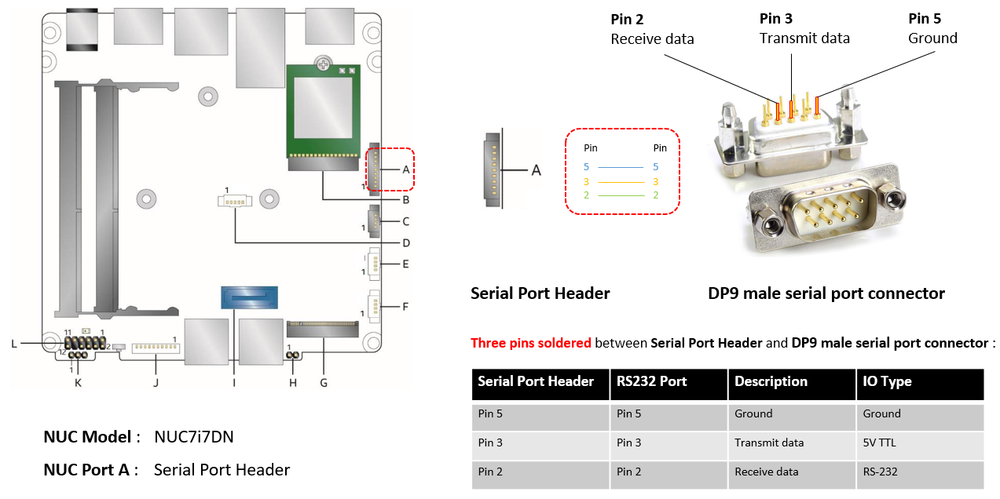

.. _rt_industry_setup:

Getting Started Guide for ACRN Industry Scenario
################################################

Verified version
****************

- Clear Linux version: **31670**
- ACRN-hypervisor tag: **v1.4**
- ACRN-Kernel(Service VM kernel): **4.19.78-98.iot-lts2018-sos**

Prerequisites
*************

The example below is based on the Intel Kaby Lake NUC platform with two
disks, a SATA disk for the Clear Linux-based Service VM and an NVMe disk
for the RTVM.

- Intel Kaby Lake (aka KBL) NUC platform with two disks inside
  (refer to :ref:`the tables <hardware_setup>` for detailed information).
- If you need to enable the serial port on KBL NUC, navigate to the
  :ref:`troubleshooting <connect_serial_port>` to prepare the cable.
- Follow below steps to install Clear Linux OS (Ver: 31670) onto both disks on the KBL NUC:

.. _Clear Linux OS Server image:
   https://download.clearlinux.org/releases/31670/clear/clear-31670-live-server.iso

  #. Create a bootable USB drive on Linux*:

     a. Download the `Clear Linux OS Server image`_.
     #. Plug in the USB drive.
     #. Use the ``lsblk`` command line to identify the USB drive:

        .. code-block:: console
           :emphasize-lines: 6,7

           $ lsblk | grep sd*
           sda         8:0    0 931.5G  0 disk
           ├─sda1      8:1    0   512M  0 part /boot/efi
           ├─sda2      8:2    0 930.1G  0 part /
           └─sda3      8:3    0   977M  0 part [SWAP]
           sdc         8:32   1  57.3G  0 disk
           └─sdc1      8:33   1  57.3G  0 part

     #. Unmount all the ``/dev/sdc`` partitions and burn the image onto the USB drive::

        $ umount /dev/sdc* 2>/dev/null
        $ sudo dd if=./clear-31670-live-server.iso of=/dev/sdc oflag=sync status=progress bs=4M

  #. Plug in the USB drive to the KBL NUC and boot from USB.
  #. Launch the Clear Linux OS installer boot menu.
  #. With Clear Linux OS highlighted, select :kbd:`Enter`.
  #. Log in with your root account and new password.
  #. Run the installer using the following command::

     # clr-installer

  #. From the Main menu, select :kbd:`Configure Installation Media` and set
     :kbd:`Destructive Installation` to your desired hard disk.
  #. Select :kbd:`Telemetry` to set Tab to highlight your choice.
  #. Press :kbd:`A` to show the :kbd:`Advanced` options.
  #. Select :kbd:`Select additional bundles` and add bundles for
     **network-basic**, and **user-basic**.
  #. Select :kbd:`Automatic OS Updates` and choose :kbd:`No [Disable]`.
  #. Select :kbd:`Manage User` and choose :kbd:`Add New User `.
  #. Select :kbd:`Install`.
  #. Select :kbd:`Confirm Install` in the :kbd:`Confirm Installation` window to start the installation.

.. _step-by-step instruction:
   https://docs.01.org/clearlinux/latest/get-started/bare-metal-install-server.html

.. note:: You may also refer to the `step-by-step instruction`_ for the detailed Clear Linux OS
   installation guide.

.. _hardware_setup:

Hardware Setup
==============

.. table:: Hardware Setup
   :widths: auto
   :name: Hardware Setup

   +----------------------+-------------------+----------------------+-----------------------------------------------------------+
   | Platform (Intel x86) | Product/kit name  | Hardware             | Descriptions                                              |
   +======================+===================+======================+===========================================================+
   | Kaby Lake            | NUC7i7DNH         | Processor            | - Intel |reg| Core |trade| i7-8650U CPU @ 1.90GHz         |
   |                      |                   +----------------------+-----------------------------------------------------------+
   |                      |                   | Graphics             | - UHD Graphics 620                                        |
   |                      |                   |                      | - Two HDMI 2.0a ports supporting 4K at 60 Hz              |
   |                      |                   +----------------------+-----------------------------------------------------------+
   |                      |                   | System memory        | - 8GiB SODIMM DDR4 2400 MHz [1]_                          |
   |                      |                   +----------------------+-----------------------------------------------------------+
   |                      |                   | Storage capabilities | - SATA: 1TB WDC WD10SPZX-22Z                              |
   |                      |                   |                      | - NVMe: 256G Intel Corporation SSD Pro 7600p/760p/E 6100p |
   +----------------------+-------------------+----------------------+-----------------------------------------------------------+

.. [1] The maximum supported memory size for ACRN is 16GB. If you are using
   32GB memory, follow the :ref:`config_32GB_memory` instruction to make
   a customized ACRN hypervisor that can support 32GB memory. For more
   detailed information about how to build ACRN
   from the source code, refer to this :ref:`guide <getting-started-building>`.

Set up the ACRN Hypervisor for industry scenario
************************************************

The ACRN industry scenario environment can be set up in several ways. The
two listed below are recommended:

- :ref:`Using the pre-installed industry ACRN hypervisor <use pre-installed industry efi>`
- :ref:`Using the ACRN industry out-of-the-box image <use industry ootb image>`

.. _use pre-installed industry efi:

Use the pre-installed industry ACRN hypervisor
==============================================

.. note:: Skip this section if you choose :ref:`Using the ACRN industry out-of-the-box image <use industry ootb image>`.

#. Boot Clear Linux from SATA disk.

#. Login as root and download ACRN quick setup script:

   .. code-block:: none

      # wget https://raw.githubusercontent.com/projectacrn/acrn-hypervisor/master/doc/getting-started/acrn_quick_setup.sh
      # chmod +x acrn_quick_setup.sh

#. Run the script to set up Service VM:

   .. code-block:: none

      # ./acrn_quick_setup.sh -s 31670 -d -i

   .. note:: ``-i`` option means the industry scenario efi image will be used, e.g.
      ``acrn.nuc7i7dnb.industry.efi``. For the detailed usage of the ``acrn_quick_setup.sh`` script, 
      move to this :ref:`quick setup ACRN guide <quick-setup-guide>` or just type ``./acrn_quick_setup.sh -h``. 

#. Use ``efibootmgr -v`` command to check the ACRN boot order:

   .. code-block:: none
      :emphasize-lines: 3,5

      BootCurrent: 000C
      Timeout: 1 seconds
      BootOrder: 0001,0002,000C,000D,0008,000E,000B,0003,0000,0004,0007
      Boot0000* Windows Boot Manager	VenHw(99e275e7-75a0-4b37-a2e6-c5385e6c00cb)WINDOWS.........x...B.C.D.O.B.J.E.C.T.=.{.9.d.e.a.8.6.2.c.-.5.c.d.d.-.4.e.7.0.-.a.c.c.1.-.f.3.2.b.3.4.4.d.4.7.9.5.}...o................
      Boot0001* ACRN	HD(1,GPT,c6715698-0f6e-4e27-bb1b-bf7779c1486d,0x800,0x47000)/File(\EFI\acrn\acrn.efi)u.a.r.t.=.d.i.s.a.b.l.e.d.
      Boot0002* Linux bootloader	HD(3,GPT,b537f16f-d70f-4f1b-83b4-0f11be83cd83,0xc1800,0xded3000)/File(\EFI\org.clearlinux\bootloaderx64.efi)
      Boot0003* CentOS	VenHw(99e275e7-75a0-4b37-a2e6-c5385e6c00cb)
      Boot0004* CentOS Linux	VenHw(99e275e7-75a0-4b37-a2e6-c5385e6c00cb)
      Boot0007* Linux bootloader	VenHw(99e275e7-75a0-4b37-a2e6-c5385e6c00cb)
      Boot0008* UEFI : Built-in EFI Shell	VenMedia(5023b95c-db26-429b-a648-bd47664c8012)..BO
      Boot000B* LAN : IBA CL Slot 00FE v0110	BBS(Network,,0x0)..BO
      Boot000C* SATA : PORT 0 : KINGSTON SUV500120G : PART 0 : Boot Drive	BBS(HD,,0x0)..BO
      Boot000D* INTEL SSDPEKKW256G8 : PART 0 : Boot Drive	BBS(HD,,0x0)..BO
      Boot000E* UEFI : INTEL SSDPEKKW256G8 : PART 0 : OS Bootloader	PciRoot(0x0)/Pci(0x1d,0x0)/Pci(0x0,0x0)/NVMe(0x1,00-00-00-00-00-00-00-00)/HD(1,GPT,8aa992f8-8149-4f6b-8b64-503998c776c1,0x800,0x47000)..BO

   .. note:: Ensure the ACRN is first in the boot order, or you may use ``efibootmgr -o 1`` command to move it
      to the first position.

   .. note:: If you need to enable the serial port, run the following command before reboot:

      ``efibootmgr -c -l '\EFI\acrn\acrn.efi' -d /dev/sda -p 1 -L ACRN -u "uart=port@0x3f8"``

#. Reboot KBL NUC.

#. Use ``dmesg`` command to ensure the Service VM boots:

   .. code-block:: console
      :emphasize-lines: 2

      # dmesg | grep ACRN
      [    0.000000] Hypervisor detected: ACRN
      [    1.252840] ACRNTrace: Initialized acrn trace module with 4 cpu
      [    1.253291] ACRN HVLog: Failed to init last hvlog devs, errno -19
      [    1.253292] ACRN HVLog: Initialized hvlog module with 4

.. _use industry ootb image:

Use the ACRN industry out-of-the-box image
==========================================

.. note:: If you are following the section above to set up the Service VM, jump to the next
   :ref:`section <install_rtvm>`.

#. Boot Clear Linux from NVMe disk.

#. Download the Service VM industry image::

   # wget https://github.com/projectacrn/acrn-hypervisor/releases/download/acrn-2019w47.1-140000p/sos-industry-31670.img.xz

#. Decompress the .xz image::

   # xz -d sos-industry-31670.img.xz

#. Burn the Service VM image onto the SATA disk::

   # dd if=sos-industry-31670.img of=/dev/sda bs=4M oflag=sync status=progress

#. Configure the EFI firmware to boot the ACRN hypervisor by default:
   
   ::

      # efibootmgr -c -l "\EFI\acrn\acrn.efi" -d /dev/sda -p 1 -L "ACRN" -u "uart=disabled"

   Or use the following command to enable the serial port:

   ::

      # efibootmgr -c -l "\EFI\acrn\acrn.efi" -d /dev/sda -p 1 -L "ACRN" -u "uart=port@0x3f8"

#. Reboot the test machine. After the Clear Linux OS boots,
   log in as “root” for the first time.

.. _install_rtvm:

Install and launch the Preempt-RT VM
************************************

#. Log in Service VM as root privileges.

#. Download the Preempt-RT VM image::

   # wget https://github.com/projectacrn/acrn-hypervisor/releases/download/acrn-2019w47.1-140000p/preempt-rt-31670.img.xz

#. Decompress the xz image::

   # xz -d preempt-rt-31670.img.xz

#. Burn the Preempt-RT VM image onto the NVMe disk::

   # dd if=preempt-rt-31670.img of=/dev/nvme0n1 bs=4M oflag=sync status=progress

#. Use the ``lspci`` command to ensure that the correct NVMe device IDs will
   be used for the passthru before launching the script:

   .. code-block:: none
      :emphasize-lines: 5

      # lspci -v | grep -iE 'nvm|ssd'
      02:00.0 Non-Volatile memory controller: Intel Corporation Device f1a6 (rev 03) (prog-if 02 [NVM Express])

      # lspci -nn | grep "Non-Volatile memory controller"
      02:00.0 Non-Volatile memory controller [0108]: Intel Corporation Device [8086:f1a6] (rev 03)

#. Modify the script to use the correct NVMe device IDs and bus number.

   .. code-block:: none
      :emphasize-lines: 6,11

      # vim /usr/share/acrn/samples/nuc/launch_hard_rt_vm.sh

      passthru_vpid=(
      ["eth"]="8086 156f"
      ["sata"]="8086 9d03"
      ["nvme"]="8086 f1a6"
      )
      passthru_bdf=(
      ["eth"]="0000:00:1f.6"
      ["sata"]="0000:00:17.0"
      ["nvme"]="0000:02:00.0"
      )

   .. code-block:: none
      :emphasize-lines: 6

      /usr/bin/acrn-dm -A -m $mem_size -s 0:0,hostbridge \
         --lapic_pt \
         --rtvm \
         --virtio_poll 1000000 \
         -U 495ae2e5-2603-4d64-af76-d4bc5a8ec0e5 \
         -s 2,passthru,02/00/0 \
         -s 3,virtio-console,@stdio:stdio_port \
         -s 8,virtio-net,tap0 \
         $pm_channel $pm_by_vuart \
         --ovmf /usr/share/acrn/bios/OVMF.fd \
         hard_rtvm
      
      }

#. Upon deployment completion, launch the RTVM directly on your KBL NUC::

   # /usr/share/acrn/samples/nuc/launch_hard_rt_vm.sh

RT Performance Test
*******************

.. _cyclictest:

Cyclictest introduction
=======================

The cyclictest is most commonly used for benchmarking RT systems. It is one of the
most frequently used tools for evaluating the relative performance of real-time
systems. Cyclictest accurately and repeatedly measures the difference between a
thread's intended wake-up time and the time at which it actually wakes up in order
to provide statistics about the system's latencies. It can measure latencies in
real-time systems that are caused by hardware, firmware, and the operating system.
The cyclictest is currently maintained by Linux Foundation and is part of the test
suite rt-tests.

Pre-Configurations
==================

Firmware update on the NUC
--------------------------

If you need to update to the latest UEFI firmware for the NUC hardware.
Follow these `BIOS Update Instructions
<https://www.intel.com/content/www/us/en/support/articles/000005636.html>`__
for downloading and flashing an updated BIOS for the NUC.

Recommended BIOS settings
-------------------------

.. csv-table::
   :widths: 15, 30, 10

   "Hyper-Threading", "Intel Advanced Menu -> CPU Configuration", "Disabled"
   "Intel VMX", "Intel Advanced Menu -> CPU Configuration", "Enable"
   "Speed Step", "Intel Advanced Menu -> Power & Performance -> CPU - Power Management Control", "Disabled"
   "Speed Shift", "Intel Advanced Menu -> Power & Performance -> CPU - Power Management Control", "Disabled"
   "C States", "Intel Advanced Menu -> Power & Performance -> CPU - Power Management Control", "Disabled"
   "RC6", "Intel Advanced Menu -> Power & Performance -> GT - Power Management", "Disabled"
   "GT freq", "Intel Advanced Menu -> Power & Performance -> GT - Power Management", "Lowest"
   "SA GV", "Intel Advanced Menu -> Memory Configuration", "Fixed High"
   "VT-d", "Intel Advanced Menu -> System Agent Configuration", "Enable"
   "Gfx Low Power Mode", "Intel Advanced Menu -> System Agent Configuration -> Graphics Configuration", "Disabled"
   "DMI spine clock gating", "Intel Advanced Menu -> System Agent Configuration -> DMI/OPI Configuration", "Disabled"
   "PCH Cross Throttling", "Intel Advanced Menu -> PCH-IO Configuration", "Disabled"
   "Legacy IO Low Latency", "Intel Advanced Menu -> PCH-IO Configuration -> PCI Express Configuration", "Enabled"
   "PCI Express Clock Gating", "Intel Advanced Menu -> PCH-IO Configuration -> PCI Express Configuration", "Disabled"
   "Delay Enable DMI ASPM", "Intel Advanced Menu -> PCH-IO Configuration -> PCI Express Configuration", "Disabled"
   "DMI Link ASPM", "Intel Advanced Menu -> PCH-IO Configuration -> PCI Express Configuration", "Disabled"
   "Aggressive LPM Support", "Intel Advanced Menu -> PCH-IO Configuration -> SATA And RST Configuration", "Disabled"
   "USB Periodic Smi", "Intel Advanced Menu -> LEGACY USB Configuration", "Disabled"
   "ACPI S3 Support", "Intel Advanced Menu -> ACPI Settings", "Disabled"
   "Native ASPM", "Intel Advanced Menu -> ACPI Settings", "Disabled"

.. note:: The BIOS settings depend on the platform and BIOS version; some may not be applicable.

Configure CAT
-------------

.. _Apollo Lake NUC:
   https://www.intel.com/content/www/us/en/products/boards-kits/nuc/kits/nuc6cayh.html

.. note:: CAT configuration is only supported on `Apollo Lake NUC`_.

With the ACRN Hypervisor shell, we can use ``cpuid`` and ``wrmsr``/``rdmsr`` debug
commands to enumerate the CAT capability and set the CAT configuration without rebuilding binaries.
Because ``lapic`` is a pass-through to the RTVM, the CAT configuration must be
set before launching the RTVM.

Check CAT ability with cupid
````````````````````````````

First run ``cpuid 0x10 0x0``. The return value of ``ebx[bit 2]`` reports that the L2 CAT is supported.
Next, run ``cpuid 0x10 0x2`` to query the L2 CAT capability; the return value of ``eax[bit 4:0]``
reports that the cache mask has 8 bits, and ``edx[bit 15:0]`` reports that 04 CLOS are supported,
as shown below. The reported data is in the format of ``[ eax:ebx:ecx:edx ]``::

   ACRN:\>cpuid 0x10 0x0
   cpuid leaf: 0x10, subleaf: 0x0, 0x0:0x4:0x0:0x0

   ACRN:\>cpuid 0x10 0x2
   cpuid leaf: 0x10, subleaf: 0x2, 0x7:0x0:0x0:0x3

Set CLOS (QOS MASK) and PQR_ASSOC MSRs to configure the CAT
```````````````````````````````````````````````````````````

Apollo Lake doesn't have L3 cache and it supports L2 CAT. The CLOS MSRs are per L2 cache and starts from 0x00000D10. In the case of 4 CLOS MSRs, the address is as follows::

   MSR_IA32_L2_QOS_MASK_0    0x00000D10
   MSR_IA32_L2_QOS_MASK_1    0x00000D11
   MSR_IA32_L2_QOS_MASK_2    0x00000D12
   MSR_IA32_L2_QOS_MASK_3    0x00000D13

The PQR_ASSOC MSR is per CPU core; each core has its own PQR_ASSOC::

   MSR_IA32_PQR_ASSOC        0x00000C8F

To set the CAT, first set the CLOS MSRs. Next, set the PQR_ASSOC of each CPU
so that the CPU of the RTVM uses dedicated cache and other CPUs use other cache.
Taking a Quad Core Apollo Lake platform for example, CPU0 and CPU1 share L2 cache while CPU2 and CPU3 share the other L2 cache.

- If we allocate CPU2 and CPU3, no extra action is required.
- If we allocate only CPU1 to the RTVM, we need to set the CAT as follows.
  These commands actually set the CAT configuration for L2 cache shared by CPU0 and CPU1.

a. Set CLOS with ``wrmsr <reg_num> <value>``, we want VM1 to use the lower 6 ways of cache,
   so CLOS0 is set to 0xf0 for the upper 4 ways, and CLOS1 is set to 0x0f for the lower 4 ways::

      ACRN:\>wrmsr -p1 0xd10 0xf0
      ACRN:\>wrmsr -p1 0xd11 0x0f

#. Attach COS1 to PCPU1. Because MSR is IA32_PQR_ASSOC [bit 63:32], we’ll write
   0x100000000 to it to use CLOS1::

      ACRN:\>wrmsr -p0 0xc8f 0x000000000
      ACRN:\>wrmsr -p1 0xc8f 0x100000000

In addition to setting the CAT configuration via HV commands, we allow developers to add
the CAT configurations to the VM config and do the configure automatically at the
time of RTVM creation. Refer to the :ref:`configure_cat_vm` for details.

Set up the core allocation for the RTVM
---------------------------------------

In our recommended configuration, two cores are allocated to the RTVM:
core 0 for housekeeping and core 1 for RT tasks. In order to achieve
this, follow the below steps to allocate all housekeeping tasks to core 0:

#. Launch RTVM::

   # /usr/share/acrn/samples/nuc/launch_hard_rt_vm.sh

#. Log in RTVM as root and run the script as below:

   .. code-block:: bash
   
      #!/bin/bash
      # Copyright (C) 2019 Intel Corporation.
      # SPDX-License-Identifier: BSD-3-Clause
      # Move all IRQs to core 0.
      for i in `cat /proc/interrupts | grep '^ *[0-9]*[0-9]:' | awk {'print $1'} | sed 's/:$//' `;
      do
          echo setting $i to affine for core zero
          echo 1 > /proc/irq/$i/smp_affinity
      done
   
      # Move all rcu tasks to core 0.
      for i in `pgrep rcu`; do taskset -pc 0 $i; done
   
      # Change realtime attribute of all rcu tasks to SCHED_OTHER and priority 0
      for i in `pgrep rcu`; do chrt -v -o -p 0 $i; done
   
      # Change realtime attribute of all tasks on core 1 to SCHED_OTHER and priority 0
      for i in `pgrep /1`; do chrt -v -o -p 0 $i; done
   
      # Change realtime attribute of all tasks to SCHED_OTHER and priority 0
      for i in `ps -A -o pid`; do chrt -v -o -p 0 $i; done
   
      echo disabling timer migration
      echo 0 > /proc/sys/kernel/timer_migration

   .. note:: You can ignore the error messages during the script running.

Run cyclictest
==============

#. Refer to the :ref:`troubleshooting <enabling the network on RTVM>` to enable the
   network connection for RTVM.

#. Launch RTVM and log in as root.

#. Install ``cyclictest`` tool::

   # swupd bundle-add dev-utils

#. Use the following command to start cyclictest::

   # cyclictest -a 1 -p 80 -m -N -D 1h -q -H 30000 --histfile=test.log
 
   Parameter descriptions:

    :-a 1:                           to bind the RT task to core 1
    :-p 80:                          to set the priority of the highest prio thread
    :-m:                             lock current and future memory allocations
    :-N:                             print results in ns instead of us (default us)
    :-D 1h:                          to run for 1 hour, you can change it to other values
    :-q:                             quiee mode; print a summary only on exit
    :-H 30000 --histfile=test.log:   dump the latency histogram to a local file

Troubleshooting
***************

.. _connect_serial_port:

Use serial port on KBL NUC
==========================

You can enable the serial console on the
`KBL NUC <https://www.amazon.com/Intel-Business-Mini-Technology-BLKNUC7i7DNH1E/dp/B07CCQ8V4R>`_
(NUC7i7DNH). The KBL NUC has a serial port header you can
expose with a serial DB9 header cable. You can build this cable yourself;
refer to the `KBL NUC product specification
<https://www.intel.com/content/dam/support/us/en/documents/mini-pcs/nuc-kits/NUC7i7DN_TechProdSpec.pdf>`_
as shown below:



   KBL serial port header details


.. figure:: images/KBL-serial-port-header-to-RS232-cable.jpg
   :scale: 80

   KBL `serial port header to RS232 cable
   <https://www.amazon.com/dp/B07BV1W6N8/ref=cm_sw_r_cp_ep_dp_wYm0BbABD5AK6>`_


Or you can `purchase
<https://www.amazon.com/dp/B07BV1W6N8/ref=cm_sw_r_cp_ep_dp_wYm0BbABD5AK6>`_
such a cable.

You'll also need an `RS232 DB9 female to USB cable
<https://www.amazon.com/Adapter-Chipset-CableCreation-Converter-Register/dp/B0769DVQM1>`_,
or an `RS232 DB9 female/female (NULL modem) cross-over cable
<https://www.amazon.com/SF-Cable-Null-Modem-RS232/dp/B006W0I3BA>`_
to connect to your host system.

Note that If you want to use the RS232 DB9 female/female cable, choose the ``cross-over``
type rather than ``straight-through`` type.

.. _efi image not exist:

EFI image doesn't exist
=======================

You might see the error message if you are running the ``acrn_quick_setup.sh`` script
on an older Clear Linux OS ( < 31470 ):

.. code-block:: console

   /usr/lib/acrn/acrn.nuc7i7dnb.industry.efi doesn't exist.
   Use one of these efi images from /usr/lib/acrn.
   ------
   /usr/lib/acrn/acrn.kbl-nuc-i7.industry.efi
   ------
   Copy the efi image to /usr/lib/acrn/acrn.nuc7i7dnb.industry.efi, then run the script again.

To fix it, just rename the existing efi image to ``/usr/lib/acrn/acrn.nuc7i7dnb.industry.efi`` and
then run the script again::

   # cp -r /usr/lib/acrn/acrn.kbl-nuc-i7.industry.efi /usr/lib/acrn/acrn.nuc7i7dnb.industry.efi
   # ./acrn_quick_setup.sh -s <target version> -i -d

.. _enabling the network on RTVM:

Enabling the network on RTVM
============================

If you need to access the internet, you must add the following command line to the
``launch_hard_rt_vm.sh`` script before launch it:

.. code-block:: none
   :emphasize-lines: 8

   /usr/bin/acrn-dm -A -m $mem_size -s 0:0,hostbridge \
      --lapic_pt \
      --rtvm \
      --virtio_poll 1000000 \
      -U 495ae2e5-2603-4d64-af76-d4bc5a8ec0e5 \
      -s 2,passthru,02/0/0 \
      -s 3,virtio-console,@stdio:stdio_port \
      -s 8,virtio-net,tap0 \
      $pm_channel $pm_by_vuart \
      --ovmf /usr/share/acrn/bios/OVMF.fd \
      hard_rtvm
   }

