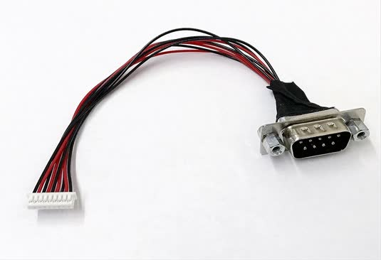

.. _rt_industry_setup:

Getting Started Guide for ACRN Industry Scenario
################################################

Verified version
****************

- Clear Linux version: **32680**
- ACRN-hypervisor tag: **v1.6 (acrn-2020w12.5-140000p)**
- ACRN-Kernel (Service VM kernel): **4.19.97-104.iot-lts2018-sos**

Prerequisites
*************

The example below is based on the Intel Whiskey Lake NUC platform with two
disks, an NVMe disk for the Clear Linux-based Service VM and a SATA disk
for the RTVM.

- Intel Whiskey Lake (aka WHL) NUC platform with two disks inside
  (refer to :ref:`the tables <hardware_setup>` for detailed information).
- `com1` is the serial port on WHL NUC.
  If you are still using the KBL NUC and trying to enable the serial port on it, navigate to the
  :ref:`troubleshooting section <connect_serial_port>` that discusses how to prepare the cable.
- Follow the steps below to install Clear Linux OS (ver: 32680) onto the NVMe disk of the WHL NUC.

.. _Clear Linux OS Server image:
   https://download.clearlinux.org/releases/32680/clear/clear-32680-live-server.iso

  #. Create a bootable USB drive on Linux*:

     a. Download the `Clear Linux OS Server image`_.
     #. Plug in the USB drive.
     #. Use the ``lsblk`` command line to identify the USB drive:

        .. code-block:: console
           :emphasize-lines: 6,7

           $ lsblk | grep sd*
           sda         8:0    0 931.5G  0 disk
           ├─sda1      8:1    0   512M  0 part /boot/efi
           ├─sda2      8:2    0 930.1G  0 part /
           └─sda3      8:3    0   977M  0 part [SWAP]
           sdc         8:32   1  57.3G  0 disk
           └─sdc1      8:33   1  57.3G  0 part

     #. Unmount all the ``/dev/sdc`` partitions and burn the image onto the USB drive::

        $ umount /dev/sdc* 2>/dev/null
        $ sudo dd if=./clear-32680-live-server.iso of=/dev/sdc oflag=sync status=progress bs=4M

  #. Plug in the USB drive to the WHL NUC and boot from USB.
  #. Launch the Clear Linux OS installer boot menu.
  #. With Clear Linux OS highlighted, select :kbd:`Enter`.
  #. Log in with your root account and new password.
  #. Run the installer using the following command::

     # clr-installer

  #. From the Main menu, select :kbd:`Configure Installation Media` and set
     :kbd:`Destructive Installation` to the NVMe disk.
  #. Select :kbd:`Manage User` and choose :kbd:`Add New User`.
  #. Select :kbd:`Telemetry` to set Tab to highlight your choice.
  #. Press :kbd:`A` to show the :kbd:`Advanced` options.
  #. Select :kbd:`Select additional bundles` and add bundles for
     **network-basic**, and **user-basic**.
  #. Select :kbd:`Automatic OS Updates` and choose :kbd:`No [Disable]`.
  #. Select :kbd:`Install`.
  #. Select :kbd:`Confirm Install` in the :kbd:`Confirm Installation` window to start the installation.

.. _step-by-step instructions:
   https://docs.01.org/clearlinux/latest/get-started/bare-metal-install-server.html

.. note:: Refer to these `step-by-step instructions`_ from the Clear Linux OS installation guide.

.. _hardware_setup:

Hardware Setup
==============

.. table:: Hardware Setup
   :widths: auto
   :name: Hardware Setup

   +----------------------+-------------------+----------------------+-----------------------------------------------------------+
   | Platform (Intel x86) | Product/kit name  | Hardware             | Descriptions                                              |
   +======================+===================+======================+===========================================================+
   | Whiskey Lake         | WHL-IPC-I7        | Processor            | - Intel |reg| Core |trade| i7-8565U CPU @ 1.80GHz         |
   |                      |                   +----------------------+-----------------------------------------------------------+
   |                      |                   | Graphics             | - UHD Graphics 620                                        |
   |                      |                   |                      | - ONE HDMI\* 1.4a ports supporting 4K at 60 Hz            |
   |                      |                   +----------------------+-----------------------------------------------------------+
   |                      |                   | System memory        | - 8GiB SODIMM DDR4 2400 MHz [1]_                          |
   |                      |                   +----------------------+-----------------------------------------------------------+
   |                      |                   | Storage capabilities | - SATA: 128G KINGSTON RBUSNS8                             |
   |                      |                   |                      | - NVMe: 256G Intel Corporation SSD Pro 7600p/760p/E 6100p |
   +----------------------+-------------------+----------------------+-----------------------------------------------------------+

.. [1] The maximum supported memory size for ACRN is 16GB. If you are using
   32GB memory, follow the :ref:`config_32GB_memory` instructions to make
   a customized ACRN hypervisor that can support 32GB memory. For more
   detailed information about how to build ACRN
   from the source code, refer to this :ref:`guide <getting-started-building>`.

Set up the ACRN Hypervisor for industry scenario
************************************************

The ACRN industry scenario environment can be set up in several ways. The
two listed below are recommended:

- :ref:`Using the pre-installed industry ACRN hypervisor <use pre-installed industry efi>`
- :ref:`Using the ACRN industry out-of-the-box image <use industry ootb image>`

.. _use pre-installed industry efi:

Use the pre-installed industry ACRN hypervisor
==============================================

.. note:: Skip this section if you choose :ref:`Using the ACRN industry out-of-the-box image <use industry ootb image>`.

#. Boot Clear Linux from NVMe disk.

#. Log in and download ACRN quick setup script:

   .. code-block:: none

      $ wget https://raw.githubusercontent.com/projectacrn/acrn-hypervisor/master/doc/getting-started/acrn_quick_setup.sh
      $ sudo chmod +x acrn_quick_setup.sh

#. Run the script to set up Service VM:

   .. code-block:: none

      $ sudo ./acrn_quick_setup.sh -s 32680 -d -e /dev/nvme0n1p1 -i

   .. note:: ``-i`` option means the industry scenario efi image will be used, e.g. ``acrn.nuc7i7dnb.industry.efi``.
      For the detailed usage of the ``acrn_quick_setup.sh`` script, refer to the :ref:`quick setup ACRN guide <quick-setup-guide>`
      or simply type ``./acrn_quick_setup.sh -h``.

#. Use ``efibootmgr -v`` command to check the ACRN boot order:

   .. code-block:: none
      :emphasize-lines: 3,4

      BootCurrent: 0005
      Timeout: 1 seconds
      BootOrder: 0000,0003,0005,0001,0004
      Boot0000* ACRN  HD(1,GPT,cb72266b-c83d-4c56-99e3-3e7d2f4bc175,0x800,0x47000)/File(\EFI\acrn\acrn.efi)u.a.r.t.=.d.i.s.a.b.l.e.d.
      Boot0001* UEFI OS       HD(1,GPT,335d53f0-50c1-4b0a-b58e-3393dc0389a4,0x800,0x47000)/File(\EFI\BOOT\BOOTX64.EFI)..BO
      Boot0003* Linux bootloader      HD(3,GPT,af681d62-3a96-43fb-92fc-e98e850f867f,0xc1800,0x1dc31800)/File(\EFI\org.clearlinux\bootloaderx64.efi)
      Boot0004* Hard Drive    BBS(HD,,0x0)..GO..NO........o.K.I.N.G.S.T.O.N. .R.B.U.S.N.S.8.1.8.0.S.3.1.2.8.G.J...................A..........................>..Gd-.;.A..MQ..L.0.5.2.0.B.6.6.7.2.8.F.F.3.D.1.0. . . . .......BO..NO........m.F.O.R.E.S.E.E. .2.5.6.G.B. .S.S.D...................A......................................0..Gd-.;.A..MQ..L.J.2.7.1.0.0.R.0.0.0.9.6.9.......BO
      Boot0005* UEFI OS       HD(1,GPT,cb72266b-c83d-4c56-99e3-3e7d2f4bc175,0x800,0x47000)/File(\EFI\BOOT\BOOTX64.EFI)..BO

   .. note:: Ensure that ACRN is first in the boot order, or you may use the
      ``efibootmgr -o 1`` command to move it to the first position. If you need to enable the serial port, run the following command before rebooting:

      ``efibootmgr -c -l '\EFI\acrn\acrn.efi' -d /dev/nvme0n1 -p 1 -L ACRN -u "uart=port@0x3f8 "``

      Note the extra space at the end of the EFI command-line options
      string. This is a workaround for a current `efi-stub bootloader name
      issue <https://github.com/projectacrn/acrn-hypervisor/issues/4520>`_.
      It ensures that the end of the string is properly detected.

#. Reboot WHL NUC.

#. Use the ``dmesg`` command to ensure that the Service VM boots:

   .. code-block:: console
      :emphasize-lines: 2

      $ sudo dmesg | grep ACRN
      [    0.000000] Hypervisor detected: ACRN
      [    1.252840] ACRNTrace: Initialized acrn trace module with 4 cpu
      [    1.253291] ACRN HVLog: Failed to init last hvlog devs, errno -19
      [    1.253292] ACRN HVLog: Initialized hvlog module with 4

.. note:: If you want to log in to the Service VM with root privileges, use ``sudo passwd`` to create a root user
   so that you can log in as root on the next reboot.

.. _use industry ootb image:

Use the ACRN industry out-of-the-box image
==========================================

.. note:: If you are following the section above to set up the Service VM, jump to the next
   :ref:`section <install_rtvm>`.

#. Boot Clear Linux from SATA disk.

#. Download the Service VM industry image:

   .. code-block:: none

      # wget https://github.com/projectacrn/acrn-hypervisor/releases/download/acrn-2020w12.5-140000p/sos-industry-32680.img.xz

   .. note:: You may also follow :ref:`set_up_ootb_service_vm` to build the image by yourself.

#. Decompress the .xz image::

   # xz -d sos-industry-32680.img.xz

#. Burn the Service VM image onto the NVMe disk::

   # dd if=sos-industry-32680.img of=/dev/nvme0n1 bs=4M oflag=sync status=progress iflag=fullblock seek=0 conv=notrunc

#. Configure the EFI firmware to boot the ACRN hypervisor by default:

   ::

      # efibootmgr -c -l "\EFI\acrn\acrn.efi" -d /dev/nvme0n1 -p 1 -L "ACRN" -u "uart=disabled "

   Or use the following command to enable the serial port:

   ::

      # efibootmgr -c -l "\EFI\acrn\acrn.efi" -d /dev/nvme0n1 -p 1 -L "ACRN" -u "uart=port@0x3f8 "

   .. note:: Note the extra space at the end of the EFI command-line options
      strings above. This is a workaround for a current `efi-stub bootloader
      name issue <https://github.com/projectacrn/acrn-hypervisor/issues/4520>`_.
      It ensures that the end of the string is properly detected.

#. Reboot the test machine. After the Clear Linux OS boots,
   log in as ``root`` for the first time.

.. _install_rtvm:

Install and launch the Preempt-RT VM
************************************

In this section, we will use :ref:`virtio-blk` to launch the Preempt-RT VM.
If you need better performance, follow :ref:`building-acrn-in-docker` to
build the ACRN kernel for the Service VM, and then :ref:`passthrough the SATA disk <passthru rtvm>` to launch the Preempt-RT VM.

#. Log in to the Service VM with root privileges.

#. Download the Preempt-RT VM image:

   .. code-block:: none

      # wget https://github.com/projectacrn/acrn-hypervisor/releases/download/acrn-2020w12.5-140000p/preempt-rt-32680.img.xz

   .. note:: You may also follow :ref:`set_up_ootb_rtvm` to build the Preempt-RT VM image by yourself.

#. Decompress the xz image::

   # xz -d preempt-rt-32680.img.xz

#. Burn the Preempt-RT VM image onto the SATA disk::

   # dd if=preempt-rt-32680.img of=/dev/sda bs=4M oflag=sync status=progress iflag=fullblock seek=0 conv=notrunc

#. Modify the script to use the virtio device.

   .. code-block:: none

      # NVME pass-through
      #echo ${passthru_vpid["nvme"]} > /sys/bus/pci/drivers/pci-stub/new_id
      #echo ${passthru_bdf["nvme"]} > /sys/bus/pci/devices/${passthru_bdf["nvme"]}/driver/unbind
      #echo ${passthru_bdf["nvme"]} > /sys/bus/pci/drivers/pci-stub/bind

   .. code-block:: none
      :emphasize-lines: 6

      /usr/bin/acrn-dm -A -m $mem_size -s 0:0,hostbridge \
         --lapic_pt \
         --rtvm \
         --virtio_poll 1000000 \
         -U 495ae2e5-2603-4d64-af76-d4bc5a8ec0e5 \
         -s 2,virtio-blk,/dev/sda \
         -s 3,virtio-console,@stdio:stdio_port \
         $pm_channel $pm_by_vuart \
         --ovmf /usr/share/acrn/bios/OVMF.fd \
         hard_rtvm

      }

#. Upon deployment completion, launch the RTVM directly onto your WHL NUC::

   # /usr/share/acrn/samples/nuc/launch_hard_rt_vm.sh

RT Performance Test
*******************

.. _cyclictest:

Cyclictest introduction
=======================

The cyclictest is most commonly used for benchmarking RT systems. It is
one of the most frequently used tools for evaluating the relative
performance of real-time systems. Cyclictest accurately and repeatedly
measures the difference between a thread's intended wake-up time and the
time at which it actually wakes up in order to provide statistics about
the system's latencies. It can measure latencies in real-time systems
that are caused by hardware, firmware, and the operating system. The
cyclictest is currently maintained by Linux Foundation and is part of
the test suite rt-tests.

Pre-Configurations
==================

Firmware update on the NUC
--------------------------

If you need to update to the latest UEFI firmware for the NUC hardware.
Follow these `BIOS Update Instructions
<https://www.intel.com/content/www/us/en/support/articles/000005636.html>`__
for downloading and flashing an updated BIOS for the NUC.

Recommended BIOS settings
-------------------------

.. csv-table::
   :widths: 15, 30, 10

   "Hyper-Threading", "Intel Advanced Menu -> CPU Configuration", "Disabled"
   "Intel VMX", "Intel Advanced Menu -> CPU Configuration", "Enable"
   "Speed Step", "Intel Advanced Menu -> Power & Performance -> CPU - Power Management Control", "Disabled"
   "Speed Shift", "Intel Advanced Menu -> Power & Performance -> CPU - Power Management Control", "Disabled"
   "C States", "Intel Advanced Menu -> Power & Performance -> CPU - Power Management Control", "Disabled"
   "RC6", "Intel Advanced Menu -> Power & Performance -> GT - Power Management", "Disabled"
   "GT freq", "Intel Advanced Menu -> Power & Performance -> GT - Power Management", "Lowest"
   "SA GV", "Intel Advanced Menu -> Memory Configuration", "Fixed High"
   "VT-d", "Intel Advanced Menu -> System Agent Configuration", "Enable"
   "Gfx Low Power Mode", "Intel Advanced Menu -> System Agent Configuration -> Graphics Configuration", "Disabled"
   "DMI spine clock gating", "Intel Advanced Menu -> System Agent Configuration -> DMI/OPI Configuration", "Disabled"
   "PCH Cross Throttling", "Intel Advanced Menu -> PCH-IO Configuration", "Disabled"
   "Legacy IO Low Latency", "Intel Advanced Menu -> PCH-IO Configuration -> PCI Express Configuration", "Enabled"
   "PCI Express Clock Gating", "Intel Advanced Menu -> PCH-IO Configuration -> PCI Express Configuration", "Disabled"
   "Delay Enable DMI ASPM", "Intel Advanced Menu -> PCH-IO Configuration -> PCI Express Configuration", "Disabled"
   "DMI Link ASPM", "Intel Advanced Menu -> PCH-IO Configuration -> PCI Express Configuration", "Disabled"
   "Aggressive LPM Support", "Intel Advanced Menu -> PCH-IO Configuration -> SATA And RST Configuration", "Disabled"
   "USB Periodic Smi", "Intel Advanced Menu -> LEGACY USB Configuration", "Disabled"
   "ACPI S3 Support", "Intel Advanced Menu -> ACPI Settings", "Disabled"
   "Native ASPM", "Intel Advanced Menu -> ACPI Settings", "Disabled"

.. note:: BIOS settings depend on the platform and BIOS version; some may not be applicable.

Configure RDT
-------------

In addition to setting the CAT configuration via HV commands, we allow
developers to add CAT configurations to the VM config and configure
automatically at the time of RTVM creation. Refer to :ref:`rdt_configuration`
for details on RDT configuration and :ref:`hv_rdt` for details on RDT
high-level design.

Set up the core allocation for the RTVM
---------------------------------------

In our recommended configuration, two cores are allocated to the RTVM:
core 0 for housekeeping and core 1 for RT tasks. In order to achieve
this, follow the below steps to allocate all housekeeping tasks to core 0:

#. Launch RTVM::

   # /usr/share/acrn/samples/nuc/launch_hard_rt_vm.sh

#. Log in to RTVM as root and run the script as below:

   .. code-block:: bash

      #!/bin/bash
      # Copyright (C) 2019 Intel Corporation.
      # SPDX-License-Identifier: BSD-3-Clause
      # Move all IRQs to core 0.
      for i in `cat /proc/interrupts | grep '^ *[0-9]*[0-9]:' | awk {'print $1'} | sed 's/:$//' `;
      do
          echo setting $i to affine for core zero
          echo 1 > /proc/irq/$i/smp_affinity
      done

      # Move all rcu tasks to core 0.
      for i in `pgrep rcu`; do taskset -pc 0 $i; done

      # Change realtime attribute of all rcu tasks to SCHED_OTHER and priority 0
      for i in `pgrep rcu`; do chrt -v -o -p 0 $i; done

      # Change realtime attribute of all tasks on core 1 to SCHED_OTHER and priority 0
      for i in `pgrep /1`; do chrt -v -o -p 0 $i; done

      # Change realtime attribute of all tasks to SCHED_OTHER and priority 0
      for i in `ps -A -o pid`; do chrt -v -o -p 0 $i; done

      echo disabling timer migration
      echo 0 > /proc/sys/kernel/timer_migration

   .. note:: You can ignore the error messages during the script running.

Run cyclictest
==============

#. Refer to the :ref:`troubleshooting section <enabling the network on RTVM>` below that discusses how to enable the network connection for RTVM.

#. Launch RTVM and log in as root.

#. Install the ``cyclictest`` tool::

   # swupd bundle-add dev-utils

#. Use the following command to start cyclictest::

   # cyclictest -a 1 -p 80 -m -N -D 1h -q -H 30000 --histfile=test.log

   Parameter descriptions:

    :-a 1:                           to bind the RT task to core 1
    :-p 80:                          to set the priority of the highest prio thread
    :-m:                             lock current and future memory allocations
    :-N:                             print results in ns instead of us (default us)
    :-D 1h:                          to run for 1 hour, you can change it to other values
    :-q:                             quiee mode; print a summary only on exit
    :-H 30000 --histfile=test.log:   dump the latency histogram to a local file

Troubleshooting
***************

.. _connect_serial_port:

Use serial port on KBL NUC
==========================

You can enable the serial console on the
`KBL NUC <https://www.amazon.com/Intel-Business-Mini-Technology-BLKNUC7i7DNH1E/dp/B07CCQ8V4R>`_
(NUC7i7DNH). The KBL NUC has a serial port header you can
expose with a serial DB9 header cable. You can build this cable yourself;
refer to the `KBL NUC product specification
<https://www.intel.com/content/dam/support/us/en/documents/mini-pcs/nuc-kits/NUC7i7DN_TechProdSpec.pdf>`_
as shown below:

.. figure:: images/KBL-serial-port-header.png
   :scale: 80

   KBL serial port header details

   KBL `serial port header to RS232 cable
   <https://www.amazon.com/dp/B07BV1W6N8/ref=cm_sw_r_cp_ep_dp_wYm0BbABD5AK6>`_

Or you can `purchase
<https://www.amazon.com/dp/B07BV1W6N8/ref=cm_sw_r_cp_ep_dp_wYm0BbABD5AK6>`_
such a cable.

You'll also need an `RS232 DB9 female to USB cable
<https://www.amazon.com/Adapter-Chipset-CableCreation-Converter-Register/dp/B0769DVQM1>`_,
or an `RS232 DB9 female/female (NULL modem) cross-over cable
<https://www.amazon.com/SF-Cable-Null-Modem-RS232/dp/B006W0I3BA>`_
to connect to your host system.

Note that If you want to use the RS232 DB9 female/female cable, choose the ``cross-over``
type rather than ``straight-through`` type.

.. _efi image not exist:

EFI image doesn't exist
=======================

You might see the error message if you are running the ``acrn_quick_setup.sh`` script
on an older Clear Linux OS ( < 31470 ):

.. code-block:: console

   /usr/lib/acrn/acrn.wl10.industry.efi doesn't exist.
   Use one of these efi images from /usr/lib/acrn.
   ------
   /usr/lib/acrn/acrn.nuc7i7dnb.industry.efi
   ------
   Copy the efi image to /usr/lib/acrn/acrn.wl10.industry.efi, then run the script again.

To fix it, just rename the existing efi image to ``/usr/lib/acrn/acrn.wl10.industry.efi`` and
then run the script again::

   $ sudo cp /usr/lib/acrn/acrn.nuc7i7dnb.industry.efi /usr/lib/acrn/acrn.wl10.industry.efi
   $ sudo ./acrn_quick_setup.sh -s <target OS version> -d -e <target EFI partition> -i

.. _enabling the network on RTVM:

Enabling the network on RTVM
============================

If you need to access the internet, you must add the following command line to the
``launch_hard_rt_vm.sh`` script before launch it:

.. code-block:: none
   :emphasize-lines: 8

   /usr/bin/acrn-dm -A -m $mem_size -s 0:0,hostbridge \
      --lapic_pt \
      --rtvm \
      --virtio_poll 1000000 \
      -U 495ae2e5-2603-4d64-af76-d4bc5a8ec0e5 \
      -s 2,passthru,02/0/0 \
      -s 3,virtio-console,@stdio:stdio_port \
      -s 8,virtio-net,tap0 \
      $pm_channel $pm_by_vuart \
      --ovmf /usr/share/acrn/bios/OVMF.fd \
      hard_rtvm
   }

.. _passthru rtvm:

Passthrough a hard disk to the RTVM
===================================

#. Use the ``lspci`` command to ensure that the correct SATA device IDs will
   be used for the passthrough before launching the script:

   .. code-block:: none

      # lspci -nn | grep -i sata
      00:17.0 SATA controller [0106]: Intel Corporation Cannon Point-LP SATA Controller [AHCI Mode] [8086:9dd3] (rev 30)

#. Modify the script to use the correct SATA device IDs and bus number:

   .. code-block:: none
      :emphasize-lines: 5, 10

      # vim /usr/share/acrn/samples/nuc/launch_hard_rt_vm.sh

      passthru_vpid=(
      ["eth"]="8086 156f"
      ["sata"]="8086 9d03"
      ["nvme"]="8086 f1a6"
      )
      passthru_bdf=(
      ["eth"]="0000:00:1f.6"
      ["sata"]="0000:00:17.0"
      ["nvme"]="0000:02:00.0"
      )

      # SATA pass-through
      echo ${passthru_vpid["sata"]} > /sys/bus/pci/drivers/pci-stub/new_id
      echo ${passthru_bdf["sata"]} > /sys/bus/pci/devices/${passthru_bdf["sata"]}/driver/unbind
      echo ${passthru_bdf["sata"]} > /sys/bus/pci/drivers/pci-stub/bind

      # NVME pass-through
      #echo ${passthru_vpid["nvme"]} > /sys/bus/pci/drivers/pci-stub/new_id
      #echo ${passthru_bdf["nvme"]} > /sys/bus/pci/devices/${passthru_bdf["nvme"]}/driver/unbind
      #echo ${passthru_bdf["nvme"]} > /sys/bus/pci/drivers/pci-stub/bind

   .. code-block:: none
      :emphasize-lines: 4

         --rtvm \
         --virtio_poll 1000000 \
         -U 495ae2e5-2603-4d64-af76-d4bc5a8ec0e5 \
         -s 2,passthru,00/17/0 \
         -s 3,virtio-console,@stdio:stdio_port \
         -s 8,virtio-net,tap0 \
         $pm_channel $pm_by_vuart \
         --ovmf /usr/share/acrn/bios/OVMF.fd \
         hard_rtvm

       }

#. Upon deployment completion, launch the RTVM directly onto your WHL NUC:

   .. code-block:: none

      # /usr/share/acrn/samples/nuc/launch_hard_rt_vm.sh
