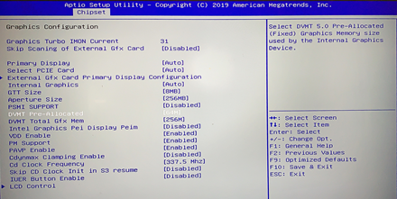
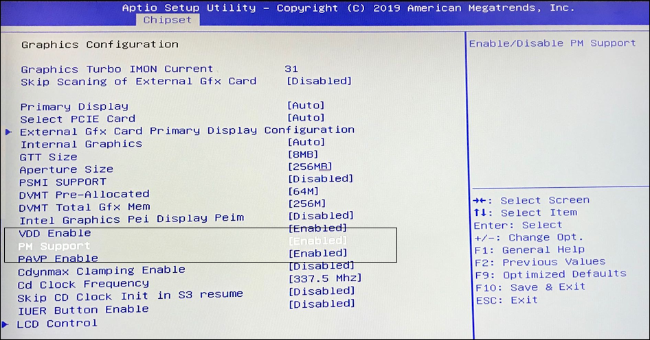

.. _rt_industry_ubuntu_setup:

Getting Started Guide for ACRN Industry Scenario with Ubuntu Service VM
#######################################################################

Verified version
****************

- Ubuntu version: **18.04**
- GCC version: **9.0**
- ACRN-hypervisor tag: **v1.6.1 (acrn-2020w18.4-140000p)**
- ACRN-Kernel (Service VM kernel): **4.19.120-108.iot-lts2018-sos**
- RT kernel for Ubuntu User OS:
- HW: Maxtang Intel WHL-U i7-8665U (`AX8665U-A2 <http://www.maxtangpc.com/fanlessembeddedcomputers/140.html>`_)

Prerequisites
*************

- VMX/VT-D are enabled and secure boot is disabled in the BIOS
- Ubuntu 18.04 boot-able USB disk
- Monitors with HDMI interface (DP interface is optional)
- USB keyboard and mouse
- Ethernet cables
- A grub-2.04-7 bootloader with the following patch:

  http://git.savannah.gnu.org/cgit/grub.git/commit/?id=0f3f5b7c13fa9b677a64cf11f20eca0f850a2b20: multiboot2: Set min address for mbi allocation to 0x1000

Install Ubuntu for the Service and User VMs
*******************************************

Hardware Connection
===================

Connect the WHL Maxtang with the appropriate external devices.

#. Connect the WHL Maxtang board to a monitor via an HDMI cable.
#. Connect the mouse, keyboard, ethernet cable, and power supply cable to
   the WHL Maxtang board.
#. Insert the Ubuntu 18.04 USB boot disk into the USB port.

   .. figure:: images/rt-ind-ubun-hw-1.png

   .. figure:: images/rt-ind-ubun-hw-2.png

Install the Ubuntu User VM (RTVM) on the SATA disk
==================================================

Install the Native Ubuntu OS on the SATA disk
---------------------------------------------

.. note:: The WHL Maxtang machine contains both an NVMe and SATA disk.

#. Insert the Ubuntu USB boot disk into the WHL Maxtang machine.
#. Power on the machine, then press F11 to select the USB disk as the boot
   device. Select **UEFI: SanDisk**. Note that the label depends on the brand/make of the USB stick.
#. Install the Ubuntu OS.
#. Select **Something else** to create the partition.

   .. figure:: images/native-ubuntu-on-SATA-1.png

#. Configure the ``/dev/sda`` partition. Refer to the diagram below:

   .. figure:: images/native-ubuntu-on-SATA-2.png

   a. Select the ``/dev/sda`` partition, not ``/dev/nvme0p1``.
   b. Select ``/dev/sda`` **ATA KINGSTON RBUSNS4** as the device for the
      boot loader installation. Note that the label depends on the on the SATA disk used.

#. Continue with the Ubuntu Service VM installation in ``/dev/sda``.

Install the Ubuntu Service VM on the NVMe disk
----------------------------------------------

.. note:: Before you install the Ubuntu Service VM on the NVMe disk, either
   remove the SATA disk or disable it in the BIOS. Disable it by going to:
   **Chipset** → **PCH-IO Configuration** -> **SATA and RST Configuration** -> **SATA Controller [Disabled]**

#. Insert the Ubuntu USB boot disk into the WHL Maxtang machine.
#. Power on the machine, then press F11 to select the USB disk as the boot
   device. Select **UEFI: SanDisk**. Note that the label depends on the brand/make of the USB stick.
#. Install the Ubuntu OS.
#. Select **Something else** to create the partition.

   .. figure:: images/native-ubuntu-on-NVME-1.png

#. Configure the ``/dev/nvme0n1`` partition. Refer to the diagram below:

   .. figure:: images/native-ubuntu-on-NVME-2.png

   a. Select the ``/dev/nvme0n1`` partition, not ``/dev/sda``.
   b. Select ``/dev/nvme0n1`` **FORESEE 256GB SSD** as the device for the
      boot loader installation. Note that the label depends on the on the NVMe disk used.

#. Complete the Ubuntu installation and reboot the system.

   .. note:: Set **acrn** as the username for the Ubuntu Service VM.

Build and Install ACRN on Ubuntu
********************************

Pre-Steps
=========

#. Set the network configuration, proxy, etc.
#. Update Ubuntu:

   .. code-block:: none

      $ sudo -E apt update

#. Create a work folder:

   .. code-block:: none

      $ mkdir /home/acrn/work

Build the ACRN Hypervisor on Ubuntu
===================================

#. Install the necessary libraries:

   .. code-block:: none

      $ sudo -E apt install gcc \
        git \
        make \
        gnu-efi \
        libssl-dev \
        libpciaccess-dev \
        uuid-dev \
        libsystemd-dev \
        libevent-dev \
        libxml2-dev \
        libusb-1.0-0-dev \
        python3 \
        python3-pip \
        libblkid-dev \
        e2fslibs-dev \
        pkg-config \
        zlib1g-dev \
        libnuma-dev \

        liblz4-tool

      $ pip3 install kconfiglib

#. Get the ACRN source code:

   .. code-block:: none

      $ cd /home/acrn/work
      $ git clone https://github.com/projectacrn/acrn-hypervisor
      $ cd acrn-hypvervisor

#. Switch to the v2.0 version:

   .. code-block:: none

      $ git checkout -b v2.0 remotes/origin/release_2.0

4. Apply CAT and other patches if necessary [optional].

5. Build ACRN:

   .. code-block:: none

      $ make all BOARD_FILE=misc/acrn-config/xmls/board-xmls/whl-ipc-i7.xml SCENARIO_FILE=misc/acrn-config/xmls/config-xmls/whl-ipc-i7/industry.xml RELEASE=0

      $ sudo make install

Enable network sharing for the User VM
======================================

.. code-block:: none

   $ sudo systemctl enable systemd-networkd
   $ sudo systemctl start systemd-networkd

Build and install the ACRN kernel
=================================

#. Build the Service VM kernel from opensource:

   .. code-block:: none

      $ cd /home/acrn/work/
      $ git clone https://github.com/projectacrn/acrn-kernel

#. Switch to the 5.4 kernel:

   .. code-block:: none

      $ git checkout -b v2.0 remotes/origin/release_2.0
      $ cp kernel_config_uefi_sos .config
      $ make oldconfig
      $ make all
      $ sudo make modules_install

Install the Service VM kernel and modules
=========================================

.. code-block:: none

   $ sudo cp -r ~/sos-kernel-build/usr/lib/modules/4.19.78-98.iot-lts2018-sos/ /lib/modules
   $ sudo mkdir /boot/acrn/
   $ sudo cp ~/sos-kernel-build/usr/lib/kernel/lts2018-sos.4.19.78-98  /boot/bzImage

Copy the Service VM kernel files located at ``arch/x86/boot/bzImage`` to the ``/boot/`` folder.

Update Grub for the Ubuntu Service VM
=====================================

#. Update the ``/etc/grub.d/40_custom`` file as shown below. 

   .. note::
      Enter the command line for the kernel in ``/etc/grub.d/40_custom`` as
      a single line and not as multiple lines. Otherwise, the kernel will
      fail to boot.

   **menuentry 'ACRN Multiboot Ubuntu Service VM' --id ubuntu-service-vm**

   .. code-block:: bash

      {

        load_video
        insmod gzio
        insmod part_gpt
        insmod ext2

        search --no-floppy --fs-uuid --set 9bd58889-add7-410c-bdb7-1fbc2af9b0e1
        echo 'loading ACRN...'
        multiboot2 /boot/acrn.bin  root=PARTUUID="e515916d-aac4-4439-aaa0-33231a9f4d83"
        module2 /boot/bzImage Linux_bzImage

      }

   .. note::

      Adjust this to your uuid and PARTUUID for the root= parameter with
      lbkid cmdline (or use the device node directly).

      Update the kernel name if you used a different name as the source
      for your Service VM kernel.

#. Modify the ``/etc/default/grub`` file to make the Grub menu visible when
   booting and make it load the Service VM kernel by default. Modify the
   lines shown below:

   .. code-block:: none

      GRUB_DEFAULT=ubuntu-service-vm
      #GRUB_TIMEOUT_STYLE=hidden
      GRUB_TIMEOUT=5

#. Update Grub on your system:

   .. code-block:: none

      sudo update-grub

Reboot the system
=================

Reboot the system. You should see the Grub menu with the new **ACRN ubuntu-service-os** entry. Select it and proceed to booting the platform. The system will start Ubuntu and you can now log in (as before).

To verify that the hypervisor is effectively running, check ``dmesg``. The typical output of a successful installation resembles the following:

.. code-block:: none

   dmesg | grep ACRN
   [    0.000000] Hypervisor detected: ACRN
   [    0.862942] ACRN HVLog: acrn_hvlog_init

Additional settings in the Service VM
=====================================

BIOS settings of GVT-d for WaaG
-------------------------------

.. note::
   Skip this step if you are using a Kaby Lake (KBL) NUC.

Go to **Chipset** -> **System Agent (SA) Configuration** -> **Graphics
Configuration** and make the following settings:

The **DVMT Pre-Allocated** to **64MB**:

Set **PM Support** to **Enabled**: 

OVMF for User VM launching
--------------------------

The User VM will be launched by OVMF, so copy it to the specific folder:

.. code-block:: none

   $ sudo mkdir -p /usr/share/acrn/bios
   $ sudo cp /home/acrn/work/acrn-hypervisor/devicemodel/bios/OVMF.fd  /usr/share/acrn/bios

Install IASL in Ubuntu for User VM launch
-----------------------------------------

ACRN uses ``iasl`` to parse **User VM ACPI** information. The original ``iasl``
in Ubuntu 18.04 is too old to match with ``acrn-dm``; update it using the
following steps:

.. code-block:: none

   $ sudo -E apt-get install iasl bison flex
   $ cd /home/acrn/work
   $ wget https://acpica.org/sites/acpica/files/acpica-unix-20191018.tar.gz
   $ tar zxvf acpica-unix-20191018.tar.gz
   $ cd acpica-unix-20191018
   $ make clean && make iasl
   $ sudo cp ./generate/unix/bin/iasl /usr/sbin/

Launch the RTVM
***************

Update the Grub file
====================

#. Update the ``/etc/grub.d/40_custom`` file as shown below.

   .. note::
      Enter the command line for the kernel in ``/etc/grub.d/40_custom`` as
      a single line and not as multiple lines. Otherwise, the kernel will
      fail to boot.

   **menuentry 'ACRN Ubuntu User VM' --id ubuntu-user-vm**

   .. code-block:: bash

      {

        load_video
        insmod gzio
        insmod part_gpt
        insmod ext2
        set root=hd0,gpt2

        search --no-floppy --fs-uuid --set b2ae4879-c0b6-4144-9d28-d916b578f2eb
        echo 'loading ACRN...'

        linux  /boot/bzImage root=root=PARTUUID=<UUID of rootfs partition> rw rootwait nohpet console=hvc0 console=ttyS0 no_timer_check ignore_loglevel log_buf_len=16M consoleblank=0 clocksource=tsc tsc=reliable x2apic_phys processor.max_cstate=0 intel_idle.max_cstate=0 intel_pstate=disable mce=ignore_ce audit=0 isolcpus=nohz,domain,1 nohz_full=1 rcu_nocbs=1 nosoftlockup idle=poll irqaffinity=0

      }

   .. note::

      Update this to use your uuid and PARTUUID for the root= parameter (or
      use the device node directly).

      Update the kernel name if you used a different name as the source
      for your Service VM kernel.

#. Modify the ``/etc/default/grub`` file to make the grub menu visible when
   booting and make it load the Service VM kernel by default. Modify the
   lines shown below:

   .. code-block:: none

      GRUB_DEFAULT=ubuntu-user-vm
      #GRUB_TIMEOUT_STYLE=hidden
      GRUB_TIMEOUT=5

#. Update Grub on your system:

   .. code-block:: none

      sudo update-grub

Recommended BIOS settings for RTVM
----------------------------------

.. csv-table::
   :widths: 15, 30, 10

   "Hyper-Threading", "Intel Advanced Menu -> CPU Configuration", "Disabled"
   "Intel VMX", "Intel Advanced Menu -> CPU Configuration", "Enable"
   "Speed Step", "Intel Advanced Menu -> Power & Performance -> CPU - Power Management Control", "Disabled"
   "Speed Shift", "Intel Advanced Menu -> Power & Performance -> CPU - Power Management Control", "Disabled"
   "C States", "Intel Advanced Menu -> Power & Performance -> CPU - Power Management Control", "Disabled"
   "RC6", "Intel Advanced Menu -> Power & Performance -> GT - Power Management", "Disabled"
   "GT freq", "Intel Advanced Menu -> Power & Performance -> GT - Power Management", "Lowest"
   "SA GV", "Intel Advanced Menu -> Memory Configuration", "Fixed High"
   "VT-d", "Intel Advanced Menu -> System Agent Configuration", "Enable"
   "Gfx Low Power Mode", "Intel Advanced Menu -> System Agent Configuration -> Graphics Configuration", "Disabled"
   "DMI spine clock gating", "Intel Advanced Menu -> System Agent Configuration -> DMI/OPI Configuration", "Disabled"
   "PCH Cross Throttling", "Intel Advanced Menu -> PCH-IO Configuration", "Disabled"
   "Legacy IO Low Latency", "Intel Advanced Menu -> PCH-IO Configuration -> PCI Express Configuration", "Enabled"
   "PCI Express Clock Gating", "Intel Advanced Menu -> PCH-IO Configuration -> PCI Express Configuration", "Disabled"
   "Delay Enable DMI ASPM", "Intel Advanced Menu -> PCH-IO Configuration -> PCI Express Configuration", "Disabled"
   "DMI Link ASPM", "Intel Advanced Menu -> PCH-IO Configuration -> PCI Express Configuration", "Disabled"
   "Aggressive LPM Support", "Intel Advanced Menu -> PCH-IO Configuration -> SATA And RST Configuration", "Disabled"
   "USB Periodic Smi", "Intel Advanced Menu -> LEGACY USB Configuration", "Disabled"
   "ACPI S3 Support", "Intel Advanced Menu -> ACPI Settings", "Disabled"
   "Native ASPM", "Intel Advanced Menu -> ACPI Settings", "Disabled"

.. note:: BIOS settings depend on the platform and BIOS version; some may
   not be applicable.

Recommended kernel cmdline for RTVM
-----------------------------------

.. code-block:: none

   root=root=PARTUUID=<UUID of rootfs partition> rw rootwait nohpet console=hvc0 console=ttyS0 \
   no_timer_check ignore_loglevel log_buf_len=16M consoleblank=0 \
   clocksource=tsc tsc=reliable x2apic_phys processor.max_cstate=0 \
   intel_idle.max_cstate=0 intel_pstate=disable mce=ignore_ce audit=0 \
   isolcpus=nohz,domain,1 nohz_full=1 rcu_nocbs=1 nosoftlockup idle=poll \
   irqaffinity=0

Configure RDT
-------------

In addition to setting the CAT configuration via HV commands, we allow
developers to add CAT configurations to the VM config and configure
automatically at the time of RTVM creation. Refer to :ref:`rdt_configuration`
for details on RDT configuration and :ref:`hv_rdt` for details on RDT
high-level design.

Set up the core allocation for the RTVM
---------------------------------------

In our recommended configuration, two cores are allocated to the RTVM:
core 0 for housekeeping and core 1 for RT tasks. In order to achieve
this, follow the below steps to allocate all housekeeping tasks to core 0:

#. Launch the RTVM::

   # /usr/share/acrn/samples/nuc/launch_hard_rt_vm.sh

#. Log in to the RTVM as root and run the script as below:

   .. code-block:: bash

      #!/bin/bash
      # Copyright (C) 2019 Intel Corporation.
      # SPDX-License-Identifier: BSD-3-Clause
      # Move all IRQs to core 0.
      for i in `cat /proc/interrupts | grep '^ *[0-9]*[0-9]:' | awk {'print $1'} | sed 's/:$//' `;
      do
          echo setting $i to affine for core zero
          echo 1 > /proc/irq/$i/smp_affinity
      done

      # Move all rcu tasks to core 0.
      for i in `pgrep rcu`; do taskset -pc 0 $i; done

      # Change realtime attribute of all rcu tasks to SCHED_OTHER and priority 0
      for i in `pgrep rcu`; do chrt -v -o -p 0 $i; done

      # Change realtime attribute of all tasks on core 1 to SCHED_OTHER and priority 0
      for i in `pgrep /1`; do chrt -v -o -p 0 $i; done

      # Change realtime attribute of all tasks to SCHED_OTHER and priority 0
      for i in `ps -A -o pid`; do chrt -v -o -p 0 $i; done

      echo disabling timer migration
      echo 0 > /proc/sys/kernel/timer_migration

   .. note:: Ignore the error messages that might appear while the script is
      running.

Run cyclictest
--------------

#. Refer to the :ref:`troubleshooting section <enabling the network on the RTVM>` below that discusses how to enable the network connection for RTVM.

#. Launch the RTVM and log in as root.

#. Install the ``cyclictest`` tool::

   # swupd bundle-add dev-utils --skip-diskspace-check

#. Use the following command to start cyclictest::

   # cyclictest -a 1 -p 80 -m -N -D 1h -q -H 30000 --histfile=test.log

   Parameter descriptions:

    :-a 1:                           to bind the RT task to core 1
    :-p 80:                          to set the priority of the highest prio thread
    :-m:                             lock current and future memory allocations
    :-N:                             print results in ns instead of us (default us)
    :-D 1h:                          to run for 1 hour, you can change it to other values
    :-q:                             quiet mode; print a summary only on exit
    :-H 30000 --histfile=test.log:   dump the latency histogram to a local file

Launch the Windows VM
*********************

#. Follow this :ref:`guide <using_windows_as_uos>` to prepare the Windows
   image file, update the Service VM kernel, and then reboot with a new ``acrngt.conf``.

#. Modify the ``launch_uos_id1.sh`` script as follows and then launch
   the Windows VM as one of the post-launched standard VMs:

   .. code-block:: none
      :emphasize-lines: 2

      acrn-dm -A -m $mem_size -s 0:0,hostbridge -s 1:0,lpc -l com1,stdio \
         -s 2,passthru,0/2/0,gpu \
         -s 3,virtio-blk,./win10-ltsc.img \
         -s 4,virtio-net,tap0 \
         --ovmf /usr/share/acrn/bios/OVMF.fd \
         --windows \
         $vm_name

Troubleshooting
***************

.. _enabling the network on the RTVM:

Enabling the network on the RTVM
================================

If you need to access the internet, you must add the following command line
to the ``launch_hard_rt_vm.sh`` script before launching it:

.. code-block:: none
   :emphasize-lines: 8

   acrn-dm -A -m $mem_size -s 0:0,hostbridge \
      --lapic_pt \
      --rtvm \
      --virtio_poll 1000000 \
      -U 495ae2e5-2603-4d64-af76-d4bc5a8ec0e5 \
      -s 2,passthru,02/0/0 \
      -s 3,virtio-console,@stdio:stdio_port \
      -s 8,virtio-net,tap0 \
      $pm_channel $pm_by_vuart \
      --ovmf /usr/share/acrn/bios/OVMF.fd \
      hard_rtvm

.. _passthru to rtvm:

Passthrough a hard disk to RTVM
===============================

#. Use the ``lspci`` command to ensure that the correct SATA device IDs will
   be used for the passthrough before launching the script:

   .. code-block:: none

      # lspci -nn | grep -i sata
      00:17.0 SATA controller [0106]: Intel Corporation Cannon Point-LP SATA Controller [AHCI Mode] [8086:9dd3] (rev 30)

#. Modify the script to use the correct SATA device IDs and bus number:

   .. code-block:: none

      # vim /usr/share/acrn/samples/nuc/launch_hard_rt_vm.sh

      passthru_vpid=(
      ["eth"]="8086 156f"
      ["sata"]="8086 9dd3"
      ["nvme"]="8086 f1a6"
      )
      passthru_bdf=(
      ["eth"]="0000:00:1f.6"
      ["sata"]="0000:00:17.0"
      ["nvme"]="0000:02:00.0"
      )

      # SATA pass-through
      echo ${passthru_vpid["sata"]} > /sys/bus/pci/drivers/pci-stub/new_id
      echo ${passthru_bdf["sata"]} > /sys/bus/pci/devices/${passthru_bdf["sata"]}/driver/unbind
      echo ${passthru_bdf["sata"]} > /sys/bus/pci/drivers/pci-stub/bind

      # NVME pass-through
      #echo ${passthru_vpid["nvme"]} > /sys/bus/pci/drivers/pci-stub/new_id
      #echo ${passthru_bdf["nvme"]} > /sys/bus/pci/devices/${passthru_bdf["nvme"]}/driver/unbind
      #echo ${passthru_bdf["nvme"]} > /sys/bus/pci/drivers/pci-stub/bind

   .. code-block:: none
      :emphasize-lines: 5

         --lapic_pt \
         --rtvm \
         --virtio_poll 1000000 \
         -U 495ae2e5-2603-4d64-af76-d4bc5a8ec0e5 \
         -s 2,passthru,00/17/0 \
         -s 3,virtio-console,@stdio:stdio_port \
         -s 8,virtio-net,tap0 \
         $pm_channel $pm_by_vuart \
         --ovmf /usr/share/acrn/bios/OVMF.fd \
         hard_rtvm

#. Upon deployment completion, launch the RTVM directly onto your WHL NUC:

   .. code-block:: none

      # /usr/share/acrn/samples/nuc/launch_hard_rt_vm.sh
