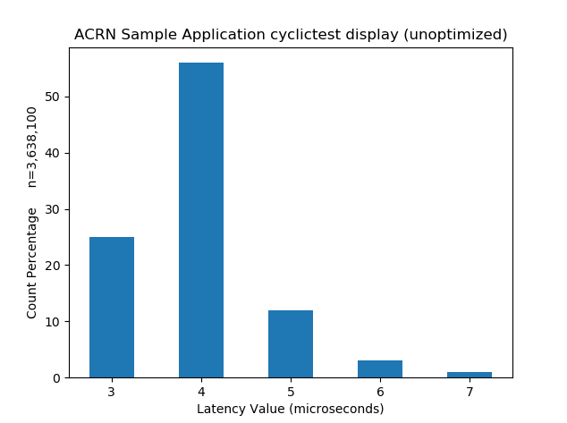

.. _GSG_sample_app:

Sample Application User Guide
#############################

This sample application shows how to create two VMs that are launched on
your target system running ACRN. These VMs communicate with each other
via inter-VM shared memory (IVSHMEM). One VM is a real-time VM running
`cyclictest <https://wiki.linuxfoundation.org/realtime/documentation/howto/tools/cyclictest/start>`__,
an open source application commonly used to measure latencies in
real-time systems. This real-time VM (RT_VM) uses inter-VM shared memory
(IVSHMEM) to send data to a second Human-Machine Interface VM (HMI_VM).
The HMI_VM formats and presents the collected data as a histogram on a web
page shown by a browser. This guide shows how to configure, create, and
launch the two VM images that make up this application.

.. figure:: images/samp-image001.png
   :class: drop-shadow
   :align: center
   :width: 900px

   Sample Application Overview

We build these two VM images on your development computer using scripts
in the ACRN source code. Once we have the two VM images, we follow
similar steps shown in the *Getting Started Guide* to define a new ACRN
scenario with two post-launched user VMs with their IVSHMEM connection.
We build a Service VM image and the Hypervisor image based on the
scenario configuration (as we did in the Getting Started Guide).
Finally, we put this all together on the target system, launch the
sample application VMs on ACRN from the Service VM, run the application
parts in each VM, and view the cyclictest histogram results in a browser
running on our HMI VM (or development computer).

While this sample application uses the cyclictest to generate data about
performance latency in the RTVM, we aren't doing any configuration
optimization in this sample to get the best RT performance.

Prerequisites Environment and Images
************************************

Before beginning, use the ``df`` command on your development computer and
verify there's at least 30GB free disk space for building the ACRN
sample application. You may see a different Filesystem name and sizes:

.. code-block:: console

   $ df -h /

   Filesystem     Size   Used Avail Use% Mounted on
   /dev/sda5      109G    42G  63G   41% /

.. rst-class:: numbered-step

Prepare the ACRN Development and Target Environment
***************************************************

.. important::
   Before building the sample application, it's important that you complete
   the :ref:`gsg` instructions and leave the development and target systems with
   the files created in those instructions.

The :ref:`gsg` instructions get all the tools and packages installed on your
development and target systems that we'll also use to build and run this sample
application.

After following the Getting Started Guide, you'll have a directory
``~/acrn-work`` on your development computer containing directories with the
``acrn-hypervisor`` and ``acrn-kernel`` source code and build output. You'll
also have the board XML file that's needed by the ACRN Configurator to
configure the ACRN hypervisor and set up the VM launch scripts for this sample
application.

Preparing the Target System
===========================

On the target system, reboot and choose the regular Ubuntu image (not the
Multiboot2 choice created when following the Getting Started Guide).

1. Log in as the **acrn** user. We'll be making ssh connections to the target system
   later in these steps, so install the ssh server on the target system using::

      sudo apt install -y openssh-server

#. We'll need to know the IP address of the target system later.  Use the
   ``hostname -I`` command and look at the first IP address mentioned. You'll
   likely see a different IP address than shown in this example:

   .. code-block:: console

      hostname -I | cut -d ' ' -f 1
      10.0.0.200

.. rst-class:: numbered-step

Make the Sample Application
***************************

On your development computer, build the applications used by the sample. The
``rtApp`` app in the RT VM reads the output from the cyclictest program and
sends it via inter-VM shared memory (IVSHMEM) to another regular HMI VM where
the ``userApp`` app receives the data and formats it for presentation using the
``histapp.py`` Python app.

As a normal (e.g., **acrn**) user, follow these steps:

1. Install some additional packages in your development computer used for
   building the sample application::

     sudo apt install -y cloud-guest-utils schroot kpartx qemu-kvm

#. Check out the ``acrn-hypervisor`` source code branch (already cloned from the
   ``acrn-hypervisor`` repo when you followed the :ref:`gsg`). We've tagged a
   specific version of the hypervisor that you should use for the sample app's
   HMI VM::

     cd ~/acrn-work/acrn-hypervisor
     git fetch --all
     git checkout release_3.2

#. Build the ACRN sample application source code::

     cd misc/sample_application/
     make all

   This builds the ``histapp.py``, ``userApp``, and ``rtApp`` used for the
   sample application.

.. rst-class:: numbered-step

Make the HMI_VM Image
*********************

1. Make the HMI VM image. This script runs for about 10 minutes total and will
   prompt you to input the passwords for the **acrn** and **root** user in the
   HMI_VM image::

     cd ~/acrn-work/acrn-hypervisor/misc/sample_application/image_builder
     ./create_image.sh hmi-vm

   After the script is finished, the ``hmi_vm.img`` image file is created in the
   ``build`` directory. You should see a final message from the script that
   looks like this:

   .. code-block:: console

      2022-08-18T09:53:06+08:00 [   Info   ] VM image created at /home/acrn/acrn-work/acrn-hypervisor/misc/sample_application/image_builder/build/hmi_vm.img.

   If you don't see such a message, look back through the output to see what
   errors are indicated.  For example, there could have been a network error
   while retrieving packages from the Internet. In such a case, simply trying
   the ``create_image.sh`` command again might work.

   The HMI VM image is a configured Ubuntu desktop image
   ready to launch as an ACRN user VM with the HMI parts of the sample app
   installed.

.. rst-class:: numbered-step

Make the RT_VM Image
*********************

1. Check out the ``acrn-kernel`` source code branch (already cloned from the
   ``acrn-kernel`` repo when you followed the :ref:`gsg`). We use preempt-rt 
   branch of ``acrn-kernel`` for the sample app's RT VM::

     cd ~/acrn-work/acrn-kernel
     git fetch --all
     git checkout -b sample_rt origin/5.15/preempt-rt

#. Build the preempt-rt patched kernel used by the RT VM::

     make mrproper
     cp kernel_config .config
     make olddefconfig
     make -j $(nproc) deb-pkg

   The kernel build can take 15 minutes on a fast computer but could
   take two to three hours depending on the performance of your development
   computer. When done, the build generates four Debian packages in the
   directory above the build root directory, as shown by this command::

     ls ../*rtvm*.deb

   You will see rtvm Debian packages for linux-headers, linux-image
   (normal and debug), and linux-libc-dev (your file names might look a
   bit different):

   .. code-block:: console

     linux-headers-5.15.44-rt46-acrn-kernel-rtvm+_5.15.44-rt46-acrn-kernel-rtvm+-1_amd64.deb
     linux-image-5.15.44-rt46-acrn-kernel-rtvm+-dbg_5.15.44-rt46-acrn-kernel-rtvm+-1_amd64.deb
     linux-image-5.15.44-rt46-acrn-kernel-rtvm+_5.15.44-rt46-acrn-kernel-rtvm+-1_amd64.deb
     linux-libc-dev_5.15.44-rt46-acrn-kernel-rtvm+-1_amd64.deb

#. Make the RT VM image::

     cd ~/acrn-work/acrn-hypervisor/misc/sample_application/image_builder
     ./create_image.sh rt-vm

   After the script is finished, the ``rt_vm.img`` image file is created in the ``build``
   directory. The RT VM image is a configured Ubuntu image with a
   preempt-rt patched kernel used for real-time VMs.

.. rst-class:: numbered-step

Create and Configure the ACRN Scenario
**************************************

Now we turn to building the hypervisor based on the board and scenario
configuration for our sample application. We'll use the board XML file
and ACRN Configurator already on your development computer when you followed
the :ref:`gsg`.

Use the ACRN Configurator to define a new scenario for our two VMs
and generate new launch scripts for this sample application.

1. On your development computer, launch the ACRN Configurator::

     cd ~/acrn-work
     acrn-configurator

#. Under **Start a new configuration**, confirm that the working folder is
   ``/home/acrn/acrn-work/MyConfiguration``. Click **Use This Folder**. (If
   prompted, confirm it's **OK** to overwrite an existing configuration.)

   .. image:: images/samp-image002.png
      :class: drop-shadow
      :align: center

#. Import your board configuration file as follows:

   a. In the **1. Import a board configuration file** panel, click **Browse
      for file**.

   #. Browse to ``/home/acrn/acrn-work/my_board.xml`` and click **Open**.
      Then click **Import Board File**.

      .. image:: images/samp-image003.png
         :class: drop-shadow
         :align: center

#. **Create a new scenario**: select a shared scenario type with a Service VM and
   two post-launched VMs. Click **OK**.

   .. image:: images/samp-image004.png
      :class: drop-shadow
      :align: center

   The ACRN Configurator will report some problems with the initial scenario
   configuration that we'll resolve as we make updates. (Notice the error
   indicators on the settings tabs and above the parameters tabs.) The
   ACRN Configurator verifies the scenario when you open a saved
   scenario and when you click the **Save Scenario And Launch Scripts**
   button.

   .. image:: images/samp-image004a.png
      :class: drop-shadow
      :align: center

#. Select the VM0 (Service VM) tab and set the **Console virtual UART type** to
   ``COM Port 1``. Edit the **Basic Parameters > Kernel
   command-line parameters** by appending the existing parameters with ``i915.modeset=1 3``
   (to disable the GPU driver loading for Intel GPU device).

   .. image:: images/samp-image005.png
      :class: drop-shadow
      :align: center

#. Select the VM1 tab and change the VM name to HMI_VM. Configure the **Console
   virtual UART type** to ``COM Port 1``, set the **Memory size** to ``2048``,
   and add the **physical CPU affinity** to pCPU ``0`` and ``1`` (click the
   **+** button to create the additional affinity setting), as shown below:

   .. image:: images/samp-image006.png
      :class: drop-shadow
      :align: center

#. Enable GVT-d configuration by clicking the **+** within the **PCI device
   setting** options and selecting the VGA compatible controller.  Click the
   **+** button again to add the USB controller to passthrough to the HMI_VM.

   .. image:: images/samp-image007.png
      :class: drop-shadow
      :align: center

#. Configure the HMI_VM's **virtio console devices** and **virtio network
   devices** by clicking the **+** button in the section and setting the values
   as shown here (note the **Network interface name** must be ``tap0``):

   .. image:: images/samp-image008.png
      :class: drop-shadow
      :align: center

#. Configure the HMI_VM **virtio block device**. Add the absolute path of your
   ``hmi_vm.img`` on the target system (we'll copy the generated ``hmi_vm.img``
   to this directory in a later step):

   .. image:: images/samp-image009.png
      :class: drop-shadow
      :align: center

   That completes the HMI_VM settings.

#. Next, select the VM2 tab and change the **VM name** to RT_VM, change the
   **VM type** to ``Real-time``, set the **Console virtual UART type** to ``COM port 1``,
   set the **memory size** to ``1024``, set **pCPU affinity** to IDs ``2`` and ``3``, and
   check the **Real-time vCPU box** for pCPU ID 2, as shown below:

   .. image:: images/samp-image010.png
      :class: drop-shadow
      :align: center

#. Configure the **virtio console device** for the RT_VM (unlike the HMI_VM, we
   don't use a **virtio network device** for this RT_VM):

   .. image:: images/samp-image011.png
      :align: center
      :class: drop-shadow

#. Add the absolute path of your ``rt_vm.img`` on the target system (we'll copy
   the ``rt_vm.img`` file we generated earlier to this directory in a later
   step):

   .. image:: images/samp-image012.png
      :class: drop-shadow
      :align: center

#. Select the Hypervisor tab: Verify that the **build type** is ``Debug``,
   define the
   **InterVM shared memory region** settings as shown below, adding the
   HMI_VM and RT_VM as the VMs doing the sharing of this region. (The
   missing **Virtual BDF** values will be supplied by the ACRN Configurator
   when you save the configuration.)

   .. image:: images/samp-image013.png
      :class: drop-shadow
      :align: center

   In the **Debug options**, set the **Serial console port** to
   ``/dev/ttyS0``, as shown below (this will resolve the message about the
   missing serial port configuration):

   .. image:: images/samp-image014.png
      :class: drop-shadow
      :align: center

#. Click the **Save Scenario and Launch Scripts** to validate and save this
   configuration and launch scripts.  You should see a dialog box saying the
   scenario is saved and validated, launch scripts are generated, and all files
   successfully saved.  Click **OK**.

   .. image:: images/samp-image015.png
      :class: drop-shadow
      :align: center
      :width: 400px

#. We're done configuring the sample application scenario. When you saved the
   scenario, the ACRN Configurator did a re-verification of all the option
   settings and found no issues, so all the error indicators are now cleared.

   Exit the ACRN Configurator by clicking the **X** in the top right corner.

   .. image:: images/samp-image015a.png
      :class: drop-shadow
      :align: center

You can see the saved scenario and launch scripts in the working
directory:

.. code-block:: console

   $ ls MyConfiguration

   launch_user_vm_id1.sh launch_user_vm_id2.sh scenario.xml myboard.board.xml

You'll see the two VM launch scripts (id1 for the HMI_VM, and id2 for
the RT_VM) and the scenario XML file for your sample application (as
well as your board XML file).

.. rst-class:: numbered-step

Build the ACRN Hypervisor and Service VM Images
***********************************************

1. On the development computer, build the ACRN hypervisor using the
   board XML and the scenario XML file we just generated::

     cd ~/acrn-work/acrn-hypervisor

     make clean
     debian/debian_build.sh clean && debian/debian_build.sh -c ~/acrn-work/MyConfiguration -b "my_board" -s "MyConfiguration"

   The build typically takes about a minute. When done, the build
   generates a Debian package in the build directory with your board and
   working folder name.

   This Debian package contains the ACRN hypervisor and tools for
   installing ACRN on the target.

#. Build the ACRN kernel for the Service VM (the sample application
   requires a newer version of the Service VM than generated in the
   Getting Started Guide, so we'll need to generate it again) using a tagged
   version of the ``acrn-kernel``::

     cd ~/acrn-work/acrn-kernel
     git fetch --all

     git checkout release_3.2

     make distclean
     cp kernel_config_service_vm .config
     make olddefconfig
     make -j $(nproc) deb-pkg

   The kernel build can take 15 minutes or less on a fast computer, but
   could take one to two hours depending on the performance of your development
   computer. When done, the build generates four Debian packages in the
   directory above the build root directory:

   .. code-block:: console

      $ ls ../*acrn-service*.deb

      linux-headers-5.15.44-acrn-service-vm_5.15.44-acrn-service-vm-1_amd64.deb
      linux-image-5.15.44-acrn-service-vm_5.15.44-acrn-service-vm-1_amd64.deb
      linux-image-5.15.44-acrn-service-vm-dbg_5.15.44-acrn-service-vm-1_amd64.deb
      linux-libc-dev_5.15.44-acrn-service-vm-1_amd64.deb

.. rst-class:: numbered-step

Copy Files from the Development Computer to Your Target System
**************************************************************

1. Copy all the files generated on the development computer to the
   target system. This includes the sample application executable files,
   HMI_VM and RT_VM images, Debian packages for the Service VM and
   Hypervisor, launch scripts. You can use ``scp`` to copy across the local network,
   or use a USB stick:

   Option 1: use ``scp`` to copy files over the local network
     Use ``scp`` to copy files from your development computer to the
     ``~/acrn-work`` directory on the target (replace the IP address used in
     this example with the target system's IP address you found earlier)::

       cd ~/acrn-work

       scp acrn-hypervisor/misc/sample_application/image_builder/build/*_vm.img \
           acrn-hypervisor_3.2-unstable~1.gbp<commit ID>_amd64.deb \    
           *acrn-service-vm*.deb MyConfiguration/launch_user_vm_id*.sh \
           acrn@10.0.0.200:~/acrn-work

   Option 2: use a USB stick to copy files
     Because the VM image files are large, format your USB stick with a file
     system that supports files greater than 4GB: extFAT or NTFS, but not FAT32.

     Insert a USB stick into the development computer and run these commands::

        disk="/media/$USER/"$(ls /media/$USER)

        cd ~/acrn-work
        cp acrn-hypervisor/misc/sample_application/image_builder/build/*_vm.img rt_vm.img "$disk"
        cp acrn-hypervisor/build/acrn-my_board-MyConfiguration*.deb "$disk"
        cp *acrn-service-vm*.deb "$disk"
        cp MyConfiguration/launch_user_vm_id*.sh "$disk"
        cp acpica-unix-20210105/generate/unix/bin/iasl "$disk"
        sync && sudo umount "$disk"

     Move the USB stick you just used to the target system and run
     these commands to copy the files locally::

        disk="/media/$USER/"$(ls /media/$USER)

        cp "$disk"/*_vm.img ~/acrn-work
        cp "$disk"/acrn-my_board-MyConfiguration*.deb ~/acrn-work
        cp "$disk"/*acrn-service-vm*.deb ~/acrn-work
        cp "$disk"/launch_user_vm_id*.sh ~/acrn-work
        sudo cp "$disk"/iasl /usr/sbin/
        sudo ln -s /usr/sbin/iasl /usr/bin/iasl
        sync && sudo umount "$disk"

.. rst-class:: numbered-step

Install and Run ACRN on the Target System
*****************************************

1. On your target system, install the ACRN Debian package and ACRN
   kernel Debian packages using these commands::

     cd ~/acrn-work
     sudo apt purge acrn-hypervisor
     sudo apt install ./acrn-hypervisor_3.2-unstable~1.gbp<commit ID>_amd64.deb
     sudo apt install ./*acrn-service-vm*.deb

#. Enable networking services for sharing with the HMI User VM::

     sudo systemctl enable --now systemd-networkd

#. Reboot the system::

     reboot

#. Confirm that you see the GRUB menu with the "ACRN multiboot2" entry.  Select
   it and press :kbd:`Enter` to proceed to booting ACRN. (It may be
   auto-selected, in which case it will boot with this option automatically in 5
   seconds.)

   .. image:: images/samp-image016.png
      :class: drop-shadow
      :align: center

   This will boot the ACRN hypervisor and launch the Service VM.

#. Log in to the Service VM (using the target's keyboard and HDMI monitor) using
   the ``acrn`` username.

#. Find the Service VM's IP address (the first IP address shown by this command):

   .. code-block:: console

      $ hostname -I | cut -d ' ' -f 1
      10.0.0.200

#. From your development computer, ssh to your target system's Service VM
   using that IP address::

     ssh acrn@10.0.0.200

#. In that ssh session, launch the HMI_VM by using the ``launch_user_vm_id1.sh`` launch
   script::

     sudo chmod +x ~/acrn-work/launch_user_vm_id1.sh
     sudo ~/acrn-work/launch_user_vm_id1.sh

#. The launch script will start up the HMI_VM and show an Ubuntu login
   prompt in your ssh session (and a graphical login on your target's HDMI
   monitor).

   Log in to the HMI_VM as **root** user (not **acrn**) using your development
   computer's ssh session:

   .. code-block:: console
      :emphasize-lines: 1

      ubuntu login: root
      Password:
      Welcome to Ubuntu 22.04.1 LTS (GNU/Linux 5.15.0-52-generic x86_64)

      . . .

      (acrn-guest)root@ubuntu:~#

#. Find the HMI_VM's IP address:

   .. code-block:: console

      (acrn-guest)root@ubuntu:~# hostname -I | cut -d ' ' -f 1
      10.0.0.100

   If no IP address is reported, run this command to request an IP address and check again::

      dhclient

#. Run the HMI VM sample application ``userApp`` (in the background)::

     sudo /root/userApp &

   and then the ``histapp.py`` application::

     sudo python3 /root/histapp.py

   At this point, the HMI_VM is running and we've started the HMI parts of
   the sample application. Next, we will launch the RT_VM and its parts of
   the sample application.

#. On your development computer, open a new terminal window and start a
   new ssh connection to your target system's Service VM::

     ssh acrn@10.0.0.200

#. In this ssh session, launch the RT_VM by using the vm_id2 launch
   script::

     sudo chmod +x ~/acrn-work/launch_user_vm_id2.sh
     sudo ~/acrn-work/launch_user_vm_id2.sh

#. The launch script will start up the RT_VM.  Lots of system messages will go
   by and end with an Ubuntu login prompt. 

   Log in to the RT_VM as **root** user (not **acrn**) in this ssh session:

   .. code-block:: console
      :emphasize-lines: 1

      ubuntu login: root
      Password:
      Welcome to Ubuntu 22.04.1 LTS (GNU/Linux 5.15.44-rt46-acrn-kernel-rtvm+ x86_64)

      . . .

      (acrn-guest)root@ubuntu:~#

#. Run the cyclictest in this RT_VM (in the background)::

     cyclictest -p 80 --fifo="./data_pipe" -q &

   and then the rtApp in this RT_VM::

     sudo /root/rtApp

Now the two parts of the sample application are running:

* The RT_VM is running cyclictest, which generates latency data, and the rtApp
  sends this data via IVSHMEM to the HMI_VM.
* In the HMI_VM, the userApp receives the cyclictest data and provides it to the
  histapp.py Python application that is running a web server.

We can view this data displayed as a histogram:

Option 1: Use a browser on your development computer
  Open a web browser on your development computer to the
  HMI_VM IP address that we found in an earlier step (e.g., http://10.0.0.100).

Option 2: Use a browser on the HMI VM using the target system console
  Log in to the HMI_VM on the target system's console. (If you want to
  log in as root, click the "Not listed?" link under the username choices you
  do see and enter the root username and password.) Open the web browser to
  http://localhost.

Refresh the browser. You'll see a histogram graph showing the
percentage of latency time intervals reported by cyclictest. The histogram will
update every time you refresh the browser.  (Notice the count of samples
increases as reported on the vertical axis label.)

   Example Histogram Output from Cyclictest as Reported by the Sample App

The horizontal axis represents the latency values in microseconds, and the
vertical axis represents the percentage of occurrences of those values.

Congratulations
***************

That completes the building and running of this sample application. You
can view the application's code in the
``~/acrn-work/acrn-hypervisor/misc/sample_application`` directory on your
development computer (cloned from the ``acrn-hypervisor`` repo).

.. note:: As mentioned at the beginning, while this sample application uses the
   cyclictest to generate data about performance latency in the RT_VM, we
   haven't done any configuration optimization in this sample to get the
   best real-time performance.
