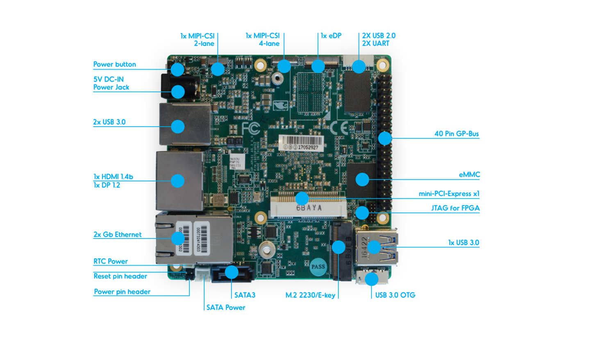
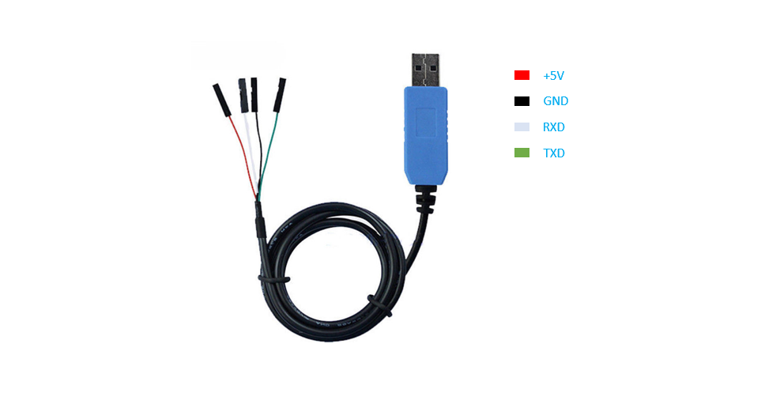
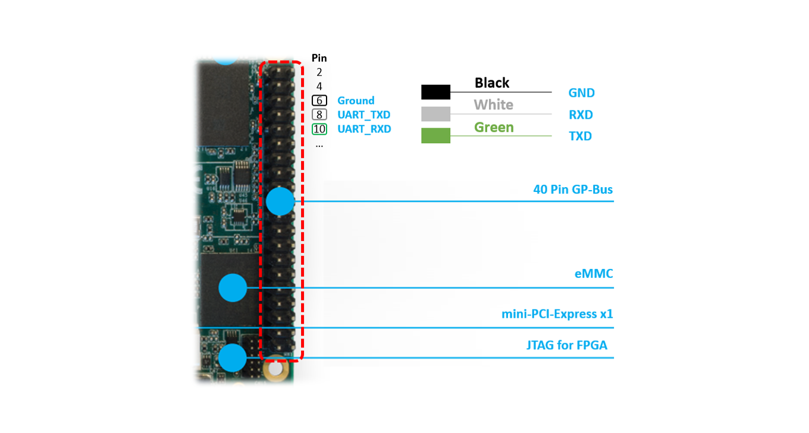

.. _getting-started-up2:

Getting started guide for UP2 board
###################################

Hardware setup
**************

The `UP Squared board <http://www.up-board.org/upsquared/specifications/>`_ (UP2) is
an x86 maker board based on the Intel Apollo Lake platform. The UP boards
are used in IoT applications, industrial automation, digital signage, and more.

The UP2 features Intel `Celeron N3550
<https://ark.intel.com/products/95598/Intel-Celeron-Processor-N3350-2M-Cache-up-to-2_4-GHz>`_
and Intel `Pentium N4200
<https://ark.intel.com/products/95592/Intel-Pentium-Processor-N4200-2M-Cache-up-to-2_5-GHz>`_
SoCs. Both have been confirmed to work with ACRN.

Connecting to the serial port
=============================

The UP2 board has two serial ports. The following figure shows the UP2 board's 
40-pin HAT connector we'll be using as documented in the  `UP2 Datasheet
<https://up-board.org/wp-content/uploads/datasheets/UP-Square-DatasheetV0.5.pdf>`_.

   
We'll access the serial port through the I/O pins in the 
40-pin HAT connector using a `USB TTL serial cable
<http://www.ftdichip.com/Products/USBTTLSerial.htm>`_, 
and show how to connect a serial port with 
``PL2303TA USB to TTL serial cable`` for example: 

Connect pin 6 (``Ground``), pin 8 (``UART_TXD``) and pin 10 (``UART_RXD``) of the HAT 
connector to respectively the ``GND``, ``RX`` and ``TX`` pins of your 
USB serial cable. Plug the USB TTL serial cable into your PC and use a 
console emulation tool such as ``minicom`` or ``putty`` to communicate 
with the UP2 board for debugging.

Software setup
**************

Setting up the ACRN hypervisor (and associated components) on the UP2
board is no different than other hardware platforms so please follow
the instructions provided in the :ref:`getting-started-apl-nuc`, with
the additional information below.

There are a few parameters specific to the UP2 board that differ from
what is referenced in the :ref:`getting-started-apl-nuc` section:

1. Serial Port settings
#. Storage device name

You will need to keep these in mind in a few places:

* When mounting the EFI System Partition (ESP)

  .. code-block:: none

     # mount /dev/mmcblk0p1 /mnt

* When adjusting the ``acrn.conf`` file

  * Set the ``root=`` parameter using the ``PARTUUID`` or device name directly

* When configuring the EFI firmware to boot the ACRN hypervisor by default

  .. code-block:: none

     # efibootmgr -c -l "\EFI\acrn\acrn.efi" -d /dev/mmcblk0 -p 1 -L "ACRN Hypervisor" \
         -u "bootloader=\EFI\org.clearlinux\bootloaderx64.efi uart=bdf@0:18.1"

UP2 serial port setting
=======================

The serial port (ttyS1) in the 40-pin HAT connector is located at ``serial PCI BDF 0:18.1``.
You can check this from the ``lspci`` output from the initial Clearlinux installation.
Also you can use ``dmesg | grep tty`` to get its IRQ information for console setting; and update
SOS bootargs ``console=ttyS1`` in acrn.conf to match with console setting.

.. code-block:: none

   # lspci | grep UART
   00:18.0 . Series HSUART Controller #1 (rev 0b)
   00:18.1 . Series HSUART Controller #2 (rev 0b)

   # dmesg | grep tty
   dw-apb-uart.8: ttyS0 at MMIO 0x91524000 (irq = 4, base_baud = 115200) is a 16550A
   dw-apb-uart.9: ttyS1 at MMIO 0x91522000 (irq = 5, base_baud = 115200) is a 16550A

The second entry associated with ``00:18.1 @irq5`` is the one on the 40-pin HAT connector.

UP2 block device
================

The UP2 board has an on-board eMMC device. The device name to be used
throughout the :ref:`getting_started` therefore is ``/dev/mmcblk0``
(and ``/dev/mmcblk0pX`` for any partition).

The UUID of the partition ``/dev/mmcblk0p3`` can be found by

.. code-block:: none

   # blkid /dev/mmcblk

.. note::
   You can also use the device name directly, e.g.: ``root=/dev/mmcblk0p3``

Running the hypervisor
**********************

Now that the hypervisor and Service OS have been installed on your UP2 board,
you can proceed with the rest of the instructions in the
:ref:`getting-started-apl-nuc` and install the User OS (UOS).
