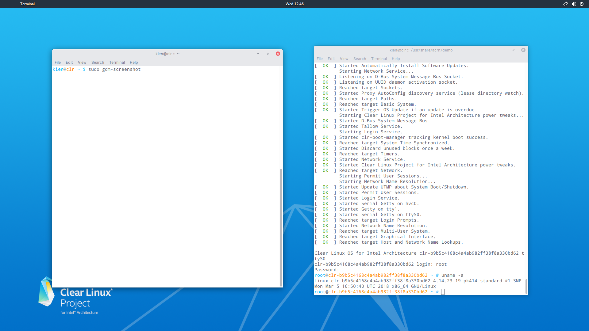

==========================================
ACRN - Getting started guide for UP2 board
==========================================

Hardware setup
==============

The `*UP squared board* <http://www.up-board.org/upsquared/>`__ (UP2) is
the x86 maker board based on Intel Apollo Lake platform. The UP boards
have been used in IoT, industrial automation, digital signage and more.
The UP2 features Intel `*Celeron
N3550* <https://ark.intel.com/products/95598/Intel-Celeron-Processor-N3350-2M-Cache-up-to-2_4-GHz>`__
and Intel `*Pentium
N4200* <https://ark.intel.com/products/95592/Intel-Pentium-Processor-N4200-2M-Cache-up-to-2_5-GHz>`__
SoCs. Both have been confirmed to work with ACRN.

Connecting to the serial port
-----------------------------

The UP2 board has two serial ports: one via the M10 header and one via
the I/O pins in the 40-pin HAT connector. Please refer to the `*UP2
specifications* <http://www.up-board.org/upsquared/specifications-up2/>`__
for more information. In this instruction, we use the latter. To connect
to the UP2 board, use a USB TTL serial cable like `*this
one* <http://www.ftdichip.com/Products/Cables/USBTTLSerial.htm>`__.
Connect pin 6 (GND), pin 8 (TX) and pin 10 (RX) of the HAT connector to
GND, RX and TX pins of your USB serial cable. The USB serial cable can
be plugged into another PC for debugging. Tool like minicom or screen
can help to connect.

Software setup
==============

Setting up the operating system
-------------------------------

Download the compressed Clear installer image from
`*here* <https://download.clearlinux.org/releases/21260/clear/clear-21260-installer.img.xz>`__
and follow the `*Clear Linux installation
guide* <https://clearlinux.org/documentation/clear-linux/get-started/bare-metal-install>`__
as a starting point for installing Clear Linux onto your UP2. Follow
the recommended options for choosing an Automatic installation type,
and using the UP2’s storage as the target device for installation
(overwriting the existing data and creating three partitions on the
UP2’s eMMC drive).
After installation is complete, boot into Clear Linux, login as **root**,
and set a password.
Clear Linux is set to automatically update itself. We recommend that
you disable this feature to have more control over when the updates
happen.

Use this command to disable the autoupdate feature:

.. code-block:: none

      # swupd autoupdate --disable

Use the swupd bundle-add command and add these Clear Linux bundles:

.. code-block:: none

      # swupd bundle-add vim network-basic service-os kernel-pk os-clr-on-clr

Building and installing software
--------------------------------

Downloading ACRN source code
~~~~~~~~~~~~~~~~~~~~~~~~~~~~

.. code-block:: none

      # git clone https://github.com/projectacrn/acrn-hypervisor
      # cd acrn-hypervisor

Building ACRN hypervisor and the device model
~~~~~~~~~~~~~~~~~~~~~~~~~~~~~~~~~~~~~~~~~~~~~

.. code-block:: none

      # make hypervisor PLATFORM=uefi
      # make devicemodel

Deploying to the system
~~~~~~~~~~~~~~~~~~~~~~~

Follow the guidance "`*Add the ACRN hypervisor to the EFI
partition* <https://projectacrn.github.io/latest/getting_started/index.html#add-the-acrn-hypervisor-to-the-efi-partition>`__"
to deploy the hypervisor to the system. The file acrn.efi is in the
folder "build/hypervisor/". ACRN allows the user to pass the cmdline
to the hypervisor. For the UP2, here the UART address is added to
enable the serial port.

.. code-block:: none

      # mount /dev/mmcblk0p1 /mnt
      # mkdir /mnt/EFI/acrn
      # cp build/hypervisor/acrn.efi /mnt/EFI/acrn/
      # efibootmgr -c -l "\EFI\acrn\acrn.efi" -d /dev/mmcblk0p3 -p 1 -L "ACRN Hypervisor" \
        -u "bootloader=\EFI\org.clearlinux\bootloaderx64.efi uart=mmio@0x9141e000"
      # cp /mnt/EFI/org.clearlinux/mnbootloaderx64.efi /mnt/EFI/org.clearlinux/bootloaderx64_origin.efi

Note that the uart address can be obtained from dmesg (after booting Clearlinux on
your UP2 board)

.. code-block:: none

      # dmesg | grep dw-apb-uart
      [2.150689] dw-apb-uart.8: ttyS1 at MMIO 0x91420000 (irq = 4, base_baud = 115200) is a 16550A
      [2.152072] dw-apb-uart.9: ttyS2 at MMIO 0x9141e000 (irq = 5, base_baud = 115200) is a 16550A

The second one associated with ‘dw-apb-uart.9’ is the one on the 40-pin
HAT connector.

Copy ‘acrn.conf’ to the directory ‘loader/entries’

.. code-block:: none

      # cp hypervisor/bsp/uefi/clearlinux/acrn.conf /mnt/loader/entries

Modify the acrn.conf like below:

.. code-block:: none

      title The ACRN Service OS
      linux /EFI/org.clearlinux/kernel-org.clearlinux.pk414-sos.4.14.23-19
      options **pci_devices_ignore=(0:18:1)** maxcpus=1 console=tty0
      console=ttyS0 i915.nuclear_pageflip=1 root=PARTUUID=<UUID of
      /dev/mmcblk0p3> rw rootwait ignore_loglevel no_timer_check
      consoleblank=0 i915.tsd_init=7 i915.tsd_delay=2000
      i915.avail_planes_per_pipe=0x00000F
      i915.domain_plane_owners=0x011111110000 i915.enable_guc_loading=0
      i915.enable_guc_submission=0 i915.enable_preemption=1
      i915.context_priority_mode=2 i915.enable_gvt=1 hvlog=2M@0x1FE00000
      cma=1024M@0x30000000-0

The UUID of the partition /dev/mmcblk0p3 can be found by

.. code-block:: none

      # blkid /dev/mmcblk0p3

Note that the Clear Linux system gets updated to the latest status when
adding new packages with bundle-add. The SOS kernel version above is
only an example. Look at the "/EFI/org.clearlinux/" under the EFI
partition and adjust the kernel version.

.. code-block:: none

      # mount /dev/mmcblk0p1 /mnt
      # ls /mnt/EFI/org.clearlinux
      bootloaderx64.efi
      kernel-org.clearlinux.native.4.15.9-538
      kernel-org.clearlinux.pk414-sos.4.14.23-19
      kernel-org.clearlinux.pk414-standard.4.14.23-19
      loaderx64.efi

Replace the ACRN devicemodel with the newly built one.

.. code-block:: none

      # cp build/devicemodel/acrn-dm /usr/bin/acrn-dm

Reboot UP2 board and select "The ACRN Service OS" to boot. From here you
can login as root using the password you set previously when installing
Clear Linux.

Installing the UOS
~~~~~~~~~~~~~~~~~~

Follow the ACRN getting started guide to `*create a bridge
network* <https://projectacrn.github.io/latest/getting_started/#create-a-network-bridge>`__
and `*setup a reference
UOS* <https://projectacrn.github.io/latest/getting_started/#set-up-reference-uos>`__.

Launching UOS in the GUI
~~~~~~~~~~~~~~~~~~~~~~~~

Mouse and keyboard have also been confirmed to work with the GUI
control. Follow the `*Clear Linux
guidance* <https://clearlinux.org/documentation/clear-linux/guides/maintenance/enable-user-space>`__
on how to enable the GUI.

.. code-block:: none

      # useradd <userID>
      # passwd <userID>
      # usermod -G wheel -a <userID>
      # swupd bundle-add desktop
      # systemctl start gdm

When the GUI starts, login with the userID and password, launch a new
terminal, and from there launch the UOS.

.. code-block:: none

      $ cd /usr/share/acrn/demo
      $ sudo ./launch_UOS.sh

|image0|

Figure 1. Launching UOS in GUI environment on top of ACRN

