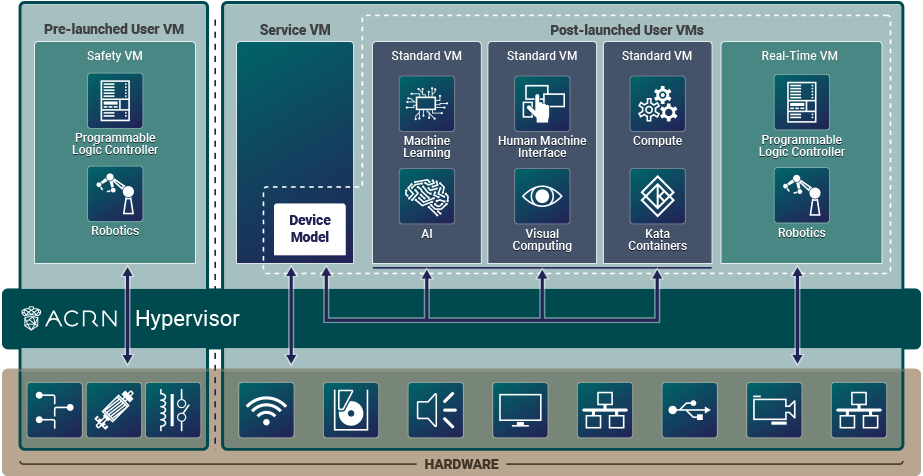

.. _introduction:

What Is ACRN
############

Introduction
************

IoT and Edge system developers face mounting demands on the systems they build, as connected
devices are increasingly expected to support a range of hardware resources,
operating systems, and software tools and applications. Virtualization is key to
meeting these broad needs. Most existing hypervisor and Virtual Machine Manager
solutions don't offer the right size, boot speed, real-time support, and
flexibility for IoT and Edge systems. Data center hypervisor code is too big, doesn't
offer safety or hard real-time capabilities, and requires too much performance
overhead for embedded development. The ACRN hypervisor was built to fill this
need.

ACRN is a type 1 reference hypervisor stack that runs on bare-metal hardware,
with fast booting, and is configurable for a variety of IoT, Edge, and embedded device
solutions.  It provides a flexible, lightweight hypervisor, built with real-time
and safety-criticality in mind, optimized to streamline embedded development
through an open-source, scalable reference platform. It has an architecture that
can run multiple OSs and VMs, managed securely, on a consolidated system by
means of efficient virtualization.  Resource partitioning ensures
co-existing heterogeneous workloads on one system hardware platform do not
interfere with each other.

ACRN defines a reference framework implementation for virtual device emulation,
called the ACRN Device Model or DM, with rich I/O mediators. It also supports
non-emulated device passthrough access to satisfy time-sensitive requirements
and low-latency access needs of real-time applications.  To keep the hypervisor
code base as small and efficient as possible, the bulk of the Device Model
implementation resides in the Service VM to provide sharing and other
capabilities.

ACRN is built to virtualize embedded IoT and Edge development functions
(for a camera, audio, graphics, storage, networking, and more), so it's ideal
for a broad range of IoT and Edge uses, including industrial, automotive, and retail
applications.

Licensing
*********
.. _BSD-3-Clause: https://opensource.org/licenses/BSD-3-Clause

The ACRN hypervisor and ACRN Device Model software are provided
under the permissive `BSD-3-Clause`_ license, which allows
*"redistribution and use in source and binary forms, with or without
modification"* together with the intact copyright notice and
disclaimers noted in the license.

Key Capabilities
****************

ACRN has these key capabilities and benefits:

* **Small Footprint**: The hypervisor is optimized for resource-constrained devices
  with significantly fewer lines of code (about 40K) than datacenter-centric
  hypervisors (over 150K).
* **Built with Real-time in Mind**: Low-latency, fast boot times, and responsive
  hardware device communication supporting near bare-metal performance. Both
  soft and hard real-time VM needs are supported including no VMExit during
  runtime operations, LAPIC and PCI passthrough, static CPU assignment, and
  more.
* **Built for Embedded IoT and Edge Virtualization**: ACRN supports virtualization beyond the
  basics and includes CPU, I/O, and networking virtualization of embedded IoT
  and Edge
  device functions and a rich set of I/O mediators to share devices across
  multiple VMs. The Service VM communicates directly with the system hardware
  and devices ensuring low latency access. The hypervisor is booted directly by the
  bootloader for fast and secure booting.
* **Built with Safety-Critical Virtualization in Mind**: Safety-critical workloads
  can be isolated from the rest of the VMs and have priority to meet their
  design needs. Partitioning of resources supports safety-critical and
  non-safety-critical domains coexisting on one SoC using Intel VT-backed
  isolation.
* **Adaptable and Flexible**: ACRN has multi-OS support with efficient
  virtualization for VM OSs including Linux, Zephyr, and Windows, as
  needed for a variety of application use cases. ACRN scenario configurations
  support shared, partitioned, and hybrid VM models to support a variety of
  application use cases.
* **Truly Open Source**: With its permissive BSD licensing and reference
  implementation, ACRN offers scalable support with a significant up-front R&D
  cost saving, code transparency, and collaborative software development with
  industry leaders.

.. include:: ../../../../README.rst
   :start-after: start_include_here

Background
**********

The ACRN architecture has evolved since its initial v0.1 release in July 2018.
Beginning with the v1.1 release, the ACRN architecture has flexibility to
support VMs with shared HW resources, partitioned HW resources, and a hybrid
VM model that simultaneously supported shared and partitioned resources. It enables a
workload consolidation solution taking multiple separate systems and running
them on a single compute platform to run heterogeneous workloads, with hard and
soft real-time support.

Workload management and orchestration are also enabled with ACRN, allowing
open-source orchestrators such as OpenStack to manage ACRN VMs. ACRN supports
secure container runtimes such as Kata Containers orchestrated via Docker or
Kubernetes.

High-Level Architecture
***********************

ACRN is a Type 1 hypervisor, meaning it runs directly on bare-metal
hardware. It implements a hybrid Virtual Machine Manager (VMM) architecture,
using a privileged Service VM that manages the I/O devices and provides I/O
mediation. Multiple User VMs are supported with each of them potentially running
different OSs. By running systems in separate VMs, you can isolate VMs
and their applications, reducing potential attack surfaces and minimizing
interference, but potentially introducing additional latency for applications.

ACRN relies on Intel Virtualization Technology (Intel VT) and runs in Virtual
Machine Extension (VMX) root operation, host mode, or VMM mode. All the User VMs
and the Service VM run in VMX non-root operation, or guest mode.

The Service VM runs with the system's highest virtual machine priority
to ensure required device time-sensitive requirements and system quality
of service (QoS). Service VM tasks run with mixed priority. Upon a
callback servicing a particular User VM request, the corresponding
software (or mediator) in the Service VM inherits the User VM priority.

As mentioned earlier, hardware resources used by VMs can be configured into
two parts, as shown in this hybrid VM sample configuration:

   ACRN High-Level Architecture Hybrid Example

Shown on the left of :numref:`V2-hl-arch`, we've partitioned resources dedicated
to a User VM launched by the hypervisor and before the Service VM is started.
This pre-launched VM runs independently of other virtual machines and owns
dedicated hardware resources, such as a CPU core, memory, and I/O devices. Other
VMs may not even be aware of the pre-launched VM's existence. Because of this,
it can be used as a Safety VM that runs hardware failure detection code and can
take emergency actions when system critical failures occur. Failures in other
VMs or rebooting the Service VM will not directly impact execution of this
pre-launched Safety VM.

Shown on the right of :numref:`V2-hl-arch`, the remaining hardware resources are
shared among the Service VM and User VMs. The Service VM is launched by the
hypervisor after any pre-launched VMs are launched. The Service VM can access
remaining hardware resources directly by running native drivers and provides
device sharing services to the User VMs, through the Device Model.  These
post-launched User VMs can run one of many OSs including Ubuntu or
Windows, or a real-time OS such as Zephyr, VxWorks, or Xenomai. Because of its
real-time capability, a real-time VM (RTVM) can be used for software
programmable logic controller (PLC), inter-process communication (IPC), or
Robotics applications.  These shared User VMs could be impacted by a failure in
the Service VM since they may rely on its mediation services for device access.

The Service VM owns most of the devices including the platform devices, and
provides I/O mediation. The notable exceptions are the devices assigned to the
pre-launched User VM. Some PCIe devices may be passed through to the
post-launched User VMs via the VM configuration.

The ACRN hypervisor also runs the ACRN VM manager to collect running
information of the User VMs, and controls the User VMs such as starting,
stopping, and pausing a VM, and pausing or resuming a virtual CPU.

See the :ref:`hld-overview` developer reference material for more in-depth
information.

.. _static-configuration-scenarios:

Static Configuration Based on Scenarios
***************************************

Scenarios are a way to describe the system configuration settings of the ACRN
hypervisor, VMs, and resources they have access to that meet your specific
application's needs such as compute, memory, storage, graphics, networking, and
other devices.  Scenario configurations are stored in an XML format file and
edited using the ACRN Configurator.

Following a general embedded-system programming model, the ACRN hypervisor is
designed to be statically customized at build time per hardware and scenario,
rather than providing one binary for all scenarios.  Dynamic configuration
parsing is not used in the ACRN hypervisor for these reasons:

* **Reduce complexity**. ACRN is a lightweight reference hypervisor, built for
  embedded IoT and Edge. As new platforms for embedded systems are rapidly introduced,
  support for one binary could require more and more complexity in the
  hypervisor, which is something we strive to avoid.
* **Maintain small footprint**. Implementing dynamic parsing introduces hundreds or
  thousands of lines of code. Avoiding dynamic parsing helps keep the
  hypervisor's Lines of Code (LOC) in a desirable range (less than 40K).
* **Improve boot time**. Dynamic parsing at runtime increases the boot time. Using a
  static build-time configuration and not dynamic parsing helps improve the boot
  time of the hypervisor.

The scenario XML file together with a target board XML file are used to build
the ACRN hypervisor image tailored to your hardware and application needs. The ACRN
project provides the Board Inspector tool to automatically create the board XML
file by inspecting the target hardware. ACRN also provides the
:ref:`ACRN Configurator tool <acrn_configuration_tool>`
to create and edit a tailored scenario XML file based on predefined sample
scenario configurations.

.. _usage-scenarios:

Scenario Types
**************

Here are three sample scenario types and diagrams to illustrate how you
can define your own configuration scenarios.

* **Shared** is a traditional
  computing, memory, and device resource sharing
  model among VMs. The ACRN hypervisor launches the Service VM. The Service VM
  then launches any post-launched User VMs and provides device and resource
  sharing mediation through the Device Model.  The Service VM runs the native
  device drivers to access the hardware and provides I/O mediation to the User
  VMs.

  .. figure:: images/ACRN-industry-example-1-0.75x.png
     :align: center
     :name: arch-shared-example

     ACRN High-Level Architecture Shared Example

  Virtualization is especially important in industrial environments because of
  device and application longevity. Virtualization enables factories to
  modernize their control system hardware by using VMs to run older control
  systems and operating systems far beyond their intended retirement dates.

  The ACRN hypervisor needs to run different workloads with little-to-no
  interference, increase security functions that safeguard the system, run hard
  real-time sensitive workloads together with general computing workloads, and
  conduct data analytics for timely actions and predictive maintenance.

  In this example, one post-launched User VM provides Human Machine Interface
  (HMI) capability, another provides Artificial Intelligence (AI) capability,
  some compute function is run in the Kata Container, and the RTVM runs the soft
  Programmable Logic Controller (PLC) that requires hard real-time
  characteristics.

  - The Service VM provides device sharing functionalities, such as disk and
    network mediation, to other virtual machines.  It can also run an
    orchestration agent allowing User VM orchestration with tools such as
    Kubernetes.
  - The HMI Application OS can be Windows or Linux. Windows is dominant in
    Industrial HMI environments.
  - ACRN can support a soft real-time OS such as preempt-rt Linux for soft-PLC
    control, or a hard real-time OS that offers less jitter.

* **Partitioned** is a VM resource partitioning model when a User VM requires
  independence and isolation from other VMs.  A partitioned VM's resources are
  statically configured and are not shared with other VMs.  Partitioned User VMs
  can be Real-Time VMs, Safety VMs, or standard VMs and are launched at boot
  time by the hypervisor. There is no need for the Service VM or Device Model
  since all partitioned VMs run native device drivers and directly access their
  configured resources.

  .. figure:: images/ACRN-partitioned-example-1-0.75x.png
     :align: center
     :name: arch-partitioned-example

     ACRN High-Level Architecture Partitioned Example

  This scenario is a simplified configuration showing VM partitioning: both
  User VMs are independent and isolated, they do not share resources, and both
  are automatically launched at boot time by the hypervisor.  The User VMs can
  be Real-Time VMs (RTVMs), Safety VMs, or standard User VMs.

  When selecting this scenario, ensure that ``reboot=acpi`` is included in the
  ``bootargs`` of ``scenario.xml``. Additionally, if the target VM is named VM0,
  ``grub.cfg`` must contain a menuentry with ``module2 /boot/ACPI_VM0.bin ACPI_VM0``.

* **Hybrid** scenario simultaneously supports both sharing and partitioning on
  the consolidated system. The pre-launched (partitioned) User VMs, with their
  statically configured and unshared resources, are started by the hypervisor.
  The hypervisor then launches the Service VM. The post-launched (shared) User
  VMs are started by the Device Model in the Service VM and share the remaining
  resources.

  .. figure:: images/ACRN-hybrid-rt-example-1-0.75x.png
     :align: center
     :name: arch-hybrid-rt-example

     ACRN High-Level Architecture Hybrid-RT Example

  In this Hybrid real-time (RT) scenario, a pre-launched RTVM is started by the
  hypervisor. The Service VM runs a post-launched User VM that runs non-safety or
  non-real-time tasks.

The :ref:`acrn_configuration_tool` tutorial explains how to use the ACRN
Configurator to create your own scenario, or to view and modify an existing one.

.. _dm_architecture_intro:

ACRN Device Model Architecture
******************************

Because devices may need to be shared between VMs, device emulation is
used to give VM applications (and their OSs) access to these shared devices.
Traditionally there are three architectural approaches to device
emulation:

* **Device emulation within the hypervisor**: a common method implemented within
  the VMware workstation product (an operating system-based hypervisor). In
  this method, the hypervisor includes emulations of common devices that the
  various guest operating systems can share, including virtual disks, virtual
  network adapters, and other necessary platform elements.

* **User space device emulation**: rather than the device emulation embedded
  within the hypervisor, it is implemented in a separate user space application.
  QEMU, for example, provides this kind of device emulation also used by other
  hypervisors. This model is advantageous, because the device emulation is
  independent of the hypervisor and can therefore be shared for other
  hypervisors. It also permits arbitrary device emulation without having to
  burden the hypervisor (which operates in a privileged state) with this
  functionality.

* **Paravirtualized (PV) drivers**: a hypervisor-based device emulation model
  introduced by the `XEN Project`_. In this model, the hypervisor includes the
  physical device drivers, and each guest operating system includes a
  hypervisor-aware driver that works in concert with the hypervisor drivers.

.. _XEN Project:
   https://wiki.xenproject.org/wiki/Understanding_the_Virtualization_Spectrum

There's a price to pay for sharing devices. Whether device emulation is
performed in the hypervisor, or in user space within an independent VM, overhead
exists.  This overhead is worthwhile as long as the devices need to be shared by
multiple guest operating systems. If sharing is not necessary, then there are
more efficient methods for accessing devices, for example, "passthrough."

All emulation, para-virtualization, and passthrough are used in ACRN project.
ACRN defines a device emulation model where the Service VM owns all devices not
previously partitioned to pre-launched User VMs, and emulates these devices for
the User VM via the ACRN Device Model.  The ACRN Device Model is thereby a
placeholder of the User VM. It allocates memory for the User VM OS, configures
and initializes the devices used by the User VM, loads the virtual firmware,
initializes the virtual CPU state, and invokes the ACRN hypervisor service to
execute the guest instructions.  ACRN Device Model is an application running in
the Service VM that emulates devices based on command line configuration.

See the :ref:`hld-devicemodel` developer reference for more information.

Device Passthrough
******************

At the highest level, device passthrough is about providing isolation
of a device to a given guest operating system so that the device can be
used exclusively by that User VM.

.. figure:: images/device-passthrough.png
   :align: center
   :name: device-passthrough

   Device Passthrough

Near-native performance can be achieved by using device passthrough.  This is
ideal for networking applications (or those with high disk I/O needs) that have
not adopted virtualization because of contention and performance degradation
through the hypervisor (using a driver in the hypervisor or through the
hypervisor to a user space emulation).  Assigning devices to specific User VMs is
also useful when those devices inherently wouldn't be shared. For example, if a
system includes multiple video adapters, those adapters could be passed through
to unique User VM domains.

Finally, there may be specialized PCI devices that only one User VM uses,
so they should be passed through to the User VM. Individual USB ports could be
isolated to a given domain too, or a serial port (which is itself not shareable)
could be isolated to a particular User VM. In the ACRN hypervisor, we support USB
controller passthrough only, and we don't support passthrough for a legacy
serial port (for example, ``0x3f8``).

Hardware Support for Device Passthrough
=======================================

Intel's processor architectures provide support for device passthrough with
Virtual Technology for Directed I/O (VT-d). VT-d maps User VM physical addresses to
machine physical addresses, so devices can use User VM physical addresses directly.
When this mapping occurs, the hardware takes care of access (and protection),
and the User VM OS can use the device as if it were a
non-virtualized system. In addition to mapping User VM to physical memory,
isolation prevents this device from accessing memory belonging to other VMs
or the hypervisor.

Another innovation that helps interrupts scale to large numbers of VMs is called
Message Signaled Interrupts (MSI). Rather than relying on physical interrupt
pins to be associated with a User VM, MSI transforms interrupts into messages that
are more easily virtualized, scaling to thousands of individual interrupts. MSI
has been available since PCI version 2.2 and is also available in PCI Express
(PCIe).  MSI is ideal for I/O virtualization, as it allows isolation of
interrupt sources (as opposed to physical pins that must be multiplexed or
routed through software).

Hypervisor Support for Device Passthrough
=========================================

By using the latest virtualization-enhanced processor architectures, hypervisors
and virtualization solutions can support device passthrough (using VT-d),
including Xen, KVM, and ACRN hypervisor.  In most cases, the User VM OS
must be compiled to support passthrough by using kernel
build-time options.

Boot Sequence
*************

.. _grub: https://www.gnu.org/software/grub/manual/grub/
.. _Slim Bootloader: https://www.intel.com/content/www/us/en/design/products-and-solutions/technologies/slim-bootloader/overview.html

The ACRN hypervisor can be booted from a third-party bootloader
directly. A popular bootloader is `grub`_ and is
also widely used by Linux distributions.

:ref:`using_grub` has an introduction on how to boot ACRN hypervisor with GRUB.

In :numref:`boot-flow-2`, we show the boot sequence:

.. graphviz:: images/boot-flow-2.dot
  :name: boot-flow-2
  :align: center
  :caption: ACRN Hypervisor Boot Flow

The Boot process proceeds as follows:

#. UEFI boots GRUB.
#. GRUB boots the ACRN hypervisor and loads the VM kernels as Multi-boot
   modules.
#. The ACRN hypervisor verifies and boots kernels of the Pre-launched VM and
   Service VM.
#. In the Service VM launch path, the Service VM kernel verifies and loads
   the ACRN Device Model and Virtual bootloader through ``dm-verity``.
#. The virtual bootloader starts the User-side verified boot process.

In this boot mode, the boot options of a pre-launched VM and the Service VM are defined
in the variable of ``bootargs`` of struct ``vm_configs[vm id].os_config``
in the source code ``configs/scenarios/$(SCENARIO)/vm_configurations.c`` (which
resides under the hypervisor build directory) by default.
These boot options can be overridden by the GRUB menu. See :ref:`using_grub` for
details. The boot options of a post-launched VM are not covered by hypervisor
source code or a GRUB menu; they are defined in the User VM's OS image file or specified by
launch scripts.

`Slim Bootloader`_ is an alternative boot firmware that can be used to
boot ACRN. The `Boot ACRN Hypervisor
<https://slimbootloader.github.io/how-tos/boot-acrn.html>`_ tutorial
provides more information on how to use SBL with ACRN.

Learn More
**********

The ACRN documentation offers more details of topics found in this introduction
about the ACRN hypervisor architecture, Device Model, Service VM, and more.

These documents provide introductory information about development with ACRN:

* :ref:`overview_dev`
* :ref:`gsg`
* :ref:`acrn_configuration_tool`

These documents provide more details and in-depth discussions of the ACRN
hypervisor architecture and high-level design, and a collection of advanced
guides and tutorials:

* :ref:`hld`
* :ref:`develop_acrn`

