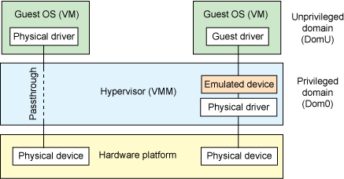

.. _introduction:

Introduction to Project ACRN
############################

The open source project ACRN defines a device hypervisor reference stack
and an architecture for running multiple software subsystems, managed
securely, on a consolidated system by means of a virtual machine
manager. It also defines a reference framework implementation for
virtual device emulation, called the "ACRN Device Model".

The ACRN Hypervisor is a Type 1 reference hypervisor stack, running
directly on the bare-metal hardware, and is suitable for a variety of
IoT and embedded device solutions. The ACRN hypervisor addresses the gap
that currently exists between datacenter hypervisors, and hard
partitioning hypervisors. The ACRN hypervisor architecture partitions
the system into different functional domains, with carefully selected
guest OS sharing optimizations for IoT and embedded devices.

Automotive Use Case Example
***************************

An interesting use case example for the ACRN Hypervisor is in an automotive
scenario.  The ACRN hypervisor can be used for building a Software
Defined Cockpit (SDC) or an In-Vehicle Experience (IVE) solution.  As a
reference implementation, ACRN provides the basis for embedded
hypervisor vendors to build solutions with a reference I/O mediation
solution.

In this scenario, an automotive SDC system consists of the Instrument
Cluster (IC) system, the In-Vehicle Infotainment (IVI) system, and one
or more Rear Seat Entertainment (RSE) systems. Each system is running as
an isolated Virtual Machine (VM) for overall system safety
considerations.

An **Instrument Cluster (IC)** system is used to show the driver operational
information about the vehicle, such as:

- the speed, the fuel level, trip mile and other driving information of
  the car;
- projecting heads-up images on the windshield, with alerts for low
  fuel or tire pressure;
- showing rear-view camera, and surround-view for parking assistance.

An **In-Vehicle Infotainment (IVI)** system's capabilities can include:

- navigation systems, radios, and other entertainment systems;
- connection to mobile devices for phone calls, music, and applications
  via voice recognition;
- control interaction by gesture recognition or touch.

A **Rear Seat Entertainment (RSE)** system could run:

- entertainment system;
- virtual office;
- connection to the front-seat IVI system and mobile devices (cloud
  connectivity).
- connection to mobile devices for phone calls, music, and
  applications via voice recognition;
- control interaction by gesture recognition or touch

The ACRN hypervisor can support both Linux\* VM and Android\* VM as a
User OS, with the User OS managed by the ACRN hypervisor. Developers and
OEMs can use this reference stack to run their own VMs, together with
IC, IVI, and RSE VMs. The Service OS runs as SOS_VM (also known as Dom0 in
other hypervisors) and the User OS runs as POST_LAUNCHED_VM, (also known as DomU).

:numref:`ivi-block` shows an example block diagram of using the ACRN
hypervisor.

   Service OS and User OS on top of ACRN hypervisor

This ACRN hypervisor block diagram shows:

- The ACRN hypervisor sits right on top of the bootloader for fast
  booting capabilities.
- Partitioning of resources to ensure safety-critical and non-safety
  critical domains are able to coexist on one platform.
- Rich I/O mediators allows various I/O devices shared across VMs, and
  thus delivers a comprehensive user experience
- Multiple operating systems are supported by one SoC through efficient
  virtualization.

.. note::
   The yellow color parts in :numref:`ivi-block` are part of the project
   ACRN software stack. This is a reference architecture diagram and not
   all features mentioned are fully functional. Other blocks will come from
   other (open source) projects and are listed here for reference only.

   For example: the Service OS and Linux Guest can come from the Clear
   Linux project at https://clearlinux.org and (in later updates) the
   Android as a Guest support can come from https://01.org/projectceladon.

   For the current ACRN-supported feature list, please see
   :ref:`release_notes`.

Licensing
*********
.. _BSD-3-Clause: https://opensource.org/licenses/BSD-3-Clause

Both the ACRN hypervisor and ACRN Device model software are provided
under the permissive `BSD-3-Clause`_ license, which allows
*"redistribution and use in source and binary forms, with or without
modification"* together with the intact copyright notice and
disclaimers noted in the license.

ACRN Device Model, Service OS, and User OS
******************************************

To keep the hypervisor code base as small and efficient as possible, the
bulk of the device model implementation resides in the Service OS to
provide sharing and other capabilities. The details of which devices are
shared and the mechanism used for their sharing is described in
`pass-through`_ section below.

The Service OS runs with the system's highest virtual machine priority
to ensure required device time-sensitive requirements and system quality
of service (QoS). Service OS tasks run with mixed priority. Upon a
callback servicing a particular User OS request, the corresponding
software (or mediator) in the Service OS inherits the User OS priority.
There may also be additional low-priority background tasks within the
Service OS.

In the automotive example we described above, the User OS is the central
hub of vehicle control and in-vehicle entertainment. It provides support
for radio and entertainment options, control of the vehicle climate
control, and vehicle navigation displays. It also provides connectivity
options for using USB, Bluetooth, and WiFi for third-party device
interaction with the vehicle, such as Android Auto\* or Apple CarPlay*,
and many other features.

Boot Sequence
*************

In :numref:`boot-flow` we show a verified Boot Sequence with UEFI
on an Intel Architecture platform NUC (see :ref:`hardware`).

.. graphviz:: images/boot-flow.dot
   :name: boot-flow
   :align: center
   :caption: ACRN Hypervisor Boot Flow

The Boot process proceeds as follows:

#. UEFI verifies and boots the ACRN hypervisor and Service OS Bootloader
#. UEFI (or Service OS Bootloader) verifies and boots Service OS kernel
#. Service OS kernel verifies and loads ACRN Device Model and Virtual
   bootloader through dm-verity
#. Virtual bootloader starts the User-side verified boot process

ACRN Hypervisor Architecture
****************************

ACRN hypervisor is a Type 1 hypervisor, running directly on bare-metal
hardware. It implements a hybrid VMM architecture, using a privileged
service VM, running the Service OS that manages the I/O devices and
provides I/O mediation. Multiple User VMs are supported, with each of
them running Linux\* or Android\* OS as the User OS .

Running systems in separate VMs provides isolation between other VMs and
their applications, reducing potential attack surfaces and minimizing
safety interference.  However, running the systems in separate VMs may
introduce additional latency for applications.

:numref:`ACRN-architecture` shows the ACRN hypervisor architecture, with
the automotive example IC VM and service VM together. The Service OS
(SOS) owns most of the devices including the platform devices, and
provides I/O mediation. Some of the PCIe devices may be passed through
to the User OSes via the VM configuration. The SOS runs the IC
applications and hypervisor-specific applications together, such as the
ACRN device model, and ACRN VM manager.

ACRN hypervisor also runs the ACRN VM manager to collect running
information of the User OS, and controls the User VM such as starting,
stopping, and pausing a VM, pausing or resuming a virtual CPU.

.. figure:: images/architecture.png
   :align: center
   :name: ACRN-architecture

   ACRN Hypervisor Architecture

ACRN hypervisor takes advantage of Intel Virtualization Technology
(Intel VT), and ACRN hypervisor runs in Virtual Machine Extension (VMX)
root operation, or host mode, or VMM mode. All the guests, including
UOS and SOS, run in VMX non-root operation, or guest mode. (Hereafter,
we use the terms VMM mode and Guest mode for simplicity).

The VMM mode has 4 protection rings, but runs the ACRN hypervisor in
ring 0 privilege only, leaving rings 1-3 unused. The guest (including
SOS & UOS), running in Guest mode, also has its own four protection
rings (ring 0 to 3). The User kernel runs in ring 0 of guest mode, and
user land applications run in ring 3 of User mode (ring 1 & 2 are
usually not used by commercial OSes).

.. figure:: images/VMX-brief.png
   :align: center
   :name: VMX-brief

   VMX Brief

As shown in :numref:`VMX-brief`, VMM mode and guest mode are switched
through VM Exit and VM Entry. When the bootloader hands off control to
the ACRN hypervisor, the processor hasn't enabled VMX operation yet. The
ACRN hypervisor needs to enable VMX operation thru a VMXON instruction
first. Initially, the processor stays in VMM mode when the VMX operation
is enabled. It enters guest mode thru a VM resume instruction (or first
time VM launch), and returns back to VMM mode thru a VM exit event. VM
exit occurs in response to certain instructions and events.

The behavior of processor execution in guest mode is controlled by a
virtual machine control structure (VMCS). VMCS contains the guest state
(loaded at VM Entry, and saved at VM Exit), the host state, (loaded at
the time of VM exit), and the guest execution controls. ACRN hypervisor
creates a VMCS data structure for each virtual CPU, and uses the VMCS to
configure the behavior of the processor running in guest mode.

When the execution of the guest hits a sensitive instruction, a VM exit
event may happen as defined in the VMCS configuration. Control goes back
to the ACRN hypervisor when the VM exit happens. The ACRN hypervisor
emulates the guest instruction (if the exit was due to privilege issue)
and resumes the guest to its next instruction, or fixes the VM exit
reason (for example if a guest memory page is not mapped yet) and resume
the guest to re-execute the instruction.

Note that the address space used in VMM mode is different from that in
guest mode. The guest mode and VMM mode use different memory mapping
tables, and therefore the ACRN hypervisor is protected from guest
access. The ACRN hypervisor uses EPT to map the guest address, using the
guest page table to map from guest linear address to guest physical
address, and using the EPT table to map from guest physical address to
machine physical address or host physical address (HPA).

ACRN Device Model Architecture
******************************

Because devices may need to be shared between VMs, device emulation is
used to give VM applications (and OSes) access to these shared devices.
Traditionally there are three architectural approaches to device
emulation:

* The first architecture is **device emulation within the hypervisor** which
  is a common method implemented within the VMware\* workstation product
  (an operating system-based hypervisor). In this method, the hypervisor
  includes emulations of common devices that the various guest operating
  systems can share, including virtual disks, virtual network adapters,
  and other necessary platform elements.

* The second architecture is called **user space device emulation**. As the
  name implies, rather than the device emulation being embedded within
  the hypervisor, it is instead implemented in a separate user space
  application. QEMU, for example, provides this kind of device emulation
  also used by a large number of independent hypervisors. This model is
  advantageous, because the device emulation is independent of the
  hypervisor and can therefore be shared for other hypervisors. It also
  permits arbitrary device emulation without having to burden the
  hypervisor (which operates in a privileged state) with this
  functionality.

* The third variation on hypervisor-based device emulation is
  **paravirtualized (PV) drivers**. In this model introduced by the `XEN
  project`_ the hypervisor includes the physical drivers, and each guest
  operating system includes a hypervisor-aware driver that works in
  concert with the hypervisor drivers.

.. _XEN project:
   https://wiki.xenproject.org/wiki/Understanding_the_Virtualization_Spectrum

In the device emulation models discussed above, there's a price to pay
for sharing devices. Whether device emulation is performed in the
hypervisor, or in user space within an independent VM, overhead exists.
This overhead is worthwhile as long as the devices need to be shared by
multiple guest operating systems. If sharing is not necessary, then
there are more efficient methods for accessing devices, for example
"pass-through".

ACRN device model is a placeholder of the UOS. It allocates memory for
the User OS, configures and initializes the devices used by the UOS,
loads the virtual firmware, initializes the virtual CPU state, and
invokes the ACRN hypervisor service to execute the guest instructions.
ACRN Device model is an application running in the Service OS that
emulates devices based on command line configuration, as shown in
the architecture diagram :numref:`device-model` below:

.. figure:: images/device-model.png
   :align: center
   :name: device-model

   ACRN Device Model

ACRN Device model incorporates these three aspects:

**Device Emulation**:
  ACRN Device model provides device emulation routines that register
  their I/O handlers to the I/O dispatcher. When there is an I/O request
  from the User OS device, the I/O dispatcher sends this request to the
  corresponding device emulation routine.

**I/O Path**: 
  see `ACRN-io-mediator`_ below

**VHM**: 
  The Virtio and Hypervisor Service Module is a kernel module in the
  Service OS acting as a middle layer to support the device model. The VHM
  and its client handling flow is described below:

  #. ACRN hypervisor IOREQ is forwarded to the VHM by an upcall
     notification to the SOS.
  #. VHM will mark the IOREQ as "in process" so that the same IOREQ will
     not pick up again. The IOREQ will be sent to the client for handling.
     Meanwhile, the VHM is ready for another IOREQ.
  #. IOREQ clients are either an SOS Userland application or a Service OS
     Kernel space module. Once the IOREQ is processed and completed, the
     Client will issue an IOCTL call to the VHM to notify an IOREQ state
     change. The VHM then checks and hypercalls to ACRN hypervisor
     notifying it that the IOREQ has completed.

.. note::
   Userland: dm as ACRN Device Model.

   Kernel space: VBS-K, MPT Service, VHM itself

.. _pass-through:

Device pass through
*******************

At the highest level, device pass-through is about providing isolation
of a device to a given guest operating system so that the device can be
used exclusively by that guest.

   Device Passthrough

Near-native performance can be achieved by using device passthrough.
This is ideal for networking applications (or those with high disk I/O
needs) that have not adopted virtualization because of contention and
performance degradation through the hypervisor (using a driver in the
hypervisor or through the hypervisor to a user space emulation).
Assigning devices to specific guests is also useful when those devices
inherently wouldn't be shared. For example, if a system includes
multiple video adapters, those adapters could be passed through to
unique guest domains.

Finally, there may be specialized PCI devices that only one guest domain
uses, so they should be passed through to the guest. Individual USB
ports could be isolated to a given domain too, or a serial port (which
is itself not shareable) could be isolated to a particular guest. In
ACRN hypervisor, we support USB controller Pass through only and we
don't support pass through for a legacy serial port, (for example
0x3f8).

Hardware support for device passthrough
=======================================

Intel's current processor architectures provides support for device
pass-through with VT-d. VT-d maps guest physical address to machine
physical address, so device can use guest physical address directly.
When this mapping occurs, the hardware takes care of access (and
protection), and the guest operating system can use the device as if it
were a non-virtualized system. In addition to mapping guest to physical
memory, isolation prevents this device from accessing memory belonging
to other guests or the hypervisor.

Another innovation that helps interrupts scale to large numbers of VMs
is called Message Signaled Interrupts (MSI). Rather than relying on
physical interrupt pins to be associated with a guest, MSI transforms
interrupts into messages that are more easily virtualized (scaling to
thousands of individual interrupts). MSI has been available since PCI
version 2.2 but is also available in PCI Express (PCIe), where it allows
fabrics to scale to many devices. MSI is ideal for I/O virtualization,
as it allows isolation of interrupt sources (as opposed to physical pins
that must be multiplexed or routed through software).

Hypervisor support for device passthrough
=========================================

By using the latest virtualization-enhanced processor architectures,
hypervisors and virtualization solutions can support device
pass-through (using VT-d), including Xen, KVM, and ACRN hypervisor.
In most cases, the guest operating system (User
OS) must be compiled to support pass-through, by using
kernel build-time options. Hiding the devices from the host VM may also
be required (as is done with Xen using pciback). Some restrictions apply
in PCI, for example, PCI devices behind a PCIe-to-PCI bridge must be
assigned to the same guest OS. PCIe does not have this restriction.

.. _ACRN-io-mediator:

ACRN I/O mediator
*****************

:numref:`io-emulation-path` shows the flow of an example I/O emulation path.

.. figure:: images/io-emulation-path.png
   :align: center
   :name: io-emulation-path

   I/O Emulation Path

Following along with the numbered items in :numref:`io-emulation-path`:

1. When a guest execute an I/O instruction (PIO or MMIO), a VM exit happens.
   ACRN hypervisor takes control, and analyzes the the VM
   exit reason, which is a VMX_EXIT_REASON_IO_INSTRUCTION for PIO access.
2. ACRN hypervisor fetches and analyzes the guest instruction, and
   notices it is a PIO instruction (``in AL, 20h`` in this example), and put
   the decoded information (including the PIO address, size of access,
   read/write, and target register) into the shared page, and
   notify/interrupt the SOS to process.
3. The Virtio and hypervisor service module (VHM) in SOS receives the
   interrupt, and queries the IO request ring to get the PIO instruction
   details.
4. It checks to see if any kernel device claims
   ownership of the IO port: if a kernel module claimed it, the kernel
   module is activated to execute its processing APIs. Otherwise, the VHM
   module leaves the IO request in the shared page and wakes up the
   device model thread to process.
5. The ACRN device model follow the same mechanism as the VHM. The I/O
   processing thread of device model queries the IO request ring to get the
   PIO instruction details and checks to see if any (guest) device emulation
   module claims ownership of the IO port: if a module claimed it,
   the module is invoked to execute its processing APIs.
6. After the ACRN device module completes the emulation (port IO 20h access
   in this example), (say uDev1 here), uDev1 puts the result into the
   shared page (in register AL in this example). 
7. ACRN device model then returns control to ACRN hypervisor to indicate the
   completion of an IO instruction emulation, typically thru VHM/hypercall.
8. The ACRN hypervisor then knows IO emulation is complete, and copies
   the result to the guest register context.
9. The ACRN hypervisor finally advances the guest IP to
   indicate completion of instruction execution, and resumes the guest.

The MMIO path is very similar, except the VM exit reason is different. MMIO
access usually is trapped thru VMX_EXIT_REASON_EPT_VIOLATION in
the hypervisor.

Virtio framework architecture
*****************************

.. _Virtio spec:
   http://docs.oasis-open.org/virtio/virtio/v1.0/virtio-v1.0.html

Virtio is an abstraction for a set of common emulated devices in any
type of hypervisor. In the ACRN reference stack, our
implementation is compatible with `Virtio spec`_ 0.9 and 1.0. By
following this spec, virtual environments and guests
should have a straightforward, efficient, standard and extensible
mechanism for virtual devices, rather than boutique per-environment or
per-OS mechanisms.

Virtio provides a common frontend driver framework which not only
standardizes device interfaces, but also increases code reuse across
different virtualization platforms.

.. figure:: images/virtio-architecture.png
   :align: center
   :name: virtio-architecture

   Virtio Architecture

To better understand Virtio, especially its usage in
the ACRN project, several key concepts of Virtio are highlighted
here:

**Front-End Virtio driver** (a.k.a. frontend driver, or FE driver in this document)
  Virtio adopts a frontend-backend architecture, which enables a simple
  but flexible framework for both frontend and backend Virtio driver. The
  FE driver provides APIs to configure the interface, pass messages, produce
  requests, and notify backend Virtio driver. As a result, the FE driver
  is easy to implement and the performance overhead of emulating device is
  eliminated.

**Back-End Virtio driver** (a.k.a. backend driver, or BE driver in this document)
  Similar to FE driver, the BE driver, runs either in user-land or
  kernel-land of host OS. The BE driver consumes requests from FE driver
  and send them to the host's native device driver. Once the requests are
  done by the host native device driver, the BE driver notifies the FE
  driver about the completeness of the requests.

**Straightforward**: Virtio devices as standard devices on existing Buses
  Instead of creating new device buses from scratch, Virtio devices are
  built on existing buses. This gives a straightforward way for both FE
  and BE drivers to interact with each other. For example, FE driver could
  read/write registers of the device, and the virtual device could
  interrupt FE driver, on behalf of the BE driver, in case of something is
  happening.  Currently Virtio supports PCI/PCIe bus and MMIO bus. In
  ACRN project, only PCI/PCIe bus is supported, and all the Virtio devices
  share the same vendor ID 0x1AF4.

**Efficient**: batching operation is encouraged
  Batching operation and deferred notification are important to achieve
  high-performance I/O, since notification between FE and BE driver
  usually involves an expensive exit of the guest. Therefore batching
  operating and notification suppression are highly encouraged if
  possible. This will give an efficient implementation for the performance
  critical devices.

**Standard: virtqueue**
  All the Virtio devices share a standard ring buffer and descriptor
  mechanism, called a virtqueue, shown in Figure 6. A virtqueue
  is a queue of scatter-gather buffers. There are three important
  methods on virtqueues:

  * ``add_buf`` is for adding a request/response buffer in a virtqueue
  * ``get_buf`` is for getting a response/request in a virtqueue, and
  * ``kick`` is for notifying the other side for a virtqueue to
    consume buffers.

  The virtqueues are created in guest physical memory by the FE drivers.
  The BE drivers only need to parse the virtqueue structures to obtain
  the requests and get the requests done. How virtqueue is organized is
  specific to the User OS. In the implementation of Virtio in Linux, the
  virtqueue is implemented as a ring buffer structure called vring.

  In ACRN, the virtqueue APIs can be leveraged
  directly so users don't need to worry about the details of the
  virtqueue. Refer to the User OS for
  more details about the virtqueue implementations.

**Extensible: feature bits**
  A simple extensible feature negotiation mechanism exists for each virtual
  device and its driver. Each virtual device could claim its
  device specific features while the corresponding driver could respond to
  the device with the subset of features the driver understands. The
  feature mechanism enables forward and backward compatibility for the
  virtual device and driver.

In the ACRN reference stack, we implement user-land and kernel
space as shown in :numref:`virtio-framework-userland`:

.. figure:: images/virtio-framework-userland.png
   :align: center
   :name: virtio-framework-userland

   Virtio Framework - User Land

In the Virtio user-land framework, the implementation is compatible with
Virtio Spec 0.9/1.0. The VBS-U is statically linked with Device Model,
and communicates with Device Model through the PCIe interface: PIO/MMIO
or MSI/MSIx. VBS-U accesses Virtio APIs through user space vring service
API helpers. User space vring service API helpers access shared ring
through remote memory map (mmap). VHM maps UOS memory with the help of
ACRN Hypervisor.

.. figure:: images/virtio-framework-kernel.png
   :align: center
   :name: virtio-framework-kernel

   Virtio Framework - Kernel Space

VBS-U offloads data plane processing to VBS-K. VBS-U initializes VBS-K
at the right timings, for example. The FE driver sets
VIRTIO_CONFIG_S_DRIVER_OK to avoid unnecessary device configuration
changes while running. VBS-K can access shared rings through VBS-K
virtqueue APIs. VBS-K virtqueue APIs are similar to VBS-U virtqueue
APIs. VBS-K registers as VHM client(s) to handle a continuous range of
registers

There may be one or more VHM-clients for each VBS-K, and there can be a
single VHM-client for all VBS-Ks as well. VBS-K notifies FE through VHM
interrupt APIs.
