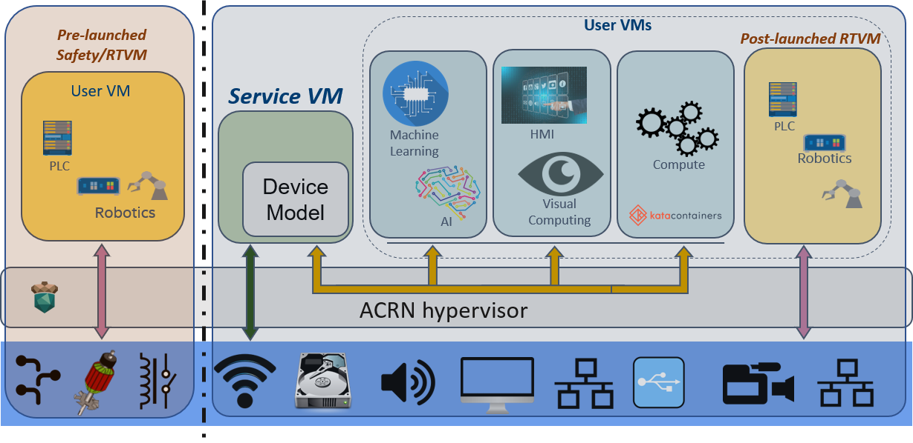

.. _release_notes_2.0:

ACRN v2.0 (Jun 2020)
####################

We are pleased to announce the second major release of the Project ACRN
hypervisor.

ACRN v2.0 offers new and improved scenario definitions, with a focus on
industrial IoT and edge device use cases. ACRN supports these uses with
their demanding and varying workloads including Functional Safety
certification, real-time characteristics, device and CPU sharing, and
general computing power needs, while honoring required isolation and
resource partitioning. A wide range of User VM OSs (such as Windows 10,
Ubuntu, Android, and VxWorks) can run on ACRN, running different
workloads and applications on the same hardware platform.

A new hybrid-mode architecture adds flexibility to simultaneously
support both traditional resource sharing among VMs and complete VM
resource partitioning required for functional safety requirements.

Workload management and orchestration, rather standard and mature in
cloud environments, are enabled now in ACRN, allowing open source
orchestrators such as OpenStack to manage ACRN virtual machines. Kata
Containers, a secure container runtime, has also been enabled on ACRN
and can be orchestrated via Docker or Kubernetes.

Rounding things out, we've also made significant improvements in
configuration tools, added many new tutorial documents, and enabled ACRN
on the QEMU machine emulator making it easier to try out and develop with
ACRN.

ACRN is a flexible, lightweight reference hypervisor that is built with
real-time and safety-criticality in mind. It is optimized to streamline
embedded development through an open source platform. Check out
:ref:`introduction` for more information.  All project ACRN source code
is maintained in the https://github.com/projectacrn/acrn-hypervisor
repository and includes folders for the ACRN hypervisor, the ACRN device
model, tools, and documentation. You can either download this source
code as a zip or tar.gz file (see the `ACRN v2.0 GitHub release page
<https://github.com/projectacrn/acrn-hypervisor/releases/tag/v2.0>`_)
or use Git clone and checkout commands::

   git clone https://github.com/projectacrn/acrn-hypervisor
   cd acrn-hypervisor
   git checkout v2.0

The project's online technical documentation is also tagged to
correspond with a specific release: generated v2.0 documents can be
found at https://projectacrn.github.io/2.0/.  Documentation for the
latest (master) branch is found at
https://projectacrn.github.io/latest/.
Follow the instructions in the :ref:`rt_industry_ubuntu_setup` to get
started with ACRN.

We recommend that all developers upgrade to ACRN release v2.0.

Version 2.0 Key Features (comparing with v1.0)
**********************************************

.. contents::
   :local:
   :backlinks: entry

ACRN Architecture Upgrade to Support Hybrid Mode
================================================

The ACRN architecture has evolved after its initial major 1.0 release in
May 2019.  The new hybrid mode architecture has the flexibility to
support both partition mode and sharing mode simultaneously, as shown in
this architecture diagram:

   ACRN V2 high-level architecture

On the left, resources are partitioned and used by a pre-launched User
Virtual Machine (VM), started by the hypervisor before the Service VM
has been launched. It runs independent of other virtual machines, and
can own its own dedicated hardware resources, such as a CPU core,
memory, and I/O devices. Because other VMs may not even be aware of its
existence, this pre-launched VM can be used as a safety VM where, for
example, platform hardware failure detection code can run and take
emergency actions if a system critical failure occurs.

On the right, the remaining hardware resources are shared by the Service
VM and User VMs.  The Service VM can access hardware resources directly
(by running native drivers) and offer device sharing services to other
User VMs by the Device Model.

Also on the right, a special post-launched real-time VM (RTVM) can run a
hard real-time OS, such as VxWorks*, Zephyr*, or Xenomai*. Because of
its real-time capabilities, the RTVM can be used for soft PLC, IPC, or
Robotics applications.

New Hardware Platform Support
=============================

This release adds support for 8th Gen Intel® Core™ Processors (code
name: Whiskey Lake). (See :ref:`hardware` for platform details.)

Pre-launched Safety VM Support
==============================

ACRN supports a pre-launched partitioned safety VM, isolated from the
Service VM and other post-launched VM by using partitioned HW resources.
For example, in the hybrid mode, a real-time Zephyr RTOS VM can be
*pre-launched* by the hypervisor even before the Service VM is launched,
and with its own dedicated resources to achieve a high level of
isolation. This is designed to meet the needs of a Functional Safety OS.

Post-launched VM support via OVMF
=================================

ACRN supports Open Virtual Machine Firmware (OVMF) as a virtual boot
loader for the Service VM to launch post-launched VMs such as Windows,
Linux, VxWorks, or Zephyr RTOS. Secure boot is also supported.

Post-launched Real-Time VM Support
==================================

ACRN supports a post-launched RTVM, which also uses partitioned hardware
resources to ensure adequate real-time performance, as required for
industrial use cases.

Real-Time VM Performance Optimizations
======================================

ACRN 2.0 improves RTVM performance with these optimizations:

* **Eliminate use of VM-Exit and its performance overhead:**
   Use Local APIC (LAPIC) passthrough, Virtio Polling Mode Drivers (PMD),
   and NMI interrupt notification technologies.

* **Isolate the RTVM from the Service VM:**
   The ACRN hypervisor uses RDT (Resource Director Technology)
   allocation features such as CAT (Cache Allocation Technology), CDP (Code
   Data Prioritization), and MBA (Memory Bandwidth Allocation) to provide
   better isolation and prioritize critical resources, such as cache and
   memory bandwidth, for RTVMs over other VMs.

* **PCI Configuration space access emulation for passthrough devices in the hypervisor:**
   The hypervisor provides the necessary emulation (such as config space)
   of the passthrough PCI device during runtime for a DM-launched VM from
   Service VM.

* **More hypervisor-emulated devices:**
   This includes vPCI and vPCI bridge emulation, and vUART.

* **ART (Always Running Timer Virtualization):**
   Ensure time is synchronized between Ptdev and vART

CPU Sharing Support
===================

ACRN supports CPU Sharing to fully utilize the physical CPU resource
across more virtual machines. ACRN enables a borrowed virtual time CPU
scheduler in the hypervisor to make sure the physical CPU can be shared
between VMs and support for yielding an idle vCPU when it's running a
'HLT' or 'PAUSE' instruction.

Large selection of OSs for User VMs
===================================

ACRN now supports Windows* 10, Android*, Ubuntu*, Xenomai, VxWorks*,
Real-Time Linux*, and Zephyr* RTOS.  ACRN's Windows support now conforms
to the Microsoft* Hypervisor Top-Level Functional Specification (TLFS).
ACRN 2.0 also improves overall Windows as a Guest (WaaG) stability and
performance.

GRUB bootloader
===============

The ACRN hypervisor can boot from the popular GRUB bootloader using
either the multiboot or multiboot2 prococol (the latter adding UEFI
support). GRUB provides developers with booting flexibility.

SR-IOV Support
==============

SR-IOV (Single Root Input/Output Virtualization) can isolate PCIe
devices to offer performance similar to bare-metal levels. For a
network adapter, for example, this enables network traffic to bypass the
software switch layer in the virtualization stack and achieve network
performance that is nearly the same as in a nonvirtualized environment.
In this example, the ACRN Service VM supports a SR-IOV ethernet device
through the Physical Function (PF) driver, and ensures that the SR-IOV
Virtual Function (VF) device can passthrough to a post-launched VM.

Graphics passthrough support
============================

ACRN supports GPU passthrough to dedicated User VM based on Intel GVT-d
technology used to virtualize the GPU for multiple guest VMs,
effectively providing near-native graphics performance in the VM.

Shared memory based Inter-VM communication
==========================================

ACRN supports Inter-VM communication based on shared memory for
post-launched VMs communicating via a Userspace I/O (UIO) interface.

Configuration Tool Support
==========================

A new offline configuration tool helps developers deploy ACRN to
different hardware systems with its own customization.

Kata Containers Support
=======================

ACRN can launch a Kata container, a secure container runtime,  as a User VM.

VM orchestration
================

Libvirt is an open-source API, daemon, and management tool as a layer to
decouple orchestrators and hypervisors. By adding a "ACRN driver", ACRN
supports libvirt-based tools and orchestrators to configure a User VM's CPU
configuration during VM creation.

Document updates
================
Many new and updated `reference documents <https://projectacrn.github.io>`_ are available, including:

* General

  * :ref:`introduction`
  * :ref:`hardware`
  * :ref:`asa`

* Getting Started

  * :ref:`rt_industry_ubuntu_setup`
  * :ref:`using_partition_mode_on_nuc`

* Configuration and Tools

  * :ref:`acrn_configuration_tool`

* Service VM Tutorials

  * :ref:`running_deb_as_serv_vm`

* User VM Tutorials

  .. rst-class:: rst-columns2

  * :ref:`using_zephyr_as_uos`
  * :ref:`running_deb_as_user_vm`
  * :ref:`using_celadon_as_uos`
  * :ref:`using_windows_as_uos`
  * :ref:`using_vxworks_as_uos`
  * :ref:`using_xenomai_as_uos`

* Enable ACRN Features

  .. rst-class:: rst-columns2

  * :ref:`open_vswitch`
  * :ref:`rdt_configuration`
  * :ref:`sriov_virtualization`
  * :ref:`cpu_sharing`
  * :ref:`run-kata-containers`
  * :ref:`how-to-enable-secure-boot-for-windows`
  * :ref:`enable-s5`
  * :ref:`vuart_config`
  * :ref:`sgx_virt`
  * :ref:`acrn-dm_qos`
  * :ref:`setup_openstack_libvirt`
  * :ref:`acrn_on_qemu`
  * :ref:`gpu-passthrough`
  * :ref:`using_grub`

* Debug

  * :ref:`rt_performance_tuning`
  * :ref:`rt_perf_tips_rtvm`

* High-Level Design Guides

  * :ref:`virtio-i2c`
  * :ref:`split-device-model`
  * :ref:`hv-device-passthrough`
  * :ref:`vtd-posted-interrupt`

Fixed Issues Details
********************
- :acrn-issue:`3715` -  Add support for multiple RDT resource allocation and fix L3 CAT config overwrite by L2
- :acrn-issue:`3770` -  Warning when building the ACRN hypervisor \`SDC (defined at arch/x86/Kconfig:7) set more than once`
- :acrn-issue:`3773` -  suspicious logic in vhost.c
- :acrn-issue:`3918` -  Change active_hp_work position for code cleaning and add a module parameter to disable hp work.
- :acrn-issue:`3939` -  zero-copy non-functional with vhost
- :acrn-issue:`3946` -  Cannot boot VxWorks as UOS on KabyLake
- :acrn-issue:`4017` -  hv: rename vuart operations
- :acrn-issue:`4046` -  Error info popoup when run 3DMARK11 on Waag
- :acrn-issue:`4072` -  hv: add printf "not support the value of vuart index parameter" in function vuart_register_io_handler
- :acrn-issue:`4191` -  acrnboot: the end address of _DYNAME region is not calculated correct
- :acrn-issue:`4250` -  acrnboot: parse hv cmdline incorrectly when containing any trailing white-spaces
- :acrn-issue:`4283` -  devicemodel: refactor CMD_OPT_LAPIC_PT case branch
- :acrn-issue:`4314` -  RTVM boot up fail due to init_hugetlb failed during S5 testing
- :acrn-issue:`4365` -  Enable GOP driver work in GVT-d scenario
- :acrn-issue:`4520` -  efi-stub could get wrong bootloader name
- :acrn-issue:`4628` -  HV: guest: fix bug in get_vcpu_paging_mode
- :acrn-issue:`4630` -  The \`board_parser.py` tool contains a few grammatical mistakes and typos
- :acrn-issue:`4664` -  Wake up vCPU for interrupts from vPIC
- :acrn-issue:`4666` -  Fix offline tool to generate info in pci_dev file for logical partition scenario
- :acrn-issue:`4680` -  Fix potential dead loop if VT-d QI request timeout
- :acrn-issue:`4688` -  RELEASE=n does not take effect while using xml to make hypervisor
- :acrn-issue:`4703` -  Failed to launch WaaG at a high probablity if enable CPU sharing in GVT-d.
- :acrn-issue:`4711` -  WaaG reboot will core dump with USB mediator
- :acrn-issue:`4797` -  [acrn-configuration-tool] The VM name is always 1 when using web app to generate the launch script
- :acrn-issue:`4799` -  [acrn-configuration-tool]wrong parameter for Soft RT/Hard RT vm in launch script
- :acrn-issue:`4827` -  Missing explicit initialization of pci_device_lock
- :acrn-issue:`4868` -  [acrn-configuation-tool]efi bootloader image file of Yocto industry build not match with default xmls
- :acrn-issue:`4889` -  [WHL][QEMU][HV] With latest master branch HV, build ACRN for Qemu fail

Known Issues
************
- :acrn-issue:`4047` - [WHL][Function][WaaG] passthru usb, Windows will hang when reboot it
- :acrn-issue:`4313` - [WHL][VxWorks] Failed to ping when VxWorks passthru network
- :acrn-issue:`4557` - [WHL][Performance][WaaG] Failed to run 3D directX9 during Passmark9.0 performance test with 7212 gfx driver
- :acrn-issue:`4558` - [WHL][Performance][WaaG] WaaG reboot automatically during run 3D directX12 with 7212 gfx driver
- :acrn-issue:`4982` - [WHL]ivshmemTest transfer file failed after UOS shutdown or reboot
- :acrn-issue:`4983` - [WHL][RTVM]without any virtio device, with only pass-through devices, RTVM can't boot from SATA
