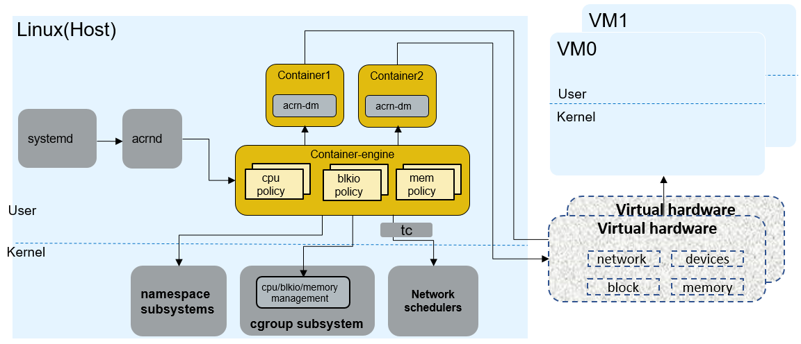
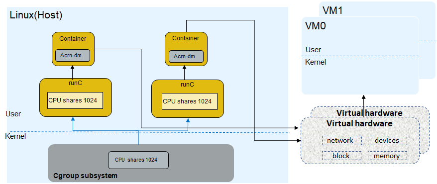

.. _acrn-dm_qos:

Enable QoS based on runC container
##################################
This document describes how ACRN supports Device-Model Quality of Service (QoS)
based on using runC containers to control the SOS resources
(CPU, Storage, Memory, Network) by modifying the runC configuration file.

What is QoS
***********
Traditionally, Quality of Service (QoS) is the description or measurement
of the overall performance of a service, such as a `computer network
<https://en.wikipedia.org/wiki/Computer_network>`_ or a `cloud computing
<https://en.wikipedia.org/wiki/Cloud_computing>`_ service,
particularly the performance is seen by the users on the network.

What is runC container
**********************
Containers are an abstraction at the application layer that packages code
and dependencies together. Multiple containers can run on the same machine
and share the OS kernel with other containers, each running as
isolated processes in user space. `runC
<https://github.com/opencontainers/runc>`_, a lightweight universal container runtime,
is a command-line tool for spawning and running containers according
to the `Open Container Initiative (OCI)
<https://www.opencontainers.org/>`_ specification.

ACRN-DM QoS architecture
************************
In ACRN-DM QoS design, we run the ACRN-DM in a runC container environment.
Every time we start a UOS, we first start a runC container and
then launch the ACRN-DM within that container.
The ACRN-DM QoS can manage these resources for Device-Model:

- CPU utilization
- Memory amount/limitation
- I/O bandwidth
- Network throughput

   ACRN-DM QoS architecture

ACRN-QoS CPU utilization example
********************************
In runC ``config.json`` we set the CPU resource as shown below for VM0 and VM1:

.. code-block:: none

   "cpu": {
      "shares": 1024,
      "quota": 1000000,
      "period": 500000,
      "realtimeRuntime": 950000,
      "realtimePeriod": 1000000,
      "mems": "0-7"
   },

In this example the `cpu.shares
<https://access.redhat.com/documentation/en-us/red_hat_enterprise_linux/6/html/resource_management_guide/sec-cpu>`_
value is 1024, so the VM0 and VM1 device model
CPU utilization is ``1024 / (1024 + 1024 + 1024) = 33%``, which means
the maximal CPU resource for the VM0 or VM1 is 33% of the entire CPU resource.

   CPU utilization image

How to use ACRN-DM QoS
**********************
#. Add these parameters to the ``runC.json`` file:

   .. code-block:: none

      # vim /usr/share/acrn/samples/nuc/runC.json

   .. code-block:: none

      "linux": {
         "resources": {
            "memory": {
               "limit": 536870912,
               "reservation": 536870912,
               "swap": 536870912,
               "kernel": -1,
               "kernelTCP": -1,
               "swappiness": 0,
               "disableOOMKiller": false
            },
            "cpu": {
               "shares": 1024,
               "quota": 1000000,
               "period": 500000,
               "mems": "0-7"
            },
            "devices": [
               {
                  "allow": true,
                  "access": "rwm"
               }
            ]
         },

   .. note:: For configuration details, refer to the `Open Containers configuration documentation
      <https://github.com/opencontainers/runtime-spec/blob/master/config.md>`_.

#. Add the UOS by ``acrnctl add`` command:

   .. code-block:: none

      # acrnctl add launch_uos.sh -C

   .. note:: You can download an `example launch_uos.sh script
      <https://raw.githubusercontent.com/projectacrn/acrn-hypervisor/master/devicemodel/samples/nuc/launch_uos.sh>`_
      that supports the ``-C``  (``run_container`` function) option.

#. Start the UOS by ``acrnd``

   .. code-block:: none

      # acrnd -t

#. After UOS boots, you may use ``runc list`` command to check the container status in SOS:

   .. code-block:: none

      # runc list
      ID          PID         STATUS      BUNDLE                              CREATED                        OWNER
      vm1         1686        running     /usr/share/acrn/conf/add/runc/vm1   2019-06-27T08:16:40.9039293Z   #0
