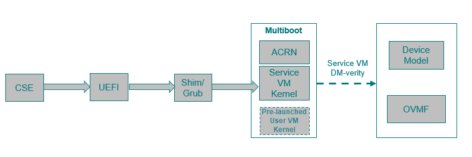

.. _how-to-enable-acrn-secure-boot-with-grub:

Enable ACRN Secure Boot With GRUB
#################################

This document shows how to enable ACRN secure boot with GRUB including:

-  `ACRN Secure Boot Sequence`_
-  `Generate GPG Key`_
-  `Setup Standalone GRUB EFI Binary`_
-  `Enable UEFI Secure Boot`_

**Validation Environment:**

- Hardware Platform: Tiger Lake, supported hardware described in
  :ref:`hardware`.
- ACRN Scenario: Shared
- Service VM: Yocto & Ubuntu
- GRUB: 2.04

.. note::
   Note that GRUB may stop booting in case of problems, make sure you
   know how to recover a bootloader on your platform.

ACRN Secure Boot Sequence
*************************

ACRN can be booted by a multiboot compatible bootloader. The following diagram
illustrates the boot sequence of ACRN with GRUB:

For details on enabling GRUB on ACRN, see :ref:`using_grub`.

From a secure boot point of view:

- UEFI firmware verifies shim/GRUB
- GRUB verifies ACRN, Service VM kernel, and pre-launched User VM kernel
- Service VM OS kernel verifies the Device Model (``acrn-dm``) and User
  VM OVMF bootloader (with the help of ``acrn-dm``)
- User VM virtual bootloader (e.g., OVMF) starts the guest side verified boot process

This document shows you how to enable GRUB to
verify ACRN binaries such as ``acrn.bin``, Service VM kernel (``bzImage``), and
if present, a pre-launched User VM kernel image.

.. rst-class:: numbered-step

Generate GPG Key
****************

GRUB supports loading GPG signed files only if digital signatures are
enabled. Here's an example of generating a GPG signing key::

  mkdir --mode 0700 keys
  gpg --homedir keys  --gen-key
  gpg --homedir keys --export > boot.key

The :command:`gpg --gen-key` generates a public and private key pair.
The private key is used to sign GRUB configuration files and ACRN
binaries. The public key will be embedded in GRUB and is used to verify
GRUB configuration files or binaries GRUB tries to load.

.. rst-class:: numbered-step

Setup Standalone GRUB EFI Binary
********************************

Prepare Initial GRUB Configuration grub.init.cfg
================================================

Create file ``grub.init.cfg`` to store the following minimal GRUB
configuration.  The environment variable ``check_signatures=enforce``
tells GRUB to enable digital signatures::

    set check_signatures=enforce
    export check_signatures

    search --no-floppy --fs-uuid --set=root ESP_UUID
    configfile /grub.cfg
    echo /grub.cfg did not boot the system, rebooting in 10 seconds.
    sleep 10
    reboot

Replace the ESP_UUID with the UUID of your EFI system partition (found
by running the :command:`lsblk -f`.  In the example output below,
the UUID is ``24FC-BE7A``:

.. code-block:: console
    :emphasize-lines: 2

    sda
    ├─sda1 vfat   ESP    24FC-BE7A                            /boot/efi
    ├─sda2 vfat   OS     7015-557F
    ├─sda3 ext4   UBUNTU e8640994-b2a3-45ad-9b72-e68960fb22f0 /
    └─sda4 swap          262d1113-64be-4910-a700-670b9d2277cc [SWAP]

Enable Authentication in GRUB
=============================

With authentication enabled, a user/password is required to restrict
access to the GRUB shell, where arbitrary commands could be run.
A typical GRUB configuration fragment (added to ``grub.init.cfg``) might
look like this::

    set superusers="root"
    export superusers
    password_pbkdf2 root GRUB_PASSWORD_HASH

Replace the ``GRUB_PASSWORD_HASH`` with the result of the :command:`grub-mkpasswd-pbkdf2`
with your custom passphrase.

Use this command to sign the :file:`grub.init.cfg` file with your private
GPG key and create the :file:`grub.init.cfg.sig`::

    gpg --homedir keys --detach-sign grub.init.cfg

Create Standalone GRUB EFI Binary
=================================

Use the ``grub-mkstandalone`` tool to create a standalone GRUB EFI binary
file with the buit-in modules and the signed ``grub.init.cfg`` file.
The ``--pubkey`` option adds a GPG public key that will be used for
verification. The public key ``boot.key`` is no longer required.

.. note::
    You should make a backup copy of your current GRUB image
    (:file:`grubx64.efi`) before replacing it with the new signed GRUB image.
    This would allow you to restore GRUB in case of errors updating it.

Here's an example sequence to do this build::

    #!/bin/bash
    #

    TARGET_EFI='path/to/grubx64.efi'

    # GRUB doesn't allow loading new modules from disk when secure boot is in
    # effect, therefore pre-load the required modules.

    MODULES="all_video archelp boot bufio configfile crypto echo efi_gop efi_uga ext2 extcmd  \
     fat font fshelp gcry_dsa gcry_rsa gcry_sha1 gcry_sha512 gettext gfxterm linux ls \
     memdisk minicmd mmap mpi normal part_gpt part_msdos password_pbkdf2 pbkdf2 reboot relocator \
     search search_fs_file search_fs_uuid search_label sleep tar terminal verifiers video_fb"

    grub-mkstandalone \
     --directory /usr/lib/grub/x86_64-efi \
     --format x86_64-efi \
     --modules "$MODULES" \
     --pubkey ./boot.key \
     --output ./grubx64.efi  \
     "boot/grub/grub.cfg=./grub.init.cfg" \
     "boot/grub/grub.cfg.sig=./grub.init.cfg.sig"

    echo "writing signed grub.efi to '$TARGET_EFI'"
    sudo cp ./grubx64.efi "$TARGET_EFI"

Prepare grub.cfg
================

Define the menu entry for your system in a new GRUB configuration :file:`grub.cfg`.
For example::

    # @/boot/efi/grub.cfg for grub secure boot
    set timeout_style=menu
    set timeout=5
    set gfxmode=auto
    set gfxpayload=keep
    terminal_output gfxterm

    menuentry "ACRN Multiboot Ubuntu Service VM" --users "" --id ubuntu-service-vm {

    search --no-floppy --fs-uuid --set 3df12ea1-ef12-426b-be98-774665c7483a

    echo 'loading ACRN...'
    multiboot2 /boot/acrn/acrn.bin  root=PARTUUID="c8ee7d92-8935-4e86-9e12-05dbeb412ad6"
    module2 /boot/bzImage Linux_bzImage
    }

Use the output of the :command:`blkid` to find the right values for the
UUID (``--set``) and PARTUUID (``root=PARTUUID=`` parameter) of the root
partition (e.g., ``/dev/nvme0n1p2``) according to your hardware.

Copy this new :file:`grub.cfg` to your ESP (e.g., ``/boot/efi/EFI/``).

Sign grub.cfg and ACRN Binaries
===============================

The :file:`grub.cfg` and all ACRN binaries that will be loaded by GRUB
**must** be signed with the same GPG key.

Here's a sequence example of signing the individual binaries::

    gpg --homedir keys --detach-sign path/to/grub.cfg
    gpg --homedir keys --detach-sign path/to/acrn.bin
    gpg --homedir keys --detach-sign path/to/service_vm_kernel/bzImage

Now, you can reboot and the system will boot with the signed GRUB EFI binary.
GRUB will refuse to boot if any files it attempts to load have been tampered
with.

.. rst-class:: numbered-step

Enable UEFI Secure Boot
***********************

Creating UEFI Secure Boot Key
=============================

- Generate your own keys for Secure Boot::

    openssl req -new -x509 -newkey rsa:2048 -subj "/CN=PK/"  -keyout PK.key  -out PK.crt  -days 7300 -nodes -sha256
    openssl req -new -x509 -newkey rsa:2048 -subj "/CN=KEK/" -keyout KEK.key -out KEK.crt -days 7300 -nodes -sha256
    openssl req -new -x509 -newkey rsa:2048 -subj "/CN=db/"  -keyout db.key  -out db.crt  -days 7300 -nodes -sha256

- Convert ``*.crt`` keys to the ESL format understood for UEFI::

    cert-to-efi-sig-list PK.crt PK.esl
    cert-to-efi-sig-list KEK.crt KEK.esl
    cert-to-efi-sig-list db.crt db.esl

- Sign ESL files::

    sign-efi-sig-list -k PK.key -c PK.crt PK PK.esl PK.auth
    sign-efi-sig-list -k PK.key -c PK.crt KEK KEK.esl KEK.auth
    sign-efi-sig-list -k KEK.key -c KEK.crt db db.esl db.auth

- Convert to DER format::

    openssl x509 -outform DER -in PK.crt -out PK.der
    openssl x509 -outform DER -in KEK.crt -out KEK.der
    openssl x509 -outform DER -in db.crt -out db.der

The keys to be enrolled in UEFI firmware: :file:`PK.der`, :file:`KEK.der`, :file:`db.der`.
The keys to sign bootloader image: :file:`grubx64.efi`, :file:`db.key` , :file:`db.crt`.

Sign GRUB Image With db Key
===========================

Command example::

    sbsign --key db.key --cert db.crt path/to/grubx64.efi

:file:`grubx64.efi.signed` will be created, it will be your bootloader.

Enroll UEFI Keys to UEFI Firmware
=================================

Enroll ``PK`` (:file:`PK.der`), ``KEK`` (:file:`KEK.der`) and ``db``
(:file:`db.der`) in Secure Boot Configuration UI, which depends on your
platform UEFI firmware.  In UEFI configuration menu UI, follow the steps
in :ref:`this section <qemu_inject_boot_keys>` that shows how to enroll UEFI
keys, using your own key files.  From now on, only EFI binaries
signed with any ``db`` key (:file:`grubx64.efi.signed` in this case) can
be loaded by UEFI firmware.
