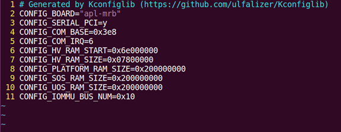
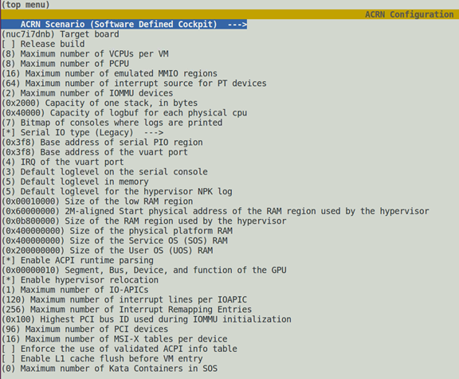
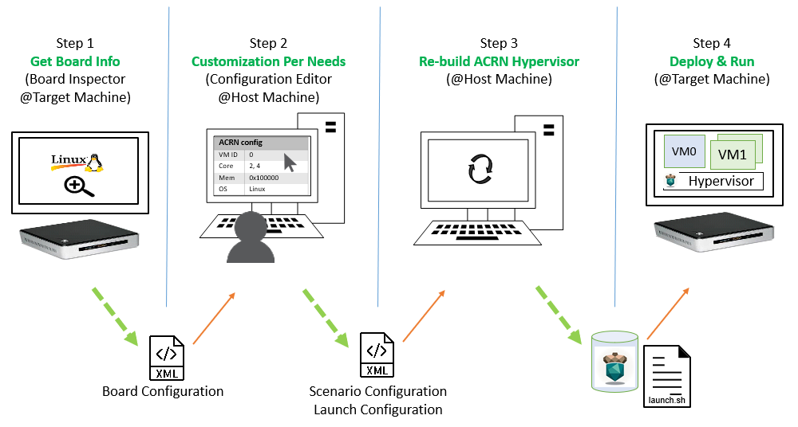

.. _acrn_configuration_tool:

ACRN Configuration Tool
#######################

The ACRN configuration tool is designed for System Integrators / Tier 1s to
customize ACRN to meet their own needs. It consists of two tools, the
``Kconfig`` tool and the ``acrn-config`` tool. The latter allows users to
provision VMs via a web interface and configure the hypervisor from XML
files at build time.

Introduction
************

ACRN includes three types of configurations: Hypervisor, Board, and VM. Each
are discussed in the following sections.

Hypervisor configuration
========================

The hypervisor configuration defines a working scenario and target
board by configuring the hypervisor image features and capabilities such as
setting up the log and the serial port.

The hypervisor configuration uses the ``Kconfig`` mechanism.  The configuration
file is located at ``acrn-hypervisor/hypervisor/arch/x86/Kconfig``.

A board-specific ``defconfig`` file, for example
``misc/vm_configs/scenarios/$(SCENARIO)/$(BOARD)/$(BOARD).config``
is loaded first; it is the default ``Kconfig`` for the specified board.

Board configuration
===================

The board configuration stores board-specific settings referenced by the
ACRN hypervisor. This includes **scenario-relevant** information such as
board settings, root device selection, and the kernel cmdline. It also includes
**scenario-irrelevant** hardware-specific information such as ACPI/PCI
and BDF information. The reference board configuration is organized as
``*.c/*.h`` files located in the
``misc/vm_configs/boards/$(BOARD)/`` folder.

VM configuration
=================

VM configuration includes **scenario-based** VM configuration
information that is used to describe the characteristics and attributes for
VMs on each user scenario. It also includes **launch script-based** VM
configuration information, where parameters are passed to the device model
to launch post-launched User VMs.

Scenario based VM configurations are organized as ``*.c/*.h`` files. The
reference scenarios are located in the
``misc/vm_configs/scenarios/$(SCENARIO)/`` folder.
The board specific configurations on this scenario is stored in the
``misc/vm_configs/scenarios/$(SCENARIO)/$(BOARD)/`` folder.

User VM launch script samples are located in the
``misc/vm_configs/sample_launch_scripts/`` folder.

ACRN configuration XMLs
***********************

The ACRN configuration includes three kinds of XML files for acrn-config
usage: ``board``, ``scenario``, and ``launch`` XML. All
scenario-irrelevant hardware-specific information for the board
configuration is stored in the ``board`` XML. The XML is generated by
``misc/acrn-config/target/board_parser.py``, which runs on the target
board. The scenario-relevant board and scenario-based VM configurations
are stored in the ``scenario`` XML. The launch script-based VM
configuration is stored in the ``launch`` XML. These two XMLs can be
customized by using the web interface tool at
``misc/acrn-config/config_app/app.py``. End users can load their own
configurations by importing customized XMLs or by saving the
configurations by exporting XMLs.

Board XML format
================

The board XMLs are located in the
``misc/vm_configs/xmls/board-xmls/`` folder.
The board XML has an ``acrn-config`` root element and a ``board`` attribute:

.. code-block:: xml

   <acrn-config board="BOARD">

As an input for the ``acrn-config`` tool, end users do not need to care
about the format of board XML and should not modify it.

Scenario XML format
===================
The scenario XMLs are located in the
``misc/vm_configs/xmls/config-xmls/`` folder.  The
scenario XML has an ``acrn-config`` root element as well as ``board``
and ``scenario`` attributes:

.. code-block:: xml

   <acrn-config board="BOARD" scenario="SCENARIO">

Additional scenario XML elements:

``hv``:
  Specify the global attributes for all VMs.

``RELEASE`` (a child node of ``DEBUG_OPTIONS``):
  Specify the final build is for Release or Debug.

``SERIAL_CONSOLE`` (a child node of ``DEBUG_OPTIONS``):
  Specify the host serial device is used for hypervisor debugging.

``MEM_LOGLEVEL`` (a child node of ``DEBUG_OPTIONS``):
  Specify the default log level in memory.

``NPK_LOGLEVEL`` (a child node of ``DEBUG_OPTIONS``):
  Specify the default log level for the hypervisor NPK log.

``CONSOLE_LOGLEVEL`` (a child node of ``DEBUG_OPTIONS``):
  Specify the default log level on the serial console.

``LOG_DESTINATION`` (a child node of ``DEBUG_OPTIONS``):
  Specify the bitmap of consoles where logs are printed.

``LOG_BUF_SIZE`` (a child node of ``DEBUG_OPTIONS``):
  Specify the capacity of the log buffer for each physical CPU.

``RELOC`` (a child node of ``FEATURES``):
  Specify whether the hypervisor image relocation is enabled on booting.

``SCHEDULER`` (a child node of ``FEATURES``):
  Specify the CPU scheduler used by the hypervisor.
  Supported schedulers are: ``SCHED_NOOP``, ``SCHED_BVT`` and ``SCHED_IORR``.

``MULTIBOOT2`` (a child node of ``FEATURES``):
  Specify whether the ACRN hypervisor image can be booted using the
  multiboot2 protocol. If not set, GRUB's multiboot2 is not available as a
  boot option.

``RDT_ENABLED`` (a child node of ``FEATURES/RDT``):
  Specify whether to enable the Resource Director Technology (RDT)
  allocation feature. Set to 'y' to enable the feature or 'n' to disable it.
  The 'y' will be ignored when hardware does not support RDT.

``CDP_ENABLED`` (a child node of ``FEATURES/RDT``):
  Specify whether to enable Code and Data Prioritization (CDP). CDP is an
  extension of CAT. Set to 'y' to enable the feature or 'n' to disable it.
  The 'y' will be ignored when hardware does not support CDP.

``CLOS_MASK`` (a child node of ``FEATURES/RDT``):
  Specify the cache capacity bitmask for the CLOS; only continuous '1' bits
  are allowed. The value will be ignored when hardware does not support RDT.

``HYPERV_ENABLED`` (a child node of ``FEATURES``):
  Specify whether Hyper-V is enabled.

``IOMMU_ENFORCE_SNP`` (a child node of ``FEATURES``):
  Specify whether IOMMU enforces snoop behavior of the DMA operation.

``ACPI_PARSE_ENABLED`` (a child node of ``FEATURES``):
  Specify whether ACPI runtime parsing is enabled.

``L1D_VMENTRY_ENABLED`` (a child node of ``FEATURES``):
  Specify whether the L1 cache flush before VM entry is enabled.

``MCE_ON_PSC_DISABLED`` (a child node of ``FEATURE``):
  Specify whether force to disable software workaround for Machine Check
  Error on Page Size Change is enabled.

``STACK_SIZE`` (a child node of ``MEMORY``):
  Specify the size of stacks used by physical cores. Each core uses one stack
  for normal operations and another three for specific exceptions.

``HV_RAM_SIZE`` (a child node of ``MEMORY``):
  Specify the size of the RAM region used by the hypervisor.

``LOW_RAM_SIZE`` (a child node of ``MEMORY``):
  Specify the size of the RAM region below address 0x10000, starting from address 0x0.

``SOS_RAM_SIZE`` (a child node of ``MEMORY``):
  Specify the size of the Service OS VM RAM region.

``UOS_RAM_SIZE`` (a child node of ``MEMORY``):
  Specify the size of the User OS VM RAM region.

``PLATFORM_RAM_SIZE`` (a child node of ``MEMORY``):
  Specify the size of the physical platform RAM region.

``IOMMU_BUS_NUM`` (a child node of ``CAPACITIES``):
  Specify the highest PCI bus ID used during IOMMU initialization.

``MAX_IR_ENTRIES`` (a child node of ``CAPACITIES``):
  Specify the maximum number of Interrupt Remapping Entries.

``MAX_IOAPIC_NUM`` (a child node of ``CAPACITIES``):
  Specify the maximum number of IO-APICs.

``MAX_PCI_DEV_NUM`` (a child node of ``CAPACITIES``):
  Specify the maximum number of PCI devices.

``MAX_IOAPIC_LINES`` (a child node of ``CAPACITIES``):
  Specify the maximum number of interrupt lines per IOAPIC.

``MAX_PT_IRQ_ENTRIES`` (a child node of ``CAPACITIES``):
  Specify the maximum number of interrupt source for PT devices.

``MAX_MSIX_TABLE_NUM`` (a child node of ``CAPACITIES``):
  Specify the maximum number of MSI-X tables per device.

``MAX_EMULATED_MMIO`` (a child node of ``CAPACITIES``):
  Specify the maximum number of emulated MMIO regions.

``GPU_SBDF`` (a child node of ``MISC_CFG``):
  Specify the Segment, Bus, Device, and function of the GPU.

``UEFI_OS_LOADER_NAME`` (a child node of ``MISC_CFG``):
  Specify the UEFI OS loader name.

``vm``:
  Specify the VM with VMID by its "id" attribute.

``vm_type``:
  Current supported VM types are:

  - ``SAFETY_VM`` pre-launched Safety VM
  - ``PRE_STD_VM`` pre-launched Standard VM
  - ``SOS_VM`` pre-launched Service VM
  - ``POST_STD_VM`` post-launched Standard VM
  - ``POST_RT_VM`` post-launched realtime capable VM
  - ``KATA_VM`` post-launched Kata Container VM

``name`` (a child node of ``vm``):
  Specify the VM name shown in the hypervisor console command: vm_list.

``guest_flags``:
  Select all applicable flags for the VM:

  - ``GUEST_FLAG_SECURE_WORLD_ENABLED`` specify whether the secure world is
    enabled
  - ``GUEST_FLAG_LAPIC_PASSTHROUGH`` specify whether LAPIC is passed through
  - ``GUEST_FLAG_IO_COMPLETION_POLLING`` specify whether the hypervisor needs
    IO polling to completion
  - ``GUEST_FLAG_HIDE_MTRR`` specify whether to hide MTRR from the VM
  - ``GUEST_FLAG_RT`` specify whether the VM is RT-VM (realtime)

``cpu_affinity``:
  List of pCPU: the guest VM is allowed to create vCPU from all or a subset of this list.

``base`` (a child node of ``epc_section``):
  SGX EPC section base; must be page aligned.

``size`` (a child node of ``epc_section``):
  SGX EPC section size in bytes; must be page aligned.

``clos``:
  Class of Service for Cache Allocation Technology settings. Refer to :ref:`hv_rdt` for details.

``start_hpa`` (a child node of ``memory``):
  The start physical address in host for the VM.

``size`` (a child node of ``memory``):
  The memory size in bytes for the VM.

``name`` (a child node of ``os_config``):
  Specify the OS name of VM; currently, it is not referenced by the hypervisor code.

``kern_type`` (a child node of ``os_config``):
  Specify the kernel image type so that the hypervisor can load it correctly.
  Currently supports ``KERNEL_BZIMAGE`` and ``KERNEL_ZEPHYR``.

``kern_mod`` (a child node of ``os_config``):
  The tag for the kernel image that acts as a multiboot module; it must
  exactly match the module tag in the GRUB multiboot cmdline.

``ramdisk_mod`` (a child node of ``os_config``):
  The tag for the ramdisk image which acts as a multiboot module; it
  must exactly match the module tag in the GRUB multiboot cmdline.

``bootargs`` (a child node of ``os_config``):
  For internal use and is not configurable. Specify the kernel boot arguments
  in bootargs under the parent of board_private.

``kern_load_addr`` (a child node of ``os_config``):
  The loading address in host memory for the VM kernel.

``kern_entry_addr`` (a child node of ``os_config``):
  The entry address in host memory for the VM kernel.

``vuart``:
  Specify the vuart (aka COM) with the vUART ID by its "id" attribute.
  Refer to :ref:`vuart_config` for detailed vUART settings.

``type`` (a child node of ``vuart``):
  vUART (aka COM) type; currently only supports the legacy PIO mode.

``base`` (a child node of ``vuart``):
  vUART (A.K.A COM) enabling switch. Enable by exposing its COM_BASE
  (SOS_COM_BASE for Service VM); disable by returning INVALID_COM_BASE.

``irq`` (a child node of ``vuart``):
  vCOM irq.

``target_vm_id`` (a child node of ``vuart1``):
  COM2 is used for VM communications. When it is enabled, specify which
  target VM the current VM connects to.

``target_uart_id`` (a child node of ``vuart1``):
  Target vUART ID to which the vCOM2 connects.

``pci_dev_num``:
  PCI devices number of the VM; it is hard-coded for each scenario so it
  is not configurable for now.

``pci_devs``:
  PCI devices list of the VM; it is hard-coded for each scenario so it
  is not configurable for now.

``board_private``:
  Stores scenario-relevant board configuration.

``rootfs`` (a child node of ``board_private``):
  rootfs for the Linux kernel.

``bootargs`` (a child node of ``board_private``):
  Specify kernel boot arguments.

Launch XML format
=================
The launch XMLs are located in the
``misc/vm_configs/xmls/config-xmls/`` folder.
The launch XML has an ``acrn-config`` root element as well as
``board``, ``scenario`` and ``uos_launcher`` attributes:

.. code-block:: xml

   <acrn-config board="BOARD" scenario="SCENARIO" uos_launcher="UOS_NUMBER">

Attributes of the ``uos_launcher`` specify the number of User VMs that the
current scenario has:

``uos``:
  Specify the User VM with its relative ID to Service VM by the "id" attribute.

``uos_type``:
  Specify the User VM type, such as ``CLEARLINUX``, ``ANDROID``, ``ALIOS``,
  ``PREEMPT-RT LINUX``, ``GENERIC LINUX``, ``WINDOWS``, ``YOCTO``, ``UBUNTU``,
  ``ZEPHYR`` or ``VXWORKS``.

``rtos_type``:
  Specify the User VM Realtime capability: Soft RT, Hard RT, or none of them.

``mem_size``:
  Specify the User VM memory size in Mbyte.

``gvt_args``:
  GVT arguments for the VM. Set it to ``gvtd`` for GVTd, otherwise stand
  for GVTg arguments.  The GVTg Input format: ``low_gm_size high_gm_size fence_sz``,
  The recommendation is ``64 448 8``.  Leave it blank to disable the GVT.

``vbootloader``:
  Virtual bootloader type; currently only supports OVMF.

``vuart0``:
  Specify whether the device model emulates the vUART0(vCOM1); refer to
  :ref:`vuart_config` for details.  If set to ``Enable``, the vUART0 is
  emulated by the device model; if set to ``Disable``, the vUART0 is
  emulated by the hypervisor if it is configured in the scenario XML.

``poweroff_channel``:
  Specify whether the User VM power off channel is through the IOC,
  Powerbutton, or vUART.

``usb_xhci``:
  USB xHCI mediator configuration. Input format:
  ``bus#-port#[:bus#-port#: ...]``, e.g.: ``1-2:2-4``.
  Refer to :ref:`usb_virtualization` for details.

``passthrough_devices``:
  Select the passthrough device from the lspci list. Currently we support:
  usb_xdci, audio, audio_codec, ipu, ipu_i2c, cse, wifi, Bluetooth, sd_card,
  ethernet, wifi, sata, and nvme.

``network`` (a child node of ``virtio_devices``):
  The virtio network device setting.
  Input format: ``tap_name,[vhost],[mac=XX:XX:XX:XX:XX:XX]``.

``block`` (a child node of ``virtio_devices``):
  The virtio block device setting.
  Input format: ``[blk partition:][img path]`` e.g.: ``/dev/sda3:./a/b.img``.

``console`` (a child node of ``virtio_devices``):
  The virtio console device setting.
  Input format:
  ``[@]stdio|tty|pty|sock:portname[=portpath][,[@]stdio|tty|pty:portname[=portpath]]``.

.. note::

   The ``configurable`` and ``readonly`` attributes are used to mark
   whether the items is configurable for users. When ``configurable="0"``
   and ``readonly="true"``, the item is not configurable from the web
   interface. When ``configurable="0"``, the item does not appear on the
   interface.

Configuration tool workflow
***************************

Hypervisor configuration workflow
==================================

The hypervisor configuration is based on the ``Kconfig``
mechanism. Begin by creating a board-specific ``defconfig`` file to
set up the default ``Kconfig`` values for the specified board.
Next, configure the hypervisor build options using the ``make
menuconfig`` graphical interface or ``make defconfig`` to generate
a ``.config`` file. The resulting ``.config`` file is
used by the ACRN build process to create a configured scenario- and
board-specific hypervisor image.

   defconfig file sample

   menuconfig interface sample

Refer to :ref:`getting-started-hypervisor-configuration` for detailed
configuration steps.

.. _vm_config_workflow:

Board and VM configuration workflow
===================================

Python offline tools are provided to configure Board and VM configurations.
The tool source folder is ``misc/acrn-config/``.

Here is the offline configuration tool workflow:

#. Get the board info.

   a. Set up a native Linux environment on the target board.
   #. Copy the ``target`` folder into the target file system and then run the
      ``sudo python3 board_parser.py $(BOARD)`` command.
   #. A $(BOARD).xml that includes all needed hardware-specific information
      is generated in the ``./out/`` folder. Here, ``$(BOARD)`` is the
      specified board name.

      | **Native Linux requirement:**
      | **Release:** Ubuntu 18.04+ or Clear Linux 30210+
      | **Tools:** cpuid, rdmsr, lspci, dmidecode (optional)
      | **Kernel cmdline:** "idle=nomwait intel_idle.max_cstate=0 intel_pstate=disable"

#. Customize your needs.

   a. Copy ``$(BOARD).xml`` to the host development machine.
   #. Run the ``misc/acrn-config/config_app/app.py`` tool on the host
      machine and import the $(BOARD).xml. Select your working scenario under
      **Scenario Setting** and input the desired scenario settings. The tool
      will do a sanity check on the input based on the $(BOARD).xml. The
      customized settings can be exported to your own $(SCENARIO).xml.
   #. In the configuration tool UI, input the launch script parameters
      for the post-launched User VM under **Launch Setting**. The tool will
      sanity check the input based on both the $(BOARD).xml and
      $(SCENARIO).xml and then export settings to your $(LAUNCH).xml.
   #. The user defined XMLs can be imported by acrn-config for modification.

   .. note:: Refer to :ref:`acrn_config_tool_ui` for more details on
      the configuration tool UI.

#. Auto generate the code.

   Python tools are used to generate configurations in patch format.
   The patches are applied to your local ``acrn-hypervisor`` git tree
   automatically.

   a. Generate a patch for the board-related configuration::

         cd misc/acrn-config/board_config
         python3 board_cfg_gen.py --board $(BOARD).xml --scenario $(SCENARIO).xml

      Note that this can also be done by clicking **Generate Board SRC** in the acrn-config UI.

   #. Generate a patch for scenario-based VM configuration::

         cd misc/acrn-config/scenario_config
         python3 scenario_cfg_gen.py --board $(BOARD).xml --scenario $(SCENARIO).xml

      Note that this can also be done by clicking **Generate Scenario SRC** in the acrn-config UI.

   #. Generate the launch script for the specified
      post-launched User VM::

         cd misc/acrn-config/launch_config
         python3 launch_cfg_gen.py --board $(BOARD).xml --scenario $(SCENARIO).xml --launch $(LAUNCH).xml --uosid xx

      Note that this can also be done by clicking **Generate Launch Script** in the acrn-config UI.

#. Re-build the ACRN hypervisor. Refer to
   :ref:`getting-started-building` to re-build the ACRN hypervisor on the host machine.

#. Deploy VMs and run ACRN hypervisor on the target board.

   Offline tool workflow

.. _acrn_config_tool_ui:

Use the ACRN configuration app
******************************

The ACRN configuration app is a web user interface application that performs the following:

- reads board info
- configures and validates scenario settings
- automatically generates source code for board-related configurations and
  scenario-based VM configurations
- configures and validates launch settings
- generates launch scripts for the specified post-launched User VMs.
- dynamically creates a new scenario setting and adds or deletes VM settings
  in scenario settings
- dynamically creates a new launch setting and adds or deletes User VM
  settings in launch settings

Prerequisites
=============

.. _get acrn repo guide:
   https://projectacrn.github.io/latest/getting-started/building-from-source.html#get-the-acrn-hypervisor-source-code

- Clone acrn-hypervisor:

  .. code-block:: none

     $git clone https://github.com/projectacrn/acrn-hypervisor

- Install ACRN configuration app dependencies:

  .. code-block:: none

     $ cd ~/acrn-hypervisor/misc/acrn-config/config_app
     $ sudo pip3 install -r requirements

Instructions
============

#. Launch the ACRN configuration app:

   .. code-block:: none

      $ python3 app.py

#. Open a browser and navigate to the website
   `<http://127.0.0.1:5001/>`_ automatically, or you may need to visit this
   website manually. Make sure you can connect to open network from browser
   because the app needs to download some JavaScript files.

   .. note:: The ACRN configuration app is supported on Chrome, Firefox,
      and MS Edge. Do not use IE.

   The website is shown below:

   .. figure:: images/config_app_main_menu.png
      :align: center
      :name: ACRN config tool main menu

#. Set the board info:

   a. Click **Import Board info**.

      .. figure:: images/click_import_board_info_button.png
         :align: center

   #. Upload the board info you have generated from the ACRN config tool.

   #. After board info is uploaded, you will see the board name from the
      Board info list. Select the board name to be configured.

      .. figure:: images/select_board_info.png
         :align: center

#. Load or create the scenario setting by selecting among the following:

   - Choose a scenario from the **Scenario Setting** menu which lists all
     user-defined scenarios for the board you selected in the previous step.

   - Click the **Create a new scenario** from the **Scenario Setting**
     menu to dynamically create a new scenario setting for the current board.

   - Click the **Load a default scenario** from the **Scenario Setting**
     menu, and then select one default scenario setting to load a default
     scenario setting for the current board.

   The default scenario configuration xmls are located at
   ``misc/vm_configs/xmls/config-xmls/[board]/``.
   We can edit the scenario name when creating or loading a scenario. If the
   current scenario name is duplicated with an existing scenario setting
   name, rename the current scenario name or overwrite the existing one
   after the confirmation message.

   .. figure:: images/choose_scenario.png
      :align: center

   Note that you can also use a customized scenario xml by clicking **Import
   XML**. The configuration app automatically directs to the new scenario
   xml once the import is complete.

#. The configurable items display after one scenario is created/loaded/
   selected. Following is an industry scenario:

   .. figure:: images/configure_scenario.png
      :align: center

   - You can edit these items directly in the text boxes, or you can choose
     single or even multiple items from the drop down list.

   - Read-only items are marked as grey.

   - Hover the mouse pointer over the item to display the description.

#. To dynamically add or delete VMs:

   - Click **Add a VM below** in one VM setting, and then select one VM type
     to add a new VM under the current VM.

   - Click **Remove this VM** in one VM setting to remove the current VM for
     the scenario setting.

   When one VM is added or removed in the scenario setting, the
   configuration app reassigns the VM IDs for the remaining VMs by the order of Pre-launched VMs, Service VMs, and Post-launched VMs.

   .. figure:: images/configure_vm_add.png
      :align: center

#. Click **Export XML** to save the scenario xml; you can rename it in the
   pop-up model.

   .. note::
      All customized scenario xmls will be in user-defined groups which are
      located in ``misc/vm_configs/xmls/config-xmls/[board]/user_defined/``.

   Before saving the scenario xml, the configuration app validates the
   configurable items. If errors exist, the configuration app lists all
   incorrect configurable items and shows the errors as below:

   .. figure:: images/err_acrn_configuration.png
      :align: center

   After the scenario is saved, the page automatically directs to the saved
   scenario xmls. Delete the configured scenario by clicking **Export XML** -> **Remove**.

#. Click **Generate configuration files** to save the current scenario
   setting and then generate files for the board-related configuration
   source code and the scenario-based VM configuration source code.

   If **Source Path** in the pop-up model is edited, the source code is
   generated into the edited Source Path relative to ``acrn-hypervisor``;
   otherwise, the source code is generated into default folders and
   overwrite the old ones. The board-related configuration source
   code is located at
   ``misc/vm_configs/boards/[board]/`` and the
   scenario-based VM configuration source code is located at
   ``misc/vm_configs/scenarios/[scenario]/``.

The **Launch Setting** is quite similar to the **Scenario Setting**:

#. Upload board info or select one board as the current board.

#. Load or create one launch setting by selecting among the following:

   - Click **Create a new launch script** from the **Launch Setting** menu.

   - Click **Load a default launch script** from the **Launch Setting** menu.

   - Select one launch setting xml from the menu.

   - Import the local launch setting xml by clicking **Import XML**.

#. Select one scenario for the current launch setting from the **Select Scenario** drop down box.

#. Configure the items for the current launch setting.

#. To dynamically add or remove User VM (UOS) launch scripts:

   - Add a UOS launch script by clicking **Configure an UOS below** for the
     current launch setting.

   - Remove a UOS launch script by clicking **Remove this VM** for the
     current launch setting.

#. Save the current launch setting to the user-defined xml files by
   clicking **Export XML**. The configuration app validates the current
   configuration and lists all incorrect configurable items and shows errors.

#. Click **Generate Launch Script** to save the current launch setting and
   then generate the launch script.

   .. figure:: images/generate_launch_script.png
      :align: center
