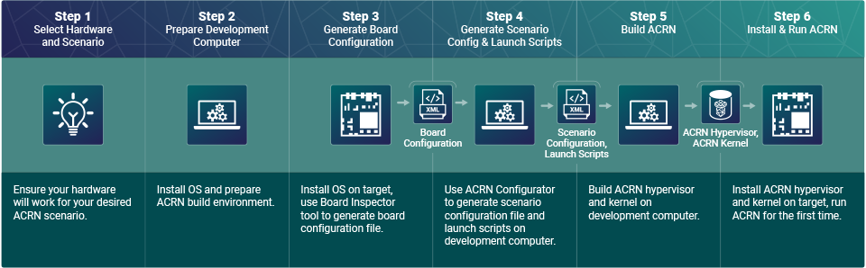

.. _acrn_configuration_tool:

Introduction to ACRN Configuration
##################################

ACRN configuration is designed for System Integrators / Tier 1s to customize
ACRN to meet their own needs. It allows users to adapt ACRN to target boards as
well as configure hypervisor capabilities and provision VMs.

ACRN configuration consists of the following key components.

* Configuration data saved as XML files.
* A configuration toolset that helps users to generate and edit configuration
  data. The toolset includes:

  - **Board Inspector**: Collects board-specific information on target
    machines.
  - **ACRN Configurator**: Enables you to edit configuration data via a
    web-based UI.

The following sections introduce the concepts and tools of ACRN configuration
from the aspects below.

* :ref:`acrn_config_types` introduces the objectives and main contents of
  different types of configuration data.
* :ref:`acrn_config_workflow` overviews the steps to customize ACRN
  configuration using the configuration toolset.
* :ref:`acrn_config_data` explains the location and format of configuration
  data saved as XML files.

.. _acrn_config_types:

Types of Configurations
***********************

ACRN includes three types of configurations: board, scenario, and launch. The
configuration data are saved in three XML files. The following sections briefly
describe the objectives and main contents of each file.

Board Configuration File
========================

The board configuration file stores hardware-specific information extracted
from the target platform. Examples of information:

* Capacity of hardware resources (such as processors and memory)
* Platform power states
* Available devices
* BIOS versions

You need a board configuration file to create scenario configurations. The
board configuration is scenario-neutral by nature. Thus, multiple scenario
configurations can be based on the same board configuration.

You also need a board configuration file to build an ACRN hypervisor. The
build process uses the file to build a hypervisor that can
initialize and manage the platform at runtime.

Scenario Configuration File
===========================

The scenario configuration file defines a working scenario by configuring
hypervisor capabilities and defining some VM attributes and resources.
We call these settings "static" because they are used to build the hypervisor.
You can specify the following information in a scenario configuration:

* Hypervisor capabilities

  - Availability and settings of hypervisor features, such as debugging
    facilities, scheduling algorithm, inter-VM shared memory (ivshmem),
    and security features.
  - Hardware management capacity of the hypervisor, such as maximum PCI devices
    and maximum interrupt lines supported.
  - Memory consumption of the hypervisor, such as the entry point and stack
    size.

* VM attributes and resources

  - VM attributes, such as VM names.
  - Maximum number of VMs supported.
  - Resources allocated to each VM, such as number of vCPUs, amount of guest
    memory, and pass-through devices.
  - User VM settings, such as boot protocol and VM OS kernel parameters.
  - Settings of virtual devices, such as virtual UARTs.

You need a scenario configuration file to build an ACRN hypervisor. The
build process uses the file to build a hypervisor that can initialize its
capabilities and set up the VMs at runtime.

The scenario configuration defines User VMs as follows:

* For pre-launched User VMs, the scenario configuration defines all attributes
  and resources (these VMs have static configurations by nature). The VM
  attributes and resources are exactly the amount
  of resources allocated to them.

* For post-launched User VMs, the scenario configuration defines only static
  attributes and resources. Other resources are under the control of the
  Service VM and can be dynamically allocated to these VMs via launch
  scripts.

Launch Configuration File for Launch Scripts
============================================

The launch configuration file applies only to scenarios that have
post-launched User VMs. The file defines certain attributes and
resources of the post-launched VMs specified in the scenario configuration
file. We call these settings "dynamic" because they are used at runtime.

You need a launch configuration file to generate a launch script (shell script)
for each post-launched User VM. The launch script invokes the
Service VM's :ref:`Device Model <hld-devicemodel>` ``acrn-dm`` to create
the VM. Unlike board and scenario configurations used at build time or by
ACRN hypervisor, launch configurations are used dynamically in the Service VM.

.. _acrn_config_workflow:

Using ACRN Configuration Toolset
********************************

The ACRN configuration toolset enables you to create
and edit configuration data. The toolset consists of the following:

* :ref:`Board Inspector <board_inspector_tool>`
* :ref:`ACRN Configurator <acrn_configurator_tool>`

As introduced in :ref:`overview_dev`, configuration takes place at
:ref:`overview_dev_board_config` and :ref:`overview_dev_config_editor` in
the overall development process:

ACRN source also includes makefile targets to aid customization. See
:ref:`hypervisor-make-options`.

.. _acrn_config_data:

ACRN Configuration Data
***********************

The following sections explain the format of the board, scenario, and launch
configuration files. Although we recommend using the ACRN configuration toolset
to create these files, this reference may be useful for advanced usage and
troubleshooting.

ACRN source code offers predefined XMLs, and the generic templates used for
new boards and scenarios, in the ``misc/config_tools/data/`` directory of
the ``acrn-hypervisor`` repo.

Board XML Format
================

The board XML has an ``acrn-config`` root element and a
``board`` attribute:

.. code-block:: xml

   <acrn-config board="BOARD">

The ``board`` attribute defines the board name and must match the
``board`` attribute in the scenario configuration file and the launch
configuration file. The file name of the board configuration file
(example: ``my_board.xml``) doesn't affect the board name.

Board XML files are input to the ACRN Configurator tool and the build system,
and are not intended for end users to modify.

Scenario XML Format
===================

The scenario XML has an ``acrn-config`` root element as well as ``board`` and
``scenario`` attributes:

.. code-block:: xml

   <acrn-config board="BOARD" scenario="SCENARIO">

The ``board`` attribute specifies the board name and must match the ``board``
attribute in the board configuration file.

The ``scenario`` attribute specifies the scenario name, followed by hypervisor
and VM settings.

See :ref:`scenario-config-options` for a full explanation of available scenario
XML elements.

Launch XML Format
=================

The launch XML has an ``acrn-config`` root element as well as
``board``, ``scenario``, and ``user_vm_launcher`` attributes:

.. code-block:: xml

   <acrn-config board="BOARD" scenario="SCENARIO" user_vm_launcher="USER_VM_NUMBER">

The ``board`` attribute specifies the board name and must match the ``board``
attribute in the board configuration file and the scenario configuration file.

The ``scenario`` attribute specifies the scenario name and must match the
``scenario`` attribute in the scenario configuration file.

The ``user_vm_launcher`` attribute specifies the number of post-launched User
VMs in a scenario.

See :ref:`launch-config-options` for a full explanation of available launch
XML elements.
