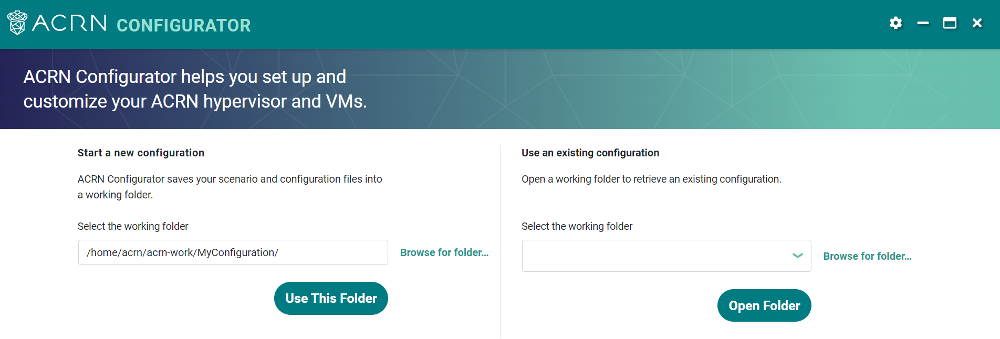
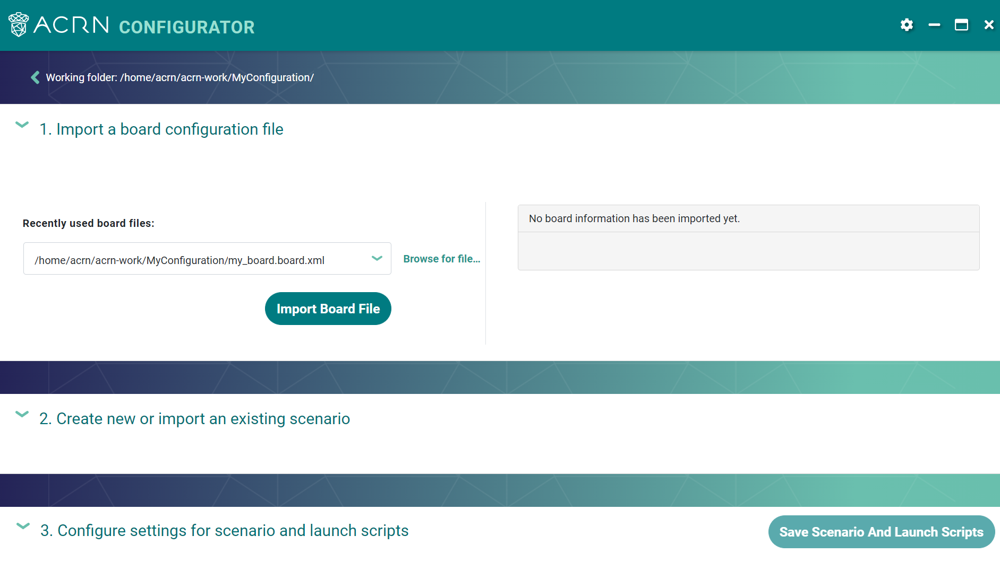
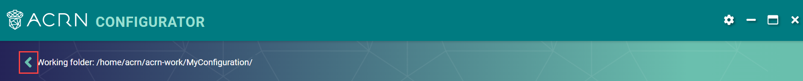
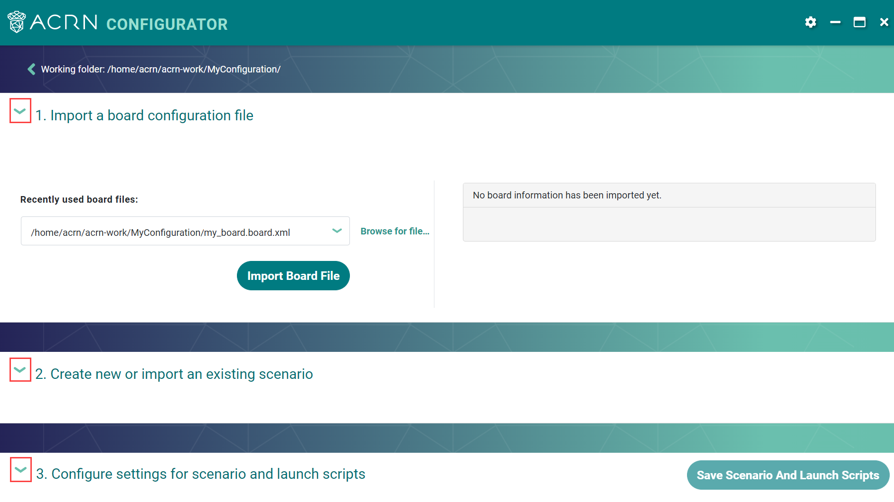
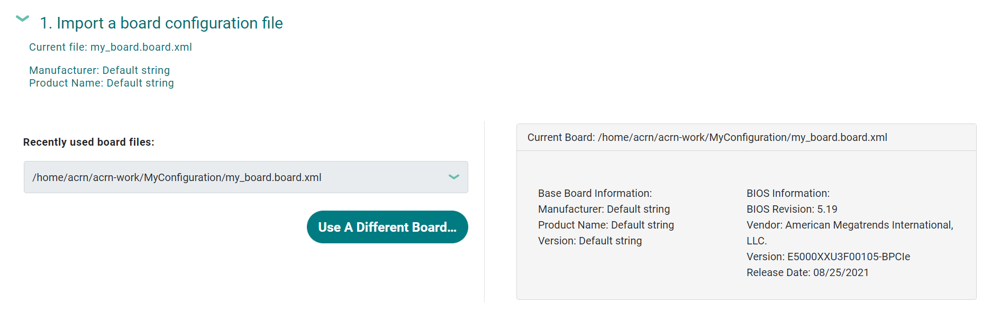
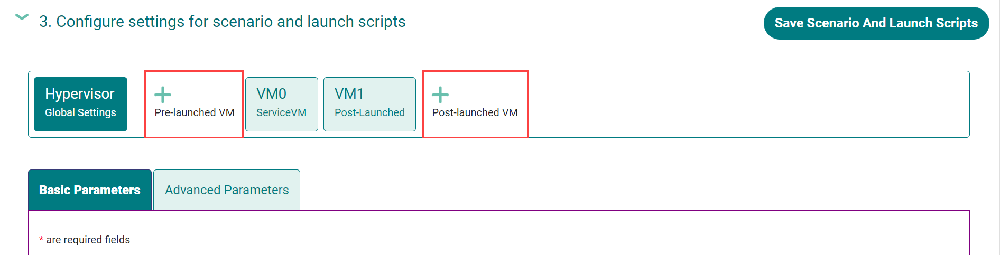

.. _acrn_configurator_tool:

ACRN Configurator Tool
######################

This guide describes all features and uses of the tool.

About the ACRN Configurator Tool
*********************************

The ACRN Configurator provides a user interface to help
you customize your :ref:`ACRN configuration <acrn_configuration_tool>`.
Capabilities:

* Reads board information from the board configuration file generated by the
  :ref:`board_inspector_tool`
* Helps you configure a scenario of hypervisor and VM settings
* Generates a scenario configuration file that stores the configured settings in
  XML format
* Generates a launch script for each post-launched User VM

.. _acrn_configurator_tool_prerequisites:

Prerequisites
*************

This guide assumes you have a board configuration file and have successfully
launched the ACRN Configurator. For steps, see the following Getting Started
Guide sections:

* :ref:`gsg-dev-computer`
* :ref:`gsg-board-setup`
* :ref:`gsg-dev-setup`

The above Getting Started Guide steps use a prebuilt Debian package to install
the ACRN Configurator. :ref:`acrn_configurator_tool_source` describes how to
build the Debian package.

Scenario Error Checking
***********************

The Configurator includes many validation checks that verify input values,
ensure the consistency of configuration options, and interactions between
options.

Simple data validation checks on values are detected immediately with red
text indicating the problem, or with an indicator within a data entry field. For
example, if you type in a value that is out of range, you'll see your value
crossed out:

.. image:: images/config-out-of-range-error.png
   :align: center
   :class: drop-shadow

If you delete a required value, you'll see an error message in red text:

.. image:: images/config-required-value-error.png
   :align: center
   :class: drop-shadow

More complex checks, including those that look for conflicting settings, are
done when you initially open a saved (or newly created) scenario, or when you
use the "Save Scenario" button. If problems are detected, the response window
from the save action will indicate that problems were found.  The Hypervisor or
VM tabs will then display an error icon leading you to the configuration option
panels where you can resolve the errors. For example, both the Hypervisor and
VM1 tabs indicate an option setting problem:

.. image:: images/config-tab-errors.png
   :align: center
   :class: drop-shadow

Since we're on the Hypervisor (Basic Parameters) options, we see the Hypervisor
configuration error message.  If we click the VM1 tab, we'll see what the
issues are with that VM's configuration options:

.. image:: images/config-tab-errors2.png
   :align: center
   :class: drop-shadow

In both cases, you can scroll down to see the specific problem (on either the
basic or advanced parameters tab) and fix the issues.
When all issues are resolved, click the "Save Scenario" button to
validate the changes and save the settings.  If all issues were resolved, the
save scenario response window will indicate that no issues were found, and all
the error indicators will be cleared.

Start with a New or Existing Configuration
******************************************

When the ACRN Configurator opens, the introduction screen appears.

The introduction screen lets you start a new configuration or use an existing
one by selecting a working folder.

As described in :ref:`acrn_configuration_tool`, a configuration defines one
ACRN instance, and its data is stored in a set of configuration files:

* One board configuration file
* One scenario configuration file
* One launch script per post-launched VM

When you use the ACRN Configurator, it saves these files in the selected working
folder.

Each configuration must have a unique working folder. For example, imagine you
want to create three configurations. Perhaps you want to create a configuration
for three different boards, or you have one board but want to create three sets
of hypervisor settings to test on it. You would need to select a different
working folder for each configuration. After you have selected the working
folder in the ACRN Configurator, it saves the configuration files there. The
following figure shows an example file system consisting of a top-level folder,
``acrn-work``, and a working folder for each configuration, ``ConfigA``,
``ConfigB``, and ``ConfigC``.

.. image:: images/config-file.png
   :align: center

Start a New Configuration
==========================

You can start by selecting a new working folder. The tool assumes you are
starting from scratch. It checks the folder for existing configuration files,
such as a board configuration file, scenario configuration file, and launch
scripts. If it finds any, it will delete them.

1. Under **Start a new configuration**, use the displayed working folder or
   select a different folder by clicking **Browse for folder**. Use a
   folder name that is meaningful to you.

   .. image:: images/configurator-newconfig.png
      :align: center
      :class: drop-shadow

#. If the folder contains configuration files, the tool displays a message about
   deleting the files. Click **OK** to delete the files.

#. Click **Use This Folder**.

Use an Existing Configuration
=============================

You can use an existing configuration by selecting a working folder that has one
or more configuration files in it. For example, the folder can contain a board
configuration file alone, or a board configuration file and scenario
configuration file. The tool uses the information in the files to populate the
UI, so that you can continue working on the configuration where you left off.

1. Under **Use an existing configuration**, use the displayed working folder or
   select a different folder by clicking **Browse for folder**.

   .. image:: images/configurator-exconfig.png
      :align: center
      :class: drop-shadow

#. Click **Open Folder**.

Navigate the Configuration Screen
*********************************

After you have selected a working folder, the tool opens the second (and final)
screen, where you can customize your configuration. The following figure shows
an example:

At the top of the screen, the tool shows the selected working folder. To return
to the introduction screen, click the arrow next to the working folder path:

The rest of the configuration screen is divided into three panels:

1. Import a board configuration file
#. Create new or import an existing scenario
#. Configure settings for scenario and launch scripts

The panels are labeled 1, 2, and 3 to guide you through the configuration steps.
The tool also enforces this order of operation by enabling each panel only after
you have completed the preceding panel.

The title bar of each panel has an arrow icon. Click the icon to expand
or collapse the panel.

Import a Board Configuration File
**********************************

The first step in the configuration process is to import the board configuration
file generated via the :ref:`board_inspector_tool`. You can import a board configuration file for the first time, or replace the existing file.

Import a Board Configuration File for the First Time
====================================================

If the working folder doesn't have a board configuration file, the tool shows
that no board information has been imported yet.

To import a board configuration file for the first time:

1. Under **Import a board configuration file**, select a
   file from the drop-down menu or click **Browse for file** to select a
   different file.

   .. image:: images/configurator-board01.png
      :align: center
      :class: drop-shadow

#. Click **Import Board File**.

The tool makes a copy of your board configuration file, changes the
file extension to ``.board.xml``, and saves the file in the working folder.

The tool displays the current board information. Example:

Replace an Existing Board Configuration File
============================================

After a board configuration file has been imported, you can choose to replace it
at any time. This option is useful, for example, when you need to change your
board's configuration while you are customizing your hypervisor settings.
Whenever you change the configuration of your board, you must generate a new
board configuration file via the :ref:`board_inspector_tool`. Examples include
changing any BIOS setting such as hyper-threading, adding or removing a physical
device, or adding or removing memory. If this happens after you've started
customizing your hypervisor in the ACRN Configurator, you can import the new
board file into your existing configuration and continue editing.

To replace an existing board configuration file:

1. Under **Import a board configuration file**, click **Use a Different Board**.

   .. image:: images/configurator-board03.png
      :align: center
      :class: drop-shadow

#. Browse to the board configuration file and click **Open**.

#. The tool displays a warning message about overwriting the existing file.
   Click **Ok** to proceed.

The tool replaces the file and displays the new board information.

Create New or Import an Existing Scenario
*******************************************

After importing the board configuration file, the next step is to specify an
initial scenario. You can create a scenario, or import an existing scenario
configuration file. In both cases, this step is a starting point for configuring
your hypervisor and VMs. Later, you can choose to change the configuration, such
as adding or deleting VMs.

Create a Scenario
=================

You can create a scenario by specifying an initial number of VMs.

1. Under **Create new or import an existing scenario**, click **Create
   Scenario**.

   .. image:: images/configurator-newscenario01.png
      :align: center
      :class: drop-shadow

#. In the dialog box, select a scenario type and number of VMs. The tool
   enforces dependencies. For example, a scenario with post-launched VMs must
   have a Service VM, so the tool adds a Service VM and doesn't allow you to
   delete it here.

   .. image:: images/configurator-newscenario02.png
      :align: center
      :class: drop-shadow

#. Click **Ok**.

The tool displays the name of the scenario configuration file, but it doesn't
save it to the working folder until you click **Save Scenario And Launch
Scripts** in the third panel.

Import a Scenario Configuration File
====================================

You can import an existing scenario configuration file. The tool uses the
information in the file to populate the UI, so that you can continue working on
the configuration where you left off.

1. Due to the strict validation ACRN adopts, scenario configuration files for a
   former release may not work in the current release unless they are upgraded.
   Starting from v3.0, upgrade an older scenario XML per the steps in
   :ref:`upgrading_configuration` then import the upgraded file into the tool in
   the next step.

#. Under **Create new or import an existing scenario**, go to the right side of
   the screen and select a scenario configuration file from the drop-down menu
   or click **Browse for scenario file** to select a different file.

   .. image:: images/configurator-exscenario.png
      :align: center
      :class: drop-shadow

#. Click **Import Scenario**.

The tool displays the name of the scenario configuration file, but it doesn't
save it to the working folder until you click **Save Scenario And Launch
Scripts** in the third panel.

Configure Settings for Scenario and Launch Scripts
**************************************************

After creating a scenario or importing an existing one, you can configure
hypervisor and VM parameters, as well as add or delete VMs.

Configure the Hypervisor and VM Parameters
==========================================

1. Click the hypervisor or VM tab in the selector menu. The selected tab is
   darker in color.

   .. image:: images/configurator-selecthypervisor.png
      :align: center
      :class: drop-shadow

#. Click the Basic Parameters tab or Advanced Parameters tab and make updates.
   To learn more about each parameter, hover over the |tooltip| icon for a short
   description or go to :ref:`scenario-config-options` for documentation.

   .. |tooltip| image:: images/tooltip.png

Basic parameters are generally defined as:

* Parameters that are necessary for ACRN configuration, compilation, and
  execution.

* Parameters that are common for software like ACRN.

* Parameters that are anticipated to be commonly used for typical ACRN use
  cases.

Advanced parameters are generally defined as:

* Parameters that are optional for ACRN configuration, compilation, and
  execution. Default values cover most use cases.

* Parameters that are used for fine-grained tuning, such as reducing code
  lines or optimizing performance.

Add a VM
=========

In the selector menu, click **+** to add a pre-launched VM or post-launched VM.

Delete a VM
============

1. In the selector menu, click the VM tab. The selected tab is darker in color.

#. Click **Delete VM**.

   .. image:: images/configurator-deletevm.png
      :align: center
      :class: drop-shadow

Save and Check for Errors
=========================

#. To save your configuration, click **Save Scenario And Launch Scripts** at the
   top of the panel.

   .. image:: images/configurator-save.png
      :align: center
      :class: drop-shadow

   The tool validates hypervisor and VM settings whenever you save.

   If no errors occur, the tool saves your configuration data in a set of files
   in the working folder:

   * Scenario configuration file (``scenario.xml``): Raw format of all
     hypervisor and VM settings. You will need this file to build ACRN.

   * One launch script per post-launched VM (``launch_user_vm_id*.sh``): This
     file is used to start the post-launched VM in the Service VM. You can find
     the VM's name inside the script:

     .. code-block:: bash

        # Launch script for VM name: <name>

   If an error occurs, such as an empty required field, the tool saves the
   changes to the scenario configuration file, but prompts you to correct the
   error.

#. On the selector menu, check for error messages on all tabs that have an error
   icon. The following figure shows that the Hypervisor tab and the VM1 tab
   contain errors.

   .. image:: images/configurator-erroricon.png
      :align: center
      :class: drop-shadow

   Error messages appear below the selector menu or below the applicable
   parameter.

#. Fix all errors and save again to generate a valid configuration.

#. Click the **x** in the upper-right corner to close the ACRN Configurator.

Next Steps
==========

After generating a valid scenario configuration file, you can build ACRN. See
:ref:`gsg_build`.

.. _acrn_configurator_tool_source:

Build ACRN Configurator from Source Code
*****************************************

The :ref:`prerequisites<acrn_configurator_tool_prerequisites>` use a prebuilt
Debian package to install the ACRN Configurator. The following steps describe
how to build the Debian package from source code. 

#. On the development computer, complete the steps in :ref:`gsg-dev-computer`.

#. Install the ACRN Configurator build tools:

   .. code-block:: bash

      sudo apt install -y build-essential \
         curl \
         wget \
         libssl-dev \
         libgtk-3-dev \
         librsvg2-dev \
         python3-venv

      cd /tmp/
      wget http://security.ubuntu.com/ubuntu/pool/main/w/webkit2gtk/libwebkit2gtk-4.0-37_2.44.2-0ubuntu0.22.04.1_amd64.deb http://mirrors.kernel.org/ubuntu/pool/main/i/icu/libicu70_70.1-2_amd64.deb http://security.ubuntu.com/ubuntu/pool/main/w/webkit2gtk/libjavascriptcoregtk-4.0-18_2.44.2-0ubuntu0.22.04.1_amd64.deb
      sudo apt install ./libwebkit2gtk-4.0-37_2.44.2-0ubuntu0.22.04.1_amd64.deb ./libicu70_70.1-2_amd64.deb ./libjavascriptcoregtk-4.0-18_2.44.2-0ubuntu0.22.04.1_amd64.deb

#. Install Node.js (npm included) as follows:

   a. We recommend using nvm to manage your Node.js runtime. It allows you to
      switch versions and update Node.js easily.

      .. code-block:: bash

         curl -o- https://raw.githubusercontent.com/nvm-sh/nvm/v0.35.2/install.sh | bash

   #. Rerun your ``.bashrc`` initialization script and then install the latest
      version of Node.js and npm:

      .. code-block:: bash

         source ~/.bashrc
         nvm install node --latest-npm
         nvm use node

#. Install and upgrade Yarn:

   .. code-block:: bash

      npm install --global yarn

#. Install rustup, the official installer for Rust:

   .. code-block:: bash

      curl --proto '=https' --tlsv1.2 -sSf https://sh.rustup.rs | sh

   When prompted by the Rust installation script, type ``1`` and press
   :kbd:`Enter`.

   .. code-block:: console

      1) Proceed with installation (default)
      2) Customize installation
      3) Cancel installation
      >1

#. Configure the current shell:

   .. code-block:: bash

      source $HOME/.cargo/env

#. Install additional ACRN Configurator dependencies:

   .. code-block:: bash

      cd ~/acrn-work/acrn-hypervisor/misc/config_tools/configurator
      python3 -m pip install -r requirements.txt
      yarn

#. Build the ACRN Configurator Debian package:

   .. code-block:: bash

      cd ~/acrn-work/acrn-hypervisor
      make configurator

#. Install the ACRN Configurator:

   .. code-block:: bash

      sudo apt install -y ~/acrn-work/acrn-hypervisor/build/acrn-configurator*.deb

#. Launch the ACRN Configurator:

   .. code-block:: bash

      acrn-configurator
