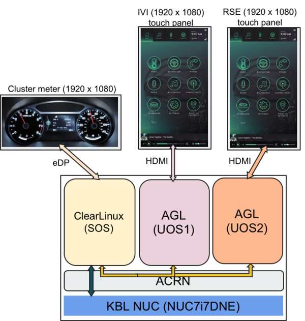
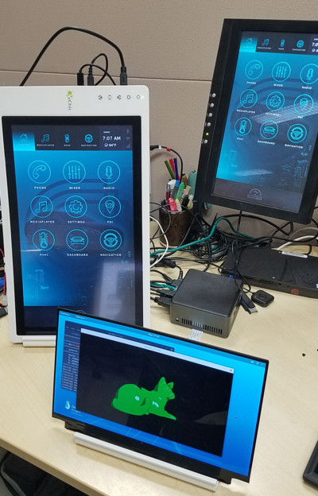
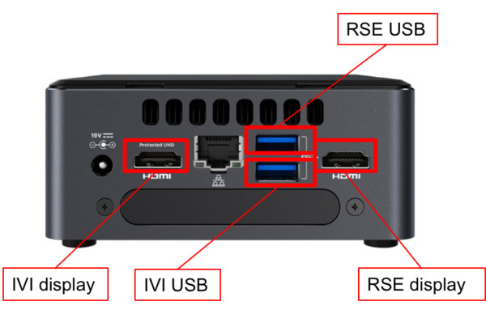

.. highlight:: none

.. _agl-vms:

Running AGL as VMs
##################

This document describes how to run two Automotive Grade Linux (AGL)
images as VMs on the ACRN hypervisor. This serves as the baseline for
developing the hypervisor version of the `AGL CES demo
<https://www.youtube.com/watch?v=3Bv501INyKY>`_ using open-source
technologies.

   Demo concept

:numref:`agl-demo-concept` shows the AGL demo system configuration.  The
hardware is an Intel Kaby Lake NUC and three displays for the cluster
meter, the In-Vehicle Infotainment (IVI) system, and the rear seat
entertainment (RSE).  For the software, there are three VMs running on
top of ACRN:

* Clear Linux OS runs as the service OS (SOS) to control the cluster meter,
* an AGL instance runs as a user OS (UOS) controlling the IVI display, and
* a second AGL UOS controls the RSE display.

:numref:`agl-demo-setup` shows the hardware and display images of a
running demo:

   Demo in action

Hardware setup
**************

Here is the hardware used for the demo development:

.. list-table:: Demo Hardware
   :header-rows: 1

   * - Name
     - Link
     - Notes
   * - NUC
     - Kaby Lake `NUC7i7DNHE
       <https://www.intel.com/content/www/us/en/products/boards-kits/nuc/kits/nuc7i7dnhe.html>`_
     -
       * `Specifications
         <https://www.intel.com/content/dam/support/us/en/documents/mini-pcs/nuc-kits/NUC7i7DN_TechProdSpec.pdf>`_,
       * `Tested components and peripherals
         <http://compatibleproducts.intel.com/ProductDetails?prodSearch=True&searchTerm=NUC7i7DNHE#>`_,
       * 16GB RAM, and
       * 250GB SSD
   * - eDP display
     - `Sharp LQ125T1JX05
       <http://www.panelook.com/LQ125T1JX05-E_SHARP_12.5_LCM_overview_35649.html>`_
     -
   * - eDP cable
     - `eDP 40 pin cable
       <https://www.gorite.com/intel-nuc-dawson-canyon-edp-cable-4-lanes>`_
     - Other eDP pin cables work as well
   * - HDMI touch displays
     - `GeChic 1303I
       <https://www.gechic.com/en-portable-touch-monitor-onlap1303i-view.html>`_
     -
   * - Serial cable
     - `Serial DB9 header cable
       <https://www.gorite.com/serial-db9-header-cable-for-nuc-dawson-canyon>`_
       or `RS232 lid
       <https://www.gorite.com/intel-nuc-rs232-lid-for-7th-gen-dawson-canyon-nuc>`_
     -

Connecting hardware
===================

Learn how to connect an eDP display to the NUC using an eDP cable as
shown in :numref:`agl-cables`, by
following the `NUC specification
<https://www.intel.com/content/dam/support/us/en/documents/mini-pcs/nuc-kits/NUC7i7DN_TechProdSpec.pdf>`_

   USB an Display cable connections

As shown in :numref:`agl-cables`, connect HDMI cables and USB cables
(for touch) to the touch displays for the IVI and RSE. (If the USB port
for touch is changed, the USB bus-port number in the AGL launch script
must be changed accordingly.)

Software Setup
**************

The demo setup uses these software components and versions:

.. list-table:: Demo Software
   :header-rows: 1

   * - Name
     - Version
     - Link
   * - ACRN hypervisor
     - 0.3
     - `ACRN project <https://github.com/projectacrn/acrn-hypervisor>`_
   * - Clear Linux OS
     - 26200
     - `Clear Linux OS installer image
       <https://download.clearlinux.org/releases/26200/clear/clear-26200-installer.img.xz>`_
   * - AGL
     - Funky Flounder (6.02)
     - `intel-corei7-x64 image
       <https://download.automotivelinux.org/AGL/release/flounder/6.0.2/intel-corei7-64/deploy/images/intel-corei7-64/agl-demo-platform-crosssdk-intel-corei7-64-20181112133144.rootfs.wic.xz>`_
   * - acrn-kernel
     - revision acrn-2018w49.3-140000p
     - `acrn-kernel <https://github.com/projectacrn/acrn-kernel>`_

Service OS
==========

#. Download the compressed Clear Linux OS installer image from
   https://download.clearlinux.org/releases/26200/clear/clear-26200-installer.img.xz
   and follow the `Clear Linux OS installation guide
   <https://clearlinux.org/documentation/clear-linux/get-started/bare-metal-install>`_
   as a starting point for installing Clear Linux OS onto your platform.
   Follow the recommended options for choosing an Automatic installation
   type, and using the platform's storage as the target device for
   installation (overwriting the existing data and creating three
   partitions on the platform's storage drive).

#. After installation is complete, boot into Clear Linux OS, login as
   root, and set a password.

#. Clear Linux OS is set to automatically update itself. We recommend that
   you disable this feature to have more control over when the updates
   happen. Use this command (as root) to disable the autoupdate feature::

      # swupd autoupdate --disable

#. This demo setup uses a specific release version (26200) of Clear
   Linux OS which has been verified to work with ACRN. In case you
   unintentionally update or change the Clear Linux OS version, you can
   fix it again using::

      # swupd verify --fix --picky -m 26200

#. Use the ``swupd bundle-add`` command and add needed Clear Linux
   OS bundles::

      # swupd bundle-add openssh-server sudo network-basic \
          kernel-iot-lts2018 os-clr-on-clr os-core-dev \
          python3-basic dfu-util dtc

#. Install the graphics UI if necessary. Use only one of the two
   options listed below (this guide uses the first GNOME on Wayland option)::

      # swupd bundle-add desktop desktop-autostart # GNOME and Weston

   or::

      # swupd bundle-add software-defined-cockpit # IAS shell for IVI (optional)

#. Create a new user and allow the user to use "sudo"::

      # useradd <username>
      # passwd <username>
      # usermod -G wheel -a <username>

#. Reboot the system::

      # reboot

#. The system will reboot to the graphic interface (GDM). In the login
   screen, click on the setting button and choose "GNOME on Wayland". Then
   chose the <username> and enter the password to login.

#. Build ACRN. In this demo we use the ACRN v0.3 release.
   Open a terminal window in Clear Linux OS desktop, create a workspace,
   install needed tools, clone the ACRN Hypervisor repo source, and build ACRN::

      $ mkdir workspace
      $ cd workspace
      $ pip3 install kconfiglib
      $ git clone https://github.com/projectacrn/acrn-hypervisor
      $ git checkout tags/v0.3
      $ make PLATFORM=uefi
      $ sudo make install

#. Install and enable ACRN::

      $ sudo mount /dev/sda1 /mnt
      $ sudo mkdir /mnt/EFI/acrn
      $ sudo cp /usr/lib/acrn/acrn.efi /mnt/EFI/acrn/
      $ efibootmgr -c -l "\EFI\acrn\acrn.efi" -d /dev/sda -p 1 \
          -L "ACRN Hypervisor" \
          -u "bootloader=\EFI\org.clearlinux\bootloaderx64.efi uart=port@0x3f8"

      $ sudo cp /usr/share/acrn/samples/nuc/acrn.conf /mnt/loader/entries/
      $ sudo vi /mnt/loader/entries/acrn.conf

   Modify the acrn.conf file as shown below and save it::

      title The ACRN Service OS

      linux
      /EFI/org.clearlinux/kernel-org.clearlinux.iot-lts2018-sos.4.19.0-19

      options pci_devices_ignore=(0:18:1) console=tty0 console=ttyS0
      root=/dev/sda3 rw rootwait ignore_loglevel no_timer_check consoleblank=0
      i915.nuclear_pageflip=1 i915.avail_planes_per_pipe=0x00000F i915.domain_plane_owners=0x022211110000
      i915.enable_gvt=1 i915.enable_guc=0 hvlog=2M@0x1FE00000

#. Set a longer timeout::

      $ sudo clr-boot-manager set-timeout 20
      $ sudo clr-boot-manager update

#. Reboot the system, choose "ACRN Hypervisor" and launch Clear Linux OS
   SOS. If the EFI boot order is not right, use :kbd:`F10`
   on boot up to enter the EFI menu and choose "ACRN Hypervisor".

Building ACRN kernel for AGL (UOS)
==================================

In this demo, we use acrn-kernel as the baseline for development for AGL.

#. Create a workspace, get the kernel source code, and configure kernel
   settings with::

      $ cd workspace
      $ git clone https://github.com/projectacrn/acrn-kernel
      $ git checkout tags/acrn-2018w49.3-140000p
      $ make menuconfig

   Load the **kernel_uos_config** for the UOS kernel build, and verify
   the following configs options are on::

      CONFIG_LOCAL_VERSION="-uos"
      CONFIG_SECURITY_SMACK=y
      CONFIG_SECURITY_SMACK_BRINGUP=y
      CONFIG_DEFAULT_SECURITY_SMACK=y
      CONFIG_EXT4_FS=y
      CONFIG_EXT4_USE_FOR_EXT23=y
      CONFIG_EXT4_FS_POSIX_ACL=y
      CONFIG_EXT4_FS_SECURITY=y
      # CONFIG_MODULES is not set
      CONFIG_CAN
      CONFIG_CAN_VCAN
      CONFIG_CAN_SLCAN

#. Build the kernel::

      $ make -j 4
      $ sudo make modules_install
      $ sudo cp arch/x86/boot/bzImage /root/bzImage-4.19.0-uos

Setting up AGLs
===============

#. Download the AGL Funky Flounder image::

      $ sudo su
      # cd /root
      # wget https://download.automotivelinux.org/AGL/release/flounder/6.0.2/intel-corei7-64/deploy/images/intel-corei7-64/agl-demo-platform-crosssdk-intel-corei7-64-20181112133144.rootfs.wic.xz

      # unxz agl-demo-platform-crosssdk-intel-corei7-64-20181112133144.rootfs.wic.xz
      # cp agl-demo-platform-crosssdk-intel-corei7-64-20181112133144.rootfs.wic agl-ivi.wic
      # cp agl-demo-platform-crosssdk-intel-corei7-64-20181112133144.rootfs.wic agl-rse.wic

#. Set up the AGL images::

      # losetup -f -P --show agl-ivi.wic
      # mount /dev/loop0p2 /mnt
      # cp -r /lib/modules/4.19.0-uos /mnt/lib/modules/
      # sync
      # umount /mnt
      # losetup -f -P --show agl-rse.wic
      # mount /dev/loop1p2 /mnt
      # cp -r /lib/modules/4.19.0-uos /mnt/lib/modules/
      # sync
      # umount /mnt

#. Create the ``launch_ivi.sh`` script for the AGL IVI VM (e.g., with vi) with
   the following content::

      #!/bin/bash
      function launch_agl()
      {
        vm_name=vm$1

        #check if the vm is running or not
        vm_ps=$(pgrep -a -f acrn-dm)
        result=$(echo $vm_ps | grep "${vm_name}")
        if [[ "$result" != "" ]]; then
          echo "$vm_name is running, can't create twice!"
          exit
        fi

        # create a unique tap device for each VM
        tap=tap2
        tap_exist=$(ip a | grep acrn_"$tap" | awk '{print $1}')
        if [ "$tap_exist"x != "x" ]; then
          echo "tap device existed, reuse acrn_$tap"
        else
          ip tuntap add dev acrn_$tap mode tap
        fi

        # if acrn-br0 exists, add VM's unique tap device under it
        br_exist=$(ip a | grep acrn-br0 | awk '{print $1}')
        if [ "$br_exist"x != "x" -a "$tap_exist"x = "x" ]; then
          echo "acrn-br0 bridge aleady exists, adding new tap device to it..."
          ip link set acrn_"$tap" master acrn-br0
          ip link set dev acrn_"$tap" down
          ip link set dev acrn_"$tap" up
        fi

        #for memsize setting
        mem_size=2048M

        acrn-dm -A -m $mem_size -c $2 -s 0:0,hostbridge -s 1:0,lpc -l com1,stdio \
          -s 2,pci-gvt -G "$3" \
          -s 5,virtio-console,@pty:pty_port \
          -s 6,virtio-hyper_dmabuf \
          -s 3,virtio-blk,/root/agl_ivi.wic \
          -s 4,virtio-net,$tap \
          -s 7,xhci,1-4 \
          -k /root/bzImage-4.19.0-uos \
          -B "root=/dev/vda2 rw rootwait maxcpus=$2 nohpet console=tty0 console=hvc0 \
          console=ttyS0 no_timer_check ignore_loglevel log_buf_len=16M \
          consoleblank=0 tsc=reliable i915.avail_planes_per_pipe=$4 \
          i915.enable_hangcheck=0 i915.nuclear_pageflip=1 i915.enable_guc_loading=0 \
          i915.enable_guc_submission=0 i915.enable_guc=0" $vm_name
      }

      # offline SOS CPUs except BSP before launch UOS
      for i in `ls -d /sys/devices/system/cpu/cpu[2-99]`; do
        online=`cat $i/online`
        idx=`echo $i | tr -cd "[2-99]"`
        echo cpu$idx online=$online
        if [ "$online" = "1" ]; then
          echo 0 > $i/online
          echo $idx > /sys/class/vhm/acrn_vhm/offline_cpu
        fi
      done

      launch_agl 1 1 "64 448 8" 0x000F00 agl

#. Create the ``launch_rse.sh`` script for the AGL RSE VM with this
   content::

      #!/bin/bash

      function launch_agl()
      {
        vm_name=vm$1

        #check if the vm is running or not
        vm_ps=$(pgrep -a -f acrn-dm)
        result=$(echo $vm_ps | grep "${vm_name}")
        if [[ "$result" != "" ]]; then
          echo "$vm_name is running, can't create twice!"
          exit
        fi

        # create a unique tap device for each VM
        tap=tap1

        tap_exist=$(ip a | grep acrn_"$tap" | awk '{print $1}')
        if [ "$tap_exist"x != "x" ]; then
          echo "tap device existed, reuse acrn_$tap"
        else
          ip tuntap add dev acrn_$tap mode tap
        fi

        # if acrn-br0 exists, add VM's unique tap device under it

        br_exist=$(ip a | grep acrn-br0 | awk '{print $1}')
        if [ "$br_exist"x != "x" -a "$tap_exist"x = "x" ]; then
          echo "acrn-br0 bridge aleady exists, adding new tap device to it..."
          ip link set acrn_"$tap" master acrn-br0
          ip link set dev acrn_"$tap" down
          ip link set dev acrn_"$tap" up
        fi

        #for memsize setting
        mem_size=2048M

        acrn-dm -A -m $mem_size -c $2 -s 0:0,hostbridge -s 1:0,lpc -l com1,stdio \
        -s 2,pci-gvt -G "$3" \
        -s 5,virtio-console,@pty:pty_port \
        -s 6,virtio-hyper_dmabuf \
        -s 3,virtio-blk,/root/agl_rse.wic \
        -s 4,virtio-net,tap1 \
        -s 7,xhci,1-5 \
        -k /root/bzImage-4.19.0-uos \
        -B "root=/dev/vda2 rw rootwait maxcpus=$2 nohpet console=tty0 console=hvc0 \
          console=ttyS0 no_timer_check ignore_loglevel log_buf_len=16M \
          consoleblank=0 tsc=reliable i915.avail_planes_per_pipe=$4 \
          i915.enable_hangcheck=0 i915.nuclear_pageflip=1 i915.enable_guc_loading=0 \
          i915.enable_guc_submission=0 i915.enable_guc=0" $vm_name
      }

      # offline SOS CPUs except BSP before launch UOS
      for i in `ls -d /sys/devices/system/cpu/cpu[2-99]`; do
        online=`cat $i/online`
        idx=`echo $i | tr -cd "[2-99]"`
        echo cpu$idx online=$online
        if [ "$online" = "1" ]; then
          echo 0 > $i/online
          echo $idx > /sys/class/vhm/acrn_vhm/offline_cpu
        fi
      done

      launch_agl 2 1 "64 448 8" 0x070000 agl

#. Launch the AGL IVI VM::

      # chmod a+x launch_ivi.sh
      # ./launch_ivi.sh

#. Settings for the IVI screen

   After booting, the IVI image will be accessible via the console.
   Login as root, and use an editor to modify ``/etc/xdg/weston/weston.ini``
   to change the ``[output]`` orientation as shown below.

   .. code-block:: none
      :emphasize-lines: 11-13

      [core]
      shell=ivi-shell.so
      backend=drm-backend.so
      require-input=false
      modules=systemd-notify.so

      # A display is connected to HDMI-A-1 and needs to be rotated 90 degrees
      # to have a proper orientation of the homescreen.  For example, the 'eGalax'
      # display used in some instances.

      [output]
      name=HDMI-A-1
      transform=270

      [id-agent]
      default-id-offset=1000

      [ivi-shell]
      ivi-input-module=ivi-input-controller.so
      ivi-module=ivi-controller.so
      id-agent-module=simple-id-agent.so

      [shell]
      locking=true
      panel-position=none

   .. note:: Reboot for the changes to take affect.

#. Launch the AGL RSE VM

   Open a new terminal::

      $ sudo su
      # cd /root
      # chmod a+x launch_rse.sh
      # ./launch_rse.sh

#. Settings for the RSE screen

   After booting, the RSE image will be accessible via the console.
   Login as root, and use an editor to modify ``/etc/xdg/weston/weston.ini``
   to change the ``[output]`` orientation as shown below.

   .. code-block:: none
      :emphasize-lines: 11-13

      [core]
      shell=ivi-shell.so
      backend=drm-backend.so
      require-input=false
      modules=systemd-notify.so

      # A display is connected to HDMI-A-3 and needs to be rotated 90 degrees
      # to have a proper orientation of the homescreen.  For example, the 'eGalax'
      # display used in some instances.

      [output]
      name=HDMI-A-3
      transform=270

      [id-agent]
      default-id-offset=1000

      [ivi-shell]
      ivi-input-module=ivi-input-controller.so
      ivi-module=ivi-controller.so
      id-agent-module=simple-id-agent.so

      [shell]
      locking=true
      panel-position=none

   .. note:: Reboot for the changes to take affect.

Congratulations! You've successfully launch the demo system. It should
look similar to :numref:`agl-demo-setup` at the beginning of this
document. AGL as IVI and RSE work independently on top
of ACRN and you can interact with them via the touch screen.
