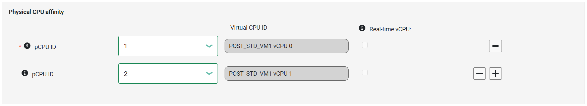

.. _cpu_sharing:

Enable CPU Sharing
##################

About CPU Sharing
*****************

CPU sharing allows the virtual CPUs (vCPUs) of different VMs to run on the same
physical CPU, just like how multiple processes run concurrently on a single CPU.
Internally the hypervisor adopts time slicing scheduling and periodically
switches among those vCPUs.

This feature can help improve overall CPU utilization when the VMs are not fully
loaded. However, sharing a physical CPU among multiple vCPUs increases the
worst-case response latency of them, and thus is not suitable for vCPUs running
latency-sensitive workloads.

Dependencies and Constraints
****************************

Consider the following dependencies and constraints:

* CPU sharing is a hypervisor feature that is hardware and OS neutral.

* CPU sharing is not available for real-time VMs or for VMs with local APIC
  passthrough (via the LAPIC passthrough option in the ACRN Configurator or via
  the Device Model ``--lapic_pt`` option).

* You can choose the scheduler the hypervisor uses. A scheduler is an algorithm
  for determining the priority of VMs running on a shared virtual CPU. ACRN
  supports the following schedulers:

  - Borrowed Virtual Time (BVT), which fairly allocates time slices to multiple
    vCPUs pinned to the same physical CPU. The BVT scheduler is the default and
    is sufficient for most use cases.

  - No-Operation (NOOP), which runs at most one vCPU on each physical CPU.

  - Priority based, which supports vCPU scheduling based on their static
    priorities defined in the scenario configuration. A vCPU can be running only
    if there is no higher-priority vCPU running on the same physical CPU.

Configuration Overview
**********************

You use the :ref:`acrn_configurator_tool` to enable CPU sharing by assigning the
same set of physical CPUs to multiple VMs and selecting a scheduler. The
following documentation is a general overview of the configuration process.

To assign the same set of physical CPUs to multiple VMs, set the following
parameters in each VM's **Basic Parameters**:

* VM type: Standard (Real-time VMs don't support CPU sharing)
* Physical CPU affinity > pCPU ID: Select a physical CPU by its core ID.
* To add another physical CPU, click **+** on the right side of an existing CPU.
  Or click **-** to delete a CPU.
* Repeat the process to assign the same physical CPUs to another VM.

To select a scheduler, go to **Hypervisor Global Settings > Advanced Parameters
> Virtual CPU scheduler** and select a scheduler from the list.

Example Configuration
*********************

The following steps show how to enable and verify CPU sharing between two User
VMs. The example extends the information provided in the :ref:`gsg`.

#. In the ACRN Configurator, create a shared scenario with a Service VM and two
   post-launched User VMs.

#. For the first User VM, set the following parameters in the VM's **Basic
   Parameters**:

   * VM name: This example uses ``POST_STD_VM1``.
   * VM type: ``Standard``
   * Physical CPU affinity: Select pCPU ID ``1``, then click **+** and select
     pCPU ID ``2`` to assign the VM to CPU cores 1 and 2.

   .. image:: images/configurator-cpusharing-vm1.png
      :align: center
      :class: drop-shadow

   .. image:: images/configurator-cpusharing-affinity.png
      :align: center
      :class: drop-shadow

#. For the second User VM, set the following parameters in the VM's **Basic
   Parameters**:

   * VM name: This example uses ``POST_STD_VM2``.
   * VM type: ``Standard``
   * Physical CPU affinity: Select pCPU ID ``1`` and ``2``. The pCPU IDs must be
     the same as those of ``POST_STD_VM1`` to use the CPU sharing function.

#. In **Hypervisor Global Settings > Advanced Parameters > Virtual CPU
   scheduler**, confirm that the default scheduler, Borrowed Virtual Time, is
   selected.

#. Save the scenario and launch script.

#. Build ACRN, copy all the necessary files from the development computer to
   the target system, and launch the Service VM and post-launched User VMs.

#. In the :ref:`ACRN hypervisor shell<acrnshell>`, check the CPU sharing via
   the ``vcpu_list`` command. For example:

   .. code-block:: none

      ACRN:\>vcpu_list

      VM ID    PCPU ID    VCPU ID    VCPU ROLE    VCPU STATE    THREAD STATE
      =====    =======    =======    =========    ==========    ==========
        0         0          0        PRIMARY      Running       RUNNABLE
        0         1          1        SECONDARY    Running       BLOCKED
        0         2          2        SECONDARY    Running       BLOCKED
        0         3          3        SECONDARY    Running       BLOCKED
        1         1          0        PRIMARY      Running       RUNNING
        1         2          1        SECONDARY    Running       BLOCKED
        2         1          0        PRIMARY      Running       BLOCKED
        2         2          1        SECONDARY    Running       RUNNING

   The VM ID, PCPU ID, VCPU ID, and THREAD STATE columns provide information to
   help you check CPU sharing. In the VM ID column, VM 0 is the Service VM, VM 1
   is POST_STD_VM1, and VM 2 is POST_STD_VM2. The output shows that ACRN
   assigned all physical CPUs (pCPUs) to VM 0 as expected. It also confirms that
   you assigned pCPUs 1 and 2 to VMs 1 and 2 (via the ACRN Configurator). vCPU 1
   of VM 0 and vCPU 0 of VM 1 and VM 2 are running on the same physical CPU;
   they are sharing the physical CPU execution time. The thread state column
   shows the current states of the vCPUs. BLOCKED state means the vCPU is
   waiting for an I/O operation to be completed. Once it is done, the state will
   change to RUNNABLE. When this vCPU gets its pCPU execution time, its state
   will change to RUNNING, then the vCPU is actually running on the pCPU.

Learn More
**********

For details on the ACRN CPU virtualization high-level design, For the
:ref:`hv-cpu-virt`.