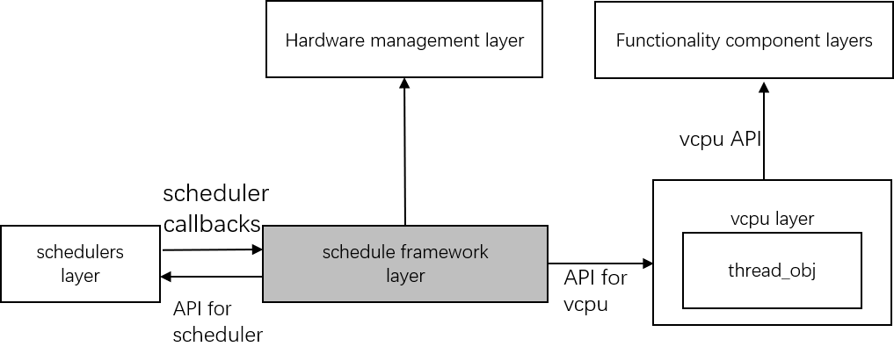

.. _cpu_sharing:

ACRN CPU Sharing
################

Introduction
************

The goal of CPU Sharing is to fully utilize the physical CPU resource to support more virtual machines. Currently, ACRN only supports 1 to 1 mapping mode between virtual CPUs (vCPUs) and physical CPUs (pCPUs). Because of the lack of CPU sharing ability, the number of VMs is limited. To support CPU Sharing, we have introduced a scheduling framework and implemented two simple small scheduling algorithms to satisfy embedded device requirements. Note that, CPU Sharing is not available for VMs with local APIC passthrough (``--lapic_pt`` option).

Scheduling Framework
********************

To satisfy the modularization design concept, the scheduling framework layer isolates the vCPU layer and scheduler algorithm. It does not have a vCPU concept so it is only aware of the thread object instance. The thread object state machine is maintained in the framework. The framework abstracts the scheduler algorithm object, so this architecture can easily extend to new scheduler algorithms.

.. figure:: images/cpu_sharing_framework.png
   :align: center

The below diagram shows that the vCPU layer invokes APIs provided by scheduling framework for vCPU scheduling. The scheduling framework also provides some APIs for schedulers. The scheduler mainly implements some callbacks in an ``acrn_scheduler`` instance for scheduling framework. Scheduling initialization is invoked in the hardware management layer.

vCPU affinity
*************

Currently, we do not support vCPU migration; the assignment of vCPU mapping to pCPU is statically configured in the VM configuration via a vcpu_affinity array. The item number of the array matches the vCPU number of this VM. Each item has one bit to indicate the assigned pCPU of the corresponding vCPU. Use these rules to configure the vCPU affinity:

- Only one bit can be set for each affinity item of vCPU.
- vCPUs in the same VM cannot be assigned to the same pCPU.

Here is an example for affinity:

- VM0: 2 vCPUs, pinned to pCPU0 and pCPU1
- VM1: 2 vCPUs, pinned to pCPU2 and pCPU3
- VM2: 2 vCPUs, pinned to pCPU0 and pCPU1

Thread object state
*******************

The thread object contains three states: RUNNING, RUNNABLE, and BLOCKED.

.. figure:: images/cpu_sharing_state.png
   :align: center

After a new vCPU is created, the corresponding thread object is initiated. The vCPU layer invokes a wakeup operation. After wakeup, the state for the new thread object is set to RUNNABLE, and then follows its algorithm to determine whether or not to preempt the current running thread object. If yes, it turns to the RUNNING state. In RUNNING state, the thread object may turn back to the RUNNABLE state when it runs out of its timeslice, or it might yield the pCPU by itself, or be preempted. The thread object under RUNNING state may trigger sleep to transfer to BLOCKED state.

Scheduler
*********

The below block diagram shows the basic concept for the scheduler. There are two kinds of scheduler in the diagram: NOOP (No-Operation) scheduler and IORR (IO sensitive Round-Robin) scheduler.

- **No-Operation scheduler**:

  The NOOP (No-operation) scheduler has the same policy as the original 1-1 mapping previously used; every pCPU can run only two thread objects: one is the idle thread, and another is the thread of the assigned vCPU. With this scheduler, vCPU works in Work-Conserving mode, which always try to keep resource busy, and will run once it is ready. Idle thread can run when the vCPU thread is blocked.

- **IO sensitive round-robin scheduler**:

  The IORR (IO sensitive round-robin) scheduler is implemented with the per-pCPU runqueue and the per-pCPU tick timer; it supports more than one vCPU running on a pCPU. It basically schedules thread objects in a round-robin policy and supports preemption by timeslice counting.

  - Every thread object has an initial timeslice (ex: 10ms)
  - The timeslice is consumed with time and be counted in the context switch and tick handler
  - If the timeslice is positive or zero, then switch out the current thread object and put it to tail of runqueue. Then, pick the next runnable one from runqueue to run.
  - Threads with an IO request will preempt current running threads on the same pCPU.

Scheduler configuration
***********************

Two places in the code decide the usage for the scheduler.

* The option in Kconfig decides the only scheduler used in runtime.
  ``hypervisor/arch/x86/Kconfig``

  .. literalinclude:: ../../../../hypervisor/arch/x86/Kconfig
     :name: Kconfig for Scheduler
     :caption: Kconfig for Scheduler
     :linenos:
     :lines: 40-58
     :emphasize-lines: 3
     :language: c

The default scheduler is **SCHED_NOOP**. To use the IORR, change it to **SCHED_IORR** in the **ACRN Scheduler**.

* The affinity for VMs are set in  ``hypervisor/scenarios/<scenario_name>/vm_configurations.h``

  .. literalinclude:: ../../../..//hypervisor/scenarios/industry/vm_configurations.h
     :name: Affinity for VMs
     :caption: Affinity for VMs
     :linenos:
     :lines: 31-32
     :language: c

* vCPU number corresponding to affinity is set in ``hypervisor/scenarios/<scenario_name>/vm_configurations.c`` by the **vcpu_num**

Example
*******

To support below configuration in industry scenario:

+----------+-------+-------+--------+
|pCPU0     |pCPU1  |pCPU2  |pCPU3   |
+==========+=======+=======+========+
|SOS WaaG  |RT Linux       |vxWorks |
+----------+---------------+--------+

Change the following three files:

1. ``hypervisor/arch/x86/Kconfig``

.. code-block:: none

   choice
       prompt "ACRN Scheduler"
       -default SCHED_NOOP
       +default SCHED_IORR
       help
          Select the CPU scheduler to be used by the hypervisor

2. ``hypervisor/scenarios/industry/vm_configurations.h``

.. code-block:: none

  #define CONFIG_MAX_VM_NUM               (4U)

  #define DM_OWNED_GUEST_FLAG_MASK        (GUEST_FLAG_SECURE_WORLD_ENABLED | GUEST_FLAG_LAPIC_PASSTHROUGH | \
                                                  GUEST_FLAG_RT | GUEST_FLAG_IO_COMPLETION_POLLING)

  #define SOS_VM_BOOTARGS                 SOS_ROOTFS      \
                                          "rw rootwait "  \
                                          "console=tty0 " \
                                          SOS_CONSOLE     \
                                          "consoleblank=0 "       \
                                          "no_timer_check "       \
                                          "quiet loglevel=3 "     \
                                          "i915.nuclear_pageflip=1 " \
                                          "i915.avail_planes_per_pipe=0x01010F "  \
                                          "i915.domain_plane_owners=0x011111110000 " \
                                          "i915.enable_gvt=1 "    \
                                          SOS_BOOTARGS_DIFF

  #define VM1_CONFIG_VCPU_AFFINITY        {AFFINITY_CPU(0U)}
  #define VM2_CONFIG_VCPU_AFFINITY        {AFFINITY_CPU(1U), AFFINITY_CPU(2U)}
  #define VM3_CONFIG_VCPU_AFFINITY        {AFFINITY_CPU(3U)}

3. ``hypervisor/scenarios/industry/vm_configurations.c``

.. code-block:: none

 struct acrn_vm_config vm_configs[CONFIG_MAX_VM_NUM] = {
         {
                 .load_order = SOS_VM,
                 .name = "ACRN SOS VM",
                 .uuid = {0xdbU, 0xbbU, 0xd4U, 0x34U, 0x7aU, 0x57U, 0x42U, 0x16U,        \
                          0xa1U, 0x2cU, 0x22U, 0x01U, 0xf1U, 0xabU, 0x02U, 0x40U},
                 .guest_flags = 0UL,
                 .clos = 0U,
                 .memory = {
                         .start_hpa = 0UL,
                         .size = CONFIG_SOS_RAM_SIZE,
                 },
                 .os_config = {
                         .name = "ACRN Service OS",
                         .kernel_type = KERNEL_BZIMAGE,
                         .kernel_mod_tag = "Linux_bzImage",
                         .bootargs = SOS_VM_BOOTARGS
                 },
                 .vuart[0] = {
                         .type = VUART_LEGACY_PIO,
                         .addr.port_base = SOS_COM1_BASE,
                         .irq = SOS_COM1_IRQ,
                 },
                 .vuart[1] = {
                         .type = VUART_LEGACY_PIO,
                         .addr.port_base = SOS_COM2_BASE,
                         .irq = SOS_COM2_IRQ,
                         .t_vuart.vm_id = 2U,
                         .t_vuart.vuart_id = 1U,
                 },
                 .pci_dev_num = SOS_EMULATED_PCI_DEV_NUM,
                 .pci_devs = sos_pci_devs,
         },
         {
                 .load_order = POST_LAUNCHED_VM,
                 .uuid = {0xd2U, 0x79U, 0x54U, 0x38U, 0x25U, 0xd6U, 0x11U, 0xe8U,        \
                          0x86U, 0x4eU, 0xcbU, 0x7aU, 0x18U, 0xb3U, 0x46U, 0x43U},
                 .vcpu_num = 1U,
                 .vcpu_affinity = VM1_CONFIG_VCPU_AFFINITY,
                 .vuart[0] = {
                         .type = VUART_LEGACY_PIO,
                         .addr.port_base = COM1_BASE,
                         .irq = COM1_IRQ,
                 },
                 .vuart[1] = {
                         .type = VUART_LEGACY_PIO,
                         .addr.port_base = INVALID_COM_BASE,
                 }

         },
         {
                 .load_order = POST_LAUNCHED_VM,
                 .uuid = {0x49U, 0x5aU, 0xe2U, 0xe5U, 0x26U, 0x03U, 0x4dU, 0x64U,        \
                          0xafU, 0x76U, 0xd4U, 0xbcU, 0x5aU, 0x8eU, 0xc0U, 0xe5U},

                 .guest_flags = GUEST_FLAG_HIGHEST_SEVERITY,
                 .vcpu_num = 2U,
                 .vcpu_affinity = VM2_CONFIG_VCPU_AFFINITY,
                 .vuart[0] = {
                         .type = VUART_LEGACY_PIO,
                         .addr.port_base = COM1_BASE,
                         .irq = COM1_IRQ,
                 },
                 .vuart[1] = {
                         .type = VUART_LEGACY_PIO,
                         .addr.port_base = COM2_BASE,
                         .irq = COM2_IRQ,
                         .t_vuart.vm_id = 0U,
                         .t_vuart.vuart_id = 1U,
                 },
         },
         {
                 .load_order = POST_LAUNCHED_VM,
                 .uuid = {0x38U, 0x15U, 0x88U, 0x21U, 0x52U, 0x08U, 0x40U, 0x05U,        \
                          0xb7U, 0x2aU, 0x8aU, 0x60U, 0x9eU, 0x41U, 0x90U, 0xd0U},
                 .vcpu_num = 1U,
                 .vcpu_affinity = VM3_CONFIG_VCPU_AFFINITY,
                 .vuart[0] = {
                         .type = VUART_LEGACY_PIO,
                         .addr.port_base = COM1_BASE,
                         .irq = COM1_IRQ,
                 },
                 .vuart[1] = {
                         .type = VUART_LEGACY_PIO,
                         .addr.port_base = INVALID_COM_BASE,
                 }

         },

 };

After you start all VMs, check the vCPU affinities from the Hypervisor console:

.. code-block:: none

  ACRN:\>vcpu_list

  VM ID    PCPU ID    VCPU ID    VCPU ROLE    VCPU STATE
  =====    =======    =======    =========    ==========
    0         0          0       PRIMARY      Running
    1         0          0       PRIMARY      Running
    2         1          0       PRIMARY      Running
    2         2          1       SECONDARY    Running
    3         3          0       PRIMARY      Running
