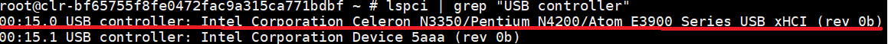
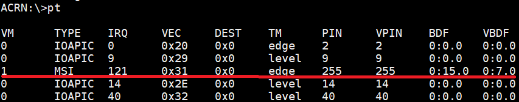
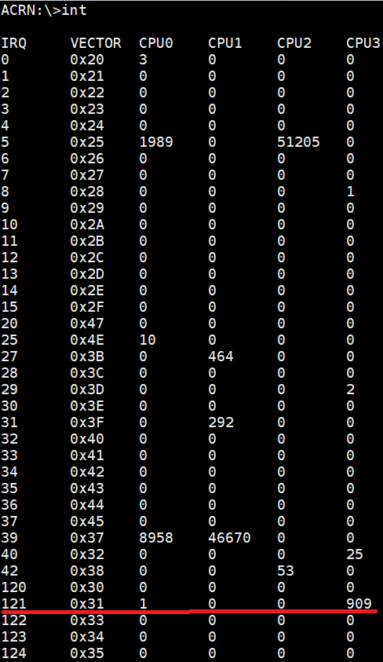
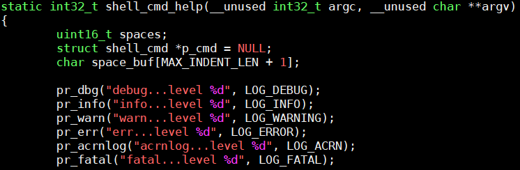
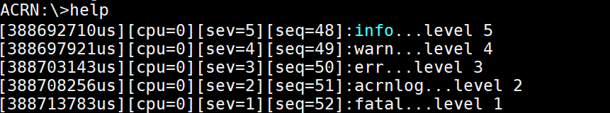
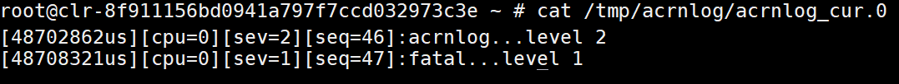

.. _acrn-debug:

ACRN Debugging Tools
####################

This document describes how to use ACRN tools to collect log
and trace data for debugging.

ACRN Console Command
********************

The ACRN console provides shell commands for a user to check system states
and environment settings. See the :ref:`acrnshell` documentation for a
full list of commands, or see a summary of available commands by using
the ``help`` command within the ACRN shell.

An example
**********

As an example, we'll show how to obtain the interrupts of a passthrough USB device.

First, we can get the USB controller BDF number (0:15.0) through the
following command in the Service VM console::

   lspci | grep "USB controller"

   USB controller BDF information

Second, we use the ``pt`` command in the ACRN console, and use this BDF number
to find the interrupt vector (VEC) "0x31".

   USB controller interrupt information

Finally we use the ``int`` command in the ACRN console, and use this
interrupt vector to find the interrupt number (909) on CPU3.

   USB controller interrupt number information

ACRN Log
********

ACRN log provides console log and mem log for a user to analyze.
We can use console log to debug directly, while mem log is a userland tool
used to capture a ACRN hypervisor log.

Turn on the logging info
========================

ACRN enables a console log by default.

To enable and start the mem log::

   $ systemctl enable acrnlog
   $ systemctl start acrnlog

Set and grab log
================

We have 1-6 log levels for console log and mem log. The following
functions print different levels of console log and mem log::

      pr_dbg("debug...level %d", LOG_DEBUG);       //level 6
      pr_info("info...level %d", LOG_INFO);        //level 5
      pr_warn("warn...level %d", LOG_WARNING);     //level 4
      pr_err("err...level %d", LOG_ERROR);         //level 3
      pr_acrnlog("acrnlog...level %d", LOG_ACRN);  //level 2
      pr_fatal("fatal...level %d", LOG_FATAL);     //level 1

If the built-in logging doesn't provide enough information, you can add
additional logging in functions you want to debug, using the functions
noted above.  For example, add the following code into function
``shell_cmd_help`` in the source file
``acrn-hypervisor/hypervisor/debug/shell.c``:

   shell_cmd_help added information

Once you have instrumented the code, you need to rebuild the hypervisor and
install it on your platform. Refer to :ref:`getting-started-building` and
:ref:`kbl-nuc-sdc` for detailed instructions on how to do that.

We set console log level to 5, and mem log level to 2 through the
command::

   loglevel 5 2

Then we input ``help`` into the ACRN console (this is the command that we have
just instrumented with additional log information), and check the log as follows.

   console log information

Then we use the command, on the ACRN console::

   vm_console

to switch to the Service VM console. Then we use the command::

   cat /tmp/acrnlog/acrnlog_cur.0

and we will see the following log:

   mem log information

ACRN Trace
**********

ACRN trace is a tool running on the Service VM to capture trace
data. We can use the existing trace information to analyze, and we can
add self-defined tracing to analyze code which we care about.

Using Existing trace event id to analyze trace
==============================================

As an example, we can use the existing vm_exit trace to analyze the
reason and times of each vm_exit after we have done some operations.

1. Run the following Service VM console command to collect
   trace data::

      # acrntrace -c

2. Check current directory, and confirm the directory contains four
   trace files::

      # ls
      0 1 2 3

3. Use the command to get a summary of vmexit::

      # acrnalyze.py -i /home/trace/acrntrace/20190219-001529/1 -o vmexit --vm_exit

   .. note:: The acrnalyze.py script is in the
      ``misc/tools/acrntrace/scripts`` folder.  The location
      of the trace files produced by ``acrntrace`` may be different in your system.

   .. figure:: images/debug_image28.png
      :align: center

      vmexit summary information

Using Self-defined trace event id to analyze trace
==================================================

For some undefined trace event id, we can define it by ourselves as
shown in the following example:

1. Add the following new event id into
   ``acrn-hypervisor/hypervisor/include/debug/trace.h``:

   .. figure:: images/debug_image25.png
      :align: center

      trace event id

2. Add the following format to
   ``misc/tools/acrntrace/scripts/formats``:

   .. figure:: images/debug_image1.png
      :align: center

      acrntrace formatted information

   .. note::

      Formats:
        0x00000005: event id for trace test

        %(cpu)d: corresponding cpu index with 'decimal' format

        %(event)016x: corresponding event id with 'hex' format

        %(tsc)d: corresponding event time stamp with 'decimal' format

        %(1)08x: corresponding first 'Long' data in TRACE_2L

3. Add trace into function ``emulate_io`` in
   ``acrn-hypervisor/hypervisor/arch/x86/guest/io_emul.c`` which we want to
   trace for the calling times of function ``emulate_io``:

   .. figure:: images/debug_image2.png
      :align: center

      inserted trace information

4. After we have inserted the trace code addition, we need to rebuild
   the ACRN hypervisor and install it on the platform. Refer to
   :ref:`getting-started-building` and :ref:`kbl-nuc-sdc` for
   detailed instructions on how to do that.

5. Now we can use the following command in the Service VM console
   to generate acrntrace data into the current directory::

      acrntrace -c

   .. figure:: images/debug_image3.png
      :align: center

      trace collection

6. Run the console command::

      # acrntrace_format.py \
        formats /home/trace/acrntrace/20190219-001529/1 | grep "trace test"

   .. note:: The acrnalyze.py script is in the
      ``misc/tools/acrntrace/scripts`` folder.  The location
      of the trace files produced by ``acrntrace`` may be different in your system.

   and we will get the following log:

   .. figure:: images/debug_image4.png
      :align: center

      trace collection

   .. note::
      The trace data may generate on any of the available CPUs, so
      you'll need to check which CPU number was used and specify that
      CPU to analyze its trace.
