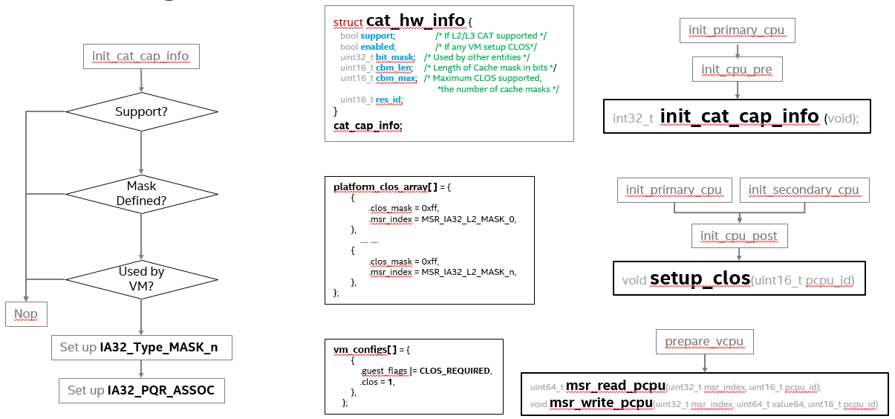

.. _using_cat_up2:

How to enable CAT on ACRN
#########################

On platforms that support Cache Allocation Technology (CAT), ACRN hypervisor can
control guest VMs' CAT-capable cache allocation based on guest's priority. :numref:`cache-mask-vm`
(taken from Intel Software Developer Manual, Vol 3, Figure 17-27) shows cache allocation examples
in a system that supports up to 4 Classes of Service and the bit length of the Cache Capacity Bitmasks is 8.

   Cache usage with Cache Mask

CAT Support on ACRN
*******************

As described at `Intel (R) 64 and IA-32 Architectures Software Developer's Manual
<https://software.intel.com/en-us/download/intel-64-and-ia-32-architectures-sdm-combined-volumes-3a-3b-3c-and-3d-system-programming-guide>`_,
chapter 17.19, volume 3. There are 3 steps to use CAT:

1. Detect the CAT capability.
2. Setup cache mask array MSRs, which is referred to as Class of Service (CLOS) array.
3. Select one of the CLOS array for the CPU, that will be the cache mask of the CPU.

ACRN integrates the usage of CAT into VM configuration. The CLOS array must be defined
in the board config source code, and the VM needs to specify which CLOS to use in its VM
config data. If the platform supports CAT, the CLOS array will be written to the CLOS MSRs
at CPU init time, and the VM will set CLOS for VCPU at VM launch time.
The details are shown in :numref:`acrn-cat-hld`:

   CAT Support on ACRN

Tuning CAT in HV debug shell
############################

From the ACRN HV debug shell, you can use ``cpuid, rdmsr and wrmsr`` debug commands to
enumerate CAT capability and tune CAT parameters. The following examples are based on
`UP Squared board <http://www.up-board.org/upsquared/specifications/>`_ (UP2).
(refer to :ref:`getting-started-up2` for setup instructions).

#. Check CAT ability with ``cupid``. First run ``cpuid 0x10 0x0``, the return value ebx[bit 2]
   reports the L2 CAT is supported. Then run ``cpuid 0x10 0x2`` to query L2 CAT capability,
   the return value eax[bit 4:0] reports the cache mask has 8 bit, and edx[bit 15:0] reports 4 CLOS are
   supported, as shown below:

   .. code-block:: none

      ACRN:\>cpuid 0x10 0x0
      cpuid leaf: 0x10, subleaf: 0x0, 0x0:0x4:0x0:0x0

      ACRN:\>cpuid 0x10 0x2
      cpuid leaf: 0x10, subleaf: 0x2, 0x7:0x0:0x0:0x3

#. Check PCPU IDs of each VM, the ``vcpu_list`` shows that VM0 is running on PCPU0,
   and VM1 is running on PCPU1:

   .. code-block:: none

      ACRN:\>vcpu_list

      VM ID    PCPU ID    VCPU ID    VCPU ROLE    VCPU STATE
      =====    =======    =======    =========    ==========
        0         0          0        PRIMARY       Running
        1         1          0        PRIMARY       Running

#. Set CLOS with ``wrmsr <reg_num> <value>``, we want VM1 to use the lower 6 ways of cache,
   so CLOS0 is set to 0xc0 for the upper 2 ways, and CLOS1 is set to 0x3f for the lower
   6 ways:

   .. code-block:: none

      ACRN:\>wrmsr -p1 0xd10 0xc0
      ACRN:\>wrmsr -p1 0xd11 0x3f

#. Attach COS1 to PCPU1. Because MSR IA32_PQR_ASSOC [bit 63:32], we'll write 0x100000000
   to it to use CLOS1

   .. code-block:: none

      ACRN:\>wrmsr -p1 0xc8f 0x100000000

.. _configure_cat_vm:

Configure CAT for VM with VM Configuration
##########################################

#. CAT on ACRN can be enabled and configured by modifying source code. The first
   step is to clone the ACRN source code (if you haven't done it already):

   .. code-block:: none

      $ git clone https://github.com/projectacrn/acrn-hypervisor.git
      $ cd acrn-hypervisor/

#. Turn on CONFIG_CAT_ENABLED with ``make menuconfig`` command:

   .. code-block:: none

     $ cd hypervisor
     $ make defconfig BOARD=<board_name>
     $ make menuconfig

   .. figure:: images/menuconfig-cat.png
      :align: center

      menuconfig: CAT_ENABLED

#. The predefined cache masks can be found at
   ``hypervisor/arch/x86/configs/$(CONFIG_BOARD)/board.c``, you can change the mask values,
   but note that the CLOS mask must have continuous bits, or a #GP fault can be triggered.

   .. code-block:: none
      :emphasize-lines: 3,7,11,15

      struct platform_clos_info platform_clos_array[MAX_PLATFORM_CLOS_NUM] = {
              {
                      .clos_mask = 0xff,
                      .msr_index = MSR_IA32_L2_MASK_0,
              },
              {
                      .clos_mask = 0xff,
                      .msr_index = MSR_IA32_L2_MASK_1,
              },
              {
                      .clos_mask = 0xff,
                      .msr_index = MSR_IA32_L2_MASK_2,
              },
              {
                      .clos_mask = 0xff,
                      .msr_index = MSR_IA32_L2_MASK_3,
              },
      };

#. Set up CLOS for every VM. The configuration data can be found at
   ``scenarios/<scenario_name>/vm_configurations.c``. In the following example,
   you may associate a valid CLOS to a guest by assigning clos to a number between
   0 and (MAX_PLATFORM_CLOS_NUM - 1).

   .. code-block:: none
      :emphasize-lines: 6

      struct acrn_vm_config vm_configs[CONFIG_MAX_VM_NUM] = {
              {
                      .load_order = SOS_VM,
                      .name = "ACRN SOS VM",
                      .guest_flags = 0U,
                      .clos = 1,
                      .memory = {
                              .start_hpa = 0x0UL,
                              .size = CONFIG_SOS_RAM_SIZE,
                      },
                      .os_config = {
                              .name = "ACRN Service OS",
                      },
              },
      };

#. Careful consideration should be made in assigning VCPU affinity. In cache isolation configuration,
   not only need to isolate CAT-capable caches, but need to isolate lower-level caches as well.
   In the following example, logical processor #0 and #2 share L1 and L2 caches. In this case,
   do not assign LP #0 and LP #2 to different VMs that need to do cache isolation. Assign LP #1 and LP #3
   with similar consideration.

   .. code-block:: none
      :emphasize-lines: 3

      # lstopo-no-graphics -v
      Package L#0 (P#0 CPUVendor=GenuineIntel CPUFamilyNumber=6 CPUModelNumber=142)
        L3Cache L#0 (size=3072KB linesize=64 ways=12 Inclusive=1)
          L2Cache L#0 (size=256KB linesize=64 ways=4 Inclusive=0)
            L1dCache L#0 (size=32KB linesize=64 ways=8 Inclusive=0)
              L1iCache L#0 (size=32KB linesize=64 ways=8 Inclusive=0)
                Core L#0 (P#0)
                  PU L#0 (P#0)
                  PU L#1 (P#2)
          L2Cache L#1 (size=256KB linesize=64 ways=4 Inclusive=0)
            L1dCache L#1 (size=32KB linesize=64 ways=8 Inclusive=0)
              L1iCache L#1 (size=32KB linesize=64 ways=8 Inclusive=0)
                Core L#1 (P#1)
                  PU L#2 (P#1)
                  PU L#3 (P#3)

   .. note:: In Clear Linux, ``lstopo-no-graphics`` utility can be installed with ``swupd bundle-add hwloc``;
      in Ubuntu, it can be installed with ``apt-get install hwloc``

   This can be done by directly modifying source code in ``scenarios/<scenario_name>/vm_configurations.h``.
   The following shows an example for VCPU affinity assigment in logical partition scenario.

   .. code-block:: none

      #define VM0_CONFIG_VCPU_AFFINITY        {AFFINITY_CPU(0U), AFFINITY_CPU(2U)}
      #define VM1_CONFIG_VCPU_AFFINITY        {AFFINITY_CPU(1U), AFFINITY_CPU(3U)}

   Or, as mentioned in :ref:`ACRN Configuration Tool <vm_config_workflow>`, generate a scenario XML file,
   with correct vcpu_affinity assignment, and generate source code accordingly.

#. Build the ACRN hypervisor, update the ACRN image and reboot the target. See :ref:`getting-started-building` for building instructions.
