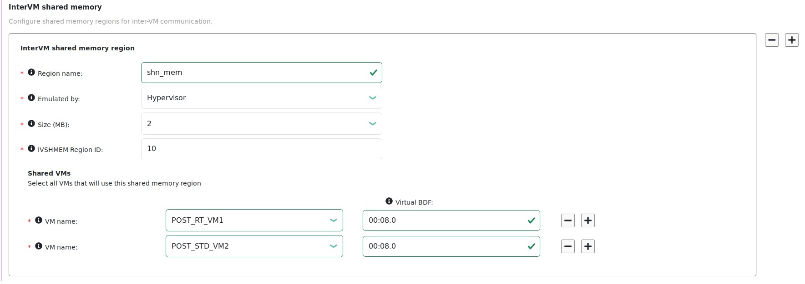

.. _enable_ivshmem:

Enable Inter-VM Shared Memory Communication (IVSHMEM)
#####################################################

About Inter-VM Shared Memory Communication (IVSHMEM)
****************************************************

Inter-VM shared memory communication allows VMs to communicate with each other
via a shared memory mechanism.

As an example, users in the industrial segment can use a shared memory region to
exchange commands and responses between a Windows VM that is taking inputs from
operators and a real-time VM that is running real-time tasks.

The ACRN Device Model or hypervisor emulates a virtual PCI device (called an
IVSHMEM device) to expose this shared memory's base address and size.

* Device Model: The IVSHMEM device is emulated in the ACRN Device Model, and the
  shared memory regions are reserved in the Service VM's memory space. This
  solution only supports communication between post-launched User VMs.

* Hypervisor: The IVSHMEM device is emulated in the hypervisor, and the shared
  memory regions are reserved in the hypervisor's memory space. This solution
  works for both pre-launched and post-launched User VMs.

While both solutions can be used in the same ACRN configuration, VMs using
different solutions cannot communicate with each other.

Dependencies and Constraints
****************************

Consider the following dependencies and constraints:

* Inter-VM shared memory communication is a hardware-neutral feature.

* Guest OSes are required to have either of the following:

  - An IVSHMEM driver, such as `virtio-WIN
    <https://github.com/virtio-win/kvm-guest-drivers-windows>`__ for Windows and
    `ivshmem APIs
    <https://docs.zephyrproject.org/apidoc/latest/group__ivshmem.html>`__ in
    Zephyr

  - A mechanism granting user-space applications access to a PCI device, such as
    the `Userspace I/O (UIO) driver
    <https://www.kernel.org/doc/html/latest/driver-api/uio-howto.html>`__ in
    Linux

Configuration Overview
**********************

The :ref:`acrn_configurator_tool` lets you configure inter-VM shared memory
communication among VMs. The following documentation is a general overview of
the configuration process.

To configure inter-VM shared memory communication among VMs, go to the
**Hypervisor Global Settings > Basic Parameters > InterVM shared memory**. Click
**+** to add the first shared memory region.

For the shared memory region:

#. Enter a name for the shared memory region.
#. Select the source of the emulation, either Hypervisor or Device Model.
#. Select the size of the shared memory region.
#. Select at least two VMs that can use the shared memory region.
#. Enter a virtual Board:Device.Function (BDF) address for each VM or leave it
   blank. If the field is blank, the tool provides an address when the
   configuration is saved.

#. Add more VMs to the shared memory region by clicking **+** on the right
   side of an existing VM. Or click **-** to delete a VM.

To add another shared memory region, click **+** on the right side of an
existing region. Or click **-** to delete a region.

Learn More
**********

ACRN supports multiple inter-VM communication methods. For a comparison, see
:ref:`inter-vm_communication`.

For details on ACRN IVSHMEM high-level design, see :ref:`ivshmem-hld`.