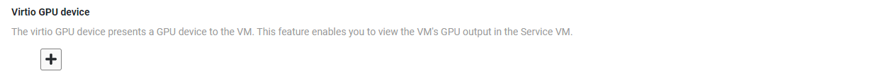
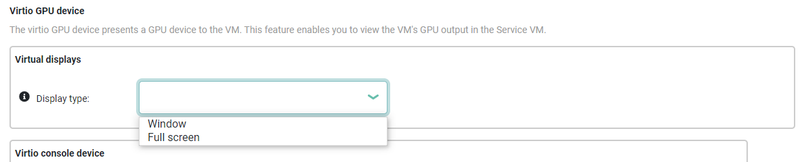

.. _enable_multiple_displays:

Enable User VMs with Multiple Displays
######################################

A VM may want to run an OS with a graphical desktop or provide an application
with a human-machine interface (HMI) display. You can enable a graphical display by
using virtio GPU.

Virtio GPU lets a VM present multiple windowed virtual displays on the physical
monitor.  Virtio GPU also allows multiple VMs to share the same physical
display, for example, where the service VM has a Linux desktop window and a
Windows-based User VM has its desktop in a window on the same physical monitor.

Virtio GPU is a virtio-based graphics adapter that provides a VM with one or
more virtual displays that show on the Service VM's monitor in either windowed
or borderless full screen mode.

In ACRN, virtio GPU operates in 2D mode only and does not support offloading
rendering operations to a physical GPU. To do that, you must enable SR-IOV of
the physical GPU and passthrough one virtual function (VF) to each VM requiring
a virtual display.

Dependencies and Constraints
****************************

Consider the following dependencies and constraints:

* Virtio GPU only works with post-launched standard (non real-time) VMs.
* Virtio GPU works best with virtual functions (VFs) of the physical GPUs.
  Without the VFs, the post-launched VM must use CPU rendering.
* Virtio GPU allows virtualizing multiple displays for one VM. All displays must
  operate in the same mode, either windowed or borderless Full screen.  In either
  mode, virtio GPU supports at most two virtual displays per VM.
* The hosting Service VM's OS needs to work in graphical mode (instead of the
  command line mode).

.. note:: The virtio GPU mechanism performs best with Single Root I/O
   Virtualization (SR-IOV) so that frames can be rendered by SR-IOV VF and
   displayed by virtio GPU. Without SR-IOV support on your hardware platform (and
   enabled in the BIOS settings), the VM can still render frames using the CPU, but
   this is typically less efficient.

Configuration Overview
**********************

Use the :ref:`acrn_configurator_tool` to configure virtio GPU in the
post-launched User VM's basic parameters:

Click on the ``+`` to define a new virtio-GPU device.  From there you can choose
between a ``window`` or a borderless``full screen`` display for this device.

If you select ``window`` you can then choose the size of the window (from a
list), and the window's top-left corner offset (in pixels) from the top-left
corner of the screen, as shown in the following example.

Configuration Example
*********************

The following steps show how to select and verify a virtio GPU device by
extending the information provided in the :ref:`gsg`.

1. In the ACRN Configurator, update the shared scenario you created with a
   Service VM and one post-launched User VM by adding these virtio-GPU settings
   to the User VM.

   Open the "POST_STD_VM1" -> "Basic Parameters" and scroll down to the "virtio
   GPU device" settings.  Click on the "+" to create a new virtual display
   device and fill out the display settings:

   .. image:: images/virtio-gpu-device-03.png
      :align: center
      :class: drop-shadow

   In this example, we selected a window device (instead of a full screen
   device) with a 1920x1080 size, and with the top-left corner 100 pixels down
   and to the right of the (Service VM) display's top-left corner.

#. Save the scenario and launch script.
#. Follow the :ref:`gsg` instructions to build ACRN and copy all the
   necessary files from the development computer to the target system.
#. Reboot the target system to launch the Service VM and use the launch script
   to start the post-launched User VM.

Unlike in the original Getting Started Guide, this time when the Post-launched
User VM starts Ubuntu, the login screen uses the virtio GPU display in a
windowed area instead of being full screen.
