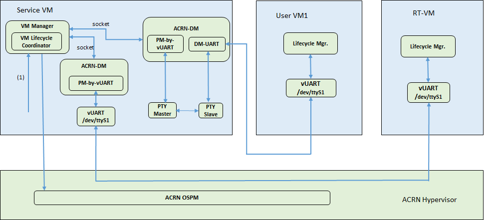
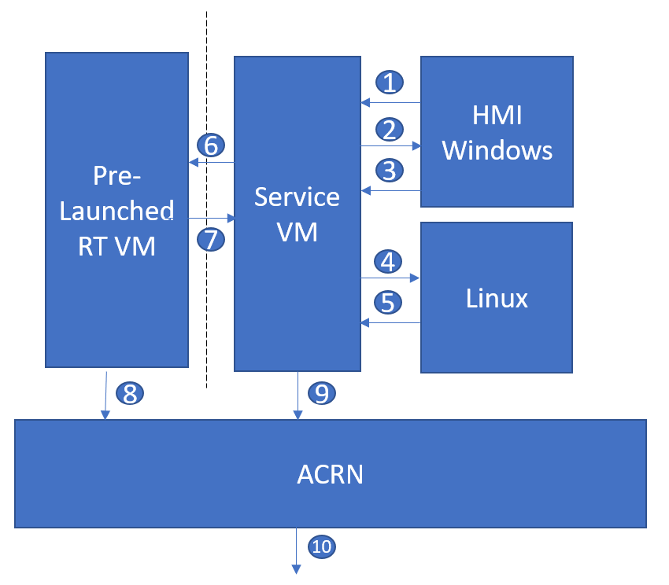

.. _enable-s5:

Enable S5 in ACRN
#################

Introduction
************

S5 is one of the `ACPI sleep states <http://acpi.sourceforge.net/documentation/sleep.html>`_
that refers to the system being shut down (although some power may still be
supplied to certain devices). In this document, S5 means the function to
shut down the **User VMs**, **Service VM**, the hypervisor, and the
hardware. In most cases, directly powering off a computer
system is not advisable because it can damage some components. It can cause
corruption and put the system in an unknown or unstable state. On ACRN, the
User VM must be shut down before powering off the Service VM. Especially for
some use cases, where User VMs could be used in industrial control or other
high safety requirement environment, a graceful system shutdown such as the
ACRN S5 function is required.

S5 Architecture
***************

ACRN provides a mechanism to trigger the S5 state transition throughout the system.
It uses a vUART channel to communicate between the Service and User VMs.
The diagram below shows the overall architecture:

   S5 overall architecture

- **vUART channel**:

    The User VM's serial port device (``/dev/ttySn``) is emulated in the
    Hypervisor. The channel from the Service VM to the User VM:

    .. graphviz:: images/s5-scenario-2.dot
       :name: s5-scenario-2

Lifecycle Manager Overview
==========================

As part of the S5 reference design, a Lifecycle Manager daemon (``life_mngr`` in Linux,
``life_mngr_win.exe`` in Windows) runs in the Service VM and User VMs to implement S5.
Operator or user can use ``s5_trigger_linux.py`` or ``s5_trigger_win.py`` script to initialize
a system S5 in the Service VM or User VMs. The Lifecycle Manager in the Service VM and
User VMs wait for system S5 request on the local socket port.

Initiate a System S5 from within a User VM (e.g., HMI)
======================================================

As shown in the :numref:`s5-architecture`, a request to Service VM initiates the shutdown flow.
This could come from a User VM, most likely the HMI (running Windows or Linux).
When a human operator initiates the flow through running ``s5_trigger_linux.py`` or ``s5_trigger_win.py``,
the Lifecycle Manager (``life_mngr``) running in that User VM sends the system S5 request via
the vUART to the Lifecycle Manager in the Service VM which in turn acknowledges the request.
The Lifecycle Manager in Service VM sends ``poweroff_cmd`` request to User VMs, when the Lifecycle Manager
in User VMs receives ``poweroff_cmd`` request, it sends ``ack_poweroff`` to the Service VM;
then it shuts down the User VMs. If the User VMs is not ready to shut down, it can ignore the
``poweroff_cmd`` request.

.. note:: The User VM need to be authorized to be able to request a system S5, this is achieved
   by configuring  ``ALLOW_TRIGGER_S5`` in the Lifecycle Manager service configuration :file:`/etc/life_mngr.conf`
   in the Service VM. There is only one User VM in the system can be configured to request a shutdown.
   If this configuration is wrong, the system S5 request from User VM is rejected by
   Lifecycle Manager of Service VM, the following error message is recorded in Lifecycle Manager
   log :file:`/var/log/life_mngr.log` of Service VM:
   ``The user VM is not allowed to trigger system shutdown``

Initiate a System S5 within the Service VM
==========================================

On the Service VM side, it uses the ``s5_trigger_linux.py`` to trigger the system S5 flow. Then,
the Lifecycle Manager in service VM sends a ``poweroff_cmd`` request to the lifecycle manager in each
User VM through the vUART channel. If the User VM receives this request, it will send an ``ack_poweroff``
to the lifecycle manager in Service VM. It is the Service VM's responsibility to check whether the
User VMs shut down successfully or not, and to decide when to shut the Service VM itself down.

.. note:: Service VM is always allowed to trigger system S5 by default.

.. _enable_s5:

Enable S5
*********

1. Configure communication vUART for Service VM and User VMs:

   Add these lines in the hypervisor scenario XML file manually:

   Example::

      /* VM0 */
      <vm_type>SERVICE_VM</vm_type>
      ...
      <legacy_vuart id="1">
         <type>VUART_LEGACY_PIO</type>
         <base>CONFIG_COM_BASE</base>
         <irq>0</irq>
         <target_vm_id>1</target_vm_id>
         <target_uart_id>1</target_uart_id>
      </legacy_vuart>
      <legacy_vuart id="2">
        <type>VUART_LEGACY_PIO</type>
        <base>CONFIG_COM_BASE</base>
        <irq>0</irq>
        <target_vm_id>2</target_vm_id>
        <target_uart_id>2</target_uart_id>
      </legacy_vuart>
      ...
      /* VM1 */
      <vm_type>POST_STD_VM</vm_type>
      ...
      <legacy_vuart id="1">
         <type>VUART_LEGACY_PIO</type>
         <base>COM2_BASE</base>
         <irq>COM2_IRQ</irq>
         <target_vm_id>0</target_vm_id>
         <target_uart_id>1</target_uart_id>
      </legacy_vuart>
      ...
      /* VM2 */
      <vm_type>POST_STD_VM</vm_type>
      ...
      <legacy_vuart id="1">
         <type>VUART_LEGACY_PIO</type>
         <base>INVALID_COM_BASE</base>
         <irq>COM2_IRQ</irq>
         <target_vm_id>0</target_vm_id>
         <target_uart_id>2</target_uart_id>
      </legacy_vuart>
      <legacy_vuart id="2">
         <type>VUART_LEGACY_PIO</type>
         <base>COM2_BASE</base>
         <irq>COM2_IRQ</irq>
         <target_vm_id>0</target_vm_id>
         <target_uart_id>2</target_uart_id>
      </legacy_vuart>
      ...
      /* VM3 */
      ...

  .. note:: These vUART is emulated in the hypervisor; expose the node as ``/dev/ttySn``.
     For the User VM with the minimal VM ID, the communication vUART id should be 1.
     For other User VMs, the vUART (id is 1) shoulbe be configured as invalid, the communication
     vUART id should be 2 or others.

2. Build the Lifecycle Manager daemon, ``life_mngr``:

   .. code-block:: none

      cd acrn-hypervisor
      make life_mngr

#. For Service VM, LaaG VM and RT-Linux VM, run the Lifecycle Manager daemon:

   a. Copy ``life_mngr.conf``, ``s5_trigger_linux.py``, ``user_vm_shutdown.py``, ``life_mngr``,
      and ``life_mngr.service`` into the Service VM and User VMs.

      .. code-block:: none

         scp build/misc/services/s5_trigger_linux.py root@<target board address>:~/
         scp build/misc/services/life_mngr root@<target board address>:/usr/bin/
         scp build/misc/services/life_mngr.conf root@<target board address>:/etc/life_mngr/
         scp build/misc/services/life_mngr.service root@<target board address>:/lib/systemd/system/

         scp misc/services/life_mngr/user_vm_shutdown.py root@<target board address>:~/

      .. note:: :file:`user_vm_shutdown.py` is only needed to be copied into Service VM.

   #. Edit options in ``/etc/life_mngr/life_mngr.conf`` in the Service VM.

      .. code-block:: none

         VM_TYPE=service_vm
         VM_NAME=Service_VM
         DEV_NAME=tty:/dev/ttyS8,/dev/ttyS9,/dev/ttyS10,/dev/ttyS11,/dev/ttyS12,/dev/ttyS13,/dev/ttyS14
         ALLOW_TRIGGER_S5=/dev/ttySn

      .. note:: The mapping between User VM ID and communication serial device name (``/dev/ttySn``)
                in the :file:`/etc/serial.conf`. If ``/dev/ttySn`` is configured in the  ``ALLOW_TRIGGER_S5``,
                this means system shutdown is allowed to be triggered in the corresponding User VM.

   #. Edit options in ``/etc/life_mngr/life_mngr.conf`` in the User VM.

      .. code-block:: none

         VM_TYPE=user_vm
         VM_NAME=<User VM name>
         DEV_NAME=tty:/dev/ttyS1
         #ALLOW_TRIGGER_S5=/dev/ttySn

      .. note:: The User VM name in this configuration file should be consistent with the VM name in the
               launch script for the Post-launched User VM or the VM name which is specified in the hypervisor
               scenario XML for the Pre-launched User VM.

   #. Use the following commands to enable ``life_mngr.service`` and restart the Service VM and User VMs.

      .. code-block:: none

         sudo chmod +x /usr/bin/life_mngr
         sudo systemctl enable life_mngr.service
         sudo reboot

      .. note:: For the Pre-launched User VM, need restart Lifecycle Manager service manually
         after Lifecycle Manager in Service VM starts.

#. For the WaaG VM, run the lifecycle manager daemon:

   a) Build the ``life_mngr_win.exe`` application and ``s5_trigger_win.py``::

        cd acrn-hypervisor
        make life_mngr

      .. note:: If there is no ``x86_64-w64-mingw32-gcc`` compiler, you can run
               ``sudo apt install gcc-mingw-w64-x86-64`` on Ubuntu to install it.

   #) Copy ``s5_trigger_win.py`` into the WaaG VM.

   #) Set up a Windows environment:

      1) Download the Python3 from `<https://www.python.org/downloads/release/python-3810/>`_, install
         "Python 3.8.10" in WaaG.

      #) If Lifecycle Manager for WaaG will be built in Windows,
         download the Visual Studio 2019 tool from `<https://visualstudio.microsoft.com/downloads/>`_,
         and choose the two options in the below screenshots to install "Microsoft Visual C++ Redistributable
         for Visual Studio 2015, 2017 and 2019 (x86 or X64)" in WaaG:

         .. figure:: images/Microsoft-Visual-C-install-option-1.png

         .. figure:: images/Microsoft-Visual-C-install-option-2.png

         .. note:: If Lifecycle Manager for WaaG is built in Linux, Visual Studio 2019 tool is not needed for WaaG.

      #) In WaaG, use the :kbd:`Windows + R` shortcut key, input
         ``shell:startup``, click :kbd:`OK`
         and then copy the ``life_mngr_win.exe`` application into this directory.

         .. figure:: images/run-shell-startup.png

         .. figure:: images/launch-startup.png

   #) Restart the WaaG VM. The COM2 window will automatically open after reboot.

         .. figure:: images/open-com-success.png

#. If ``s5_trigger_linux.py`` is run in the Service VM, the Service VM will shut down (transitioning to the S5 state),
   it sends poweroff request to shut down the User VMs.

   .. note:: S5 state is not automatically triggered by a Service VM shutdown; this needs
      to run ``s5_trigger_linux.py`` in the Service VM.

How to Test
***********
   As described in :ref:`vuart_config`, two vUARTs are defined for User VM in
   pre-defined ACRN scenarios: vUART0/ttyS0 for the console and
   vUART1/ttyS1 for S5-related communication (as shown in :ref:`s5-architecture`).

   For Yocto Project (Poky) or Ubuntu rootfs, the ``serial-getty``
   service for ``ttyS1`` conflicts with the S5-related communication
   use of ``vUART1``. We can eliminate the conflict by preventing
   that service from being started
   either automatically or manually, by masking the service
   using this command

   ::

     systemctl mask serial-getty@ttyS1.service

#. Refer to the :ref:`enable_s5` section to set up the S5 environment for the User VMs.

   .. note:: Use the ``systemctl status life_mngr.service`` command to ensure the service is working on the LaaG or RT-Linux:

      .. code-block:: console

           * life_mngr.service - ACRN lifemngr daemon
           Loaded: loaded (/lib/systemd/system/life_mngr.service; enabled; vendor preset: enabled)
           Active: active (running) since Thu 2021-11-11 12:43:53 CST; 36s ago
           Main PID: 197397 (life_mngr)

   .. note:: For WaaG, we need to close ``windbg`` by using the ``bcdedit /set debug off`` command
      IF you executed the ``bcdedit /set debug on`` when you set up the WaaG, because it occupies the ``COM2``.

#. Use the ``user_vm_shutdown.py`` in the Service VM to shut down the User VMs:

   .. code-block:: none

      sudo python3 ~/user_vm_shutdown.py <User VM name>

   .. note:: The User VM name is configured in the :file:`life_mngr.conf` of User VM.
      For the WaaG VM, the User VM name is "windows".

#. Use the ``acrnctl list`` command to check the User VM status.

   .. code-block:: none

      sudo acrnctl list
      <User VM name>		stopped

System Shutdown
***************

Using a coordinating script, ``s5_trigger_linux.py`` or ``s5_trigger_win.py``,
in conjunction with the Lifecycle Manager in each VM, graceful system shutdown
can be performed.

In the ``hybrid_rt`` scenario, operator can use the script to send a system shutdown
request via ``/var/lib/life_mngr/monitor.sock`` to User VM which is configured to be allowed to
trigger system S5, this system shutdown request is forwarded to the Service VM, the
Service VM sends poweroff request to each User VMs (Pre-launched VM or Post-launched VM)
through vUART. The Lifecycle Manager in the User VM receives the poweroff request, sends an
ack message, and proceeds to shut itself down accordingly.

   Graceful system shutdown flow

#. The HMI in the Windows VM uses ``s5_trigger_win.py`` to send
   system shutdown request to the Lifecycle Manager, Lifecycle Manager
   forwards this request to Lifecycle Manager in the Service VM.
#. The Lifecycle Manager in the Service VM responds with an ack message and
   sends ``poweroff_cmd`` request to Windows VM.
#. After receiving the ``poweroff_cmd`` request, the Lifecycle Manager in the HMI
   Windows VM responds with an ack message, then shuts down VM.
#. The Lifecycle Manager in the Service VM sends ``poweroff_cmd`` request to
   Linux User VM.
#. After receiving the ``poweroff_cmd`` request, the Lifecycle Manager in the
   Linux User VM responds with an ack message, then shuts down VM.
#. The Lifecycle Manager in the Service VM sends ``poweroff_cmd`` request to
   Pre-launched RTVM.
#. After receiving the ``poweroff_cmd`` request, the Lifecycle Manager in
   the Pre-launched RTVM responds with an ack message.
#. The Lifecycle Manager in the Pre-launched RTVM shuts down the VM using
   ACPI PM registers.
#. After receiving the ack message from all user VMs, the Lifecycle Manager
   in the Service VM shuts down VM.
#. The hypervisor shuts down the system after all VMs have shut down.
