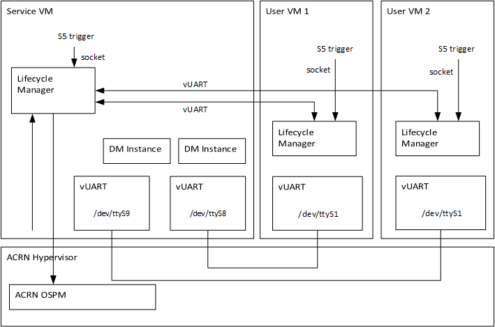
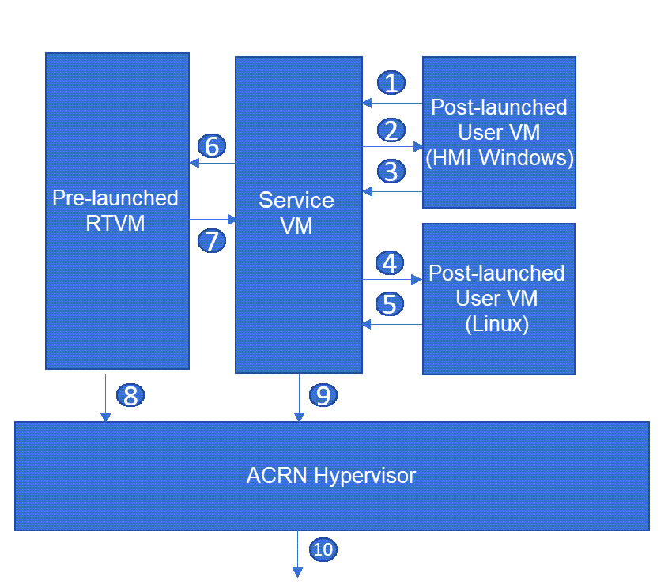

.. _enable-s5:

Enable S5 in ACRN
#################

Introduction
************

S5 is one of the `ACPI sleep states <http://acpi.sourceforge.net/documentation/sleep.html>`_
that refers to the system being shut down (although some power may still be
supplied to certain devices). In this document, S5 means the function to
shut down the **User VMs**, **the Service VM**, the hypervisor, and the
hardware. In most cases, directly shutting down the power of a computer
system is not advisable because it can damage some components. It can cause
corruption and put the system in an unknown or unstable state. On ACRN, the
User VM must be shut down before powering off the Service VM. Especially for
some use cases, where User VMs could be used in industrial control or other
high safety requirement environment, a graceful system shutdown such as the
ACRN S5 function is required.

S5 Architecture
***************

ACRN provides a mechanism to trigger the S5 state transition throughout the system.
It uses a vUART channel to communicate between the Service and User VMs.
The diagram below shows the overall architecture:

   S5 overall architecture

- **Scenario I**:

    The User VM's serial port device (``ttySn``) is emulated in the
    Device Model, the channel from the Service VM to the User VM:

    .. graphviz:: images/s5-scenario-1.dot
       :name: s5-scenario-1

- **Scenario II**:

    The User VM's (like RT-Linux or other RT-VMs) serial port device
    (``ttySn``) is emulated in the Hypervisor,
    the channel from the Service OS to the User VM:

    .. graphviz:: images/s5-scenario-2.dot
       :name: s5-scenario-2

Initiate a system S5 from within a User VM (e.g. HMI)
=====================================================

As shown in the :numref:`s5-architecture`, a request to Service VM initiates the shutdown flow.
This could come from a User VM, most likely the HMI (running Windows or Linux).
When a human operator initiates the flow, the Lifecycle Manager (``life_mngr``) running in that
User VM will send the request via the vUART to the Lifecycle Manager in the Service VM which in
turn acknowledges the request and triggers the following flow.

.. note:: The User VM need to be authorized to be able to request a Shutdown, this is achieved by adding 
   ``--pm_notify_channel uart,allow_trigger_s5`` in the launch script of that VM.
   And, there is only one VM in the system can be configured to request a shutdown. If there is a second User 
   VM launched with ``--pm_notify_channel uart,allow_trigger_s5``, ACRN will stop launching it and throw
   out below error message:
   ``initiate a connection on a socket error``
   ``create socket to connect life-cycle manager failed``

Trigger the User VM's S5
========================

On the Service VM side, it uses the ``acrnctl`` tool to trigger the User VM's S5 flow:
``acrnctl stop user-vm-name``. Then, the Device Model sends a ``shutdown`` command
to the User VM through a channel. If the User VM receives the command, it will send an ``ACKED``
to the Device Model. It is the Service VM's responsibility to check whether the User VMs
shut down successfully or not, and to decide when to shut the Service VM itself down.

User VM "Lifecycle Manager"
===========================

As part of the S5 reference design, a Lifecycle Manager daemon (``life_mngr`` in Linux,
``life_mngr_win.exe`` in Windows) runs in the User VM to implement S5. It waits for the shutdown
request from the Service VM on the serial port. The simple protocol between the Service VM and
User VM is as follows: when the daemon receives ``shutdown``, it sends ``ACKED`` to the Service VM;
then it shuts down the User VM. If the User VM is not ready to shut down,
it can ignore the ``shutdown`` command.

.. _enable_s5:

Enable S5
*********

The procedure for enabling S5 is specific to the particular OS:

* For Linux (LaaG) or Windows (WaaG), include these lines in the launch script:

  .. code-block:: bash

     # Power Management (PM) configuration using vUART channel
     pm_channel="--pm_notify_channel uart"
     pm_by_vuart="--pm_by_vuart pty,/run/acrn/life_mngr_"$vm_name
     pm_vuart_node="-s 1:0,lpc -l com2,/run/acrn/life_mngr_"$vm_name

     acrn-dm -A -m $mem_size -s 0:0,hostbridge \
       ...
       $pm_channel \
       $pm_by_vuart \
       $pm_vuart_node \
       ...

* For RT-Linux, include these lines in the launch script:

  .. code-block:: bash

     # Power Management (PM) configuration
     pm_channel="--pm_notify_channel uart"
     pm_by_vuart="--pm_by_vuart tty,/dev/ttyS1"

     /usr/bin/acrn-dm -A -m $mem_size -s 0:0,hostbridge \
        ...
        $pm_channel \
        $pm_by_vuart \
        ...

  .. note:: For RT-Linux, the vUART is emulated in the hypervisor; expose the node as ``/dev/ttySn``.

#. For LaaG and RT-Linux VMs, run the lifecycle manager daemon:

   a. Use these commands to build the lifecycle manager daemon, ``life_mngr``.

      .. code-block:: none

         $ cd acrn-hypervisor
         $ make life_mngr

   #. Copy ``life_mngr`` and ``life_mngr.service`` into the User VM:

      .. code-block:: none

         $ scp build/misc/services/life_mngr root@<test board address>:/usr/bin/life_mngr
         $ scp build/misc/services/life_mngr.service root@<test board address>:/lib/systemd/system/life_mngr.service

   #. Use the below commands to enable ``life_mngr.service`` and restart the User VM.

      .. code-block:: none

         # chmod +x /usr/bin/life_mngr
         # systemctl enable life_mngr.service
         # reboot

#. For the WaaG VM, run the lifecycle manager daemon:

   a) Build the ``life_mngr_win.exe`` application::

        $ cd acrn-hypervisor
        $ make life_mngr

      .. note:: If there is no ``x86_64-w64-mingw32-gcc`` compiler, you can run ``sudo apt install gcc-mingw-w64-x86-64``
         on Ubuntu to install it.

   #) Set up a Windows environment:

      I) Download the :kbd:`Visual Studio 2019` tool from `<https://visualstudio.microsoft.com/downloads/>`_,
         and choose the two options in the below screenshots to install "Microsoft Visual C++ Redistributable
         for Visual Studio 2015, 2017 and 2019 (x86 or X64)" in WaaG:

         .. figure:: images/Microsoft-Visual-C-install-option-1.png

         .. figure:: images/Microsoft-Visual-C-install-option-2.png

      #) In WaaG, use the :kbd:`Windows + R` shortcut key, input
         ``shell:startup``, click :kbd:`OK`
         and then copy the ``life_mngr_win.exe`` application into this directory.

         .. figure:: images/run-shell-startup.png

         .. figure:: images/launch-startup.png

   #) Restart the WaaG VM. The COM2 window will automatically open after reboot.

         .. figure:: images/open-com-success.png

#. If the Service VM is being shut down (transitioning to the S5 state), it can call
   ``acrnctl stop vm-name`` to shut down the User VMs.

   .. note:: S5 state is not automatically triggered by a Service VM shutdown; this needs
      to be run before powering off the Service VM.

How to Test
***********
   As described in :ref:`vuart_config`, two vUARTs are defined in
   pre-defined ACRN scenarios: vUART0/ttyS0 for the console and
   vUART1/ttyS1 for S5-related communication (as shown in :ref:`s5-architecture`).

   For Yocto Project (Poky) or Ubuntu rootfs, the ``serial-getty``
   service for ``ttyS1`` conflicts with the S5-related communication
   use of ``vUART1``. We can eliminate the conflict by preventing
   that service from being started
   either automatically or manually, by masking the service
   using this command

   ::

     systemctl mask serial-getty@ttyS1.service

#. Refer to the :ref:`enable_s5` section to set up the S5 environment for the User VMs.

   .. note:: RT-Linux's UUID must use ``495ae2e5-2603-4d64-af76-d4bc5a8ec0e5``. Also, the
      industry EFI image is required for launching the RT-Linux VM.

   .. note:: Use the ``systemctl status life_mngr.service`` command to ensure the service is working on the LaaG or RT-Linux:

      .. code-block:: console

           * life_mngr.service - ACRN lifemngr daemon
           Loaded: loaded (/usr/lib/systemd/system/life_mngr.service; enabled; vendor p>
           Active: active (running) since Tue 2019-09-10 07:15:06 UTC; 1min 11s ago
           Main PID: 840 (life_mngr)

   .. note:: For WaaG, we need to close ``windbg`` by using the ``bcdedit /set debug off`` command
      IF you executed the ``bcdedit /set debug on`` when you set up the WaaG, because it occupies the ``COM2``.

#. Use the ``acrnctl stop`` command on the Service VM to trigger S5 to the User VMs:

   .. code-block:: console

      # acrnctl stop vm1

#. Use the ``acrnctl list`` command to check the User VM status.

   .. code-block:: console

      # acrnctl list
      vm1		stopped

System Shutdown
***************

Using a coordinating script, ``misc/life_mngr/s5_trigger.sh``, in conjunction with
the lifecycle manager in each VM, graceful system shutdown can be performed.

.. note:: Please install ``s5_trigger.sh`` manually to root's home directory.

   .. code-block:: none

      $ sudo install -p -m 0755 -t ~root misc/life_mngr/s5_trigger.sh

In the ``hybrid_rt`` scenario, the script can send a shutdown command via ``ttyS1``
in the Service VM, which is connected to ``ttyS1`` in the pre-launched VM. The
lifecycle manager in the pre-launched VM receives the shutdown command, sends an
ack message, and proceeds to shut itself down accordingly.

   Graceful system shutdown flow

#. The HMI Windows Guest uses the lifecycle manager to send a shutdown request to
   the Service VM
#. The lifecycle manager in the Service VM responds with an ack message and
   executes ``s5_trigger.sh``
#. After receiving the ack message, the lifecycle manager in the HMI Windows Guest
   shuts down the guest
#. The ``s5_trigger.sh`` script in the Service VM shuts down the Linux Guest by
   using ``acrnctl`` to send a shutdown request
#. After receiving the shutdown request, the lifecycle manager in the Linux Guest
   responds with an ack message and shuts down the guest
#. The ``s5_trigger.sh`` script in the Service VM shuts down the Pre-launched RTVM
   by sending a shutdown request to its ``ttyS1``
#. After receiving the shutdown request, the lifecycle manager in the Pre-launched
   RTVM responds with an ack message
#. The lifecycle manager in the Pre-launched RTVM shuts down the guest using
   standard PM registers
#. After receiving the ack message, the ``s5_trigger.sh`` script in the Service VM
   shuts down the Service VM
#. The hypervisor shuts down the system after all of its guests have shut down
