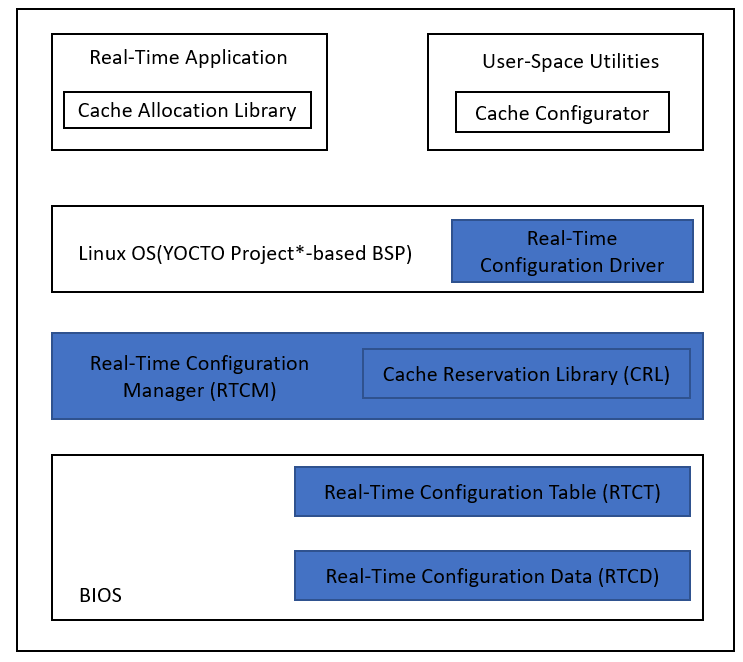
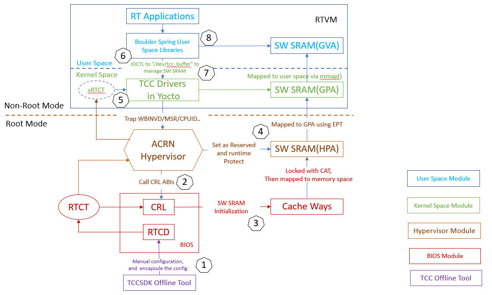

.. _enable_software_sram:

Enable Software SRAM on ACRN
############################

Overview of Software SRAM
*************************

Traditionally, on Intel-based systems, it is not possible for software to specifically address the caches when requesting data buffers. Instead, operating systems manage the physical address space while the contents of the cache are managed by hardware.

As one Intel® TCC feature, software SRAM technology offers software developers a programmatic way to address the cache for user space data. Application developers can now request low-latency buffers that do not experience the jitter typically associated with cache misses and accessing DRAM; in other words, software SRAM technology improves WCET (worst-case execution time) by reducing cache misses.

The components in the figure below are collectively referred to as implementing a "software SRAM", which enables code or data to be placed into cache via a special address range in the physical memory map.

Components highlighted in blue are fundamental elements of software SRAM in platform firmware, hypervisor, and kernel respectively. When configurations of software SRAM are generated in platform firmware (BIOS), operating system and hypervisor play a critical role in the enablement of software SRAM technology. This guide introduces the integrating of software SRAM capability for ACRN hypervisor.

For details about Intel TCC Tools outside the scope of this guide, refer to the `Intel TCC Tools page`_ and `Guide to Operating System and Hypervisor Components for Cache Allocation`_.

.. _Intel TCC Tools page:
   https://software.intel.com/content/www/us/en/secure/develop/time-coordinated-computing-tools.html

.. _Guide to Operating System and Hypervisor Components for Cache Allocation:
   https://software.intel.com/content/www/us/en/secure/develop/time-coordinated-computing-tools/documentation.html

ACRN Software SRAM Architecture
*******************************

The diagram below illustrates the architecture of software SRAM on ACRN. The numbers refer to the steps in the `Software SRAM Workflow`_ section below.

Terminology
===========

Intel® TCC
   Intel® Time Coordinated Computing is a set of features with the ability to address the temporal requirements of real-time applications in a wide range of latencies, from milliseconds to microseconds.

Real-Time Configuration Driver (TCC Driver)
   Acts as an intermediary entity that makes software SRAM regions available to user-space applications utilizing the cache allocation library, TCC driver is
   offically supported only in YOCTO Linux Kernel.

CRL
   The cache reservation library (CRL) contains the logic required to create software SRAM regions within the physical address space.

ABI
   Application Binary Interface, the CRL binary is delivered via the BIOS and has a well-defined Application Binary Interface (ABI).

RTCD
   Real-time configuration data (RTCD) contains settings for how the system should be optimized for improved temporal performance.

RTCT
   The real-time configuration table (RTCT) enables software to programmatically discover which Intel TCC resources are available and how they should be configured (as indicated by the data in RTCD). For the software SRAM capability, RTCT provides the instructions to the CRL about size and location of software SRAM regions to establish.

Boulder Spring
   Software toolkit makes it easy to take advantage of real-time features on Intel platforms.

Software SRAM Workflow
======================

1. The TCC offline tool configures Software SRAM resources, indicated by the data in RTCD and RTCT.

2. ACRN hypervisor parses RTCT and initializes software SRAM by calling CRL ABI on each physical CPU.

3. CRL initializes software SRAM by setting up cache ways and mapping locked cache to memory space.

4. ACRN hypervisor:

   - Reserve the address range for software SRAM and remap software SRAM region to guest address space.
   - Build and inject virtual RTCT(vRTCT) to RTVM as an ACPI table.
   - Set up protection for software SRAM from being flushed at runtime; for example, trap and emulate the ``wbinvd`` instruction from guest.

5. Real-Time Configuration Driver (RTVM Kernel) initializes when valid RTCT is detected and creates device node ``/dev/tcc_buffer``.

6. User space applications or libraries query configurations of software SRAM and request software SRAM buffers by issuing command to ``/dev/tcc_buffer``.

7. User space applications or libraries map software SRAM buffer to user space by issuing a command to ``/dev/tcc_buffer``.

8. User space applications can access the low-latency software SRAM buffers.

Design assumptions
==================

1. One RTVM at most, either a Pre-launched RTVM or a post-launched RTVM, can be supported for a specific ACRN configuration. Will update this design when ACRN supports multiple RTVMs.

2. Software SRAM and CAT features can't co-exist for current design limitation; only one of them is allowed for one ACRN configuration.

3. So far, software SRAM can be supported on the Intel Tiger Lake and Elkhart Lake platforms only.

4. When software SRAM is enabled for a Pre-launched RTVM, ACRN passes all software SRAM resources through to this RTVM, which means:

   - Platform RTCT instead of vRTCT will be injected to RTVM.
   - RTVM accesses software SRAM region by host physical address(HPA), or, say, identical mapping is used for case.

5. When software SRAM is configured for a Pre-launched RTVM, L2 cache software SRAM is NOT supported, or, say, ONLY L3 cache can be configured in the platform RTCT. As L2 cache is likely core specific, for example, on Intel Tiger Lake platform, in this case, remapping between physical LAPIC ID and virtual LAPIC ID is required for pre-launched RTVM but not implemented on ACRN by design.

6. Please follow the latest Intel TCC Tools guide, such as `Get Started with Intel® TCC Tools 2021.1`_\ , to configure software SRAM for a specific platform:

.. _Get Started with Intel® TCC Tools 2021.1:
   https://software.intel.com/content/www/us/en/secure/develop/documentation/get-started-with-intel-time-coordinated-computing-tools-2021-1/top.html

7. As TCC driver is integrated in YOCTO Linux kernel only so far, user need to deploy this feature in YOCTO guest.

Enable Software SRAM for a Pre-launched RTVM
********************************************

Please follow the steps below to enable software SRAM support for a Pre-launched RTVM:

1. Follow the Intel TCC Tools guide to configure software SRAM on the target platform. According to the previous `Design Assumptions`, only L3 cache can be configured. The native RTCT ACPI table can be found at ``/sys/firmware/acpi/tables/PTCT`` when it is configured successfully.

2. Configure ACRN:

   - Stitch native RTCT ACPI table to ``VM0_ACPI.bin`` binary, which will be parsed to the Pre-launched RTVM as a multiboot module.

   - ACRN scenario configuration should include one pre-launched RTVM.

   - Set ``PSRAM_ENABLED`` to ``y`` for the Pre-launched RTVM when configure ACRN.

Now, ACRN with this build can support software SRAM for this Pre-launched RTVM.

Enable Software SRAM for a post-launched RTVM
*********************************************

Please follow the steps below to enable software SRAM support for a post-launched RTVM：

1. Follow the Intel TCC Tools guide to configure software SRAM on the target platform.

2. Configure ACRN:

   - ACRN scenario configuration should include one post-launched RTVM.

   - Set ``PSRAM_ENABLED`` to ``y`` for the post-launched RTVM when configure ACRN.

Now, software SRAM can be detected inside this post-launched RTVM.
