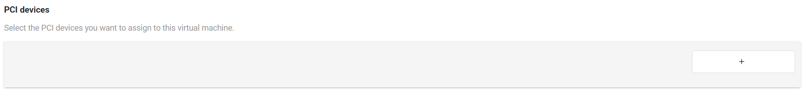
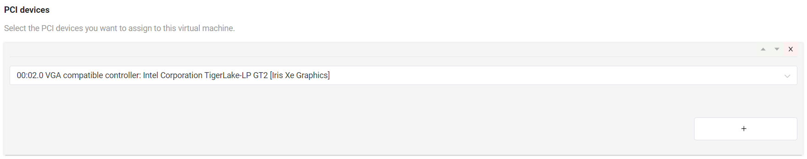

.. _gpu-passthrough:

Enable GPU Passthrough (GVT-d)
##############################

About GVT-d
************

GVT-d is a graphics virtualization approach that is also known as the
Intel-Graphics-Device passthrough feature. It allows for direct assignment of a
GPU to a single VM, passing the native driver capabilities through to the
hypervisor without any limitations. For example, you can pass through a VGA
controller to a VM, allowing users to access a Windows or Ubuntu desktop.

A typical use of GVT-d is to give a post-launched VM full control to the
graphics card when that VM serves as the main user interface while all the other
VMs are in the background and headless.

Dependencies and Constraints
****************************

Consider the following dependencies and constraints:

* GVT-d applies only to an Intel integrated graphics card. Discrete graphics
  cards are passed through to VMs as a standard PCI device.

* When a device is assigned to a VM via GVT-d, no other VMs can use it.

* For ADL-ASRock board, need disable BIOS setting "Above 4G Decoding"(under Advanced Menu -> SA Configuration) to enable GVT-d feature.

.. note:: After GVT-d is enabled, have either a serial port
   or SSH session open in the Service VM to interact with it.

Configuration Overview
**********************

The :ref:`acrn_configurator_tool` lets you select PCI devices, such as VGA
controllers, as passthrough devices for a VM. The following documentation is a
general overview of the configuration process.

To select a passthrough device for a VM, select the VM and go to **Basic
Parameters > PCI devices**. Click **+** to add a device.

Select the device from the list.

To add another passthrough device, click **+**. Or click **x** to delete a
device.

Example Configuration
*********************

The following steps show how to select and verify a passthrough VGA controller.
The example extends the information provided in the :ref:`gsg`.

#. In the ACRN Configurator, create a shared scenario with a Service VM and one
   post-launched User VM.

#. Select the Service VM and go to **Basic Parameters > Kernel
   command-line parameters**.

#. Append ``i915.modeset=0`` in **Kernel command-line parameters** to disable the
   GPU driver loading for Intel GPU device.

   .. image:: images/kernel_cmd_line.png
      :align: center
      :class: drop-shadow

#. Select the post-launched User VM and go to **Basic Parameters > PCI
   devices**.

#. Click **+** to add a device, and select the VGA controller.

   .. image:: images/configurator-gvtd01.png
      :align: center
      :class: drop-shadow

#. Save the scenario and launch script.

#. Build ACRN, copy all the necessary files from the development computer to the
   target system, and launch the Service VM and post-launched User VM.

#. Verify that the VM can access the VGA controller: Run the following command
   in the post-launched User VM:

   .. code-block:: console

      root@acrn-Standard-PC-i440FX-PIIX-1996:~# lspci |grep VGA
      00:02.0 VGA compatible controller: Intel Corporation Device 4680 (rev 0c)

Troubleshooting
***************

Enable the GVT-d GOP Driver
===========================

When enabling GVT-d, the Guest OS cannot light up the physical screen
before the OS driver loads. As a result, the Guest BIOS and the Grub UI
are not visible on the physical screen. This occurs because the physical
display is initialized by the GOP driver or VBIOS before the OS driver
loads, and the Guest BIOS doesn't have them.

The solution is to integrate the GOP driver binary into the OVMF as a DXE
driver. Then the Guest OVMF can see the GOP driver and run it in the graphic
passthrough environment. The physical display can be initialized
by the GOP and used by the Guest BIOS and Guest Grub.

Steps
-----

1. Fetch the ACRN OVMF:

   ::

     git clone https://github.com/projectacrn/acrn-edk2.git

#. Fetch the VBT and GOP drivers.

   Fetch the **VBT** and **GOP** drivers from the board manufacturer
   according to your CPU model name.

#. Add the **VBT** and **GOP** drivers to the OVMF:

   ::

     cp IntelGopDriver.efi  acrn-edk2/OvmfPkg/IntelGop/IntelGopDriver.efi
     cp Vbt.bin acrn-edk2/OvmfPkg/Vbt/Vbt.bin

   Confirm that these binaries names match the board manufacturer names.

#. Use ``git apply`` to add the following two patches:

   * `Use-the-default-vbt-released-with-GOP-driver.patch <../_static/downloads/Use-the-default-vbt-released-with-GOP-driver.patch>`_

   * `Integrate-IntelGopDriver-into-OVMF.patch <../_static/downloads/Integrate-IntelGopDriver-into-OVMF.patch>`_

#. Compile the OVMF:

   ::

     cd acrn-edk2
     git submodule update --init CryptoPkg/Library/OpensslLib/openssl

     source edksetup.sh
     make -C BaseTools

     vim Conf/target.txt

       ACTIVE_PLATFORM = OvmfPkg/OvmfPkgX64.dsc
       TARGET_ARCH = X64
       TOOL_CHAIN_TAG = GCC5

     build -DFD_SIZE_2MB -DDEBUG_ON_SERIAL_PORT=TRUE

Keep in mind the following:

   -  Use a build machine that has GCC 5.X version installed.

   -  The ``source edksetup.sh`` step is needed for compilation every time
      a shell is created.

   -  This will generate the binary at
      ``Build/OvmfX64/DEBUG_GCC5/FV/OVMF.fd``. Transfer the binary to
      your target machine.
   -  Modify the launch script to specify the OVMF you built just now.

Script
------

Once you've installed the Docker environment, you can use this
`script <../_static/downloads/build_acrn_ovmf.sh>`_ to build ACRN OVMF
with the GOP driver enabled. For more details about the script usage,
run ``build_acrn_ovmf.sh -h``.
