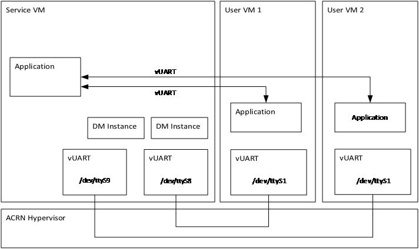
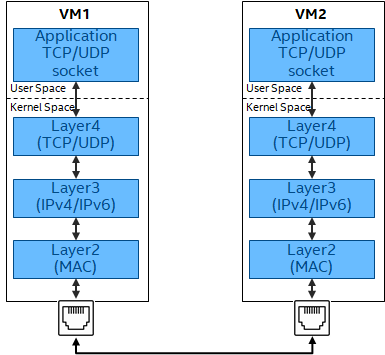
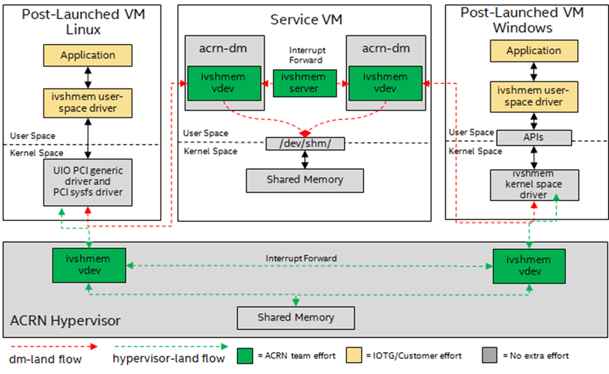
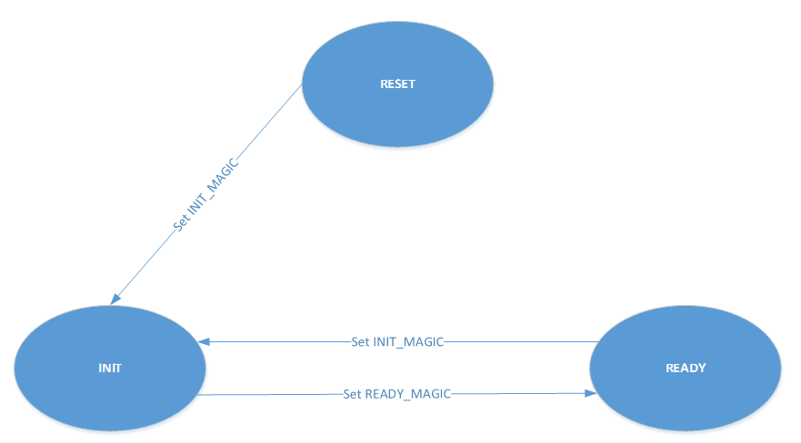
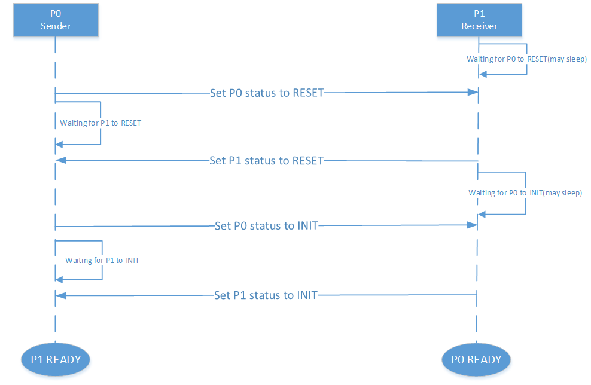

.. _inter-vm_communication:

ACRN Inter-VM Communication
##############################################

ACRN supports three kinds of Inter-VM communication – Inter-VM vUART,
Inter-VM network communication, and Inter-VM shared memory device (``ivshmem``).
Each communication method has its pros and cons, as described below.

Inter-VM vUART
**************

Inter-VM vUART communication is based on the vUART implementation. It is
used to transfer data between two VMs at low speed (< 120kbps). (Refer to :ref:`vuart_virtualization`
and :ref:`vuart_config`).

:numref:`Inter-VM vUART communication` shows the Inter-VM vUART communication overview:

   Inter-VM vUART communication

- Pros:
   - POSIX APIs; development-friendly (easily used programmatically
     by using standard POSIX APIs).
   - UART drivers are available in most Operating Systems.

- Cons:
   - The communication rate is low.
   - The communication is only between two VMs.
   - Need to configure communication vUART in hypervisor scenario.

Inter-VM network communication
******************************

Inter-VM network communication is based on the network stack. ACRN supports
both pass-through NICs to VMs and Virtio-Net solutions. (Refer to :ref:`virtio-net`
background introductions of ACRN Virtio-Net Architecture and Design). 

:numref:`Inter-VM network communication` shows the Inter-VM network communication overview:

   Inter-VM network communication

- Pros:
   - Socket-based APIs; development-friendly (easily used programmatically
     by using Socket-based APIs).
   - Orders of magnitude faster than vUART.
   - Multiple VMs can communicate together.

- Cons:
   - Multiple layers are involved across the data path, which will introduce additional computation and latency.
   - Potentially more CPU overhead in the Service VM if using ``virtio-net``.

Inter-VM shared memory communication (ivshmem)
**********************************************

Inter-VM shared memory communication is based on a shared memory mechanism
to transfer data between VMs. The ACRN device model or hypervisor emulates
a virtual PCI device (called an ``ivshmem device``) to expose this shared memory's
base address and size. (Refer to :ref:`ivshmem-hld` and :ref:`enable_ivshmem` for the
background introductions).

:numref:`Inter-VM shared memory communication` shows the Inter-VM shared memory communication overview:

   Inter-VM shared memory communication

- Pros:
   - Shared memory is exposed to VMs via PCI MMIO Bar and is mapped and accessed directly.
   - No Service VM emulation is involved if using hv-land ivshmem. Its data path is short, with high bandwidth and low latency.
   - Multiple VMs can communicate together.

- Cons:
   - Applications talk to the device directly (via `UIO <https://doc.dpdk.org/guides/linux_gsg/linux_drivers.html#uio>`_
     on Linux or `Ivshmem driver <https://github.com/virtio-win/kvm-guest-drivers-windows/tree/master/ivshmem/>`_
     on Windows). Because the applications need to directly operate the device resources, additional development work is required.
   - Applications need to implement protocols such as a handshake, data transfer, and data
     integrity.

How to implement an Ivshmem application on ACRN
***********************************************

As Ivshmem is a PCI device that shares memory inside a virtual machine, the application
running on the VM can access it as a standard PCI device. The application needs to design
a data transfer notification mechanism between the VMs.

**The following reference code are used for Inter-VM communication using ivshmem device**

- Initialize Device:

  Enable and bind to UIO PCI driver

  .. code-block:: none

     sudo modprobe uio
     sudo modprobe uio_pci_generic
     sudo echo "1af4 1110" > /sys/bus/pci/drivers/uio_pci_generic/new_id

  .. note::
     - "1af4" is the Vendor ID and "1110" is the Device ID of the ivshmem device.
     - For Linux-based User VMs, we recommend using the standard UIO and UIO_PCI_GENERIC
       drivers through the device node (for example, ``/dev/uioX``).

- UIO IRQ data struct

  .. code-block:: c

     struct uio_irq_data
     {
         int fd;
         int vector;
     };

- Ivshmem Device context struct:

  .. code-block:: c

     struct ivsh_dev_context
     {
         long uio_nr;
         int bar0_fd;
         uint32_t *p_reg;

         int bar2_fd;
         void *p_shmem;
         long shmem_size;

         /* used for doorbell mode */
         int uio_dev_fd;
         int epfds_irq[IVSH_MAX_IRQ_NUM];
         struct uio_irq_data irq_data[IVSH_MAX_IRQ_NUM];
         bool opened;
     };

- Init Ivshmem Device context

  .. code-block:: c

     int ivsh_init_dev_ctx(struct ivsh_dev_context *p_ivsh_dev_ctx, long uio_nr)
     {
         int i;
         memset(p_ivsh_dev_ctx, 0, sizeof(*p_ivsh_dev_ctx));
         p_ivsh_dev_ctx->uio_nr = uio_nr;
         p_ivsh_dev_ctx->bar0_fd = -1;
         p_ivsh_dev_ctx->bar2_fd = -1;
         p_ivsh_dev_ctx->uio_dev_fd = -1;

         for (i = 0; i < IVSH_MAX_IRQ_NUM; i++) {
             p_ivsh_dev_ctx->epfds_irq[i] = -1;
             p_ivsh_dev_ctx->irq_data[i].fd = -1;
         }
         p_ivsh_dev_ctx->opened = false;
         return 0;
     }

- Get Ivshmem Device shared memory size

  .. code-block:: c

     uint32_t ivsh_get_shmem_size(long uio_nr)
     {
         char config_node[PATH_MAX] = {0};
         uint32_t shm_size;
         uint64_t tmp;
         int cfg_fd;

         sprintf(config_node, "/sys/class/uio/uio%ld/device/config", uio_nr);
         cfg_fd = open(config_node, O_RDWR);
         /*Get the size of BAR2(offset in Configuration Space is 0x18) of uio_nr device*/
         pread(cfg_fd, &tmp, 8, 0x18);
         shm_size= ~0U;
         pwrite(cfg_fd ,&shm_size, 8, 0x18);
         pread(cfg_fd, &shm_size, 8, 0x18);
         pwrite(cfg_fd ,&tmp, 8, 0x18);
         shm_size &= (~0xfUL);
         shm_size = (shm_size & ~(shm_size - 1));
         close(cfg_fd);

         return shm_size;
     }

- Open Ivshmem Device:

  .. code-block:: c

     /* prepare data struct to record the ivshmem device status */
     ret = ivsh_init_dev_ctx(&dev_ctx, ctrl_ctx.uio_nr);

     int open_ivsh_dev(struct ivsh_dev_context *p_ivsh_dev_ctx)
     {
         /* mmap reg mmio space from BAR0 */
         /* BAR0 is used for emulating interrupt related registers */
         sprintf(node_path, "/sys/class/uio/uio%ld/device/resource0", p_ivsh_dev_ctx->uio_nr);
         p_ivsh_dev_ctx->bar0_fd = open(node_path, O_RDWR);
         p_ivsh_dev_ctx->p_reg = (uint32_t *)mmap(NULL, IVSH_BAR0_SIZE, PROT_READ|PROT_WRITE, MAP_SHARED, p_ivsh_dev_ctx->bar0_fd, 0);

          /* mmap shared memory from BAR2 */
          /* BAR2 is used for exposing a shared memory region*/
          sprintf(node_path,"/sys/class/uio/uio%ld/device/resource2_wc", p_ivsh_dev_ctx->uio_nr);
          p_ivsh_dev_ctx->bar2_fd = open(node_path, O_RDWR);
          p_ivsh_dev_ctx->p_shmem = mmap(NULL, p_ivsh_dev_ctx->shmem_size, PROT_READ|PROT_WRITE, MAP_SHARED, p_ivsh_dev_ctx->bar2_fd, 0);

         /* get shared memory size from config space */
         p_ivsh_dev_ctx->shmem_size = ivsh_get_shmem_size(p_ivsh_dev_ctx->uio_nr);
         // Note: ivsh_get_shmem_size details go to ivsh_get_shmem_size.

         /* used for doorbell mode*/
         sprintf(node_path, "/dev/uio%ld", p_ivsh_dev_ctx->uio_nr);
         p_ivsh_dev_ctx->uio_dev_fd = open(node_path, O_RDWR);
         for (i = 0; i < IVSH_MAX_IRQ_NUM; i++) {
             /* create a eventfd for each msix */
             evt_fd = eventfd(0, 0);

             /* set eventfds of msix to kernel driver by ioctl */
             p_ivsh_dev_ctx->irq_data[i].vector = i;
             p_ivsh_dev_ctx->irq_data[i].fd = evt_fd;
             ioctl(p_ivsh_dev_ctx->uio_dev_fd, UIO_IRQ_DATA, &p_ivsh_dev_ctx->irq_data[i]) 

             /* create epoll */
             p_ivsh_dev_ctx->epfds_irq[i] = epoll_create1(0);

             /* add eventfds of msix to epoll */
             events.events = EPOLLIN;
             events.data.ptr = &p_ivsh_dev_ctx->irq_data[i];
             epoll_ctl(p_ivsh_dev_ctx->epfds_irq[i], EPOLL_CTL_ADD, evt_fd, &events)
         }
     }

- Close Ivshmem Device

  .. code-block:: c

     void ivsh_close_dev(struct ivsh_dev_context *p_ivsh_dev_ctx)
     {
         /* unmap reg mmio space from BAR0 */
         munmap(p_ivsh_dev_ctx->p_reg, IVSH_BAR0_SIZE);
         p_ivsh_dev_ctx->p_reg = NULL;
         close(p_ivsh_dev_ctx->bar0_fd);
         p_ivsh_dev_ctx->bar0_fd = -1;

         /* unmap shared memory from BAR2 */
         munmap(p_ivsh_dev_ctx->p_shmem, p_ivsh_dev_ctx->shmem_size);
         p_ivsh_dev_ctx->p_shmem = NULL;
         close(p_ivsh_dev_ctx->bar2_fd);
         p_ivsh_dev_ctx->bar2_fd = -1;

         /* used for doorbell mode*/
         for (i = 0; i < IVSH_MAX_IRQ_NUM; i++) {
             close(p_ivsh_dev_ctx->irq_data[i].fd);
             p_ivsh_dev_ctx->irq_data[i].fd = -1;
             close(p_ivsh_dev_ctx->epfds_irq[i]);
             p_ivsh_dev_ctx->epfds_irq[i] = -1;
         }
         close(p_ivsh_dev_ctx->uio_dev_fd);
         p_ivsh_dev_ctx->uio_dev_fd = -1;
     }

**The following reference code are used for Inter-VM communication based on Doorbell mode:**

- Trigger Ivshmem Doorbell

  .. code-block:: c

     void ivsh_trigger_doorbell(struct ivsh_dev_context *p_ivsh_dev_ctx, uint16_t peer_id, uint16_t vector_id)
     {
         p_ivsh_dev_ctx->p_reg[IVSH_REG_DOORBELL >> 2] = (peer_id << 16) | vector_id;
     }

- Wait Ivshmem Device irq

  .. code-block:: c

     static inline int ivsh_wait_irq(struct ivsh_dev_context *p_ivsh_dev_ctx, unsigned int idx)
     {
         struct epoll_event ev = {0};
         struct uio_irq_data *irq_data = NULL;
         eventfd_t val;
         int n;
         while (1) {
             n = epoll_wait(p_ivsh_dev_ctx->epfds_irq[idx], &ev, 1, -1);
             if (n == 1) {
                 irq_data = ev.data.ptr;
                 eventfd_read(irq_data->fd, &val);
                 break;
             }
         }
     }

Data Transfer State-Machine
===========================

A state machine is introduced as a communication mechanism between the two VMs,
which use the same ivshmem PCI device for the data transfer.

It includes three states – RESET, READY, and INIT. RESET state is the initial state
after ivshmem device is initialized.

- When both VM states are in the RESET, Sender VM prepares the sending data
  and then sets its state to INIT, and Receiver VM prepares receiving buffer
  and sets its state to INIT.

- When both VM's state is in the INIT, Sender VM sets its state in the READY
  after sending all of the data, and Receiver VM sets its state in the READY
  after receiving all of the transfer data.

- Then both VMs change their status from READY to INIT for starting the next
  round of data transfer.

:numref:`Inter-VM ivshmem data transfer state machine` shows the state machine relationship:

   Inter-VM ivshmem data transfer state machine

:numref:`Inter-VM ivshmem handshake communication` shows the handshake communication between two machines:

   Inter-VM ivshmem handshake communication

Reference Sender and Receiver Sample Code Based Doorbell Mode
=============================================================

.. code-block:: c

   struct pay_load_header
   {
       uint64_t	p0_status;
      uint64_t	p1_status;
   };

   void ivsh_test_sender(struct ivsh_dev_context *p_ivsh_dev_ctx, struct ivsh_ctrl_context *p_ivsh_ctrl_ctx)
   {
       struct ivsh_test_tx_context tx_ctx;
       volatile struct pay_load_header *p_hdr;
       /* Initialize the sender related data */
       ivsh_test_tx_init(&tx_ctx, p_ivsh_dev_ctx, p_ivsh_ctrl_ctx);
       p_hdr = tx_ctx.p_hdr;
       /*Set P0 status to RESET*/
       set_p0_status(p_hdr, SHMEM_STATUS_RESET);
       while (!is_p1_reset(p_hdr))
           usleep(10000);
       /*Prepare the data to be sent */
       ivsh_test_tx_pre_send(&tx_ctx, i);
       /*Set P0 status to INIT*/
       set_p0_status(p_hdr, SHMEM_STATUS_INIT);
       while (!is_p1_initialized(p_hdr)) {
       }
       /*Set P1 status to READY*/
       set_p1_status(p_hdr, SHMEM_STATUS_READY);
       usleep(2000);

       ivsh_test_tx_send(&tx_ctx);
       ivsh_trigger_doorbell(p_ivsh_dev_ctx, p_ivsh_ctrl_ctx->peer_id, IVSH_TEST_VECTOR_ID);
       ivsh_wait_irq(p_ivsh_dev_ctx, IVSH_TEST_VECTOR_ID);

       ivsh_test_tx_deinit(&tx_ctx);
   }

   void ivsh_test_receiver(struct ivsh_dev_context *p_ivsh_dev_ctx, struct ivsh_ctrl_context *p_ivsh_ctrl_ctx)
   {
      struct ivsh_test_rx_context rx_ctx;
      volatile struct pay_load_header *p_hdr;

       /* Initialize the receiver related data */
       ivsh_test_rx_init(&rx_ctx, p_ivsh_dev_ctx, p_ivsh_ctrl_ctx);
       p_hdr = rx_ctx.p_hdr;
       while (!is_p0_reset(p_hdr))
           usleep(10000);
       set_p1_status(p_hdr, SHMEM_STATUS_RESET);

       while (!is_p0_initialized(p_hdr))
           usleep(100);
       set_p1_status(p_hdr, SHMEM_STATUS_INIT);
       set_p0_status(p_hdr, SHMEM_STATUS_READY);

       /* waiting for p0 write done */
       ivsh_wait_irq(p_ivsh_dev_ctx, IVSH_TEST_VECTOR_ID);
       ivsh_test_rx_recv(&rx_ctx);
       usleep(100);

       ivsh_test_rx_deinit(&rx_ctx);
   }

Reference Sender and Receiver Sample Code Based Polling Mode
============================================================

.. code-block:: c

   /*open_ivshmem_device*/
   p_ivsh_dev_ctx->tfd = timerfd_create(CLOCK_MONOTONIC, TFD_NONBLOCK);
   p_ivsh_dev_ctx->epfd_timer = epoll_create1(0);    /* create epoll */
   events.events = EPOLLIN;
   epoll_ctl(p_ivsh_dev_ctx->epfd_timer, EPOLL_CTL_ADD, p_ivsh_dev_ctx->tfd, &events)

   /*close_ivshmem_device*/
   close(p_ivsh_dev_ctx->tfd);
   p_ivsh_dev_ctx->tfd = -1;
   close(p_ivsh_dev_ctx->epfd_timer);
   p_ivsh_dev_ctx->epfd_timer = -1;

   struct pay_load_header
   {
       uint64_t	p0_status;
       uint64_t	p1_status;
   };

   void ivsh_test_sender(struct ivsh_dev_context *p_ivsh_dev_ctx, struct ivsh_ctrl_context *p_ivsh_ctrl_ctx)
   {
       struct ivsh_test_tx_context tx_ctx;
       volatile struct pay_load_header *p_hdr;

       ivsh_test_tx_init(&tx_ctx, p_ivsh_dev_ctx, p_ivsh_ctrl_ctx);
       p_hdr = tx_ctx.p_hdr;
       set_p0_status(p_hdr, SHMEM_STATUS_RESET);
       while (!is_p1_reset(p_hdr))
           usleep(10000);

       ivsh_test_tx_pre_send(&tx_ctx, i);
       set_p0_status(p_hdr, SHMEM_STATUS_INIT);
       while (!is_p1_initialized(p_hdr)) {
       }
       /*Set P1 status to READY*/
       set_p1_status(p_hdr, SHMEM_STATUS_READY);
       usleep(2000);

       ivsh_test_tx_send(&tx_ctx);
       ivsh_poll(p_ivsh_dev_ctx);
       ivsh_test_tx_deinit(&tx_ctx);
   }

   void ivsh_test_receiver(struct ivsh_dev_context *p_ivsh_dev_ctx, struct ivsh_ctrl_context *p_ivsh_ctrl_ctx)
   {
       struct ivsh_test_rx_context rx_ctx;
       volatile struct pay_load_header *p_hdr;

       ivsh_test_rx_init(&rx_ctx, p_ivsh_dev_ctx, p_ivsh_ctrl_ctx);
       p_hdr = rx_ctx.p_hdr;
       while (!is_p0_reset(p_hdr))
           usleep(10000);
       set_p1_status(p_hdr, SHMEM_STATUS_RESET);

       while (!is_p0_initialized(p_hdr))
           usleep(100);
       set_p1_status(p_hdr, SHMEM_STATUS_INIT);
       set_p0_status(p_hdr, SHMEM_STATUS_READY);

       ivsh_poll(p_ivsh_dev_ctx);
       ivsh_test_rx_recv(&rx_ctx);
       usleep(100);

       ivsh_test_rx_deinit(&rx_ctx);
   }

   int ivsh_poll(struct ivsh_dev_context *p_ivsh_dev_ctx)
   {
       struct epoll_event ev = {0};
       uint64_t res;
       int n;
       assert(p_ivsh_dev_ctx->cb);

       while (1) {
           if (p_ivsh_dev_ctx->epfd_timer < 0) {
               if (p_ivsh_dev_ctx->cb(p_ivsh_dev_ctx->param))
                   break;
           } else {
               n = epoll_wait(p_ivsh_dev_ctx->epfd_timer, &ev, 1, -1);
               if (n == 1) {
                   read(p_ivsh_dev_ctx->tfd, &res, sizeof(res));
                   break;
               }
               if (n < 0 && errno != EINTR)
                   printf("epoll wait error %s\n", strerror(errno));
           }
       }
   }
