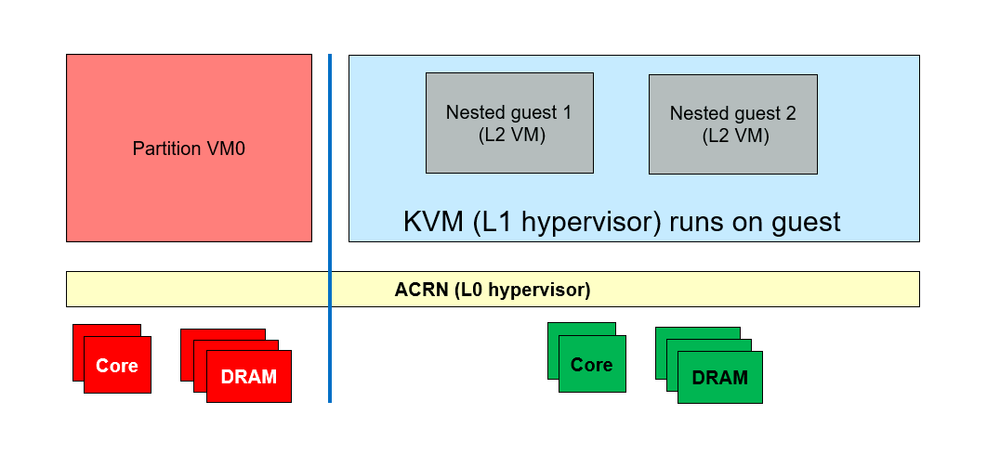
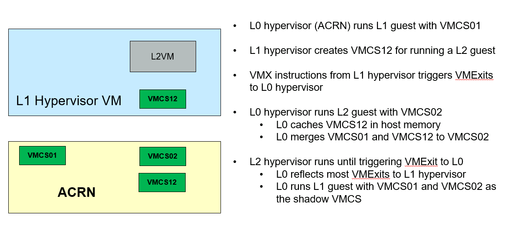

.. _nested_virt:

Enable Nested Virtualization
############################

With nested virtualization enabled, it's possible to run virtual machine
instances inside of level 1 guests. Though it seems both nested guests and
User VMs are launched from the guest VM, the distinction between them is
that, in the case of User VM, hypervisor is not running on Service OS, and
besides the device model, ACRN provides all the support to run the User VMs.
While for nested guests, an instance of guest hypervisor is running on the
guest to manage the nested VMs.

The conventional single-level virtualization has two levels - the host
(ACRN hypervisor) and the guest VMs. With nested virtualization enabled,
ACRN is able to run guests with their associated virtual machines, which
has three levels:

* The host (ACRN hypervisor), which we call L0 hypervisor, or L0 VMM
* The guest hypervisor, which we call L1 hypervisor, or L1 VMM
* The nested guest, which we call L2 guests

   Generic Nested Virtualization

High Level ACRN Nested Virtualization Design
********************************************

The high-level design of nested virtualization is shown in :numref:`nested_virt_hld`.
ACRN. Nested VMX is enabled by so by allowing a guest to use VMX
instructions, and emulating them using the single level of VMX available
in the hardware.

A logical processor uses virtual-machine control data structures (VMCSs) while
it is in VMX operation. The core of the NVMX emulation is ACRN builds VMCS02
out of the VMCS12 which is built by L1 hypervisor, to actually run the L2 guest

   Nested Virtualization in ACRN

Restrictions and constrains
***************************

Currently nested virtualization is considered as an experimental feature.
As of today, the tested platforms are: Tiger Lake RVP and Kaby Lake NUC 
(See :ref:`hardware`.)

L1 VMs have the following restrictions:

* KVM is the only L1 hypervisor supported by ACRN
* KVM runs in 64-bit mode
* KVM enables EPT for L2 guests
* QEMU is used to launch L2 guests

Constrains on L1 guest configuration:

* Local APIC passthrough should be enabled
* use SCHED_NOOP scheduler because ACRN can't receive timer interrupts
  on LAPIC passthrough pCPUs

L1 VM configuration
*******************

The nested virtualization feature is disabled by default in ACRN. You can
enable it using the :ref:`Use the ACRN Configuration Editor <acrn_config_tool_ui>`
with the following steps:

- Configure system level features:

   - Edit ``NVMX_ENABLED`` to ``y`` in ACRN scenario XML configuration to
     enable nested virtualization

   - Edit ``SCHEDULER`` to ``SCHED_NOOP``

   .. code-block:: xml
      :emphasize-lines: 3, 10

      <FEATURES>
         <RELOC>y</RELOC>
         <SCHEDULER>SCHED_NOOP</SCHEDULER>
         <MULTIBOOT2>y</MULTIBOOT2>
         <ENFORCE_TURNOFF_AC>y</ENFORCE_TURNOFF_AC>
         <RDT>
            <RDT_ENABLED>n</RDT_ENABLED>
            <CDP_ENABLED>n</CDP_ENABLED>
         </RDT>
         <NVMX_ENABLED>y</NVMX_ENABLED>
         <HYPERV_ENABLED>y</HYPERV_ENABLED>
         <IOMMU_ENFORCE_SNP>n</IOMMU_ENFORCE_SNP>
         <ACPI_PARSE_ENABLED>y</ACPI_PARSE_ENABLED>
         <L1D_VMENTRY_ENABLED>n</L1D_VMENTRY_ENABLED>
         <MCE_ON_PSC_DISABLED>n</MCE_ON_PSC_DISABLED>
         <IVSHMEM>
            <IVSHMEM_ENABLED>n</IVSHMEM_ENABLED>
            <IVSHMEM_REGION/>
         </IVSHMEM>
      </FEATURES>

Currently the Service OS's virtual UART interrupt doesn't work with LAPIC
passthrough, which may prevent Service OS from booting. If the nVMX enabled
guest is a Service OS, either built with SDC, Industry, or hybrid scenario,
need to configure the scenario XML file carefully to make sure that the SOS
boot parameter doesn't include "console=xxxx".

There are two steps to accomplish this. Firstly, make sure the ``SERIAL_CONSOLE``
setting should be empty:

   .. code-block:: xml
      :emphasize-lines: 3

      <DEBUG_OPTIONS>
        <RELEASE>n</RELEASE>
        <SERIAL_CONSOLE></SERIAL_CONSOLE>
        <MEM_LOGLEVEL>5</MEM_LOGLEVEL>
        <NPK_LOGLEVEL>5</NPK_LOGLEVEL>
        <CONSOLE_LOGLEVEL>3</CONSOLE_LOGLEVEL>
        <LOG_DESTINATION>7</LOG_DESTINATION>
        <LOG_BUF_SIZE>0x40000</LOG_BUF_SIZE>
      </DEBUG_OPTIONS>

Secondly, make sure the ``bootargs`` setting doesn't include any ``console=xxx``
test, for example:

   .. code-block:: xml
      :emphasize-lines: 4,5

      <board_private>
        <rootfs>/dev/sda3</rootfs>
        <bootargs>
        rw rootwait consoleblank=0 no_timer_check quiet loglevel=3
        i915.nuclear_pageflip=1 hvlog=2M@0xe00000 memmap=0x200000$0xe00000
        </bootargs>
      </board_private>

After ACRN is build, validate this configuration from the generated code.
For example, check this file if you build a SDC scenario:
``acrn-hypervisor/build/hypervisor/configs/scenarios/sdc/misc_cfg.h``,
the ``SOS_CONSOLE`` should be empty and ``SOS_BOOTARGS_DIFF`` should not
include any ``console=xxx`` text.

   .. code-block:: xml
      :emphasize-lines: 2,6

      #define SOS_ROOTFS                    "root=/dev/sda3 "
      #define SOS_CONSOLE                   " "
      #define SOS_COM1_BASE                 0x2F8U
      #define SOS_COM1_IRQ                  3U

      #define SOS_BOOTARGS_DIFF             "rw rootwait consoleblank=0
            no_timer_check quiet loglevel=3 i915.nuclear_pageflip=1
            hvlog=2M@0xe00000 memmap=0x200000$0xe00000 maxcpus=4 "

- Configure system level features:

  - Edit ``cpu_affinity`` to assign pCPU IDs to run the L1 guest. If you are
    using debug build and need the hypervisor console, please don't assign
    pCPU0 to the VM that enables nVMX
  - Edit ``guest_flag`` to enable ``GUEST_FLAG_NVMX_ENABLED`` on the VM that
    you want to run nested guests on
  - Edit ``guest_flag`` to enable ``GUEST_FLAG_LAPIC_PASSTHROUGH`` on this
    nVMX enabled VM

   .. code-block:: xml

      <vm id="0">
        <vm_type>SOS_VM</vm_type>
        <name>ACRN SOS VM</name>
        <cpu_affinity>
          <pcpu_id>1</pcpu_id>
          <pcpu_id>2</pcpu_id>
          <pcpu_id>3</pcpu_id>
        </cpu_affinity>
        <guest_flags>
          <guest_flag>GUEST_FLAG_NVMX_ENABLED</guest_flag>
          <guest_flag>GUEST_FLAG_LAPIC_PASSTHROUGH</guest_flag>
        </guest_flags>

- Build with the XML configuration, refer to :ref:`getting-started-building`.

Launch nested guests
********************

Since we disable serial console on Service OS if nVMX is enabled, you can log
in the Service OS with SSH.

Run QEMU on L1 guest to launch nested guest. Please note that ``-cpu host``
is needed to launch nested guests, and currently ``-nographics`` is required
to be able to run nested guests reliably.

   .. code-block:: bash
      :emphasize-lines: 2,3,4

      qemu-system-x86_64 \
        -enable-kvm \
        -cpu host \
        -nographic \
        -m 2G \
        -smp 2 \
        -hda /root/ubuntu-20.04.qcow2 \
        -net nic,macaddr=00:16:3d:60:0a:80 -net tap,script=/etc/qemu-ifup

If the nested VM is launched successfully, you can have a working console:

   .. code-block:: bash

      Ubuntu 18.04.2 LTS ubuntu_vm ttyS0

      ubuntu_vm login: nested_user (automatic login)

      Last login: Wed May 26 17:05:51 UTC 2021 on ttyS0
      Welcome to Ubuntu 18.04.2 LTS (GNU/Linux 5.4.28+ x86_64)

       * Documentation:  https://help.ubuntu.com
       * Management:     https://landscape.canonical.com
       * Support:        https://ubuntu.com/advantage

        System information as of Wed May 26 17:15:25 UTC 2021

        System load: 0.53               Memory usage: 7%   Processes:     164
        Usage of /:  51.6% of 19.62GB   Swap usage:   0%   Users logged in: 0

       * Canonical Livepatch is available for installation.
         - Reduce system reboots and improve kernel security. Activate at:
           https://ubuntu.com/livepatch

      99 packages can be updated.
      26 updates are security updates.

      $

You won't see the nested guest from a ``vcpu_list`` or ``vm_list`` command
on the ACRN hypervisor console because they only show level 1 VMs.

   .. code-block:: bash

      ACRN:\>vm_list

      VM_UUID                          VM_ID VM_NAME           VM_STATE
      ================================ ===== ==========================
      dbbbd4347a574216a12c2201f1ab0240   0   ACRN SOS VM       Running
      ACRN:\>vcpu_list

      VM ID    PCPU ID    VCPU ID    VCPU ROLE    VCPU STATE    THREAD STATE
      =====    =======    =======    =========    ==========    ============
        0         1          0       PRIMARY      Running          RUNNING
        0         2          1       SECONDARY    Running          RUNNING
        0         3          2       SECONDARY    Running          RUNNING

On the nested guest console, if you run an ``lshw`` or ``dmidecode`` command,
where you'll see that this is a QEMU-managed virtual machine:

   .. code-block:: bash
      :emphasize-lines: 4,5

      $ sudo lshw -c system
      ubuntu_vm
         description: Computer
         product: Standard PC (i440FX + PIIX, 1996)
         vendor: QEMU
         version: pc-i440fx-5.2
         width: 64 bits
         capabilities: smbios-2.8 dmi-2.8 smp vsyscall32
         configuration: boot=normal

For example, compare this to the same command run on the L1 guest (Service VM):

   .. code-block:: bash
      :emphasize-lines: 4,5

      $ sudo lshw -c system
      localhost.localdomain
         description: Computer
         product: NUC7i5DNHE
         vendor: Intel Corporation
         version: J57828-507
         serial: DW1710099900081
         width: 64 bits
         capabilities: smbios-3.1 dmi-3.1 smp vsyscall32
         configuration: boot=normal family=Intel NUC uuid=36711CA2-A784-AD49-B0DC-54B2030B16AB
