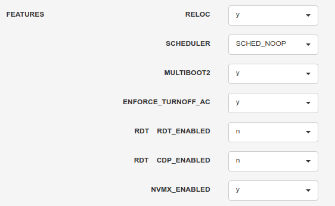
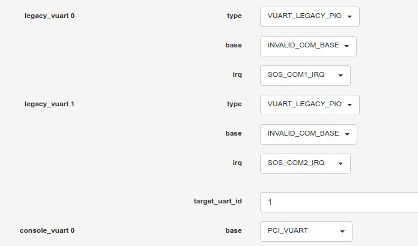

.. _nested_virt:

Enable Nested Virtualization
############################

With nested virtualization enabled, it's possible to run virtual machine
instances inside of level 1 guests, i.e. guests running on the
ACRN hypervisor. Although both nested guests and User VMs can be launched
from the Service VM, there is one significant distinction between them:

* VMX feature (CPUID01.01H:ECX[5]) doesn't need to be exposed to Service VM
  in order to launch user VMs, thus an User VMs is not running on top of
  Service VM, and it is considered as a L1 guest.

* VMX feature has to be visible to L1 guest to launch nested VMs. An instance
  of guest hypervisor (KVM) is running on L1 guest, which is working with
  L0 hypervisor (ACRN) to run the nested VM.

The conventional single-level virtualization has two levels - the host
(ACRN hypervisor) and the guest VMs. With nested virtualization enabled,
ACRN is able to run guests with their associated virtual machines, which
has three levels:

* The host (ACRN hypervisor), which we call L0 hypervisor, or L0 VMM
* The guest hypervisor, which we call L1 hypervisor, or L1 VMM
* The nested guest, which we call L2 guests

.. figure:: images/nvmx_1.png
   :width: 700px
   :align: center

   Generic Nested Virtualization

High Level ACRN Nested Virtualization Design
********************************************

The high-level design of nested virtualization is shown in :numref:`nested_virt_hld`.
ACRN. Nested VMX is enabled by allowing a guest to use VMX instructions,
and emulating them using the single level of VMX available in the hardware.

A logical processor uses virtual-machine control data structures (VMCSs) while
it is in VMX operation. The core of the NVMX emulation is ACRN builds VMCS02
out of the VMCS12 which is built by L1 hypervisor, to actually run the L2 guest.

.. figure:: images/nvmx_arch_1.png
   :width: 700px
   :align: center
   :name: nested_virt_hld

   Nested Virtualization in ACRN

Restrictions and constrains
***************************

Nested virtualization is considered as an experimental feature. As of today,
the tested platforms are: Tiger Lake RVP and Kaby Lake NUC (See :ref:`hardware`.)

L1 VMs have the following restrictions:

* KVM is the only L1 hypervisor supported by ACRN
* KVM runs in 64-bit mode
* KVM enables EPT for L2 guests
* QEMU is used to launch L2 guests

Constrains on L1 guest configuration:

* Local APIC passthrough should be enabled
* use SCHED_NOOP scheduler because ACRN can't receive timer interrupts
  on LAPIC passthrough pCPUs

Service OS VM configuration
***************************

Technically nested feature can be enabled on either Service VM or pre-launched
VMs, but officially ACRN supports Service VM only.

The nested virtualization feature is disabled by default in ACRN. You can
enable it using the :ref:`Use the ACRN Configuration Editor <acrn_config_tool_ui>`
with the following steps:

- Configure system level features:

   - Select ``y`` on ``NVMX_ENABLED`` to enable nested virtualization

   - Select ``SCHED_NOOP`` on ``SCHEDULER``

- per-VM configurations:

  - Select ``GUEST_FLAG_NVMX_ENABLED`` on ``guest_flags`` on the SOS VM section
    to enable nested feature on Service VM.
  - Select ``GUEST_FLAG_LAPIC_PASSTHROUGH`` on ``guest_flags`` to enable local
    APIC passthrough on Service VM

  .. figure:: images/nvmx_cfg_3.png
     :width: 700px
     :align: center

  - Edit ``cpu_affinity`` to assign pCPU IDs to run the Service VM. If you are
    using debug build and need the hypervisor console, please don't assign
    pCPU0 to Service VM

    It is not able to edit the ``pcpu_id`` for SOS from the ACRN-config GUI, so
    you may need to edit the ACRN scenario XML configuration file manually:

   .. code-block:: xml
      :emphasize-lines: 5,6,7

      <vm id="0">
        <vm_type>SOS_VM</vm_type>
        <name>ACRN SOS VM</name>
        <cpu_affinity>
          <pcpu_id>1</pcpu_id>
          <pcpu_id>2</pcpu_id>
          <pcpu_id>3</pcpu_id>
        </cpu_affinity>
        <guest_flags>
          <guest_flag>GUEST_FLAG_NVMX_ENABLED</guest_flag>
          <guest_flag>GUEST_FLAG_LAPIC_PASSTHROUGH</guest_flag>
        </guest_flags>

   The Service VM's virtual legacy UART interrupt doesn't work with LAPIC
   passthrough, which may prevent Service VM from booting. Thus we need to use
   the PCI-vUART for Service VM. Please refer to :ref:`Enable vUART Configurations <vuart_config>`
   for more details of VUART configuration.

   - ``base`` in ``legacy_vuart 0`` set to ``INVALID_LEGACY_PIO``

   - ``base`` in ``console_vuart 0`` set to ``PCI_VUART``

- Build with the XML configuration, refer to :ref:`getting-started-building`.

Prepare for Service VM kernel and rootfs
****************************************

Service VM could be running Ubuntu or other Linux distributions.
Instructions on how to boot Ubuntu as Service VM can be found in
:ref:`rt_industry_ubuntu_setup`.

The Service VM kernel needs to be built from acrn-kernel and some changes
to the kernel .config are needed.

Instructions on how to build and install the Service VM kernel can be found
in :ref:`Build and Install the ACRN Kernel <build-and-install-ACRN-kernel>`.
Here is the quick start of how to modify and build the kernel.

.. code-block:: none

 $ git clone https://github.com/projectacrn/acrn-kernel
 $ cd acrn-kernel
 $ git checkout release_2.5
 $ cp kernel_config_uefi_sos .config
 $ make olddefconfig

The following configuration entries are needed in order to launch nested
guests on Service VM:

.. code-block:: none

 CONFIG_KVM=y
 CONFIG_KVM_INTEL=y
 CONFIG_ACRN_GUEST=y

This is needed if you want to use virtio block device as root filesystem
for the guest VMs:

.. code-block:: none

 CONFIG_VIRTIO_BLK=y

After the configuration modifications, build and install the kernel.

.. code-block:: none

 $ make all

Launch a nested guest
*********************

Create an Ubuntu KVM Image
==========================

Please refer to :ref:`Build the Ubuntu KVM Image <build-the-ubuntu-kvm-image>`
on how to create an Ubuntu KVM image as the nested guest's root filesystem.
There is no particular requirement for this image, e.g. it could be of either
qcow2 or raw format.

Prepare for launch scripts
==========================

Install QEMU on Service VM on which is about to launch the nested guest:

.. code-block:: none

   $ sudo apt-get install qemu-kvm qemu virt-manager virt-viewer libvirt-bin

The following is a simple example for the scripts to launch nested guest. Please
note that ``-cpu host`` is needed to launch nested guests, and ``-nographics``
is required to be able to run nested guests reliably.

Besides this, there is no particular requirements for the launch scripts,
you can prepare the scripts just like the one you use to launch a VM
on a native Linux.

For example, other than ``-hda``, you can use the following option to launch
a virtio block based RAW image: ``-drive format=raw,file=/root/ubuntu-20.04.img,if=virtio``

Or use the following option to enable the Ethernet on the guest VM:
``-netdev tap,id=net0 -device virtio-net-pci,netdev=net0,mac=a6:cd:47:5f:20:dc``

   .. code-block:: bash
      :emphasize-lines: 2,3,4

      $ sudo qemu-system-x86_64 \
        -enable-kvm \
        -cpu host \
        -nographic \
        -m 2G \
        -smp 2 \
        -hda /root/ubuntu-20.04.qcow2 \
        -net nic,macaddr=00:16:3d:60:0a:80 -net tap,script=/etc/qemu-ifup

Launch the guest
================

You can launch the nested guest from Service VM's virtual serial console,
or from SSH remote login.

If the nested VM is launched successfully, you are expected to see the nested
VM's login prompt:

   .. code-block:: bash

     [  OK  ] Started Terminate Plymouth Boot Screen.
     [  OK  ] Started Hold until boot process finishes up.
     [  OK  ]  Starting Set console scheme...
     [  OK  ] Started Serial Getty on ttyS0.
     [  OK  ] Started LXD - container startup/shutdown.
     [  OK  ] Started Set console scheme.
     [  OK  ] Started Getty on tty1.
     [  OK  ] Reached target Login Prompts.
     [  OK  ] Reached target Multi-User System.
     [  OK  ] Started Update UTMP about System Runlevel Changes.

     Ubuntu 20.04 LTS ubuntu_vm ttyS0

     ubuntu_vm login:

You won't see the nested guest from a ``vcpu_list`` or ``vm_list`` command
on the ACRN hypervisor console because they only show level 1 VMs.

   .. code-block:: bash

      ACRN:\>vm_list

      VM_UUID                          VM_ID VM_NAME           VM_STATE
      ================================ ===== ==========================
      dbbbd4347a574216a12c2201f1ab0240   0   ACRN SOS VM       Running
      ACRN:\>vcpu_list

      VM ID    PCPU ID    VCPU ID    VCPU ROLE    VCPU STATE    THREAD STATE
      =====    =======    =======    =========    ==========    ============
        0         1          0       PRIMARY      Running          RUNNING
        0         2          1       SECONDARY    Running          RUNNING
        0         3          2       SECONDARY    Running          RUNNING

On the nested guest console, if you run an ``lshw`` or ``dmidecode`` command,
where you'll see that this is a QEMU-managed virtual machine:

   .. code-block:: bash
      :emphasize-lines: 4,5

      $ sudo lshw -c system
      ubuntu_vm
         description: Computer
         product: Standard PC (i440FX + PIIX, 1996)
         vendor: QEMU
         version: pc-i440fx-5.2
         width: 64 bits
         capabilities: smbios-2.8 dmi-2.8 smp vsyscall32
         configuration: boot=normal

For example, compare this to the same command run on the L1 guest (Service VM):

   .. code-block:: bash
      :emphasize-lines: 4,5

      $ sudo lshw -c system
      localhost.localdomain
         description: Computer
         product: NUC7i5DNHE
         vendor: Intel Corporation
         version: J57828-507
         serial: DW1710099900081
         width: 64 bits
         capabilities: smbios-3.1 dmi-3.1 smp vsyscall32
         configuration: boot=normal family=Intel NUC uuid=36711CA2-A784-AD49-B0DC-54B2030B16AB
