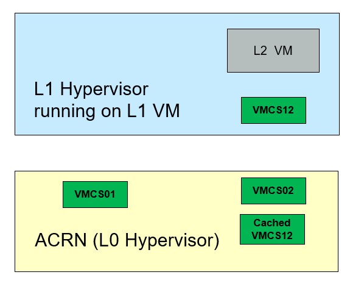

.. _nested_virt:

Enable Nested Virtualization
############################

With nested virtualization enabled in ACRN, you can run virtual machine
instances inside of a guest VM (also called a user VM) running on the ACRN hypervisor.
Although both "level 1" guest VMs and nested guest VMs can be launched
from the Service VM, the following distinction is worth noting:

* The VMX feature (``CPUID01.01H:ECX[5]``) does not need to be visible to the Service VM
  in order to launch guest VMs. A guest VM not running on top of the
  Service VM is considered a level 1 (L1) guest.

* The VMX feature must be visible to an L1 guest to launch a nested VM. An instance
  of a guest hypervisor (KVM) runs on the L1 guest and works with the
  L0 ACRN hypervisor to run the nested VM.

The conventional single-level virtualization has two levels - the L0 host
(ACRN hypervisor) and the L1 guest VMs. With nested virtualization enabled,
ACRN can run guest VMs with their associated virtual machines that define a
third level:

* The host (ACRN hypervisor), which we call the L0 hypervisor
* The guest hypervisor (KVM), which we call the L1 hypervisor
* The nested guest VMs, which we call the L2 guest VMs

.. figure:: images/nvmx_1.png
   :width: 700px
   :align: center

   Generic Nested Virtualization

High Level ACRN Nested Virtualization Design
********************************************

The high-level design of nested virtualization in ACRN is shown in :numref:`nested_virt_hld`.
Nested VMX is enabled by allowing a guest VM to use VMX instructions,
and emulating them using the single level of VMX available in the hardware.

In x86, a logical processor uses VMCSs to manage VM entries and VM exits as
well as processor behavior in VMX non-root operation. The trick of nVMX
emulation is ACRN builds a VMCS02 out of the VMCS01, which is the VMCS
ACRN uses to run the L1 VM, and VMCS12 which is built by L1 hypervisor to
actually run the L2 guest.

   Nested Virtualization in ACRN

- L0 hypervisor (ACRN) runs L1 guest with VMCS01

- L1 hypervisor (KVM) creates VMCS12 to run a L2 guest

- VMX instructions from L1 hypervisor trigger VMExits to L0 hypervisor:

- L0 hypervisor runs a L2 guest with VMCS02

   - L0 caches VMCS12 in host memory
   - L0 merges VMCS01 and VMCS12 to create VMCS02

- L2 guest runs until triggering VMExits to L0

   - L0 reflects most VMEXits to L1 hypervisor
   - L0 runs L1 guest with VMCS01 and VMCS02 as the shadow VMCS

Restrictions and Constraints
****************************

Nested virtualization is considered an experimental feature, and only tested
on Tiger Lake and Kaby Lake platforms (See :ref:`hardware`.)

L1 VMs have the following restrictions:

* KVM is the only L1 hypervisor supported by ACRN
* KVM runs in 64-bit mode
* KVM enables EPT for L2 guests
* QEMU is used to launch L2 guests

Constraints on L1 guest configuration:

* Local APIC passthrough must be enabled
* Only the ``SCHED_NOOP`` scheduler is supported. ACRN can't receive timer interrupts
  on LAPIC passthrough pCPUs

Service OS VM configuration
***************************

ACRN only supports enabling the nested virtualization feature on the Service VM, not on pre-launched
VMs.

The nested virtualization feature is disabled by default in ACRN. You can
enable it using the :ref:`Use the ACRN Configuration Editor <acrn_config_tool_ui>`
with these settings:

- Configure system level features:

   - Select ``y`` on :option:`hv.FEATURES.NVMX_ENABLED` to enable nested virtualization

   - Select ``SCHED_NOOP`` on :option:`hv.FEATURES.SCHEDULER`

     .. figure:: images/nvmx_cfg_1.png
        :width: 400px
        :align: center

        Setting NVMX_ENABLED and SCHEDULER with configuration tool

- In each guest VM configuration:

  - Select ``GUEST_FLAG_NVMX_ENABLED`` on :option:`vm.guest_flags.guest_flag` on the SOS VM section
    to enable the nested virtualization feature on the Service VM.
  - Select ``GUEST_FLAG_LAPIC_PASSTHROUGH`` on :option:`vm.guest_flags.guest_flag` to enable local
    APIC passthrough on the Service VM.

    .. figure:: images/nvmx_cfg_3.png
       :width: 700px
       :align: center

       Service VM (SOS) ``guest_flag`` settings

  - Edit :option:`vm.cpu_affinity.pcpu_id` to assign ``pCPU`` IDs to run the Service VM. If you are
    using debug build and need the hypervisor console, don't assign
    ``pCPU0`` to the Service VM.

    You may need to manually edit the ACRN scenario XML configuration file to edit the ``pcpu_id`` for the Service VM (SOS):

    .. code-block:: xml
       :emphasize-lines: 5,6,7

       <vm id="0">
         <vm_type>SOS_VM</vm_type>
         <name>ACRN SOS VM</name>
         <cpu_affinity>
           <pcpu_id>1</pcpu_id>
           <pcpu_id>2</pcpu_id>
           <pcpu_id>3</pcpu_id>
         </cpu_affinity>
         <guest_flags>
           <guest_flag>GUEST_FLAG_NVMX_ENABLED</guest_flag>
           <guest_flag>GUEST_FLAG_LAPIC_PASSTHROUGH</guest_flag>
         </guest_flags>

   The Service VM's virtual legacy UART interrupt doesn't work with LAPIC
   passthrough, which may prevent the Service VM from booting. Instead, we need to use
   the PCI-vUART for the Service VM. Refer to :ref:`Enable vUART Configurations <vuart_config>`
   for more details about VUART configuration.

   - Set :option:`vm.legacy_vuart.base` in ``legacy_vuart 0`` to ``INVALID_LEGACY_PIO``

   - Set :option:`vm.console_vuart.base` in ``console_vuart 0`` to ``PCI_VUART``

     .. figure:: images/nvmx_cfg_2.png
        :width: 500px
        :align: center

        Service VM legacy and console vUART settings

- Build with the XML configuration, referring to :ref:`getting-started-building`.

Prepare for Service VM Kernel and rootfs
****************************************

The service VM can run Ubuntu or other Linux distributions.
Instructions on how to boot Ubuntu as the Service VM can be found in
:ref:`rt_industry_ubuntu_setup`.

The Service VM kernel needs to be built from the ``acrn-kernel`` repo, and some changes
to the kernel ``.config`` are needed.

Instructions on how to build and install the Service VM kernel can be found
in :ref:`Build and Install the ACRN Kernel <build-and-install-ACRN-kernel>`.

Here is the quick start of how to modify and build the kernel:

.. code-block:: none

   git clone https://github.com/projectacrn/acrn-kernel
   cd acrn-kernel
   git checkout master
   cp kernel_config_uefi_sos .config
   make olddefconfig

The following configuration entries are needed to launch nested
guests on the Service VM:

.. code-block:: none

   CONFIG_KVM=y
   CONFIG_KVM_INTEL=y
   CONFIG_ACRN_GUEST=y

This setting is also needed if you want to use virtio block device as root filesystem
for the guest VMs:

.. code-block:: none

   CONFIG_VIRTIO_BLK=y

After the configuration modifications, build and install the kernel.

.. code-block:: none

   make all

Launch a Nested Guest VM
************************

Create an Ubuntu KVM Image
==========================

Refer to :ref:`Build the Ubuntu KVM Image <build-the-ubuntu-kvm-image>`
on how to create an Ubuntu KVM image as the nested guest VM's root filesystem.
There is no particular requirement for this image, e.g., it could be of either
qcow2 or raw format.

Prepare for Launch Scripts
==========================

Install QEMU on the Service VM that will launch the nested guest VM:

.. code-block:: none

   sudo apt-get install qemu-kvm qemu virt-manager virt-viewer libvirt-bin

The following is a simple example for the script to launch a nested guest VM.

.. important:: The ``-cpu host`` option is needed to launch a nested guest VM, and ``-nographics``
   is required to run nested guest VMs reliably.

Besides this, there is no particular requirements for the launch script.
You can prepare the script just like the one you use to launch a VM
on native Linux.

For example, other than ``-hda``, you can use the following option to launch
a virtio block based RAW image: ``-drive format=raw,file=/root/ubuntu-20.04.img,if=virtio``

Use the following option to enable Ethernet on the guest VM:
``-netdev tap,id=net0 -device virtio-net-pci,netdev=net0,mac=a6:cd:47:5f:20:dc``

.. code-block:: bash
   :emphasize-lines: 2-4

   sudo qemu-system-x86_64 \
     -enable-kvm \
     -cpu host \
     -nographic \
     -m 2G -smp 2 -hda /root/ubuntu-20.04.qcow2 \
     -net nic,macaddr=00:16:3d:60:0a:80 -net tap,script=/etc/qemu-ifup

Launch the Guest VM
===================

You can launch the nested guest VM from the Service VM's virtual serial console
or from an SSH remote login.

If the nested VM is launched successfully, you should see the nested
VM's login prompt:

.. code-block:: bash

   [  OK  ] Started Terminate Plymouth Boot Screen.
   [  OK  ] Started Hold until boot process finishes up.
   [  OK  ]  Starting Set console scheme...
   [  OK  ] Started Serial Getty on ttyS0.
   [  OK  ] Started LXD - container startup/shutdown.
   [  OK  ] Started Set console scheme.
   [  OK  ] Started Getty on tty1.
   [  OK  ] Reached target Login Prompts.
   [  OK  ] Reached target Multi-User System.
   [  OK  ] Started Update UTMP about System Runlevel Changes.

   Ubuntu 20.04 LTS ubuntu_vm ttyS0

   ubuntu_vm login:

You won't see the nested guest from a ``vcpu_list`` or ``vm_list`` command
on the ACRN hypervisor console because these commands only show level 1 VMs.

.. code-block:: bash

   ACRN:\>vm_list

   VM_UUID                          VM_ID VM_NAME           VM_STATE
   ================================ ===== ==========================
   dbbbd4347a574216a12c2201f1ab0240   0   ACRN SOS VM       Running
   ACRN:\>vcpu_list

   VM ID    PCPU ID    VCPU ID    VCPU ROLE    VCPU STATE    THREAD STATE
   =====    =======    =======    =========    ==========    ============
     0         1          0       PRIMARY      Running          RUNNING
     0         2          1       SECONDARY    Running          RUNNING
     0         3          2       SECONDARY    Running          RUNNING

On the nested guest VM console, run an ``lshw`` or ``dmidecode`` command
and you'll see that this is a QEMU-managed virtual machine:

.. code-block:: bash
   :emphasize-lines: 4,5

   $ sudo lshw -c system
   ubuntu_vm
      description: Computer
      product: Standard PC (i440FX + PIIX, 1996)
      vendor: QEMU
      version: pc-i440fx-5.2
      width: 64 bits
      capabilities: smbios-2.8 dmi-2.8 smp vsyscall32
      configuration: boot=normal

For example, compare this to the same command run on the L1 guest (Service VM):

.. code-block:: bash
   :emphasize-lines: 4,5

   $ sudo lshw -c system
   localhost.localdomain
      description: Computer
      product: NUC7i5DNHE
      vendor: Intel Corporation
      version: J57828-507
      serial: DW1710099900081
      width: 64 bits
      capabilities: smbios-3.1 dmi-3.1 smp vsyscall32
      configuration: boot=normal family=Intel NUC uuid=36711CA2-A784-AD49-B0DC-54B2030B16AB
