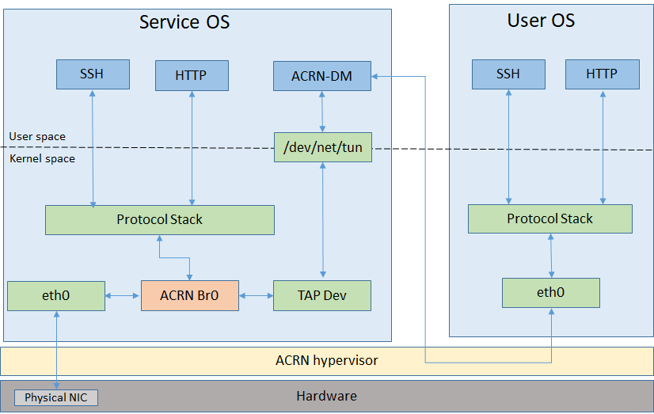
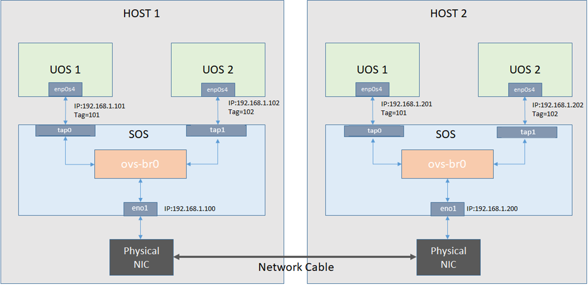

.. _open_vswitch:

How to enable OVS in ACRN
#########################
Hypervisors need the ability to bridge network traffic between VMs
and with the outside world. This tutorial describes how to
use `Open Virtual Switch (OVS)
<https://www.openvswitch.org/>`_ bridge in ACRN for this purpose.

.. note::
   OVS is provided as part of the ``service-os``
   bundle.  Use ClearLinux OS version ``29660``.

What is OVS
***********
Open vSwitch (OVS) is an open-source implementation of
a distributed virtual multilayer switch that provides a switching
stack for hardware virtualization environments. OVS supports multiple
protocols and standards used in computer networks. For more detailed
OVS information, please refer to `what-is-ovs
<http://docs.openvswitch.org/en/latest/intro/what-is-ovs/#what-is-open-vswitch>`_.

Why OVS
*******
Open vSwitch is targeted at multi-server virtualization deployments,
a landscape not well suited for ACRN's built-in L2 switch (the `Linux bridge
<https://wiki.linuxfoundation.org/networking/bridge>`_).
These environments are often characterized by highly dynamic end-points,
the maintenance of logical abstractions, and (sometimes) integration with
or offloading to special purpose switching hardware.
For more reasons about why Open vSwitch is used, please refer to `why-ovs
<http://docs.openvswitch.org/en/latest/intro/why-ovs/>`_.

.. _enable_ovs_in_ACRN:

How to enable OVS in ACRN
*************************
The OVS service is included with the Clear Linux ``service-os`` bundle.

After booting the ACRN Service OS, disable the Clear Linux
autoupdate feature before setting up the OVS bridge to
prevent autoupdate from restoring the default bridge after
a system update::

   # swupd autoupdate --disable

You can then start the OVS service with the command::

   # systemctl start openvswitch

To start OVS automatically after a reboot, you should also use this command::

   # systemctl enable openvswitch

The default ``acrn-br0`` bridge is created by the Service VM ``systemd`` and
supports the User VM network.

   Default ACRN Network

How to use OVS bridge
*********************
#. Disable acrn network configuration::

   # cd /usr/lib/systemd/network/
   # mv 50-acrn.network 50-acrn.network_bak

#. Modify ``50-eth.network`` to enable DHCP on OVS bridge

   .. code-block:: none

      [Match]
      Name=ovs-br0

      [Network]
      DHCP=ipv4

#. Create OVS bridge and ``tap1`` network interface::

   # ovs-vsctl add-br ovs-br0
   # ip tuntap add dev tap1 mode tap
   # ip link set dev tap1 down
   # ip link set dev tap1 up

#. Add ``eno1``, ``tap1`` into OVS bridge::

   # ovs-vsctl add-port ovs-br0 eno1
   # ovs-vsctl add-port ovs-br0 tap1

#. Modify ``launch_uos.sh`` script to enable ``tap1`` device before launching the User VM:

   .. code-block:: none

      # sed -i "s/virtio-net,tap0/virtio-net,tap1/" /usr/share/acrn/samples/nuc/launch_uos.sh

   .. note::
      If you set up the User VM via `acrn_quick_setup.sh
      <https://raw.githubusercontent.com/projectacrn/acrn-hypervisor/master/doc/getting-started/acrn_quick_setup.sh>`_,
      then replace ``/usr/share/acrn/samples/nuc/launch_uos.sh`` with ``/root/launch_uos_<version>.sh``
      in ``sed`` command above.

#. The User VM and Service VM network will work after rebooting the host via ``ovs-br0``

Example for VLAN network based on OVS in ACRN
*********************************************
We will use the OVS bridge VLAN feature to support network isolation
between VMs. :numref:`ovs-example1` shows an example with four VMs in two hosts,
with the hosts directly connected by a network cable. The VMs are interconnected
through statically configured IP addresses, and use VLAN id to put VM1 of
HOST1 and VM1 of HOST2 into a VLAN. Similarly, VM2 of HOST1 and VM2 of
HOST2 are put into a VLAN. In this configuration, the VM1s can communicate with each other,
and VM2s can directly communicate with each other, but VM1s and VM2s cannot connect.

   An example of OVS usage in ACRN

Follow these steps to set up OVS networks on both HOSTs:

#. Set up ``ovs-br0`` instead of ``acrn-br0``, (refer to the the previous section
   :ref:`enable_ovs_in_ACRN` for details).

#. Add ``eno1``, ``tap<VM number>`` into OVS bridge:

   .. code-block:: none

      # ovs-vsctl add-port ovs-br0 eno1
      # ovs-vsctl add-port ovs-br0 tap1 tag=101
      # ovs-vsctl add-port ovs-br0 tap2 tag=102
      # sed -i "s/virtio-net,tap0/virtio-net,tap1/" <1st launch_uos script>
      # sed -i "s/virtio-net,tap0/virtio-net,tap2/" <2nd launch_uos script>
      # reboot

#. Configure the static IP address on both HOSTs and it's VMs::

   # <HOST_1 Service VM>:
   # ifconfig ovs-br0 192.168.1.100
   # <HOST_1 User VM1>:
   # ifconfig enp0s4 192.168.1.101
   # <HOST_1 User VM2>:
   # ifconfig enp0s4 192.168.1.102
   #
   # <HOST_2 Service VM>:
   # ifconfig ovs-br0 192.168.1.200
   # <HOST_2 User VM1>:
   # ifconfig enp0s4 192.168.1.201
   # <HOST_2 User VM2>:
   # ifconfig enp0s4 192.168.1.202

#. After that, it will succeed to ``ping`` from VM1 of HOST1 to VM1 of HOST2,
   but fail to ``ping`` from VM1 of HOST1 to VM2 of HOST2.
