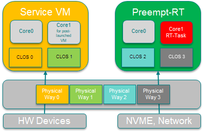

.. _pre_launched_rt:

Pre-Launched Preempt-RT Linux Mode in ACRN
##########################################

The Pre-Launched Preempt-RT Linux Mode of ACRN, abbreviated as
Pre-Launched RT mode, is an ACRN configuration scenario. Pre-Launched RT
mode allows you to boot ACRN with a preempt-rt Linux running in VM0, and
the Service VM running in VM1. VM0 and VM1 are both pre-launched VMs,
and their resources are partitioned from those on the physical platform.

Prerequisites
*************

Because the Pre-Launched RT VM and Service VM are physically isolated
from each other, they must have their own devices to run a common OS,
such as Linux. Also, the platform must support booting ACRN with
multiple kernel images. So, your platform must have:

- Two hard disk drives, one for the Pre-Launched RT and one for the Service
  VM
- Two network devices
- GRUB multiboot support

Example of Pre-Launched RT
**************************

Take the Whiskey Lake WHL-IPC-I5 board (as described in :ref:`hardware`) for
example. This platform can connect both an NVMe and a SATA drive and has
two Ethernet ports. We will passthrough the SATA and Ethernet 03:00.0
devices into the Pre-Launched RT VM, and give the rest of the devices to
the Service VM.

Install SOS with Grub on NVMe
=============================

As with the Hybrid and Logical Partition scenarios, the Pre-Launched RT
mode must boot using GRUB.  The ACRN hypervisor is loaded as a GRUB
multiboot kernel, while the Pre-Launched RT kernel and Service VM
kernels are loaded as multiboot modules. The ACRN hypervisor, Service
VM, and Pre-Launched RT kernel images are all located on the NVMe drive.
We recommend installing Ubuntu on the NVMe drive as the Service VM OS,
which also has the required GRUB image to launch Pre-Launched RT mode.
Refer to :ref:`Run Ubuntu as the Service VM <Ubuntu Service OS>`, to
install Ubuntu on the NVMe drive, and use grub to launch the Service VM.

Install Pre-Launched RT Filesystem on SATA and Kernel Image on NVMe
===================================================================

The Pre-Launched Preempt RT Linux use Clearlinux as rootfs. Refer to
:ref:`Burn the Preempt-RT VM image onto the SATA disk <install_rtvm>` to
download the RTVM image and burn it to the SATA drive. The Kernel should
be on the NVMe drive along with GRUB. You'll need to copy the RT kernel
to the NVMe drive. Once you have successfully installed and booted
Ubuntu from the NVMe drive, you'll then need to copy the RT kernel from
the SATA to the NVMe drive:

.. code-block:: none

   # mount /dev/nvme0n1p1 /boot
   # mount /dev/sda1 /mnt
   # cp /mnt/bzImage /boot/EFI/BOOT/bzImage_RT

Build ACRN with Pre-Launched RT Mode
====================================

The ACRN VM configuration framework can easily configure resources for
Pre-Launched VMs. On Whiskey Lake WHL-IPC-I5, to passthrough SATA and
ethernet 03:00.0 devices to the Pre-Launched RT VM, build ACRN with:

.. code-block:: none

   make BOARD_FILE=$PWD/misc/acrn-config/xmls/board-xmls/whl-ipc-i5.xml SCENARIO_FILE=$PWD/misc/acrn-config/xmls/config-xmls/whl-ipc-i5/hybrid_rt.xml RELEASE=0

After the build completes, please update ACRN on NVMe. It is
/boot/EFI/BOOT/acrn.bin, if /dev/nvme0n1p1 is mounted at /boot.

Add Pre-Launched RT Kernel Image to GRUB Config
===============================================

The last step is to modify the GRUB configuration file to load the Pre-Launched
kernel. (For more information about this, see :ref:`Update Grub for the Ubuntu Service VM
<rt_industry_ubuntu_setup>`.) The grub config file will look something
like this:

.. code-block:: none

   menuentry 'ACRN multiboot2 hybrid'{
       echo 'loading multiboot2 hybrid...'
       multiboot2 /EFI/BOOT/acrn.bin
       module2 /EFI/BOOT/bzImage_RT RT_bzImage
       module2 /EFI/BOOT/bzImage Linux_bzImage
   }

Reboot the system, and it will boot into Pre-Launched RT Mode

.. code-block:: none

   ACRN:\>vm_list
   VM_UUID                          VM_ID       VM_NAME                    VM_STATE
   ================================ ===== ================================ ========
   26c5e0d88f8a47d88109f201ebd61a5e   0   ACRN PRE-LAUNCHED VM0            Running
   dbbbd4347a574216a12c2201f1ab0240   1   ACRN SOS VM                      Running
   ACRN:\>

Connect console of VM0, via 'vm_console' ACRN shell command (Press
:kbd:`Ctrl` + :kbd:`Space` to return to the ACRN shell.)

.. code-block:: none

   ACRN:\>vm_console 0

   ----- Entering VM 0 Shell -----

   root@clr-85a5e9fbac604fbbb92644991f6315df ~ #
