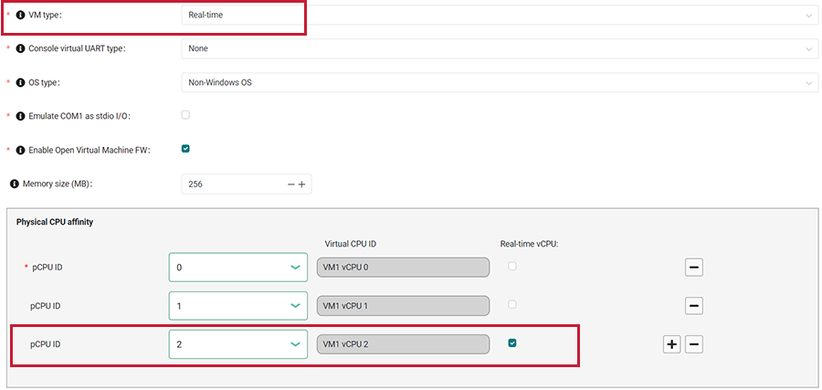
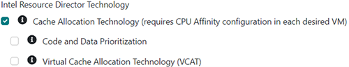
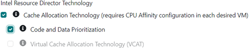
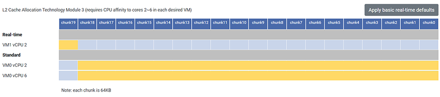
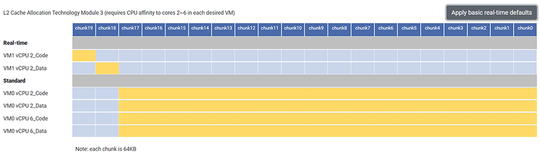

.. _rdt_configuration:

Enable Intel Resource Director Technology (RDT) Configurations
###############################################################

About Intel Resource Director Technology (RDT)
**********************************************

On x86 platforms that support Intel Resource Director Technology (RDT)
allocation features, the ACRN hypervisor can help minimize cache misses by
partitioning the shared cache among VMs. "Shared cache" refers to cache that is
shared among multiple CPU cores. By default, VMs running on these cores are
configured to use the entire cache, effectively sharing the cache among all VMs
and without any partitioning. This design choice may cause too many cache misses
for applications running in higher-priority VMs, such as real-time VMs (RTVM),
negatively affecting their performance.  The ACRN hypervisor can help minimize
cache misses and improve performance by isolating a portion of the shared cache
for a specific VM.

ACRN supports the following features:

Cache Allocation Technology (CAT)
  The CAT support in the hypervisor isolates a portion of the cache for a VM from
  other VMs. Generally, certain cache resources are allocated for the RTVMs to
  reduce performance interference by other VMs attempting to use the same cache.

Code and Data Prioritization (CDP)
  The CDP feature in RDT is an extension of CAT that enables separate control over
  code and data placement in the cache. The CDP support in the hypervisor isolates
  a portion of the cache for code and another portion for data for the same VM.

Virtual Cache Allocation Technology (vCAT)
  ACRN also supports virtualizing CAT, referred to as vCAT. With
  vCAT enabled, the hypervisor presents CAT to a selected set of VMs, allowing the
  guest OSs to further isolate the cache used by higher-priority processes in
  those VMs.

Dependencies and Constraints
*****************************

Consider the following dependencies and constraints:

* The hardware must support RDT for ACRN to enable RDT support in the
  hypervisor.

* The cache must be shared cache (cache shared across multiple CPU cores) and
  not private cache (cache that is owned by only one CPU core). If the
  cache is private, CAT, CDP, and vCAT have no benefit because the cache is
  already exclusively used by one core. For this reason, the ACRN Configurator
  will not allow you to configure private cache.

* The ACRN Configurator displays CAT configuration parameters based on data
  reported in the board configuration file.  Some Intel platforms are known to
  have L3 CAT even though it's not reported via the architectural CPUID
  interface. In this situation, the board inspector detects availability of L3
  CAT by trying to access the CAT MSRs directly. Versions of the board inspector
  before v3.1 only used the CPUID interface and would indicate L3 CAT wasn't
  supported in this circumstance.

* The guest OS in a VM with vCAT enabled requires utilities in that OS for
  further cache allocation configurations. An example is the `resctrl
  <https://docs.kernel.org/x86/resctrl.html>`__ framework in Linux.

Configuration Overview
**********************

You can allocate cache to each VM at the virtual CPU (vCPU) level. For example,
you can create a post-launched real-time VM and assign three physical CPU
cores to it. ACRN assigns a vCPU ID to each physical CPU. Furthermore, you can
specify a vCPU as a real-time vCPU. Then you can allocate a portion of the cache
to the real-time vCPU and allocate the rest of the cache to be shared among the
other vCPUs. This type of configuration allows the real-time vCPU to use its
assigned cache without interference from the other vCPUs, thus improving the
performance of applications running on the real-time vCPU. The following
documentation is a general overview of the configuration process.

The :ref:`acrn_configurator_tool` provides a user interface to help you allocate
cache to vCPUs. The configuration process requires setting VM parameters, then
allocating cache to the VMs via an interface in the hypervisor parameters. This
documentation presents the configuration process as a linear flow, but in
reality you may find yourself moving back and forth between setting the
hypervisor parameters and the VM parameters until you are satisfied with the
entire configuration.

For a real-time VM, you must set the following parameters in the VM's **Basic
Parameters**: 

* **VM type**: Select **Real-time**.

* **pCPU ID**: Select the physical CPU affinity for the VM.

* **Virtual CPU ID**: Note the vCPU ID that the tool assigns to each physical
  CPU. You will need to know the ID when you are ready to allocate cache.

* **Real-time vCPU**: Select the Real-time vCPU check box next to each real-time
  vCPU. The ACRN Configurator uses this information to create default cache
  configurations, as you will see later in this documentation. If you change the
  VM type from Real-time to Standard, the ACRN Configurator disables the
  Real-time vCPU check box.

  Some vCPUs of an RTVM may be used for housekeeping tasks and not need the
  real-time performance optimization provided by advanced cache configuration
  isolation.  You indicate this by leaving this Real-time vCPU option unchecked.
  Housekeeping tasks are generally related to kernel tasks to maintain its
  internal state and services such as updating internal statistics for the
  scheduler or timers, and User VM launch or exit.

To use vCAT for the VM, you must also set the following parameters in the VM's
**Advanced Parameters**:

* **Maximum virtual CLOS**: Select the maximum number of virtual CLOS masks.
  This parameter defines the number of cache chunks that you will see in the
  hypervisor parameters.

* Select **VM Virtual Cache Allocation Tech**.

Next, you can enable Intel RDT features in **Hypervisor Global Settings >
Advanced Parameters > Memory Isolation for Performance**. You can enable one of
the following combinations of features:

* Cache Allocation Technology (CAT) alone

* Cache Allocation Technology plus Code and Data Prioritization (CDP)

* Cache Allocation Technology plus Virtual Cache Allocation Technology (vCAT)

The following figure shows Cache Allocation Technology enabled:

When CDP or vCAT is enabled, CAT must be enabled too. The tool selects CAT if it's not already selected.

CDP and vCAT can't be enabled at the same time, so the tool clears the vCAT check box when CDP is selected and vice versa.

Based on your selection, the tool displays the available cache in tables.
Example:

.. image:: images/configurator-cache03.png
   :align: center
   :class: drop-shadow

The table title shows important information:

* Cache level, such as Level 3 (L3) or Level 2 (L2)

* Physical CPU cores that can access the cache

The above example shows an L2 cache table. VMs assigned to any CPU cores 2-6 can
have cache allocated to them.

The table's left-most column shows the names of all VMs that are assigned to the
CPU cores noted in the table title, as well as their vCPU IDs. The table
categorizes the vCPUs as either standard or real-time. The real-time vCPUs are
those that are set as real-time in the VM's parameters. All other vCPUs are
considered standard. The above example shows one real-time vCPU (VM1 vCPU 2) and
two standard vCPUs (VM0 vCPU 2 and 6).

.. note::

   The Service VM is automatically assigned to all CPUs, so it appears in the standard category in all cache tables. 

The table's rows show the number of available cache chunks. You can see the
size of each cache chunk in the note below the table. In the above example, 20
cache chunks are available to allocate to the VMs, and each cache chunk is 64KB.
All cache chunks are yellow, which means all of them are allocated to all VMs.
All VMs share the entire cache.

The **Apply basic real-time defaults** button creates a basic real-time
configuration if real-time vCPUs exist. If there are no real-time vCPUs, the
button will not do anything.

If you select Cache Allocation Technology (CAT) alone, the **Apply basic
real-time defaults** button allocates a different cache chunk to each real-time
vCPU, making sure it doesn't overlap the cache of any other vCPU. The rest of
the cache is shared among the standard vCPUs. In the following example, only VM1
vCPU 2 can use cache chunk19, while all other vCPUs share the rest of the cache.

If you select CAT with Code and Data Prioritization, you can allocate different
cache chunks to code or data on the same vCPU. The **Apply basic real-time
defaults** button allocates one cache chunk to code on the real-time vCPU and a
different cache chunk to data on the same vCPU, making sure the cache chunks
don't overlap any others. In the following example, VM1 vCPU 2 can use cache
chunk19 for code and chunk18 for data, while all other vCPUs share the rest of
the cache.

To further customize the cache allocation, you can drag the right or left edges
of the yellow boxes to cover the cache chunks that you want to allocate to
specific VMs.

.. note::

   If you have a real-time VM, ensure its cache chunks do not overlap with any
   other VM's cache chunks.

The tool helps you create valid configurations based on the underlying platform
architecture. For example, it is only possible to assign consecutive cache
chunks to a vCPU; there can be no gaps. Also, a vCPU must have access to at
least one cache chunk.

Learn More
**********

For details on the ACRN RDT high-level design, see :ref:`hv_rdt`.

For details about RDT, see
`Intel 64 and IA-32 Architectures Software Developer's Manual (SDM), Volume 3,
(Section 17.19 Intel Resource Director Technology Allocation Features)
<https://www.intel.com/content/www/us/en/developer/articles/technical/intel-sdm.html>`_.

For details on the ACRN vCAT high-level design, see :ref:`hv_vcat`.
