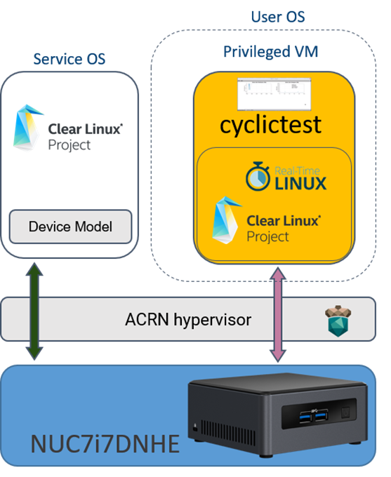

.. _rt_linux_setup:

Using PREEMPT_RT-Linux for real-time UOS
########################################

The ACRN project uses various techniques to support a User OS (UOS)
running as virtual machine (VM) with real-time characteristics, also
called a "Privileged VM" in ACRN terminology. Some of these techniques
include device passthrough and cache allocation technology (CAT), as
shown in :numref:`rt-linux-arch`.

To benefit from these techniques,
the OS running in the VM should also
behave as a real-time system. In this tutorial, we explain how to run a
Privileged VM based on a modified Clear Linux* OS using PREEMPT_RT
real-time kernel patches from the `Real-Time Linux collaborative project
<https://wiki.linuxfoundation.org/realtime/start>`_.

The PREEMPT_RT patch add preemption models to the mainline
Linux kernel. The "Fully Preemptible Kernel" model is the one that
turns Linux into an RTOS, allowing the system to react to an external
event such as an interrupt within a defined time frame.

   Real-Time Linux (PREEMPT_RT) VM on ACRN

The privileged VM exclusively owns its passthrough devices, so in
addition to the controller and file system used by the SOS, a dedicated
storage controller and device are needed to host the privileged VM's
root filesystem. The two storage devices should be under different PCI
controllers because the system can only pass through PCI-based devices
to a guest OS. The Intel NUC7ixDNHE NUC (KBL) is a good platform to set
up a real-time system because it has both an NVMe and a SATA controller.
You will need both NVMe and SATA storage devices in order to proceed.

The following procedures show an example for setting up a real-time
system on Intel KBL NUC with a SATA SSD as ``/dev/sda`` and an NVME SSD as
``/dev/nvme0n1p``.

1. Follow the :ref:`set-up-CL` instructions in the
   :ref:`getting-started-apl-nuc` to:

   a. Install Clear Linux (version 26800 or higher) onto the NVMe
   #. Install Clear Linux (version 26800 or higher) onto the SATA SSD
   #. Set up Clear Linux on the SATA SSD as the Service OS (SOS) following
      the :ref:`add-acrn-to-efi` instructions in the same guide.

#. Patch and build the Real-Time kernel

   a. Download Linux kernel real-time patch::

         $ wget https://mirrors.edge.kernel.org/pub/linux/kernel/projects/rt/4.19/patch-4.19.15-rt12.patch.xz

   #. Sync the kernel code to acrn-2019w04.5-150000p::

         $ git clone https://github.com/projectacrn/acrn-kernel.git
         $ git checkout acrn-2019w04.5-150000p
         $ cd acrn-kernel
         $ xzcat ../patch-4.19.15-rt12.patch.xz | patch -p1

      .. note:: This patch will report one conflict with ``base.c`` that
         you can ignore.

   #. Edit the ``kernel_config_uos`` config file: search for the keyword
      "NVME Support", delete ``# CONFIG_BLK_DEV_NVME is not set`` and add two lines under "NVME Support" to enable
      the NVME driver in RT kernel::

         CONFIG_NVME_CORE=y
         CONFIG_BLK_DEV_NVME=y

   #. Build the RT kernel::

         $ cp kernel_config_uos .config
         $ make targz-pkg

      Choose "Fully Preemptible Kernel (RT)" when prompted, and
      choose default for all the other options.

   #. Copy the generated package to SOS::

         $ scp linux-4.19.8-rt6+-x86.tar.gz <user name>@<SOS ip>:~/

#. Configure the system on SOS

   a. Extract kernel boot and lib modules from the package::

         $ cd ~/
         $ tar xzvf linux-4.19.8-rt6+-x86.tar.gz

   #. Copy the extracted lib modules to NVME SSD::

         $ mount /dev/nvme0n1p3 /mnt
         $ cp -r ~/lib/modules/4.19.8-rt6+ /mnt/lib/modules

   #. Edit and run the ``launch_hard_rt_vm.sh`` script to launch the UOS.
      A sample ``launch_hard_rt_vm.sh`` is included in the Clear Linux
      release, and is also available in the acrn-hypervisor/devicemodel
      GitHub repo (in the samples folder).

      You'll need to modify two places:

      1. Replace ``/root/rt_uos_kernel`` with ``~/boot/vmlinuz-4.19.8-rt6+``
      #. Replace ``root=/dev/sda3`` with ``root=/dev/nvme0n1p3``

   #. Run the launch script::

         $ sudo ./launch_hard_rt_vm.sh

#. At this point, you've successfully launched the real-time VM and
   Guest OS.  You can verify a preemptible kernel was loaded using
   the ``uname -a`` command:

   .. code-block:: console

      root@rtvm-02 ~ # uname -a
      Linux rtvm-02 4.19.8-rt6+ #1 SMP PREEMPT RT Tue Jan 22 04:17:40 UTC 2019 x86_64 GNU/Linux

#. Now you can run all kinds of performance tools to experience real-time
   performance. One popular tool is ``cyclictest``. You can install this
   tool and run it with::

      swupd bundle-add dev-utils
      cyclictest -N -p80 -D300
