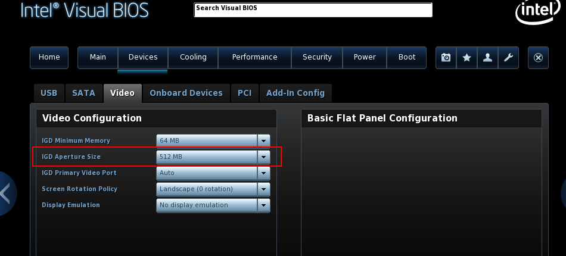

.. _running_ubun_as_user_vm:

Run Ubuntu as the User VM
#########################

Prerequisites
*************

This tutorial assumes you have already set up the ACRN Service VM on an
Intel NUC Kit. If you have not, refer to the following instructions:

- Install a `Ubuntu 18.04 desktop ISO
  <http://releases.ubuntu.com/18.04.3/ubuntu-18.04.3-desktop-amd64.iso?_ga=2.160010942.221344839.1566963570-491064742.1554370503>`_
  on your board.
- Follow the instructions in :ref:`gsg` to set up the Service VM.

Before you start this tutorial, make sure the KVM tools are installed on the
development machine and set **IGD Aperture Size to 512** in the BIOS
settings (refer to :numref:`intel-bios-ubun`). Connect two monitors to your
Intel NUC:

.. code-block:: none

   $ sudo apt install qemu-kvm libvirt-clients libvirt-daemon-system bridge-utils virt-manager ovmf

   Intel Visual BIOS

We installed these KVM tools on Ubuntu 18.04; refer to the table below for our hardware configurations.

Hardware Configurations
=======================

+--------------------------+----------------------+---------------------------------------------------------------------+
|   Platform (Intel x86)   |   Product/Kit Name   |     Hardware         |   Description                                |
+==========================+======================+======================+=====================================+========+
|       Kaby Lake          |      NUC7i7DNH       |     Processor        | - Intel(R) Core(TM) i7-8650U CPU @ 1.90GHz   |
|                          |                      +----------------------+----------------------------------------------+
|                          |                      |      Graphics        | - UHD Graphics 620                           |
|                          |                      |                      | - Two HDMI 2.0a ports supporting 4K at 60 Hz |
|                          |                      +----------------------+----------------------------------------------+
|                          |                      |    System memory     | - 8GiB SO-DIMM DDR4 2400 MHz                 |
|                          |                      +----------------------+----------------------------------------------+
|                          |                      | Storage capabilities | - 1TB WDC WD10SPZX-22Z                       |
+--------------------------+----------------------+----------------------+----------------------------------------------+
| PC (development machine) |                      |     Processor        | - Intel(R) Core(TM) i7-2600 CPU @ 3.40GHz    |
|                          |                      +----------------------+----------------------------------------------+
|                          |                      |    System memory     | - 2GiB DIMM DDR3 Synchronous 1333 MHz x 4    |
|                          |                      +----------------------+----------------------------------------------+
|                          |                      | Storage capabilities | - 1TB WDC WD10JPLX-00M                       |
+--------------------------+----------------------+----------------------+----------------------------------------------+

Validated Versions
==================

-  **Ubuntu version:** 18.04
-  **ACRN hypervisor tag:** v2.2
-  **Service VM Kernel version:** v2.2

.. _build-the-ubuntu-kvm-image:

Build the Ubuntu KVM Image
**************************

This tutorial uses the Ubuntu 18.04 desktop ISO as the base image.

#. Download the `Ubuntu 18.04 desktop ISO
   <http://releases.ubuntu.com/18.04.3/ubuntu-18.04.3-desktop-amd64.iso?_ga=2.160010942.221344839.1566963570-491064742.1554370503>`_
   on your development machine:

#. Install Ubuntu via the virt-manager tool:

   .. code-block:: none

      $ sudo virt-manager

#. Verify that you can see the main menu as shown in :numref:`vmmanager-ubun` below.

   .. figure:: images/ubuntu-uservm-1.png
      :align: center
      :name: vmmanager-ubun

      Virtual Machine Manager

#. Right-click **QEMU/KVM** and select **New**.

   a. Choose **Local install media (ISO image or CD-ROM)** and then click
      **Forward**. A **Create a new virtual machine** box displays, as shown
      in :numref:`newVM-ubun` below.

      .. figure:: images/ubuntu-uservm-2.png
         :align: center
         :name: newVM-ubun

         Create a New Virtual Machine

   #. Choose **Use ISO image** and click **Browse** - **Browse Local**.
      Select the ISO that you get from Step 2 above.

   #. Choose the **OS type:** Linux, **Version:** Ubuntu 18.04 LTS and then click **Forward**.

   #. Select **Forward** if you do not need to make customized CPU settings.

   #. Choose **Create a disk image for virtual machine**. Set the
       storage to 20 GB or more if necessary and click **Forward**.

   #. Rename the image if you desire. You must check the
      **customize configuration before install** option before you finish all stages.

#. Verify that you can see the Overview screen as set up, as shown in :numref:`ubun-setup` below:

    .. figure:: images/ubuntu-uservm-3.png
       :align: center
       :name: ubun-setup

       Debian Setup Overview

#. Complete the Ubuntu installation. Verify that you have set up the disk partition as follows:

   - /dev/vda1: EFI System Partition
   - /dev/vda2: File System Partition

#. Upon installation completion, click **Restart** Now to make sure the Ubuntu OS boots successfully.

#. The KVM image is created in the ``/var/lib/libvirt/images`` folder.
   Convert the ``gcow2`` format to ``img`` **as the root user**:

   .. code-block:: none

      $ cd ~ && mkdir ubuntu_images && cd ubuntu_images
      $ sudo qemu-img convert -f qcow2 -O raw /var/lib/libvirt/images/ubuntu18.04.qcow2 uos.img

Launch the Ubuntu Image as the User VM
**************************************

Modify the ``launch_win.sh`` script in order to launch Ubuntu as the User VM.

.. note:: This tutorial assumes SATA is the default boot drive; replace
   ``/dev/sda1`` mentioned below with ``/dev/nvme0n1p1`` if you are
   using an SSD.

1. Copy the ``uos.img`` to your Intel NUC:

   .. code-block:: none

      # scp ~/ubuntu_images/uos.img user_name@ip_address:~/uos.img

#. Log in to the ACRN Service VM, and create a launch script from the existing script:

   .. code-block:: none

      $ cd ~
      $ cp /usr/share/acrn/samples/nuc/launch_win.sh ./launch_ubuntu.sh
      $ sed -i "s/win10-ltsc.img/uos.img/" launch_ubuntu.sh

#. Assign USB ports to the Ubuntu VM in order to use the mouse and keyboard before the launch:

   .. code-block:: none

      $ vim launch_ubuntu.sh

      <Add below as the acrn-dm parameter>
      -s 7,xhci,1-2:1-3:1-4:1-5 \

   .. note:: This will assign all USB ports (2 front and 2 rear) to the
      User VM. If you want to only assign the USB ports at the front,
      use this instead::

         -s 7,xhci,1-2:1-3 \

      Refer to :ref:`acrn-dm_parameters` for ACRN for more information.

#. Launch the Ubuntu VM after logging in to the Service VM:

   .. code-block:: none

      $ sudo sh launch_ubuntu.sh

#. View the Ubuntu desktop on the secondary monitor, as shown in :numref:`ubun-display1` below:

    .. figure:: images/ubuntu-uservm-4.png
       :align: center
       :name: ubun-display1

       The Ubuntu desktop on the secondary monitor

Enable the Ubuntu Console Instead of the User Interface
*******************************************************

After the Ubuntu VM reboots, follow the steps below to enable the Ubuntu
VM console so you can make command-line entries directly from it.

1. Log in to the Ubuntu user interface and launch **Terminal** from the Application list.

#. Add ``console=ttyS0,115200`` to the grub file on the terminal:

   .. code-block:: none

      $ sudo vim /etc/default/grub
      <Add console=ttyS0,115200>
      GRUB_CMDLINE_LINUX="console=ttyS0,115200"
      $ sudo update-grub
      $ sudo poweroff

#. Modify the launch script to enable ``virtio-console`` for the Ubuntu VM:

   .. code-block:: none

      $ vim ~/launch_ubuntu.sh
      <add below to the acrn-dm command line>
      -s 9,virtio-console,@stdio:stdio_port \

#. Log in to the Service VM and launch Ubuntu. Verify that you see the
   console output shown in :numref:`console output-ubun` below:

    .. figure:: images/ubuntu-uservm-5.png
       :align: center
       :name: console output-ubun

       Ubuntu VM console output
