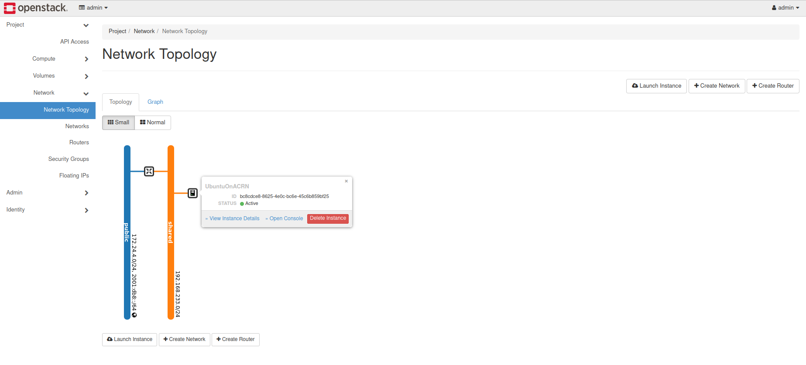
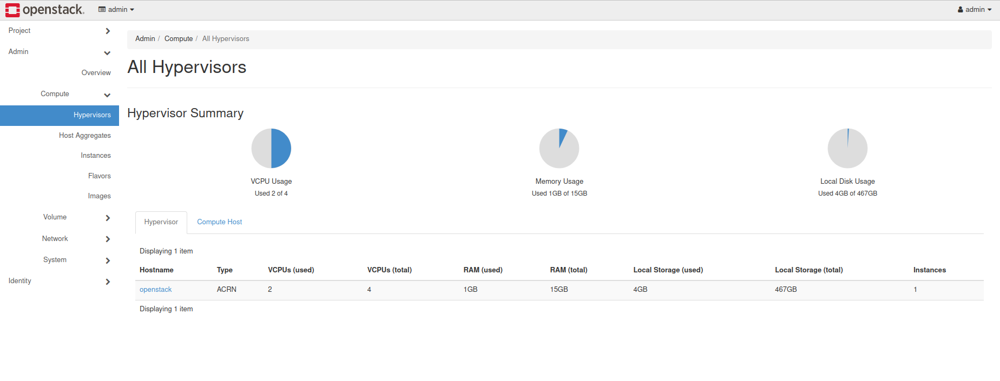

.. _setup_openstack_libvirt:

Configure ACRN Using OpenStack and Libvirt
##########################################

Introduction
************

This document provides instructions for setting up libvirt to configure
ACRN. We use OpenStack to use libvirt and we'll install OpenStack in a container
to avoid crashing your system and to take advantage of easy
snapshots/restores so that you can quickly roll back your system in the
event of setup failure. (You should only install OpenStack directly on Ubuntu if
you have a dedicated testing machine). This setup utilizes LXC/LXD on
Ubuntu 20.04.

Install ACRN
************

#. Install ACRN using Ubuntu 20.04 as its Service VM. Refer to
   :ref:`Build and Install ACRN on Ubuntu <build-and-install-acrn-on-ubuntu>`.

#. Make the acrn-kernel using the `kernel_config_uefi_sos
   <https://raw.githubusercontent.com/projectacrn/acrn-kernel/master/kernel_config_uefi_sos>`_
   configuration file (from the ``acrn-kernel`` repo).

#. Append the following kernel boot arguments to the ``multiboot2`` line in
   :file:`/etc/grub.d/40_custom` and run ``sudo update-grub`` before rebooting the system.
   It will give the Service VM  more memory and more loop devices::

      hugepagesz=1G hugepages=10 max_loop=16

#. Boot the Service VM with this new ``acrn-kernel`` using the ACRN
   hypervisor.
#. Use the command: ``losetup -a`` to verify that Ubuntu's snap service is **not**
   using all available loop devices. Typically, OpenStack needs at least 4
   available loop devices. Follow the `snaps guide
   <https://maslosoft.com/kb/how-to-clean-old-snaps/>`_ to clean up old
   snap revisions if you're running out of loop devices.
#. Make sure the networking bridge ``acrn-br0`` is created. If not,
   create it using the instructions in
   :ref:`Build and Install ACRN on Ubuntu <build-and-install-acrn-on-ubuntu>`.

Set Up and Launch LXC/LXD
*************************

1. Set up the LXC/LXD Linux container engine::

      $ sudo snap install lxd
      $ lxd init --auto

   Use all default values if running ``lxd init`` in interactive mode.

2. Create an Ubuntu 18.04 container named ``openstack``::

      $ lxc init ubuntu:18.04 openstack

3. Export the kernel interfaces necessary to launch a Service VM in the
   ``openstack`` container:

   a. Edit the ``openstack`` config file using the command::

      $ lxc config edit openstack

      In the editor, add the following lines in the **config** section:

      .. code-block:: none

         linux.kernel_modules: iptable_nat, ip6table_nat, ebtables, openvswitch
         raw.lxc: |-
           lxc.cgroup.devices.allow = c 10:237 rwm
           lxc.cgroup.devices.allow = b 7:* rwm
           lxc.cgroup.devices.allow = c 243:0 rwm
           lxc.mount.entry = /dev/net/tun dev/net/tun none bind,create=file 0 0
           lxc.mount.auto=proc:rw sys:rw cgroup:rw
           lxc.apparmor.profile=unconfined
         security.nesting: "true"
         security.privileged: "true"

      Save and exit the editor.

      .. note::

         Make sure to respect the indentation as to keep these options within
         the **config** section. It is a good idea after saving your changes
         to check that they have been correctly recorded (``lxc config show openstack``).

   b. Run the following commands to configure ``openstack``::

         $ lxc config device add openstack eth1 nic name=eth1 nictype=bridged parent=acrn-br0
         $ lxc config device add openstack acrn_hsm unix-char path=/dev/acrn_hsm
         $ lxc config device add openstack loop-control unix-char path=/dev/loop-control
         $ for n in {0..15}; do lxc config device add openstack loop$n unix-block path=/dev/loop$n; done;

4. Launch the ``openstack`` container::

     $ lxc start openstack

5. Log in to the ``openstack`` container::

     $ lxc exec openstack -- su -l

6. Let ``systemd`` manage **eth1** in the container, with **eth0** as the
   default route:

   Edit ``/etc/netplan/50-cloud-init.yaml``

   .. code-block:: none

      network:
          version: 2
          ethernets:
              eth0:
                  dhcp4: true
              eth1:
                  dhcp4: true
                  dhcp4-overrides:
                      route-metric: 200

7. Log off and restart the ``openstack`` container::

     $ lxc restart openstack

8. Log in to the ``openstack`` container again::

     $ lxc exec openstack -- su -l

9. If needed, set up the proxy inside the ``openstack`` container via
   ``/etc/environment`` and make sure ``no_proxy`` is properly set up.
   Both IP addresses assigned to **eth0** and
   **eth1** and their subnets must be included. For example::

     no_proxy=xcompany.com,.xcompany.com,10.0.0.0/8,192.168.0.0/16,localhost,.local,127.0.0.0/8,134.134.0.0/16

10. Add a new user named **stack** and set permissions

    .. code-block:: none

       # useradd -s /bin/bash -d /opt/stack -m stack
       # echo "stack ALL=(ALL) NOPASSWD: ALL" >> /etc/sudoers

11. Log off and restart the ``openstack`` container::

     $ lxc restart openstack

The ``openstack`` container is now properly configured for OpenStack.
Use the ``lxc list`` command to verify that both **eth0** and **eth1**
appear in the container.

Set Up ACRN Prerequisites Inside the Container
**********************************************

1. Log in to the ``openstack`` container as the **stack** user::

     $ lxc exec openstack -- su -l stack

2. Download and compile ACRN's source code. Refer to :ref:`getting-started-building`.

   .. note::
      All tools and build dependencies must be installed before you run the first ``make`` command.

   .. code-block:: none

      $ cd ~
      $ git clone https://github.com/projectacrn/acrn-hypervisor
      $ cd acrn-hypervisor
      $ git checkout v2.4
      $ make
      $ sudo make devicemodel-install
      $ sudo cp build/misc/debug_tools/acrnd /usr/bin/
      $ sudo cp build/misc/debug_tools/acrnctl /usr/bin/

   Install only the user-space components: ``acrn-dm``, ``acrnctl``, and
   ``acrnd`` as shown above.

   .. note:: Use the tag that matches the version of the ACRN hypervisor (``acrn.bin``)
      that runs on your system.

Set Up Libvirt
**************

1. Install the required packages::

     $ sudo apt install libdevmapper-dev libnl-route-3-dev libnl-3-dev python \
       automake autoconf autopoint libtool xsltproc libxml2-utils gettext \
       libxml2-dev libpciaccess-dev gnutls-dev python3-docutils

2. Download libvirt/ACRN::

     $ cd ~
     $ git clone https://github.com/projectacrn/acrn-libvirt.git

3. Build and install libvirt::

     $ cd acrn-libvirt
     $ mkdir build
     $ cd build
     $ ../autogen.sh --prefix=/usr --disable-werror --with-test-suite=no \
       --with-qemu=no --with-openvz=no --with-vmware=no --with-phyp=no \
       --with-vbox=no --with-lxc=no --with-uml=no --with-esx=no

     $ make
     $ sudo make install

   .. note:: The ``dev-acrn-v6.1.0`` branch is used in this tutorial. It is
      the default branch.

4. Edit and enable these options in ``/etc/libvirt/libvirtd.conf``::

     unix_sock_ro_perms = "0777"
     unix_sock_rw_perms = "0777"
     unix_sock_admin_perms = "0777"

5. Restart the libvirt daemon::

     $ sudo systemctl daemon-reload

Set Up OpenStack
****************

Use DevStack to install OpenStack. Refer to the `DevStack instructions <https://docs.openstack.org/devstack/>`_.

1. Use the latest maintenance branch **stable/train** to ensure OpenStack
   stability::

      $ cd ~
      $ git clone https://opendev.org/openstack/devstack.git -b stable/train

2. Go into the ``devstack`` directory, and apply the
   :file:`doc/tutorials/0001-devstack-installation-for-acrn.patch`::

      $ cd devstack
      $ git apply ~/acrn-hypervisor/doc/tutorials/0001-devstack-installation-for-acrn.patch

3. Edit ``lib/nova_plugins/hypervisor-libvirt``:

   Change ``xen_hvmloader_path`` to the location of your OVMF image
   file: ``/usr/share/acrn/bios/OVMF.fd``. Or use the stock image that is included
   in the ACRN source tree (``devicemodel/bios/OVMF.fd``).

4. Create a ``devstack/local.conf`` file as shown below (setting the
   passwords as appropriate):

   .. code-block:: none

      [[local|localrc]]
      PUBLIC_INTERFACE=eth1

      ADMIN_PASSWORD=<password>
      DATABASE_PASSWORD=<password>
      RABBIT_PASSWORD=<password>
      SERVICE_PASSWORD=<password>

      ENABLE_KSM=False
      VIRT_DRIVER=libvirt
      LIBVIRT_TYPE=acrn
      DEBUG_LIBVIRT=True
      DEBUG_LIBVIRT_COREDUMPS=True
      USE_PYTHON3=True

   .. note::

      Now is a great time to take a snapshot of the container using ``lxc
      snapshot``. If the OpenStack installation fails, manually rolling back
      to the previous state can be difficult. Currently, no step exists to
      reliably restart OpenStack after restarting the container.

5. Install OpenStack::

      $ ./stack.sh

   The installation should take about 20-30 minutes. Upon successful
   installation, the installer reports the URL of OpenStack's management
   interface. This URL is accessible from the native Ubuntu.

   .. code-block:: console

      ...

      Horizon is now available at http://<IP_address>/dashboard

      ...

      2020-04-09 01:21:37.504 | stack.sh completed in 1755 seconds.

6. Verify using the command ``systemctl status libvirtd.service`` that libvirtd is active
   and running.

7. Set up SNAT for OpenStack instances to connect to the external network.

   a. Inside the container, use the command ``ip a`` to identify the ``br-ex`` bridge
      interface. ``br-ex`` should have two IPs. One should be visible to
      the native Ubuntu's ``acrn-br0`` interface (e.g. iNet 192.168.1.104/24).
      The other one is internal to OpenStack (e.g. iNet 172.24.4.1/24). The
      latter corresponds to the public network in OpenStack.

   b. Set up SNAT to establish a link between ``acrn-br0`` and OpenStack.
      For example::

        $ sudo iptables -t nat -A POSTROUTING -s 172.24.4.1/24 -o br-ex -j SNAT --to-source 192.168.1.104

Configure and Create OpenStack Instance
***************************************

We'll be using the Ubuntu 20.04 (Focal) Cloud image as the OS image (qcow2
format). Download the Cloud image from https://cloud-images.ubuntu.com/releases/focal,
for example::

   $ wget https://cloud-images.ubuntu.com/releases/focal/release-20210201/ubuntu-20.04-server-cloudimg-amd64.img

Use the OpenStack management interface URL reported in a previous step
to finish setting up the network and configure and create an OpenStack
instance.

1. Begin by using your browser to login as **admin** to the OpenStack management
   dashboard (using the URL reported previously). Use the admin
   password you set in the ``devstack/local.conf`` file:

   .. figure:: images/OpenStack-01-login.png
      :align: center
      :width: 1200px
      :name: os-01-login

   Click on the **Project / Network Topology** and then the **Topology** tab
   to view the existing **public** (external) and **shared** (internal) networks:

   .. figure:: images/OpenStack-02-topology.png
      :align: center
      :width: 1200px
      :name: os-02-topology

#. A **router** acts as a bridge between the internal and external
   networks. Create a router using **Project / Network / Routers /
   +Create Router**:

   .. figure:: images/OpenStack-03-create-router.png
      :align: center
      :width: 1200px
      :name: os-03-router

   Give it a name (**acrn_router**), select **public** for the external network,
   and select create router:

   .. figure:: images/OpenStack-03a-create-router.png
      :align: center
      :width: 1200px
      :name: os-03a-router

   That added the external network to the router.  Now add
   the internal network too. Click on the acrn_router name:

   .. figure:: images/OpenStack-03b-created-router.png
      :align: center
      :width: 1200px
      :name: os-03b-router

   Go to the interfaces tab, and click on **+Add interface**:

   .. figure:: images/OpenStack-04a-add-interface.png
      :align: center
      :width: 1200px
      :name: os-04a-add-interface

   Select the subnet of the shared (private) network and click submit:

   .. figure:: images/OpenStack-04b-add-interface.png
      :align: center
      :width: 1200px
      :name: os-04b-add-interface

   The router now has interfaces between the external and internal
   networks:

   .. figure:: images/OpenStack-04c-add-interface.png
      :align: center
      :width: 1200px
      :name: os-04c-add-interface

   View the router graphically by clicking on the "Network Topology" tab:

   .. figure:: images/OpenStack-05-topology.png
      :align: center
      :width: 1200px
      :name: os-05-topology

   With the router set up, we've completed configuring the OpenStack
   networking.

#. Next, we'll prepare for launching an OpenStack instance.
   Click on the **Admin / Compute/ Image** tab and then the **+Create
   image** button:

   .. figure:: images/OpenStack-06-create-image.png
      :align: center
      :width: 1200px
      :name: os-06-create-image

   Browse for and select the Ubuntu Cloud image file we
   downloaded earlier:

   .. figure:: images/OpenStack-06a-create-image-browse.png
      :align: center
      :width: 1200px
      :name: os-06a-create-image

   .. figure:: images/OpenStack-06b-create-image-select.png
      :align: center
      :name: os-06b-create-image

   Give the image a name (**Ubuntu20.04**), select the **QCOW2 - QEMU
   Emulator** format, and click on **Create Image**:

   .. figure:: images/OpenStack-06e-create-image.png
      :align: center
      :width: 900px
      :name: os-063-create-image

   This will take a few minutes to complete.

#. Next, click on the **Admin / Computer / Flavors** tabs and then the
   **+Create Flavor** button.  This is where you'll define a machine flavor name
   (**UbuntuCloud**), and specify its resource requirements: the number of vCPUs (**2**), RAM size
   (**512MB**), and root disk size (**4GB**):

   .. figure:: images/OpenStack-07a-create-flavor.png
      :align: center
      :width: 700px
      :name: os-07a-create-flavor

   Click on **Create Flavor** and you'll return to see a list of
   available flavors plus the new one you created (**UbuntuCloud**):

   .. figure:: images/OpenStack-07b-flavor-created.png
      :align: center
      :width: 1200px
      :name: os-07b-create-flavor

#. OpenStack security groups act as a virtual firewall controlling
   connections between instances, allowing connections such as SSH, and
   HTTPS. These next steps create a security group allowing SSH and ICMP
   connections.

   Go to **Project / Network / Security Groups** and click on the **+Create
   Security Group** button:

   .. figure:: images/OpenStack-08-security-group.png
      :align: center
      :width: 1200px
      :name: os-08-security-group

   Name this security group (**acrnSecuGroup**) and click **Create
   Security Group**:

   .. figure:: images/OpenStack-08a-create-security-group.png
      :align: center
      :width: 1200px
      :name: os-08a-security-group

   You'll return to a rule management screen for this new group.  Click
   on the **+Add Rule** button:

   .. figure:: images/OpenStack-08b-add-rule.png
      :align: center
      :width: 1200px
      :name: os-08b-security-group

   Select **SSH** from the Rule list and click **Add**:

   .. figure:: images/OpenStack-08c-add-SSH-rule.png
      :align: center
      :width: 1200px
      :name: os-08c-security-group

   Similarly, add another rule to add a **All ICMP** rule too:

   .. figure:: images/OpenStack-08d-add-All-ICMP-rule.png
      :align: center
      :width: 1200px
      :name: os-08d-security-group

#. Create a public/private keypair used to access the created instance.
   Go to **Project / Compute / Key Pairs** and click on **+Create Key
   Pair**, give the keypair a name (**acrnKeyPair**) and Key Type
   (**SSH Key**) and click on **Create Key Pair**:

   .. figure:: images/OpenStack-09a-create-key-pair.png
      :align: center
      :width: 1200px
      :name: os-09a-key-pair

   You should save the **private** keypair file safely,
   for future use:

   .. figure:: images/OpenStack-09c-key-pair-private-key.png
      :align: center
      :width: 1200px
      :name: os-09c-key-pair

#. Now we're ready to launch an instance.  Go to **Project / Compute /
   Instance**, click on the **Launch Instance** button, give it a name
   (**UbuntuOnACRN**) and click **Next**:

   .. figure:: images/OpenStack-10a-launch-instance-name.png
      :align: center
      :width: 900px
      :name: os-10a-launch

   Select **No** for "Create New Volume", and click the up-arrow button
   for uploaded (**Ubuntu20.04**) image as the "Available source" for this
   instance:

   .. figure:: images/OpenStack-10b-no-new-vol-select-allocated.png
      :align: center
      :width: 900px
      :name: os-10b-launch

   Click **Next**, and select the machine flavor you created earlier
   (**UbuntuCloud**):

   .. figure:: images/OpenStack-10c-select-flavor.png
      :align: center
      :width: 900px
      :name: os-10c-launch

   Click on **>** next to the Allocated **UbuntuCloud** flavor and see
   details about your choice:

   .. figure:: images/OpenStack-10d-flavor-selected.png
      :align: center
      :width: 900px
      :name: os-10d-launch

   Click on the **Networks** tab, and select the internal **shared**
   network from the "Available" list:

   .. figure:: images/OpenStack-10e-select-network.png
      :align: center
      :width: 1200px
      :name: os-10e-launch

   Click on the **Security Groups** tab and select
   the **acrnSecuGroup**  security group you created earlier. Remove the
   **default** security group if it's in the "Allocated" list:

   .. figure:: images/OpenStack-10d-only-acrn-security-group.png
      :align: center
      :width: 1200px
      :name: os-10d-security

   Click on the **Key Pair** tab and verify the **acrnKeyPair** you
   created earlier is in the "Allocated" list, and click on **Launch
   Instance**:

   .. figure:: images/OpenStack-10g-show-keypair-launch.png
      :align: center
      :width: 1200px
      :name: os-10g-launch

   It will take a few minutes to complete launching the instance.

#. Click on the **Project / Compute / Instances** tab to monitor
   progress. When the instance status is "Active" and power state is
   "Running", associate a floating IP to the instance
   so you can access it:

   .. figure:: images/OpenStack-11-wait-for-running-create-snapshot.png
      :align: center
      :width: 1200px
      :name: os-11-running

   On the **Manage Floating IP Associations** screen, click on the **+**
   to add an association:

   .. figure:: images/OpenStack-11a-manage-floating-ip.png
      :align: center
      :width: 700px
      :name: os-11a-running

   Select **public** pool, and click on **Allocate IP**:

   .. figure:: images/OpenStack-11b-allocate-floating-ip.png
      :align: center
      :width: 1200px
      :name: os-11b-running

   Finally, click **Associate** after the IP address is assigned:

   .. figure:: images/OpenStack-11c-allocate-floating-ip-success-associate.png
      :align: center
      :width: 1200px
      :name: os-11c-running

Final Steps
***********

With that, the OpenStack instance is running and connected to the
network.  You can graphically see this by returning to the **Project /
Network / Network Topology** view:

You can also see a hypervisor summary by clicking on **Admin / Compute /
Hypervisors**:

.. note::
   OpenStack logs to the ``systemd`` journal and ``libvirt`` logs to
   ``/var/log/libvirt/libvirtd.log``.

Here are some other tasks you can try when the instance is created and
running:

* Use the hypervisor console to verify the instance is running by using
  the ``vm_list`` command.

* Ping the instance inside the container using the instance's floating IP
  address.

For more advanced CLI usage, refer to this `OpenStack cheat sheet
<https://docs.openstack.org/ocata/user-guide/cli-cheat-sheet.html>`_.
