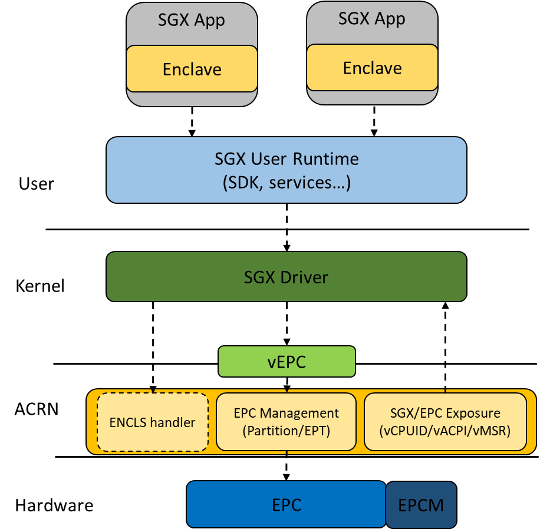

SGX Virtualization 
##################

SGX refers to Intel® Software Guard Extensions (Intel® SGX). This is a set of
instructions that can be used by applications to set aside protected areas for select code and data in order to prevent direct attacks on executing code or
data stored in memory. SGX allows an application to instantiate a protected
container, referred to as an enclave, which is protected against external
software access, including privileged malware.

High Level ACRN SGX Virtualization Design
*****************************************

ACRN SGX virtualization support can be divided into three parts: 

* SGX capability exposed to Guest EPC (Enclave Page Cache) management Enclave
* System function handing

The image below shows the high-level design of SGX virtualization in ACRN. 

   Figure 1: SGX Virtualization in ACRN

Enable SGX support for Guest 
****************************

Presumptions 
============

No Enclave in a Hypervisor 
--------------------------

ACRN does not support running an enclave in a hypervisor since currently the
whole hypervisor is running in vmx root mode, ring 0, and an enclave must run
in ring 3. SGX virtualization in ACRN provides the SGX capability to (non-SOS)
VMs.

Enable SGX on Host 
------------------

In order to enable SGX virtualization support in ACRN, the SGX feature must be
enabled and the Processor Reserved Memory (PRM) must be configured in the
platform BIOS. Note that ACRN does not support the "Software Control" option;
SGX must be enabled manually in the BIOS. If the hardware platform does not
support SGX or if SGX is not enabled in the BIOS, the SGX virtualization is
not enabled.

EPC Page Swapping in Guest 
--------------------------

ACRN only partitions the physical EPC resources for VMs. The Guest OS kernel
handles EPC Page Swapping inside Guest.

Instructions 
============

By default, SGX support for Guest is not enabled on the Master branch. Thus,
you must perform the following:

#. Make sure SGX is supported on the platform (CPUID.07H.EBX[2] should be 1).
#. Opt-in to the SGX feature in the BIOS. Follow these instructions: 

   a) Go to the Security page:

      .. figure:: images/sgx-2.jpg
         :scale: 10%
         :align: left

   #) Enable SGX and configure the SGX Reserved Memory size as below: 

      * Intel Software Guard Extension (SGX) -> Enabled 
      * SGX Reserved Memory Size -> 128MB

      .. figure:: images/sgx-3.jpg
         :scale: 10%
         :align: left

      .. note:: 
         Not all SGX Reserved Memory can be used as EPC. On KBL-NUC-i7,
         the SGX EPC size is 0x5d80000 (93.5MB) when the SGX Reserved Memory Size is set to 128MB. 

#. Add the EPC config in the VM configuration:
   Apply the patch to enable SGX support in UOS in the SDC scenario:
   https://github.com/binbinwu1/acrn-hypervisor/commit/0153b2b9b9920b61780163f19c6f5318562215ef.patch

#. Enable SGX in Guest:

   * Refer to https://github.com/intel/linux-sgx on how to enable SGX in Linux Guest.
   * Refer to https://software.intel.com/en-us/articles/getting-started-with-sgx-sdk-for-windows on how to enable SGX in Windows Guest.

SGX Capability Exposure
***********************

CPUID Virtualization
====================

CPUID Leaf 07H
--------------

* CPUID_07H.EAX[2] SGX: Supports Intel Software Guard Extensions if 1. If SGX is supported in Guest, this bit will be set.
* CPUID_07H.ECX[30] SGX_LC: Supports SGX Launch Configuration if 1. Currently, ACRN does not support the SGX Launch Configuration. This bit will not be set. Thus, the Launch Enclave must be signed by the Intel SGX Launch Enclave Key.

CPUID Leaf 12H
--------------

**Intel SGX Capability Enumeration**

* CPUID_12H.0.EAX[0] SGX1: If 1, indicates that Intel SGX supports the collection of SGX1 leaf functions.If is_sgx_supported and the section count is initialized for the VM, this bit will be set.
* CPUID_12H.0.EAX[1] SGX2: If 1, indicates that Intel SGX supports the collection of SGX2 leaf functions. If hardware supports it and SGX enabled for the VM, this bit will be set.
* Other fields of CPUID_12H.0.EAX aligns with the physical CPUID.

**Intel SGX Attributes Enumeration**

* CPUID_12H.1.EAX & CPUID_12H.1.EBX aligns with the physical CPUID.
* CPUID_12H.1.ECX & CPUID_12H.1.EDX reflects the allow-1 setting in the Extended feature (same structure as XCR0).

The hypervisor may change the allow-1 setting of XFRM in ATTRIBUTES for VM. 
If some feature is disabled for the VM, the bit is also cleared, eg. MPX.

**Intel SGX EPC Enumeration**

* CPUID_12H.2: The hypervisor presents only one EPC section to Guest. This vcpuid value will be constructed according to the EPC resource allocated to Guest.

MSR Virtualization
==================

IA32_FEATURE_CONTROL
--------------------

The hypervisor will opt-in to SGX for VM if SGX is enabled for VM.

* MSR_IA32_FEATURE_CONTROL_LOCK is set
* MSR_IA32_FEATURE_CONTROL_SGX_GE is set
* MSR_IA32_FEATURE_CONTROL_SGX_LC is not set

IA32_SGXLEPUBKEYHASH[0-3]
-------------------------

This is read-only since SGX LC is currently not supported.

SGXOWNEREPOCH[0-1]
------------------

* This is a 128-bit external entropy value for key derivation of an enclave.
* These MSRs are at the package level; they cannot be controlled by the VM.

EPC Virtualization
==================

* EPC resource is statically partitioned according to the configuration of the EPC size of VMs.
* During platform initialization, the physical EPC section information is collected via CPUID. SGX initialization function allocates EPC resource to VMs according to the EPC config in VM configurations.
* If enough EPC resource is allocated for the VM, assign the GPA of the EPC section.
* EPC resource is allocated to the Non-SOS VM; the EPC base GPA is specified by the EPC config in the VM configuration.
* The corresponding range of memory space should be marked as reserved in E820.
* During initialization, the mapping relationship of EPC HPA and GPA is saved for building the EPT table later when the VM is created.

Enclave System Function Handling
********************************

A new "Enable ENCLS exiting" control bit (bit 15) is defined in the secondary processor-based VM execution control.

* 1-Setting of "Enable ENCLS exiting" enables ENCLS-exiting bitmap control, which is a new 64-bit ENCLS-exiting bitmap control field added to VMX VMCS (0202EH) to control VMEXIT on ENCLS leaf functions.
* ACRN does not emulate ENCLS leaf functions and will not enable ENCLS exiting.

ENCLS[ECREATE]
==============

* The enclave execution environment is heavily influenced by the value of ATTRIBUTES in the enclave's SECS.
* When ECREATE is executed, the processor will check and verify that the enclave requirements are supported on the platform. If not, ECREATE will generate a #GP.
* The hypervisor can present the same extended features to Guest as the hardware. However, if the hypervisor hides some extended features that the hardware supports from the VM/guest, then if the hypervisor does not trap ENCLS[ECREATE], ECREATE may succeed even if the ATTRIBUTES the enclave requested is not supported in the VM.
* Fortunately, ENCLU[EENTER] will fault if SECS.ATTRIBUTES.XFRM is not a subset of XCR0 when CR4.OSXSAVE = 1.
* XCR0 is controlled by the hypervisor in ACRN; if the hypervisor hides some extended feature from the VM/guest, then ENCLU[EENTER] will fault if the enclave requests a feature that the VM does not support if the hypervisor does not trap/emulate ENCLS[ECREATE].
* Above all, the security feature is not compromised if the hypervisor does not trap ENCLS[ECREATE] to check the attributes of the enclave.

Other VMExit Control
********************

RDRAND exiting
==============

* ACRN allows Guest to use RDRAND/RDSEED instruction but does not set "RDRAND exiting" to 1.

PAUSE exiting
=============

* ACRN does not set "PAUSE exiting" to 1.

Future Development
******************

Launch Configuration support
============================

When the following two conditions are both satisfied:

* The hardware platform supports the SGX Launch Configuration.

* The platform BIOS must enable the feature in Unlocked mode, so that the ring0 software can configure the Model Specific Register (MSR) IA32_SGXLEPUBKEYHASH[0-3] values.

the following statements apply:

* If CPU sharing is supported, ACRN can emulate MSR IA32_SGXLEPUBKEYHASH[0-3] for VM. ACRN updates MSR IA32_SGXLEPUBKEYHASH[0-3] when the VM context switch happens. 
* If CPU sharing is not supported, ACRN can support SGX LC by passthrough MSR IA32_SGXLEPUBKEYHASH[0-3] to Guest.

ACPI Virtualization
===================

* The Intel SGX EPC ACPI device is provided in the ACPI Differentiated System Descriptor Table (DSDT), which contains the details of the Intel SGX existence on the platform as well as memory size and location.
* Although the EPC can be discovered by the CPUID, several versions of Windows do rely on the ACPI tables to enumerate the address and size of the EPC.