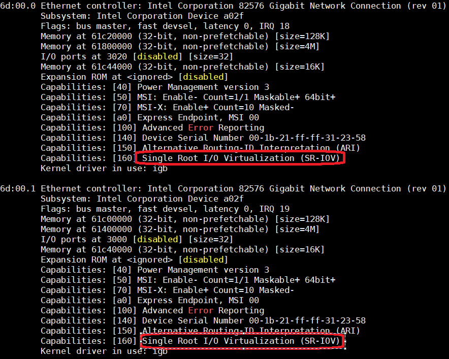
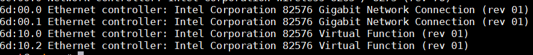
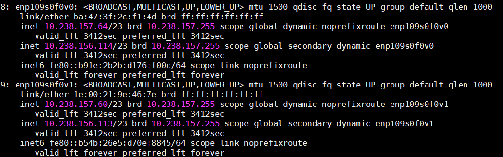
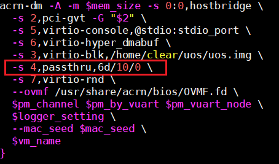

.. _sriov_virtualization:

SR-IOV Virtualization
=====================

SR-IOV (Single Root Input/Output Virtualization) can isolate PCIe devices
and make the devices to have good performance, close to bare-metal. The
SR-IOV consists of two basic units, one is called PF(Physical Function)
that supports SR-IOV PCIe extended capability and manages entire
physical device, another is called VF (Virtual Function) and is a
"lightweight" PCIe function which is meant to be given to a VM as a
pass-through device.

For more details, please refer to PCI Express Base Specification Revision 4.0,
Version 1.0 `PCI-SIG Specification <https://pcisig.com/specifications>` Chapter 9.

SR-IOV Architectural Overview
-----------------------------

.. figure:: images/sriov-image1.png
   :align: center
   :width: 900px
   :name: SR-IOV-architecture-overview

   SR-IOV Architectural Overview

-  **SI** - System Image known as a VM.

-  **VI** - Virtualization Intermediary known as Hypervisor.

-  **SR-PCIM** - Single Root PCI Manager is a software entity for SR-IOV
   management.

-  **PF** - A PF is a PCIe Function that supports the SR-IOV capability
   and is accessible to an SR-PCIM, a VI, or an SI.

-  **VF** - A VF is a “light-weight” PCIe Function that is directly
   accessible by an SI.

SR-IOV Extended Capability
--------------------------

The SR-IOV Extended Capability defined here is a PCIe extended
capability that must be implemented in each PF device that supports
SR-IOV feature. This Capability is used to describe and control a PF’s
SR-IOV Capabilities.

.. figure:: images/sriov-image2.png
   :align: center
   :width: 900px
   :name: SR-IOV-extended-capability

   SR-IOV Extended Capability

-  **PCIe Extended Capability ID** - 0010h.

-  **SR-IOV Capabilities** - VF Migration Capable and ARI Capable.

-  **SR-IOV Control** - Enable/Disable VFs, VF migration state query.

-  **SR-IOV Status** - VF Migration Status

-  **InitialVFs** - Indicates to SR-PCIM the number of VFs that are
   initially associated with the PF

-  **TotalVFs** - Indicates the maximum number of VFs that could be
   associated with the PF

-  **NumVFs** - Controls the number of VFs that are visible. *NumVFs* <=
   *InitialVFs* = *TotalVFs*.

-  **Function Link Dependency** - The field is used to describe these
   dependencies between PFs. VF dependencies are the same as the
   dependencies of their associated PFs.

-  **First VF Offset** - It is a constant and defines the Routing ID
   offset of the first VF that is associated with the PF that contains
   this Capability structure

-  **VF Stride** - It defines the Routing ID offset from one VF to the
   next one for all VFs associated with the PF that contains this
   Capability structure.

-  **VF Device ID** - This field contains the Device ID that should be
   presented for every VF to the SI.

-  **Supported Page Sizes** - This field indicates the page sizes
   supported by the PF.

-  **System Page Size** - This field defines the page size the system
   will use to map the VFs’ memory addresses. Software must set the
   value of the *System Page Size* to one of the page sizes set in the
   *Supported Page Sizes* field

-  **VF BARs** - These fields must define the VF’s Base Address
   Registers (BARs). These fields behave as normal PCI BARs.

-  **VF Migration State Array Offset** - This register shall contain a
   PF BAR relative pointer to the VF Migration State Array.

-  **VF Migration State Array** – It is located using the VF Migration
   State Array Offset register of the SR-IOV Capability block.

For more details, please refer to *PCI Express Base Specification
Revision 4.0, Version 1.0 Chapter 9.3.3*

SR-IOV Architecture In ACRN
---------------------------

.. figure:: images/sriov-image3.png
   :align: center
   :width: 900px
   :name: SR-IOV-architecure-in-acrn

   SR-IOV Architectural in ACRN

1. Hypervisor detects SR-IOV capable PCIe device in physical PCI device
   enumeration phase.

2. Hypervisor intercepts the PF’s SR-IOV capability accessing to
   enable/disable VF devices based on *VF\_ENABLE* state, and all
   read/write requests for PF device are passthrough to PF physical
   device.

3. Hypervisor waits for 100ms after *VF\_ENABLE* is set and initialize
   VF devices. The differences between normal passthrough device and
   SR-IOV VF device are physical device detection, BARs and MSIx
   initializations. Hypervisor uses *Subsystem Vendor ID* to detect
   SR-IOV VF physical device instead *Vendor ID* since there is no valid
   *Vendor ID* for SR-IOV VF physical device, the VF BARs are
   initialized by its associated PF’s SR-IOV capabilities not PCI
   standard BAR registers, MSIx mapping base address is also from PF’s
   SR-IOV capabilities not PCI standard BAR registers.

SR-IOV Passthrough VF Architecture In ACRN
------------------------------------------

.. figure:: images/sriov-image4.png
   :align: center
   :width: 900px
   :name: SR-IOV-vf-passthrough

   SR-IOV VF Passthrough Architecture In ACRN

1. The SR-IOV VF device needs to bind PCI-stud driver instead
   vendor-specific VF driver before passthrough the device.

2. User configures ``acrn-dm`` boot parameter with passthrough SR-IOV VF
   device. When User VM starts, ``acrn-dm`` invokes a hypercall to set the
   *vdev-VF0* device in User VM.

3. Hypervisor emulates *Device ID/Vendor ID* and *Memory Space Enable
   (MSE*) in configuration space for an assigned SR-IOV VF device. The
   assigned VF *Device ID* comes from its associated PF’s capability,
   *Vendor ID* is same with PF’s *Vendor ID* and *MSE* is always set
   when reading the SR-IOV VF device *CONTROL* register

4. Vendor-specific VF driver in target VM probes the assigned SR-IOV VF
   device.

SR-IOV Initialization Flow
--------------------------

.. figure:: images/sriov-image5.png
   :align: center
   :width: 900px
   :name: SR-IOV-init-flow

   SR-IOV Initialization Flow

When a SR-IOV capable device is initialized, all access to the
configuration space will pass through to the physical device directly.
Service VM can identify all capabilities of the device from SR-IOV extended
capability then create sysfs node for SR-IOV management.

SR-IOV VF Enable Flow
---------------------

.. figure:: images/sriov-image6.png
   :align: center
   :width: 900px
   :name: SR-IOV-enable-flow

   SR-IOV VF Enable Flow

Application enables n VF devices via a SR-IOV PF device *sysfs* node.
Hypervisor intercepts all SR-IOV capability accesses and check
*VF\_ENABLE* state, if the *VF\_ENABLE* is set, hypervisor creates n
virtual devices after 100ms that VF physical devices have enough time to
be created. Service VM waits 100ms then only accesses the first VF device’s
configuration space including *Class Code, Reversion ID, Subsystem
Vendor ID, Subsystem ID,* Service VM uses the first VF device information to
initialize subsequent VF devices.

SR-IOV VF Disable Flow
----------------------

.. figure:: images/sriov-image7.png
   :align: center
   :width: 900px
   :name: SR-IOV-disable-flow

   SR-IOV VF Disable Flow

Application disables SR-IOV VF devices by writing zero to SR-IOV PF
device *sysfs* node. Hypervisor intercepts all SR-IOV capability
accesses and check *VF\_ENABLE* state, if *VF\_ENABLE* is clear,
hypervisor makes VF virtual devices invisible from Service VM that all accesses
for VF will return 0xFFFFFFFF as an error, VF physical devices are
removed within 1s of *VF\_ENABLE* is clear.

SR-IOV VF Assignment Policy
---------------------------

.. figure:: images/sriov-image8.png
   :align: center
   :width: 900px
   :name: SR-IOV-vf-assignment

   SR-IOV VF Assignment

1. All SR-IOV PF devices are managed by Service VM.

2. Currently, SR-IOV PF can’t passthrough to User VM.

3. All VFs can be passthrough to User VM, but we do not recommend
   passthrough to high privilege VMs, because PF device may impact
   assigned VFs including functionality and stability.

SR-IOV Usage Guide In ACRN
--------------------------

We use Intel 82576 NIC as an example in here and only support LaaG
(Linux as a Guest).

1. Please ensure the 82576 VF driver is compiled into User VM Kernel
   (Set *CONFIG\_IGBVF=y* in Kernel Config).

2. When the Service VM boot up, “\ *lspci -v*\ ” command can show Intel 82576
   NIC devices have SR-IOV capability and their PF drivers are ``igb``.

   82576 SR-IOV PF devices

1. Input "\ *echo n > /sys/class/net/enp109s0f0/device/sriov\_numvfs*\ "
   command in Service VM to enable n VF devices for the first PF
   device(\ *enp109s0f0)*. The number *n* can’t more than *TotalVFs*
   that comes from the return value of command

   *“cat /sys/class/net/enp109s0f0/device/sriov\_totalvfs”*. Here we use
   *n = 2* for the example.

   82576 SR-IOV VF devices

   82576 SR-IOV VF NIC

1. Passthrough a SR-IOV VF device to guest

   a. Unbind igbvf driver in Service VM

      i.   *modprobe pci\_stub*

      ii.  *echo "8086 10ca" > /sys/bus/pci/drivers/pci-stub/new\_id*

      iii. *echo "0000:6d:10.0" >
           /sys/bus/pci/devices/0000:6d:10.0/driver/unbind*

      iv.  *echo "0000:6d:10.0" >
           /sys/bus/pci/drivers/pci-stub/bind*

   b. Add SR-IOV VF device parameter (“*-s X, passthru,6d/10/0*\ ”) in
      launch User VM script

   Configure 82576 NIC as Passthrough Device

a. Boot User VM

SR-IOV Limitations In ACRN
--------------------------

1. The SR-IOV migration feature is not supported.

2. If one SR-IOV PF device is detected during enumeration phase, but there is no
   enough room for its total VF devices, the PF device will be dropped. The platform
   uses *MAX_PCI_DEV_NUM* ACRN configuration to support the maximum number of PCI
   devices, please make sure *MAX_PCI_DEV_NUM* is more than the number of all PCI
   devices including total SR-IOV VF devices.
